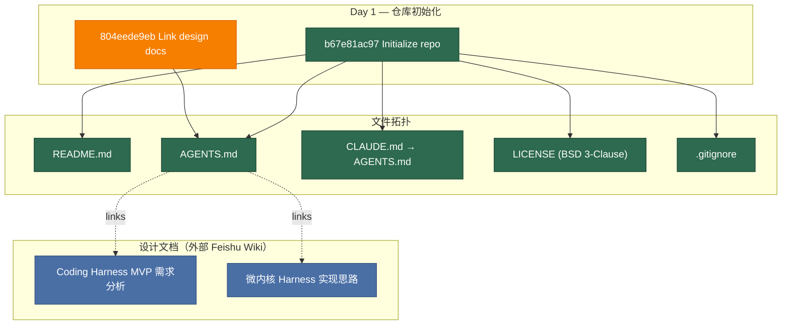

# Architecture Evolution & Design Log · 2026-06-10

## 1. 每日架构演进图

> 本图反映当日最重要的架构演进路径和设计拓扑。当日为仓库初始化日（Day 1），仅创建了基础脚手架和设计文档链接。

## 2. 设计模式与重构

- **应用的设计模式**：无。当日为仓库初始化，不涉及设计模式的引入或应用。
- **模块解耦与接口定义**：建立了 monorepo 基础结构——`AGENTS.md` 作为 AI coding agent 的指令入口，`CLAUDE.md` 通过 symlink 复用（表明团队已预见到多 agent 工具的协作需求）。`README.md` 定义了项目层级（DeepSeek Harness → DeepSeek Code），为后续的 `packages/` 结构埋下伏笔。
- **基础设施与性能**：无。

## 3. 特性交付与系统影响

- **核心特性**：仓库脚手架初始化。这看似简单，但包含了一个关键架构决策：**Monorepo + Vendored Cordis**。选择将 Cordis 源码拷贝到 monorepo 内部而非作为 npm 依赖，意味着团队对底层框架有深度定制的需求，且希望完全控制框架的演进节奏。
- **系统拓扑影响**：Day 1 的拓扑极简——单层目录结构，无代码文件。但 `AGENTS.md` 中 "一切皆插件" 的微内核架构宣言，已经为整个代码库定下了基调：后续的所有模块都将作为 Cordis 插件开发。

## 4. 架构决策与 Roadmap 对齐

- **关键技术决策（ADR 推断）**：
  - **背景与痛点**：团队启动 DeepSeek Code（DeepSeek 的编码代理产品）的开发，需要一个可扩展的 agent 框架。选择了微内核架构，核心理由是：编码代理的能力边界会持续扩展（代码补全、多文件编辑、工具调用、上下文管理等），微内核 + 插件模式可以实现能力的增量叠加而不破坏核心稳定性。
  - **选择的方案与 Trade-offs**：
    - **Monorepo**（而非 multi-repo）：牺牲了独立部署的灵活性，换取跨模块原子变更和统一的 CI/CD 控制力。
    - **Vendored Cordis**（而非 npm 依赖）：牺牲了自动升级的便利性，换取对框架核心的完全控制权——可以随时 patch 或 fork 行为。
    - **BSD 3-Clause License**：选择了宽松开源协议，暗示该产品的开源策略或社区生态意图。
  - **设计文档选择**：MVP 需求分析和微内核实现思路都托管在 Feishu（飞书 Wiki），这是中国团队的典型内部协作工具选择。将文档链接写入 `AGENTS.md` 而非代码库内的 Markdown，表明这些设计决策在仓库之外就已经完成——Day 1 不是"设计日"，而是"执行日"。

- **产品 Roadmap 支撑**：Day 1 对应产品 roadmap 的 **0 → 1 阶段**——从无到有建立技术基座。关键里程碑是：Cordis 微内核架构 + monorepo 脚手架 + AI agent 指令体系的建立。

## 5. 开发者/架构师决策推断

- **开发者意图重建**：
  - **思维模型**：Tianyi Cui 在脑中已经有了完整的系统画面——一个基于 Cordis 微内核的编码代理框架，能力通过插件扩展，多个 AI coding agent 工具（Claude Code、Codex 等）共存于同一仓库。Day 1 的工作是把这个脑中画面"锚定"到代码仓库中。
  - **优先级排序**：先建脚手架（.gitignore、LICENSE、README、AGENTS.md），再链接设计文档。这不是"先写代码再补文档"，而是"先建立协作基座再开始编码"。设计文档在飞书里已经完成，Day 1 只是把它们接入代码仓库的导航体系。
  - **有意取舍**：
    - **"暂时这样"**：README 中的项目描述很简略（"Monorepo for the DeepSeek Harness group"），后续会随着包结构的建立而细化。
    - **"就要这样"**：CLAUDE.md symlink 到 AGENTS.md 是有意识的设计——确保 AI agent 工具读取同一份指令源，避免指令分叉。这个决策在 Day 1 就被固化。

- **架构师决策推断**：
  - **模块拆分粒度的选择依据**：Day 1 尚未拆分模块。但 AGENTS.md 中明确声明了 Cordis 微内核架构和"一切皆插件"的哲学，这预示了后续的模块拆分将遵循 Cordis 的插件注册机制，而非传统的 npm workspace 包划分。
  - **抽象层引入时机的考量**：Day 1 没有引入代码抽象层，但建立了**文档抽象层**——AGENTS.md 是所有 AI agent 工具的"超级入口"，后续的所有规范、约定、架构说明都会汇聚于此。这是一个元架构决策：AI agent 的行为由一份文档统一治理。
  - **对后续可扩展性的影响**：Vendored Cordis 的选择打开了"深度定制框架"的大门，但也意味着团队需要承担维护框架代码的责任。这个决策在 Day 1 就锁定了后续的技术债务维护成本。
  - **作为架构师，你会赞同/质疑哪些选择**：
    - **赞同**：CLAUDE.md symlink 设计——简洁而有效，避免了多 agent 工具的指令漂移。
    - **质疑**：设计文档（Feishu Wiki）与代码仓库的链接关系是脆弱的——Feishu 链接可能过期或权限变更。更好的做法是将关键设计决策（ADR）以 Markdown 形式固化在代码仓库的 `docs/` 目录中。

- **Code Review 视角**：
  - **作为 reviewer，你首先关注哪个变更**：`AGENTS.md`——它是整个仓库的"宪法"，所有后续代码都受其约束。Day 1 的 AGENTS.md 建立了两个关键契约：(1) Cordis 微内核架构，(2) Vendored Cordis 策略。
  - **你会向提交者提出什么问题**：
    1. Vendored Cordis 的更新策略是什么？当上游 Cordis 发布新版本时，如何同步？
    2. AGENTS.md 中提到的 "DeepSeek Code" 和 "DeepSeek Harness" 的关系是什么？后续是否有其他产品（如 DeepSeek Chat）也会加入这个 monorepo？
    3. 设计文档链接是否有备份/导出计划？飞书文档的生命周期如何管理？
  - **哪些做得好**：
    - 仓库初始化非常干净——5 个文件，职责清晰，无冗余。
    - CLAUDE.md symlink 是一个前瞻性的设计，体现了对多 AI agent 工具生态的深刻理解。
  - **哪些可以改进**：
    - README 可以添加更详细的项目描述和开发指南，减少新贡献者的 onboarding 成本。
    - 考虑在 Day 1 就建立 `docs/` 目录结构，为后续的 ADR 和架构文档预留位置。

## 6. 技术债务与风险评估

- **已知风险 / 变通方案**：
  - **Feishu 文档链接的脆弱性**：AGENTS.md 中的外部 Feishu 链接依赖飞书平台的可用性和权限控制。如果飞书文档被移动或删除，AGENTS.md 中的链接将失效。建议将关键设计决策同步到 `docs/` 目录。
  - **Vendored Cordis 的维护负担**：vendored 源码意味着团队需要手动跟踪上游变更。Day 1 没有建立 vendoring 的同步机制或文档，后续需要补充。
- **建议的下一步**：
  1. 建立 `docs/` 目录，将关键设计决策从 Feishu 迁移到代码仓库内。
  2. 在 `vendor/README.md` 中记录 vendoring 策略和同步流程。
  3. 扩充 README，添加开发环境搭建指南和 monorepo 结构说明。

---

## 阶段性深度分析（仅当日 commit ≥ 5 个时生成）

> 当日 commit 数量为 2（< 5），不触发阶段分组分析。Day 1 的工作本质上是一个原子操作：**仓库初始化 + 设计文档链接**。
