# Architecture Evolution & Design Log · 2026-06-11

## 1. Daily Architecture Evolution Diagram

> This diagram represents the most significant architectural evolution path and design topology for this day — the foundational buildout of the entire monorepo, core packages, agent loop, and quality gate infrastructure.

```mermaid
graph TD
    subgraph Vendored["vendor/ (Cordis Framework)"]
        cordis["cordis"]
        cosmokit["cosmokit"]
        schemastery["schemastery"]
        loader["plugin-loader"]
        hmr["hmr"]
        include["include"]
        group["group"]
        timer["timer"]
        logger["logger-console"]
    end

    subgraph Core["packages/ (Core Packages)"]
        llm[["dsh-llm\n~MOD"]]
        session[["dsh-session\n~MOD"]]
        agent[["dsh-agent\n~MOD"]]
        tools[["dsh-tools\n~MOD"]]
        sysprompt[["dsh-system-prompt\n~MOD"]]
        agentloop[["dsh-agent-loop\n+NEW"]]
    end

    subgraph QualityGates["Quality Infrastructure"]
        eslint["ESLint + typescript-eslint\n+NEW"]
        knip["knip + publint\n+NEW"]
        coverage["vitest 100% coverage\n+NEW"]
        ci["GitHub Actions CI\n+NEW"]
        lefthook["lefthook git hooks\n+NEW"]
        tsdown["tsdown bundler\n+NEW"]
    end

    subgraph Types["Type Safety Layer"]
        brand["Branded IDs\n+NEW"]
        assertnever["assertNever\n+NEW"]
        schemaDsl["Schema DSL / InferArgs\n+NEW"]
    end

    subgraph Docs["Architecture Documentation"]
        archdoc["architecture.md\n+NEW"]
        adrs["ADR 0001-0008\n+NEW"]
        rfcs["RFC 0001-0008\n+NEW"]
        agentsdoc["AGENTS.md rewrite\n~MOD"]
    end

    cordis --> llm
    cordis --> session
    cordis --> agent
    cordis --> tools
    cordis --> agentloop
    llm --> agentloop
    session --> agentloop
    tools --> agentloop
    sysprompt --> agentloop
    agent --> agentloop
    brand --> llm
    brand --> session
    brand --> agent
    schemaDsl --> tools
    tsdown -.->|builds| llm
    tsdown -.->|builds| session
    tsdown -.->|builds| agent
    tsdown -.->|builds| tools
    tsdown -.->|builds| agentloop
    eslint -.->|lints| Core
    coverage -.->|tests| Core
    ci -.->|gates| Core

    style llm fill:#e8f5e9,stroke:#2e7d32
    style session fill:#e8f5e9,stroke:#2e7d32
    style agent fill:#e8f5e9,stroke:#2e7d32
    style tools fill:#e8f5e9,stroke:#2e7d32
    style sysprompt fill:#e8f5e9,stroke:#2e7d32
    style agentloop fill:#e3f2fd,stroke:#1565c0
    style brand fill:#fff3e0,stroke:#e65100
    style assertnever fill:#fff3e0,stroke:#e65100
    style schemaDsl fill:#fff3e0,stroke:#e65100
    style eslint fill:#fce4ec,stroke:#c62828
    style knip fill:#fce4ec,stroke:#c62828
    style coverage fill:#fce4ec,stroke:#c62828
    style ci fill:#fce4ec,stroke:#c62828
    style lefthook fill:#fce4ec,stroke:#c62828
    style tsdown fill:#f3e5f5,stroke:#6a1b9a
    style archdoc fill:#e0f7fa,stroke:#006064
    style adrs fill:#e0f7fa,stroke:#006064
    style rfcs fill:#e0f7fa,stroke:#006064
    style agentsdoc fill:#e0f7fa,stroke:#006064
```

**Legend**: `+NEW` = 新增模块/能力, `~MOD` = 重大修改/重构, 箭头 = 依赖/构建关系

---

## 2. Architecture Patterns & Refactoring

- **Pattern Applied: Microkernel + Event-Driven Plugin Architecture**
  Day 1 确立了基于 Cordis 的 microkernel 架构。Cordis 作为 vendored source 提供插件加载、事件系统、fiber 管理和 HMR 能力。整个系统通过 `ctx.effect()` / `ctx.on()` 注册 effects，每个插件均可独立卸载。五层核心包（dsh-llm、dsh-session、dsh-agent、dsh-tools、dsh-system-prompt）定义了 abstract service interfaces，agent-loop 作为唯一 concrete driver 通过 Cordis 的 service 机制注入。

- **Pattern Applied: Adapter Pattern + Strategy Pattern for LLM Providers**
  `dsh-llm` 定义了 `LlmAdapter` 抽象接口和 `LlmService` adapter registry，实现 provider-neutral 的 content-block vocabulary。merge-extensible maps（`ContentBlockMap`、`SessionEventMap`）支持 plugin-contributed variants，closed unions（`StreamChunk`）使用 `assertNever` 进行 exhaustive check。`BlockAssembler` 处理 streaming chunks 到 assembled messages 的转换。

- **Module Decoupling & Interface Definition**
  五层包通过 Cordis 的 dependency injection 机制解耦：`dsh-agent` 定义 `Agent` 接口（send/steer/inject/abort），`dsh-agent-loop` 实现 `LoopAgent` driver。`dsh-tools` 的 tool registry 通过 `tools/execute` waterfall 提供单一 sandbox/permission/hook seam。`dsh-session` 的 event-sourced Session 通过 `session/event` + `session/flush` durability seam 实现 append-only log。

- **Infrastructure & Performance**
  构建系统从 dumble 迁移到 tsdown（rolldown-based），解决了 single-maintainer bus-factor 风险。tsc -b 负责 declarations，tsdown 负责 JS bundles。vendor/ 包通过 per-package tsdown overrides 保持 upstream sync friendliness。vitest + vite-tsconfig-paths 提供 unbuilt 开发体验，yarn build = tsc -b && tsdown。

---

## 3. Feature Delivery & System Impact

- **Core Feature: Agent Loop Plugin (`dsh-agent-loop`)**
  实现了 streaming-first 的 session/turn/step loop。`LoopAgent` 包含 inbox with queued + steering FIFOs，per-step AbortController。Extension seams: `agent/request`、`agent/step-result`、`agent/turn-continuation` waterfalls。raw chunks 被 logged for replay，while `BlockAssembler` builds assembled message。steering drains between steps，session/flush awaited at turn end。16 tests 覆盖 turn lifecycle ordering、tool round-trips、steering、inject()、continuation override/veto、mid-stream abort、queued turn chaining、replay equivalence、mid-turn fiber disposal。

- **Core Feature: Branded ID Types**
  通过 unique-symbol brand 实现 nominal string types（零运行时成本）。`CallId`（dsh-llm）、`SessionId`（dsh-session）、`AgentId`（dsh-agent）各自在 owning package 中定义。factory functions 接受 plain strings 并 brand internally。跨越 package boundaries 的 ID 使用 branded types 防止 cross-passing errors。

- **Core Feature: Schema DSL with Type Inference**
  `SchemaSpec` with per-property `required: true` booleans，type-level `InferArgs<S>`，runtime SchemaSpec → JSON Schema converter。`defineTool()` 使得 first-party tools 获得 typed `execute(args)` with zero casts。array item inference 递归处理，array of objects 可以 infer element shape。raw JSON Schema 仍然支持 for MCP interop。

- **System Topology Impact**
  建立了完整的 monorepo topology: vendor/ (Cordis framework) → packages/ (core harness) → examples/ (demo bundles)。Yarn 4 workspaces 管理 dependencies，tsconfig paths 实现 source-first resolution。CI workflow 在 node 24 + 26 上运行完整 gate matrix。lefthook git hooks 提供 pre-commit（ESLint + typecheck + vendor-manifest guard）和 pre-push（tests + hygiene）。

---

## 4. Architecture Decisions & Roadmap Alignment

- **Key Technical Decisions (ADR Inference)**:
  - **Context & Pain Point**: 项目从零开始构建 agent harness，需要选择 framework、bundler、type safety strategy、quality gates。
  - **Chosen Solution & Trade-offs**:
    - **Vendoring Cordis as source** (ADR 0001): 选择 vendor 而非 npm dependency，获得 source-level control 和 custom modifications，但增加 sync burden（通过 vendor/README.md manifest 管理）。
    - **Microkernel Event Taxonomy** (ADR 0002): 选择 event-driven plugin architecture，获得 extensibility 和 replaceability，但增加 complexity 和 debugging difficulty。
    - **Event-Sourced Sessions** (ADR 0003): 选择 append-only log + derived history，获得 replay capability 和 durability，但牺牲 write performance。
    - **Own Content-Block Vocabulary** (ADR 0004): 不使用 OpenAI/Anthropic shapes，获得 provider-neutrality，但需要 own mapping layer。
    - **Custom Schema DSL over schemastery** (ADR 0005): 选择 SchemaSpec 而非 schemastery，获得 JSON Schema generation targeting，但失去 schemastery 的 validation features。
    - **Tool Schemas in Prompt Assembly** (ADR 0006): tool schemas 作为 system prompt assembly 的一部分，获得 unified prompt construction，但增加 coupling。
    - **Mechanical Quality Gates** (ADR 0007): 选择 automated gates over prose guidelines，获得 enforceability，但增加 false positive risk。
    - **tsdown over dumble** (ADR 0008): 选择 rolldown-based bundler，获得 bus-factor reduction 和 active maintenance，但需要 per-package overrides。

- **Product Roadmap Support**:
  Day 1 完成了 monorepo infrastructure + core packages + agent loop + quality gates，为后续 day 的 feature development 奠定了 foundation。架构文档（architecture.md + AGENTS.md rewrite）和 decision records（ADRs + RFCs）建立了 knowledge base。echo-agent example 作为 MVP proof-of-concept 验证了 end-to-end stack。

---

## 5. Technical Debt & Risk Assessment

- **Known Risks / Workarounds**:
  - **tsconfig paths resolution**: fresh clone 需要先运行 `yarn typecheck` 才能 `yarn lint`，因为 ESLint type-aware config 依赖 built declarations（tsconfig.typecheck.json → vendor/*/lib）。workaround: CI workflow 已按 artifact dependency 排序。
  - **vendor/ sync burden**: per-package tsdown overrides 和 locale YAML removal 是 local modifications，需要通过 vendor/README.md manifest 跟踪。风险: upstream sync 时可能遗漏 overrides。
  - **100% coverage gate**: vitest coverage thresholds 设置为 100% per-file，但 genuinely unreachable defensive guards 使用 `/* v8 ignore */` comments。风险: new code may need more ignore comments。
  - **Branded IDs overhead**: 虽然零运行时成本，但需要在每个 factory function 中 brand，public APIs 保持 string inputs 并 brand internally。风险: 开发者可能绕过 brand 直接使用 strings。

- **Recommended Next Steps**:
  - 考虑将 vendor/ manifest 管理自动化（类似 `vendor-sync` script）。
  - 为 schema DSL 添加 property-based testing（RFC 0001）以验证 chunk streams 和 event logs 的 correctness。
  - 为 agent loop 添加 mutation testing（RFC 0002）以验证 test suite 的 completeness。
  - 考虑 architectural conformance rules（RFC 0004）如 dependency-cruiser rules 以 enforce package boundaries。
