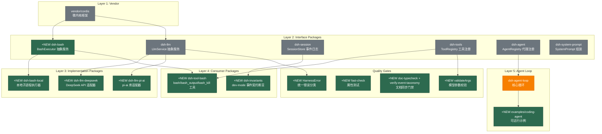

# Architecture Evolution & Design Log · 2026-06-13

## 1. 每日架构演进图

> 本图反映当日最重要的架构演进路径和设计拓扑。当日 commit 数量为 18 个，覆盖了从 bash 执行能力到运行时断言的完整基础设施搭建。



## 2. 设计模式与重构

- **应用的设计模式**：
  - **Strategy Pattern（bash 执行）**：`BashExecutor` 抽象类定义执行策略接口，`LocalBashExecutor` 是本地子进程策略实现。策略切换不需要修改工具层（`dsh-tool-bash`）。
  - **Adapter Pattern（LLM 适配器）**：`dsh-llm-deepseek`（手写 fetch + SSE 解析）和 `dsh-llm-pi-ai`（`@earendil-works/pi-ai` 库）是同一 `StreamChunk` 协议的两个适配器实现。这不是巧合，而是设计验证双胞胎（ADR 0010）。
  - **Template Method Pattern（invariants）**：`dsh-invariants` 的 `checkEvent()` 函数定义了事件契约检查的骨架，具体断言逻辑是骨架中的步骤。
  - **Facade Pattern（tool schema DSL）**：`SchemaSpec` 是面向工具作者的轻量级 DSL 门面，内部转换为标准 JSON Schema 用于 LLM 线格式。

- **模块解耦与接口定义**：
  - **Capability Seam 三分法（ADR 0009）**：每个可交换能力拆为 Interface / Implementation / Consumer 三个包。bash 是参考模板：`dsh-bash`（接口）→ `dsh-bash-local`（实现）→ `dsh-tool-bash`（消费者）。这建立了后续所有能力拆分的范式。
  - **Request/Spec 分离**：`BashExecRequest`（调用者请求）→ `resolve()` → `BashExecSpec`（完全解析后的执行规格）。"显式优于隐式"——默认值在拥有配置的实现层解析，而不是隐藏在 `run()` 内部的 `?? default`。

- **基础设施与性能**：
  - **进程组管理**：`dsh-bash-local` 使用 `detached: true` 创建独立进程组，SIGTERM→SIGKILL 优雅降级（OpenCode 的升级策略，Codex/pi 直接 SIGKILL）。输出截断采用 tail-keep + spill-to-disk 模式。
  - **凭证泄露防护**：`SENSITIVE_ENV_PATTERN` 过滤 `KEY|SECRET|TOKEN` 模式的环境变量，防止 `DEEPSEEK_API_KEY` 泄露到命令输出、spill 文件或 tool 结果中。

## 3. 特性交付与系统影响

- **核心特性**：
  - **Bash 执行能力（完整三层）**：抽象接口 `BashExecutor`（含前台运行、后台任务管理、增量输出读取）、本地实现 `LocalBashExecutor`（进程组管理、SIGTERM/SIGKILL 降级、输出截断）、工具层 `dsh-tool-bash`（`bash`/`bash_output`/`bash_kill` 三个工具定义）。
  - **LLM 适配器双胞胎**：`dsh-llm-deepseek`（手写 SSE 解析）和 `dsh-llm-pi-ai`（pi-ai 库），两者共享 `StreamChunk` 协议但内部实现完全不同。这不是"两个适配器"，而是"一个中性协议的两个验证器"。
  - **可运行示例**：`examples/coding-agent` 提供完整的 coding agent 配置（`cordis.yml`）、stdio 交互（`stdio-chat.ts`）和 JSONL 会话持久化（`session-jsonl.ts`）。

- **系统拓扑影响**：
  - 新增 `packages/bash`、`packages/bash-local`、`packages/tool-bash`、`packages/llm-deepseek`、`packages/llm-pi-ai`、`packages/invariants` 六个包，monorepo 从 Day 1 的脚手架扩展为具有完整执行能力的 agent 框架。
  - `dsh-agent-loop` 从纯抽象变为有具体实现的循环——可运行的 coding-agent 示例证明了端到端流程的可行性。
  - 质量门禁从"CI 手动检查"升级为"机械门禁"——doc-typecheck、verify-event-taxonomy、属性测试、运行时断言四层防御。

## 4. 架构决策与 Roadmap 对齐

- **关键技术决策（ADR 推断）**：

  - **ADR 0009: Capability Seam 三分法**
    - **背景与痛点**：bash 执行需要在本地、沙箱、远程后端之间切换，但切换不应该影响模型看到的工具 schema。
    - **选择的方案与 Trade-offs**：三包拆分（Interface / Implementation / Consumer），代价是更多包和样板代码，收益是实现和消费者独立演化。故意不强制所有能力都拆——LLM 缝合了接口+消费者（`dsh-llm`），因为消费者是循环本身而非可交换的 schema 表面。
    - **决策推断**：开发者选择了"bash 是参考模板"的策略——先在最复杂的能力上验证三分法，而不是预先对所有能力强制拆分。这体现了"演进式架构"的思维。

  - **ADR 0010: LLM 适配器双胞胎**
    - **背景与痛点**：单一适配器会让"provider-neutral"协议悄悄编码该适配器的假设。
    - **选择的方案与 Trade-offs**：从 Day 1 就维护两个真实适配器（手写 fetch vs pi-ai 库），代价是双倍维护和 e2e 成本，收益是"StreamChunk 无法同时为两个实现表达的东西就是核心协议 bug"——在第一个适配器阶段就捕获泄漏。
    - **决策推断**：这是防御性架构思维——不是等第二个 provider 到来时才发现协议不够中性，而是主动制造第二个验证器。pi-ai 适配器确实暴露了错误路径分歧（`throw from stream()` vs `finish {kind:'error'}`），证明了这个策略的价值。

  - **ADR 0011: 运行时参数校验**
    - **背景与痛点**：`InferArgs<S>` 只是编译时类型声明，模型生成的 JSON 不受 TypeScript 类型约束——缺失必填字段、类型错误、enum 越界会直接到达 `execute` 导致崩溃或静默错误。
    - **选择的方案与 Trade-offs**：`validateArgs()` 在 `defineTool` 的 `execute` 之前运行，返回人类可读的违规列表。选择总函数（total，不抛异常）而非异常，让工具注册表的 catch 可以将其转为 `isError` 结果供模型自纠正。
    - **决策推断**：先写 arg validation（PR 6），再写 dev invariants（PR 8），最后写错误分类（PR 14）——这是"先解决问题，再建立基础设施，最后统一语言"的递进策略。ADR 0015 故意最后且独立构建，确保可独立回滚。

  - **ADR 0012: Dev-mode Invariants vs DeepReadonly**
    - **背景与痛点**：session log 是 append-only 的，但类型不强制不可变——`deriveMessages()` 通过引用暴露 logged content，request middleware 可能回溯修改历史，破坏 replay 等价性。
    - **选择的方案与 Trade-offs**：拒绝 `DeepReadonly<T>`（类型噪音高、插件直接绕过、编译时-only），选择运行时 freeze + dev-mode 断言。`deriveMessages()` 始终深拷贝（真正的修复），`dsh-invariants` 是 dev-mode .tripwire。
    - **决策推断**：开发者在"静态保证 vs 动态保证"之间选择了后者——因为 Cordis 插件生态中类型系统无法阻止故意的类型断言，运行时 freeze 在零生产成本下提供了真实的防篡改保证。

  - **ADR 0013: 属性测试**
    - **背景与痛点**：示例测试固定了"我们想到的用例"，但 harness 的核心是协议形状——chunk stream、event log、schema 转换——输入空间是组合爆炸的，有趣 bug 藏在没人写过的交错中。
    - **选择的方案与 Trade-offs**：`fast-check` 生成"真实但对抗性"的输入（偏向小索引池和短字符串以增加碰撞），每个协议形状包一个 `properties.spec.ts`。属性测试补充而非替代示例测试。
    - **决策推断**：开发者用"already paid off"证明了价值——BlockAssembler 的 stream 属性测试发现了 `block-end` 重复索引覆盖已刷新 block 的真实 bug。这不是理论论证，而是实证驱动的采纳。

  - **ADR 0014: Doc-sync 执行**
    - **背景与痛点**：AGENTS.md 承诺文档与代码同步，但只靠人眼检查——review 已经两次捕获漂移（cookbook 示例与类型策略矛盾、README 引用错误的 `registerAdapter` 调用）。
    - **选择的方案与 Trade-offs**：两个 CI 门禁——`doc-typecheck`（提取代码块编译）和 `verify-event-taxonomy`（比对事件名集合）。故意不生成 taxonomy 表格（"比问题需要的更多机制"），只验证名称集合。
    - **决策推断**：API-extractor golden reports（RFC 006 part 3）被故意推迟——"对内部 monorepo 低价值，且是沉重、脆弱的依赖"。这是"先做高 ROI 的机械门禁，推迟高成本的全面方案"的务实选择。

  - **ADR 0015: 结构化错误分类**
    - **背景与痛点**：失败以裸字符串跨越缝合——工具错误被扁平化为文本块，`name`/`code`/`stack` 丢失，未来沙箱/重试插件无法区分 ENOENT 和 EACCES。
    - **选择的方案与 Trade-offs**：`HarnessError extends Error` 基类放在 `dsh-llm`（所有人都导入的叶子包，无新依赖边）。`ToolArgsError`、`InvariantError`、`LlmError` 都继承它。故意最后且独立构建——之前的 PR 抛出 `Error` + `code` 字段，这个 change 是纯升级，可独立回滚。
    - **决策推断**：开发者明确标注"这是用户最怀疑的 RFC 005 piece，所以故意最后且独立构建"——体现了对 review 反馈的尊重和增量交付策略。

- **产品 Roadmap 支撑**：Day 4 对应 **MVP 能力闭环**——bash 执行 + LLM 适配器 + 工具定义 + 事件契约 + 质量门禁 = 一个可运行的 coding agent。`examples/coding-agent` 是这一阶段的"可证明的里程碑"。

## 5. 开发者/架构师决策推断

- **开发者意图重建**：
  - **思维模型**：开发者脑中的系统画面是一个**分层微内核**——底层是 Cordis 插件注册机制，中间是 Interface/Implementation/Consumer 三层能力缝合，顶层是 agent 循环驱动模型执行。Day 4 的工作是把这个画面从"架构图"变成"可运行代码"。
  - **优先级排序**：
    1. **先建立执行能力**（bash 能力三层）——没有 bash 就没有文件操作，agent 无法工作。
    2. **再建立推理能力**（LLM 适配器双胞胎）——没有模型就不是 agent。
    3. **然后建立示例**（coding-agent）——证明端到端流程可行。
    4. **接着建立文档**（ADR + cookbook + architecture）——让后续贡献者有据可依。
    5. **最后建立质量门禁**（arg validation → invariants → property tests → doc-sync → error taxonomy）——从"能跑"到"跑得对"。
  - **有意取舍**：
    - **"暂时这样"**：coding-agent 示例的 system prompt 是硬编码的字符串，后续应该抽取到配置或模板。
    - **"就要这样"**：Capability Seam 三分法是硬性规则——bash 是参考模板，后续所有可交换能力都必须遵循。
    - **"就要这样"**：LLM 适配器双胞胎是设计验证策略，不是"两个适配器"——即使维护成本高也要保留，直到 conformance test 能机械验证协议中性。
    - **"就要这样"**：`HarnessError` 放在 `dsh-llm`（叶子包）而非独立包——避免新依赖边，利用"所有人都已经导入"的事实。

- **架构师决策推断**：
  - **模块拆分粒度的选择依据**：bash 能力的三包拆分不是过度工程——它验证了"实现和消费者独立演化"的假设。当第二个 bash 后端（沙箱）出现时，只需新增一个 `dsh-bash-sandbox` 包，不触碰 `dsh-tool-bash`。LLM 缝合了接口+消费者是因为消费者是循环本身——没有可交换的 schema 表面。
  - **抽象层引入时机的考量**：`BashExecutor.resolve()` 是"显式优于隐式"原则的物理实现——默认值在拥有配置的实现层解析，接口层保持完全显式。这个抽象在 Day 4 引入是因为 bash 是第一个需要配置（workdir、timeout）的能力。
  - **对后续可扩展性的影响**：Day 4 建立的四层质量门禁（arg validation → invariants → property tests → doc-sync）定义了"什么是 done"的标准——后续的 PR 必须通过这些门禁，而不仅仅是"代码能跑"。
  - **作为架构师，你会赞同/质疑哪些选择**：
    - **强烈赞同**：ADR 0010（适配器双胞胎）——这是防御性架构的教科书案例。pi-ai 适配器确实暴露了错误路径分歧，证明了"主动制造第二个验证器"的价值。
    - **赞同**：ADR 0012（dev-mode invariants）——在 Cordis 插件生态中，运行时 freeze 比 DeepReadonly 更实际。
    - **质疑**：doc-typecheck 的 `ignore-check` opt-out 机制——"超过半数就失败"的阈值是经验性的，应该有更精确的度量（如每 1000 行代码最多 N 个 opt-out）。
    - **质疑**：coding-agent 示例的 system prompt 硬编码——这应该是配置而非代码，否则每次调整 prompt 都需要重新构建。

- **Code Review 视角**：
  - **作为 reviewer，你首先关注哪个变更**：`packages/bash/src/index.ts`（`BashExecutor` 抽象类）——这是整个 bash 能力缝合的契约，所有后续实现都受其约束。需要确认：(1) 抽象方法是否覆盖了所有必要的生命周期（run/start/kill/dispose），(2) 语义契约（`run` 只在基础设施失败时 reject）是否清晰。
  - **你会向提交者提出什么问题**：
    1. `dsh-bash-local` 的 SIGTERM→SIGKILL 优雅降级中，`graceMs` 的默认值是多少？是否有配置入口？
    2. `SENSITIVE_ENV_PATTERN` 过滤了 `KEY|SECRET|TOKEN`，但 `process.env` 中可能有其他敏感变量（如 `DATABASE_URL`）——是否有白名单机制？
    3. LLM 适配器双胞胎的 e2e 测试是否覆盖了所有 `StreamChunk` 协议路径？两个适配器的错误处理分歧是否都有测试？
    4. `doc-typecheck` 提取代码块时，如何处理嵌套的 fenced code block（如 markdown 中的 ``` 包裹的代码块）？
  - **哪些做得好**：
    - Capability Seam 三分法的文档极其清晰——ADR 0009 不仅记录了"做什么"，还记录了"为什么不做成一个包"和"什么时候不需要拆分"。
    - 属性测试的 generator 设计是"真实但对抗性"的——偏向小索引池和短字符串以增加碰撞，而不是均匀随机噪声。
    - 错误分类故意最后且独立构建（ADR 0015），确保可独立回滚——这是对 review 反馈的尊重。
  - **哪些可以改进**：
    - `examples/coding-agent` 的 system prompt 应该外部化为配置文件，避免代码和 prompt 耦合。
    - `dsh-invariants` 的 `InvariantError` 应该继承 `HarnessError`（ADR 0015 后已修复，但 Day 4 的初始 PR 中是独立的 `Error` 子类）。
    - 属性测试的 `numRuns` 应该在 CI 和本地之间有差异——CI 可以跑更多轮次以发现更罕见的交错。

## 6. 技术债务与风险评估

- **已知风险 / 变通方案**：
  - **LLM 适配器双胞胎的维护负担**：双倍的适配器代码、双倍的 e2e 测试、双倍的 key-gated surface。ADR 0010 明确记录了退出条件——当 conformance test（RFC 004）能机械验证协议中性时，可以退役双胞胎。目前这个退出条件尚未满足。
  - **`ignore-check` 的滥用风险**：`doc-typecheck` 允许 `ts ignore-check` opt-out，但阈值是"超过半数就失败"。如果多个贡献者同时 opt-out，阈值可能被突破而不被注意。建议将阈值从比例改为绝对数（如每 100 个代码块最多 5 个 opt-out）。
  - **coding-agent 示例的 prompt 硬编码**：system prompt 在 `cordis.yml` 中以 YAML 字面量定义，调整 prompt 需要修改 YAML 并重新加载插件树。这是 MVP 的临时方案，后续应该支持从文件加载。
  - **`deepFreeze` 的递归深度**：`dsh-invariants` 的 `deepFreeze` 没有深度限制——如果 session event 中有循环引用（虽然不应该有），会导致栈溢出。PR 16（`fix(invariants): deepFreeze walks already-frozen objects' descendants`）部分修复了这个问题。

- **建议的下一步**：
  1. 将 coding-agent 示例的 system prompt 外部化为独立配置文件（如 `prompt.md`），支持热更新。
  2. 为 `dsh-bash-local` 添加配置入口（workdir、timeout、grace period），替代硬编码的 `ENV_OVERRIDES` 和 `SENSITIVE_ENV_PATTERN`。
  3. 扩充属性测试的 generator——当前覆盖了 session event log、tool schema、BlockAssembler chunk stream、agent loop schedule，但未覆盖 bash 执行的输出截断逻辑。
  4. 建立 conformance test 套件（RFC 004），为 LLM 适配器双胞胎的退役创造条件。

---

## 阶段性深度分析

### Phase 1: 核心能力缝合 — Bash Execution

**涉及的 Commits**: `8b5a3ef730`

**阶段意图**：建立第一个完整的 Capability Seam 参考实现——bash 执行。从抽象接口到本地实现到工具定义，一次性交付完整的三层结构，为后续所有能力拆分树立模板。

**开发者视角推断**：
- **思维模型**：开发者脑中已经有了完整的微内核架构画面——`ctx.bash` 是一个可交换的服务键，实现者注册为插件，消费者通过 inject 获取。Day 4 的 bash 三层是这个画面的第一个物理实现。
- **优先级选择**：bash 是 agent 与外部世界交互的唯一通道（文件操作、命令执行、测试运行），没有 bash 就没有 coding agent。这是 MVP 中优先级最高的能力。
- **有意取舍**：
  - **"暂时这样"**：`LocalBashExecutor` 只支持本地子进程——沙箱和远程后端是后续包的事。
  - **"就要这样"**：`resolve()` 方法将默认值解析推到实现层，接口层保持完全显式——这是"显式优于隐式"原则的物理实现，不是可选的。

**架构师视角推断**：
- **粒度考量**：三包拆分不是过度工程——bash 的实现多样性（本地、沙箱、远程）和消费者独立性（工具 schema 不因后端切换而变化）证明了拆分的必要性。但 LLM 缝合了接口+消费者，因为消费者是循环本身——这说明三分法是"当三者独立演化时"的规则，而非强制。
- **时机判断**：bash 在 Day 4 引入是因为它是 agent 的最小能力集——没有 bash 就无法验证 agent 循环的端到端流程。
- **后续影响**：bash 三分法建立了模板——后续的 sandbox 能力、subprocess 能力、web 能力都会遵循同样的 Interface/Implementation/Consumer 结构。

**重点关注的文档/代码**：

| 文件/模块 | 路径 | 阅读要点 |
|-----------|------|----------|
| BashExecutor | `packages/bash/src/index.ts` | 抽象方法设计：resolve/run/start/kill/list/readOutput，以及 onTaskDone 监听器的生命周期管理 |
| BashExecRequest/Spec | `packages/bash/src/types.ts` | Request → Spec 的分离：调用者请求是可选的，完全解析后的 Spec 是必选的 |
| LocalBashExecutor | `packages/bash-local/src/index.ts` | 实现层的配置管理：defaultWorkdir、defaultTimeout、maxTimeout 如何通过 resolve() 暴露 |
| run.ts | `packages/bash-local/src/run.ts` | 进程组管理：detached、SIGTERM→SIGKILL 降级、tail-keep + spill-to-disk 截断 |
| tool-bash | `packages/tool-bash/src/index.ts` | 消费者层：bash/bash_output/bash_kill 工具定义，如何 inject ctx.bash 而不导入实现类型 |

**关键代码模式**：
```typescript
// packages/bash/src/index.ts:31-43
// Request/Spec 分离：默认值在实现层解析
abstract resolve(request: BashExecRequest): BashExecSpec

// packages/bash-local/src/run.ts:28-36
// 凭证泄露防护：环境变量过滤
export const SENSITIVE_ENV_PATTERN = /KEY|SECRET|TOKEN/i

// packages/bash-local/src/run.ts:16-22
// Model-friendly 环境覆盖
export const ENV_OVERRIDES = {
  NO_COLOR: '1',
  TERM: 'dumb',
  PAGER: 'cat',
  GIT_PAGER: 'cat',
} as const
```

**领域建模洞察**（DDD 视角）：
- **聚合根**：`BashExecutor` 是 bash 执行领域的聚合根——所有前台运行和后台任务都通过它管理。
- **值对象**：`BashExecRequest`（调用者意图）、`BashExecSpec`（完全解析后的执行规格）、`BashRunResult`（执行结果）都是值对象。
- **领域事件**：`onTaskDone` 是后台任务完成的领域事件，通过 listener 模式通知消费者。

**AI Agent 能力演进**：
- agent 的能力边界从"无"扩展到"bash 执行"——这是最小能力集。
- `ctx.bash` 服务键的建立意味着 agent 循环可以通过 Cordis 的 inject 机制获取执行能力，而不需要硬编码依赖。

---

### Phase 2: LLM 适配器双胞胎 + 可运行示例

**涉及的 Commits**: `ab19fed77c`, `e98c1c5d42`

**阶段意图**：建立 LLM 推理能力（双适配器验证）和端到端可运行示例。双适配器不是"两个实现"，而是"一个中性协议的两个验证器"——确保 `StreamChunk` 协议不编码任何单一适配器的假设。

**开发者视角推断**：
- **思维模型**：开发者知道单一适配器会让协议泄漏——"provider-neutral"的声称需要实证。pi-ai 适配器（通过库）和 deepseek 适配器（手写 fetch）共享协议但内部实现完全不同，这是最严格的验证。
- **优先级选择**：LLM 适配器在 bash 之后，因为没有模型就不是 agent。coding-agent 示例在适配器之后，因为它需要 bash + LLM + tools 全部就绪。
- **有意取舍**：
  - **"暂时这样"**：两个适配器共享 `Config` shape（apiKey/baseURL/models），但 reasoning knob 不同（thinking/reasoningEffort vs reasoning level）——这是"大体相同但细节不同"的务实选择。
  - **"就要这样"**：双胞胎策略是设计验证，不是冗余——即使维护成本翻倍也要保留，直到 conformance test 能机械验证。

**架构师视角推断**：
- **粒度考量**：LLM 缝合了接口+消费者（`dsh-llm` 包含 `LlmService` 和 `StreamChunk` 协议），没有拆成三包。这是因为消费者是循环本身——没有可交换的 schema 表面。这与 bash 的三分法形成对比，说明"三分法是规则，但有明确的例外"。
- **时机判断**：双适配器在 Day 4 引入是因为协议中性需要尽早验证——等到第二个真实 provider 到来时再验证，泄漏已经编码在协议中了。
- **后续影响**：coding-agent 示例是"可证明的里程碑"——它证明了 bash + LLM + tools + agent-loop 可以端到端工作，为后续的 feature 开发提供了回归基线。

**重点关注的文档/代码**：

| 文件/模块 | 路径 | 阅读要点 |
|-----------|------|----------|
| LlmDeepseekAdapter | `packages/llm-deepseek/src/adapter.ts` | 手写 fetch + SSE 解析，thinking mode 的 wire format |
| LlmPiAiAdapter | `packages/llm-pi-ai/src/adapter.ts` | pi-ai 库适配，reasoning level 的转换 |
| StreamChunk | `packages/llm/src/types.ts` | 中性协议定义：block-start/text-delta/reasoning-delta/tool-call-delta/block-end/usage/finish |
| coding-agent/cordis.yml | `examples/coding-agent/cordis.yml` | 完整的插件树配置：从 core services 到 adapters 到 tools 到 agent-loop |
| coding-agent/stdio-chat.ts | `examples/coding-agent/src/stdio-chat.ts` | stdio 交互循环：readline → agent loop → stdout |

**关键代码模式**：
```typescript
// packages/llm-deepseek/src/types.ts:1-10
// DeepSeek wire format：thinking mode 是顶级字段
export interface WireRequest {
  model: string
  messages: WireMessage[]
  stream: true
  thinking?: { type: 'enabled' | 'disabled' }
  reasoning_effort?: 'high' | 'max'
  // ...
}

// examples/coding-agent/cordis.yml:55-76
// 插件树配置：从 core 到 adapters 到 tools 到 agent-loop
- id: llm-deepseek
  name: '@deepseek-ai/dsh-llm-deepseek'
  config:
    apiKey: !!js process.env.DEEPSEEK_API_KEY
    models:
      - deepseek-v4-flash
      - deepseek-v4-pro
```

**领域建模洞察**（DDD 视角）：
- **值对象**：`StreamChunk` 协议的每个变体（block-start、text-delta、finish 等）都是值对象——它们描述了 LLM 输出的结构化表示。
- **领域服务**：`LlmService` 是 LLM 推理领域的服务——它不拥有状态，只提供 `stream()`/`streamBlocks()`/`generate()` 操作。

**AI Agent 能力演进**：
- agent 的能力边界从"bash 执行"扩展到"bash + LLM 推理"——双适配器确保推理能力不绑定单一 provider。
- `examples/coding-agent` 的 system prompt 定义了 agent 的人格和行为约束——这是 agent 能力的"软件定义"。

---

### Phase 3: 文档基础设施 — ADR + Cookbook + Architecture

**涉及的 Commits**: `066f94c7e0`, `39b3db4b9c`

**阶段意图**：建立文档基础设施——ADR 体系记录架构决策、cookbook 提供扩展指南、architecture.md 描述系统拓扑。这是"让后续贡献者有据可依"的文档治理。

**开发者视角推断**：
- **思维模型**：开发者知道代码是"怎么做"，文档是"为什么"。Day 4 引入了大量架构决策（capability seams、适配器双胞胎、参数校验、dev invariants、错误分类），这些决策需要 ADR 记录理由和 trade-offs，否则后续贡献者会重复踩坑。
- **优先级选择**：文档在代码之后——先让代码能跑（bash + LLM + 示例），再记录为什么这样做（ADR + cookbook）。这是"先验证再文档化"的策略。
- **有意取舍**：
  - **"暂时这样"**：architecture.md 是 Phase 1 的简化版——只描述了核心服务和分层，没有覆盖所有细节。后续 PR 会逐步扩充。
  - **"就要这样"**：ADR 格式选择了"Status / Context / Decision / Consequences"四段式——这是架构决策记录的标准格式，不需要创新。

**架构师视角推断**：
- **粒度考量**：ADR 的粒度是"一个决策一个文档"——capability seams（0009）、适配器双胞胎（0010）、参数校验（0011）、dev invariants（0012）各自独立，不合并。这确保了每个决策可以被独立引用和回滚。
- **时机判断**：文档在 Day 4 引入是因为 Day 4 是"架构决策密集日"——18 个 commit 中有 7 个是 ADR 或 RFC 相关的。没有文档，这些决策会淹没在 commit log 中。
- **后续影响**：cookbook（adding-a-tool、adding-an-llm-adapter、adding-a-package）为后续贡献者提供了"怎么做"的模板，ADR 为"为什么"提供了理由。两者结合降低了贡献门槛。

**重点关注的文档/代码**：

| 文件/模块 | 路径 | 阅读要点 |
|-----------|------|----------|
| ADR 0009 | `docs/adr/0009-capability-seams.md` | 三分法的理由、例外情况、与 Cordis inject 的关系 |
| ADR 0010 | `docs/adr/0010-twin-llm-adapters.md` | 双胞胎策略、退出条件、错误路径分歧的发现 |
| architecture.md | `docs/architecture.md` | 分层图、服务表、capability seams、event taxonomy |
| adding-a-tool | `docs/cookbook/adding-a-tool.md` | 工具定义的三步流程：schema → execute → register |
| adding-an-llm-adapter | `docs/cookbook/adding-an-llm-adapter.md` | 适配器实现的模板：types → serialize → translate → adapter |

**关键代码模式**：
```markdown
<!-- docs/architecture.md 分层图 -->
┌─────────────────────────────────────────────────────────────┐
│  future plugins: hooks, compaction, sandbox, UI, MCP…        │
├─────────────────────────────────────────────────────────────┤
│  @deepseek-ai/dsh-agent-loop      (the ONE concrete plugin)  │
│  @deepseek-ai/dsh-bash-local      (bash impl)                │
│  @deepseek-ai/dsh-tool-bash       (bash tool schemas)        │
├─────────────────────────────────────────────────────────────┤
│  @deepseek-ai/dsh-agent           (vocabulary + registry)    │
│  @deepseek-ai/dsh-tools           (registry + exec waterfall)│
│  @deepseek-ai/dsh-system-prompt   (assembly registry)        │
│  @deepseek-ai/dsh-session         (event-sourced log)        │
│  @deepseek-ai/dsh-llm             (abstract model service)   │
│  @deepseek-ai/dsh-bash            (abstract bash executor)   │
├─────────────────────────────────────────────────────────────┤
│  vendor/: cordis, loader, include, group, timer, hmr,        │
│           logger-console, cosmokit, schemastery              │
└─────────────────────────────────────────────────────────────┘
```

**领域建模洞察**（DDD 视角）：
- **边界上下文**：architecture.md 的分层图定义了 harness 的边界上下文——vendor（框架层）、interface packages（能力契约层）、implementation packages（能力实现层）、consumer packages（消费者层）、agent loop（循环层）。
- **通用语言**：ADR 建立了通用语言——"capability seam"、"adapter twin"、"event contract"、"dev-mode invariant" 这些术语在代码和文档中保持一致。

**AI Agent 能力演进**：
- 文档基础设施是 agent 能力的"元能力"——它让 agent 的行为可预测、可扩展、可审计。

---

### Phase 4: 运行时防御 — 参数校验 + Dev Invariants + 错误分类

**涉及的 Commits**: `36a30180b8`, `11f85b4f88`, `11a29fdefe`, `89e63f1436`, `825b57aff9`, `a45bc8da67`

**阶段意图**：建立运行时防御体系——模型生成的参数校验（入口防御）、事件契约断言 + session log freeze（内部防御）、结构化错误分类（出口防御）。这是从"能跑"到"跑得对"的关键跃迁。

**开发者视角推断**：
- **思维模型**：开发者将 harness 视为一个"信任边界系统"——模型生成的 JSON 是不可信输入，session log 是不可变历史，错误信息需要机器可路由。每一层都需要防御性检查。
- **优先级选择**：arg validation（入口）→ invariants（内部）→ error taxonomy（出口）的顺序是"先堵最宽的口，再建内部围栏，最后统一出口语言"。
- **有意取舍**：
  - **"暂时这样"**：`InvariantError` 和 `ToolArgsError` 初始是独立的 `Error` 子类，直到 ADR 0015 将它们统一到 `HarnessError` 基类。这是"先独立后统一"的策略。
  - **"就要这样"**：`validateArgs` 是总函数（total）——不抛异常，返回违规列表。这确保了工具注册表的 catch 可以统一处理，而不需要在每个工具中 try-catch。
  - **"就要这样"**：`deepFreeze` 是 dev-mode only——生产环境不 freeze，因为 `deriveMessages()` 的深拷贝是真正的修复，freeze 只是 tripwire。

**架构师视角推断**：
- **粒度考量**：错误分类的粒度是"一个 code 一个语义"——`INVALID_ARGS`（参数校验失败）、`INVARIANT`（事件契约违反）、`NO_ADAPTER`（无适配器）等。每个 code 对应一种恢复策略（重试、回退、告警），而不是一种错误类型。
- **时机判断**：错误分类故意最后且独立构建——ADR 0015 明确记录"这是用户最怀疑的 RFC 005 piece"。先让 arg validation 和 invariants 抛出 `Error` + `code`，再统一基类，确保可独立回滚。
- **后续影响**：四层防御体系定义了"harness 的质量标准"——后续的 PR 必须通过这些门禁，不仅仅是"代码能跑"。这为 CI/CD 流水线建立了机械化的质量门。

**重点关注的文档/代码**：

| 文件/模块 | 路径 | 阅读要点 |
|-----------|------|----------|
| validateArgs | `packages/tools/src/schema.ts` | 参数校验的实现：SchemaSpec → runtime value 的遍历逻辑 |
| dsh-invariants | `packages/invariants/src/index.ts` | 事件契约断言：seq 单调性、turn/step 嵌套、tool-call/result 配对 |
| HarnessError | `packages/llm/src/error.ts` | 统一错误基类：code + message + cause chaining |
| ADR 0011 | `docs/adr/0011-runtime-arg-validation.md` | 校验时机、总函数设计、与 InferArgs 的对齐 |
| ADR 0012 | `docs/adr/0012-dev-invariants-over-deep-readonly.md` | 为什么拒绝 DeepReadonly、freeze vs clone 的分工 |

**关键代码模式**：
```typescript
// packages/tools/src/schema.ts
// 参数校验：总函数，不抛异常
export function validateArgs(spec: SchemaSpec, args: unknown): string[]

// packages/invariants/src/index.ts:55-72
// 事件契约断言：seq 单调性
if (event.seq <= trace.lastSeq) {
  throw new InvariantError(`seq must strictly increase: saw ${event.seq} after ${trace.lastSeq}`)
}

// packages/llm/src/error.ts
// 统一错误基类
export class HarnessError extends Error {
  readonly code: string
  constructor(message: string, code: string, options?: ErrorOptions) {
    super(message, options)
    this.code = code
    this.name = new.target.name
  }
}
```

**领域建模洞察**（DDD 视角）：
- **值对象**：`HarnessError` 的 `code` 是值对象——它编码了错误的语义类别，独立于 message 和 stack。
- **领域事件**：`tool/result` 事件的 `error: { name, code }` 字段是错误的结构化表示——它让 retry/sandbox 插件可以基于 code 而非 message 做决策。

**AI Agent 能力演进**：
- 运行时防御是 agent 能力的"安全网"——它确保模型的错误输入不会导致系统崩溃，而是产生可操作的反馈。

---

### Phase 5: 质量基础设施 — 属性测试 + Doc-sync + Pre-push

**涉及的 Commits**: `2f6d3b8539`, `7b07b70750`, `6a528be569`, `7a39616a06`, `fa7d1df6f2`

**阶段意图**：建立质量门禁基础设施——属性测试验证协议形状代码的正确性、doc-sync 门禁确保文档与代码同步、pre-push hook 将门禁下沉到开发者本地。

**开发者视角推断**：
- **思维模型**：开发者将质量视为"多层防御"——属性测试捕获协议交错 bug（最深层）、doc-sync 门禁捕获文档漂移（中间层）、pre-push hook 在代码推送前运行门禁（最外层）。每一层捕获不同类别的问题。
- **优先级选择**：属性测试（最深）→ doc-sync（中间）→ pre-push（最外）的顺序是"先建立最深层的防御，再逐步向外扩展"。
- **有意取舍**：
  - **"暂时这样"**：属性测试只覆盖了 4 个协议形状包（llm/session/tools/agent-loop），没有覆盖 bash 输出截断——因为 bash 的输出截断逻辑更依赖操作系统行为，属性测试难以生成"真实但对抗性"的输入。
  - **"就要这样"**：`verify-event-taxonomy` 只验证事件名称集合，不验证 Mode/Purpose 列——"生成表格比问题需要的更多机制"，名称集合已经足够捕获最常见的漂移。
  - **"就要这样"**：pre-push hook 运行 doc-sync 门禁——这是"门禁下沉到开发者本地"的策略，确保问题在推送前被发现，而不是等 CI 失败。

**架构师视角推断**：
- **粒度考量**：属性测试的粒度是"一个协议形状一个 spec 文件"——`properties.spec.ts` 按包组织，每个文件覆盖该包的核心协议。这确保了测试的可发现性和可维护性。
- **时机判断**：属性测试在 Day 4 引入是因为它是"已经验证了价值"的实践——ADR 0013 明确记录了 BlockAssembler 的 stream 属性测试发现了真实 bug。这不是理论论证，而是实证驱动的采纳。
- **后续影响**：质量门禁体系定义了"什么是 done"的标准——后续的 PR 必须通过属性测试、doc-sync、pre-push hook，而不仅仅是"代码能跑"。这为 CI/CD 流水线建立了机械化的质量门。

**重点关注的文档/代码**：

| 文件/模块 | 路径 | 阅读要点 |
|-----------|------|----------|
| properties.spec.ts (llm) | `packages/llm/tests/properties.spec.ts` | BlockAssembler 的属性：flushReady()+flushRemaining() ≡ blocks() |
| properties.spec.ts (session) | `packages/session/tests/properties.spec.ts` | deriveMessages 确定性、replay-from-seed 等价性 |
| properties.spec.ts (tools) | `packages/tools/tests/properties.spec.ts` | JSON Schema required 与 SchemaSpec 的对齐、validateArgs 的正确性 |
| doc-typecheck | `scripts/doc-typecheck.ts` | 代码块提取、临时项目编译、ignore-check 阈值 |
| verify-event-taxonomy | `scripts/verify-event-taxonomy.ts` | 事件名集合比对：interface Events vs architecture.md 表格 |
| lefthook.yml | `lefthook.yml` | pre-push hook 配置：运行 doc-sync 门禁 |

**关键代码模式**：
```typescript
// packages/llm/tests/properties.spec.ts
// BlockAssembler 属性测试
fc.assert(
  fc.property(
    validChunkStream(),  // 生成真实但对抗性的 chunk stream
    (chunks) => {
      const assembler = new BlockAssembler()
      for (const chunk of chunks) assembler.push(chunk)
      expect(assembler.flushReady() + assembler.flushRemaining()).toBe(assembler.blocks().length)
    }
  )
)

// scripts/doc-typecheck.ts
// 代码块提取 + 临时项目编译
const codeBlocks = extractCodeBlocks(readmeContent)
const tmpProject = createTmpProject(codeBlocks, tsconfig)
await exec('tsc --noEmit', tmpProject)
```

**领域建模洞察**（DDD 视角）：
- **不变量**：属性测试的 invariant 是领域不变量的可执行表达——`flushReady()+flushRemaining() ≡ blocks()` 是 BlockAssembler 的核心不变量。
- **值对象**：`fc.assert` 的 seed 是测试的值对象——它确保了失败的可重现性。

**AI Agent 能力演进**：
- 质量基础设施是 agent 能力的"可信度保证"——它确保 agent 的行为是可预测的、可重现的、可审计的。

---
