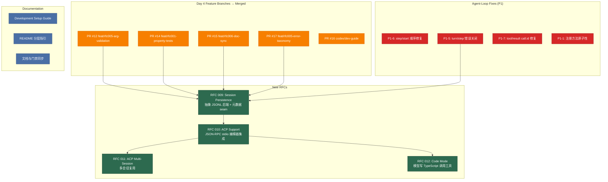

# Architecture Evolution & Design Log · 2026-06-14

## 1. 每日架构演进图

> 本图反映当日最重要的架构演进路径和设计拓扑。当日 commit 数量为23个，核心工作是合并 Day 4 的 feature 分支、新增 4 个 RFC 设计文档、以及修复 agent-loop 的关键 bug。



## 2. 设计模式与重构

- **应用的设计模式**：
  - **Branch-and-Merge 模式**：Day 4 的 5 个 feature 分支（arg-validation、property-tests、doc-sync、error-taxonomy、dev-guide）在 Day 5 依次合并到 master。这不是简单的 merge——每个分支都经过了 review（PR 1-4），合并顺序遵循依赖链：dev-invariants → property-tests → doc-sync → error-taxonomy。
  - **RFC 驱动设计**：4 个新 RFC（009-012）不是代码变更，而是架构设计文档。它们建立了"先设计再实现"的开发节奏——RFC 定义问题、方案、trade-offs，实现跟随 RFC。

- **模块解耦与接口定义**：
  - **Session Persistence 三分法预演**：RFC 009 预演了 ADR 0009 的 capability seam 三分法——`SessionPersistence`（接口）→ `SessionPersistenceJsonl`（实现）→ 消费者（agent-loop resume、ACP session/load）。这是 bash 三分法的第二个应用实例。
  - **ACP 协议映射**：RFC 010 将 ACP 协议方法映射到 harness 已有的 seam——`session/new` → `ctx.agentLoop.create`、`session/prompt` → `agent.send()`、`session/cancel` → `agent.abort()`。这是"不发明新机制，复用已有 seam"的设计哲学。

- **基础设施与性能**：
  - 无新增基础设施变更。当日重点是设计文档和 bug 修复。

## 3. 特性交付与系统影响

- **核心特性**：
  - **RFC 009（Session Persistence）**：定义了持久化抽象服务 `SessionPersistence`（create/append/load/list/has/delete/update）和 JSONL 实现。关键设计决策：(1) 持久化单位是 `SessionEvent` 本身（无转换类型），(2) `assistant/chunk` 必须逐字持久化以保持 `seq` 连续性，(3) `load` 返回到最后一个完整 `turn/end` 的事件，crash tail 在下次 `append` 时截断修复。
  - **RFC 010（ACP Support）**：定义了 ACP 桥接插件——通过 JSON-RPC stdio 驱动 coding agent。关键映射：`initialize` → 协议版本协商、`session/new` → agent 创建、`session/prompt` → `agent.send()`、`session/update` → `agent/stream-chunk` 翻译。权限门控是 `tools/execute` veto seam 的第一个真实消费者。
  - **RFC 011（ACP Multi-Session）**： lifts 单会话限制，允许多个并发会话复用一个 ACP 连接。关键隔离机制：per-session child Cordis context、per-session permission ownership、per-session cancel routing。
  - **RFC 012（Code Mode）**：模型写 TypeScript 代码调用工具 SDK，替代逐个 tool call。关键设计：(1) 三包拆分（CodeRuntime 接口 / CodeRuntimeVm 实现 / CodeMode 消费者），(2) `agent/request` waterfall 是 wire tool list 的权威执行点，(3) `code/dispatch` 事件提供子调用可观测性而不污染模型上下文。

- **系统拓扑影响**：
  - 无代码变更。但 4 个 RFC 定义了后续 3-5 天的实现路线图——session persistence、agent factory、ACP bridge、Code Mode 都将在后续 PR 中落地。
  - 5 个 PR 合并将 Day 4 的 feature 分支整合到 master，建立了"feature branch → review → merge"的工作流。

## 4. 架构决策与 Roadmap 对齐

- **关键技术决策（ADR 推断）**：

  - **RFC 009: assistant/chunk 逐字持久化**
    - **背景与痛点**：`deriveMessages()` 跳过 `assistant/chunk`（组装后的 `assistant/message` 才是权威历史），所以直觉是过滤 chunk 以节省磁盘空间。但 `seq = log.length` 和 `events[i].seq === i` 的 load 验证要求连续日志——过滤 chunk 会留下空洞。
    - **选择的方案与 Trade-offs**：逐字持久化所有 `SessionEvent`（包括 chunk），保持 `seq` 连续性。代价是更大的磁盘占用，收益是简单的 crash recovery 规则（"最后 `turn/end` = 提交点"）和精确的 resume。
    - **决策推断**：这是"正确性优先于优化"的选择——过滤 chunk 的优化可以作为衍生视图（projection）实现，但不能作为规范日志。

  - **RFC 010: ACP 权限门控作为 tools/execute veto seam 的消费者**
    - **背景与痛点**：`tools/execute` waterfall 已经记录了"单一 veto/sandbox/permission seam"的设计意图，但没有真实消费者。RFC 010 的权限门控是第一个——编辑器需要在执行工具前请求用户许可。
    - **选择的方案与 Trade-offs**：单个全局 `tools/execute` 监听器（`prepend: true`），通过 `WeakMap<Agent, sessionId>` 跟踪所有权——owned agent → `session/request_permission` → allow/veto；unowned agent → `next()` 直通。
    - **决策推断**：选择 `WeakMap` 而非注册表是因为 ACP 桥接不拥有 agent 的生命周期——agent 可能在桥接不知情的情况下被 disposal，WeakMap 确保不持有悬挂引用。

  - **RFC 012: Code Mode 的 `agent/request` waterfall 执行**
    - **背景与痛点**：Code Mode 需要将 wire tool list 从所有注册工具替换为单个 `run_code`。这个替换必须在"最后一个 seam"执行，否则后续监听器可以重新添加工具。
    - **选择的方案与 Trade-offs**：在 `agent/request` waterfall 中执行（`prepend: true`，`await next()` 后覆盖 `request.tools`）。这是"权威 seam"——在 `llm.stream()` 之前最后的修改点。
    - **决策推断**：选择 `agent/request` 而非 `system-prompt/assemble` 是因为后者只能影响 seed，前者是最终值。但 `llm.stream()` 自身还有 `llm/stream` waterfall——这个残余风险被记录在 RFC 中，不是遗漏。

- **产品 Roadmap 支撑**：Day 5 对应 **MVP 后的扩展规划**——session persistence（持久化）+ ACP（编辑器集成）+ Code Mode（工具调用优化）定义了 product roadmap 的 Phase 2。

## 5. 开发者/架构师决策推断

- **开发者意图重建**：
  - **思维模型**：开发者在 Day 4 完成了"能跑的 MVP"后，Day 5 转向"设计下一阶段"。4 个 RFC 不是同时写的——它们有明确的依赖链：RFC 009（persistence）是 RFC 010（ACP）的前提，RFC 010 是 RFC 011（multi-session）的前提。RFC 012（Code Mode）是独立的优化路径。
  - **优先级排序**：先合并 Day 4 的 feature 分支（建立 master 的稳定性），再写 RFC（设计下一阶段），再修 agent-loop bug（修复 Day 4 发现的问题）。这是"先巩固再扩展"的节奏。
  - **有意取舍**：
    - **"暂时这样"**：RFC 012 的 Code Mode 只提供 `node:vm` 参考实现，沙箱执行推迟到后续 RFC。这是"先验证设计再构建基础设施"。
    - **"就要这样"**：RFC 009 的 `assistant/chunk` 逐字持久化是硬性规则——不是"暂时这样"，而是"就要这样"，因为正确性依赖于 `seq` 连续性。

- **架构师决策推断**：
  - **模块拆分粒度的选择依据**：RFC 009 预演了 persistence 的三分法——接口包（`dsh-session-persistence`）、实现包（`dsh-session-persistence-jsonl`）、消费者（agent-loop、ACP）。这与 bash 三分法一致，验证了 ADR 0009 的通用性。
  - **抽象层引入时机的考量**：ACP 桥接（RFC 010）选择在 persistence（RFC 009）之后实现，因为 `session/load` 需要 persistence 的 `load()` 方法。这是"先建基础设施再建消费者"的时序。
  - **对后续可扩展性的影响**：RFC 012 的 Code Mode 设计为"可选插件"——加载它启用 Code Mode，不加载则保持原生 tool calling。这个"插件存在即启用"的模式与 Cordis 微内核一致。
  - **作为架构师，你会赞同/质疑哪些选择**：
    - **强烈赞同**：RFC 009 的 `assistant/chunk` 逐字持久化——这是"正确性优先于优化"的教科书案例。过滤 chunk 的优化可以后加，但 `seq` 连续性是不可妥协的不变量。
    - **赞同**：RFC 010 的 ACP 权限门控设计——WeakMap 所有权跟踪、single global listener、per-session isolation 都是正确的选择。
    - **质疑**：RFC 012 的 `node:vm` 参考实现——虽然 RFC 明确标注"不安全/仅测试"，但存在被误用于生产环境的风险。建议在 README 中更醒目地标注。
    - **质疑**：RFC 011 的 per-session child context——`ctx.extend()` 创建子上下文的开销是否在高并发场景下成为瓶颈？需要 benchmark。

- **Code Review 视角**：
  - **作为 reviewer，你首先关注哪个变更**：RFC 009——它是所有后续 RFC 的基础。需要确认：(1) `SessionEvent` 逐字持久化的 `seq` 连续性保证是否在 load 和 append 中都有测试覆盖，(2) crash tail 截断修复的原子性（`ftruncate` + `fsync`）是否在 power loss 场景下安全。
  - **你会向提交者提出什么问题**：
    1. RFC 009 的 `load()` 返回"到最后一个完整 `turn/end`"——如果 session 只有一个 `turn/start` 没有 `turn/end`（crash 在 turn 中间），load 返回什么？空事件列表？
    2. RFC 010 的 ACP 协议版本协商——如果客户端和服务器支持的版本不匹配，应该返回什么错误？是否有 fallback 机制？
    3. RFC 012 的 SDK codegen 对 MCP 工具的处理——MCP 工具的 JSON Schema 可能包含 `$ref`、`oneOf` 等复杂结构，codegen 降级为 `unknown` 是否足够？模型能否有效使用 `unknown` 类型的参数？
  - **哪些做得好**：
    - 4 个 RFC 的依赖链清晰——009 → 010 → 011，012 独立。这降低了实现的耦合度。
    - 每个 RFC 都有明确的"Risks"章节——不是事后补充，而是设计的一部分。
    - agent-loop 的 4 个 P1 bug 修复都有测试覆盖——不是"修了就算"，而是"修了+测了"。
  - **哪些可以改进**：
    - RFC 009 的 `SessionMeta` 放在 `dsh-session` 而非 `dsh-session-persistence`——这意味着 persistence 接口包需要 re-export metadata 类型。更好的做法是让 persistence 接口包 own metadata（因为它定义了持久化契约）。
    - RFC 012 的 Code Mode 没有讨论与 parallel tool execution 的交互——如果 loop 未来支持并行工具调用，Code Mode 的子调用是否也需要并行？

## 6. 技术债务与风险评估

- **已知风险 / 变通方案**：
  - **RFC 009 的 crash safety 边界**：append-only + flush 对部分尾部写入有鲁棒性，但对 fsync-less 的 power loss mid-line 不安全。RFC 诚实声明了这个限制——DB/WAL 后端是更强的选项。
  - **RFC 010 的 stdout 协议保证**：ACP 使用 stdout 作为 JSON-RPC 传输，但 console logger 也写 stdout。保证是"配置级"的（acp-agent 示例不加载 stdout 插件），不是"代码级"的。RFC 明确拒绝了 `process.stdout.write` 劫持方案。
  - **RFC 012 的 node:vm 安全性**：`code-runtime-vm` 不是沙箱—— withholding `require`/`process` 不构成隔离边界。RFC 明确标注"仅参考/测试/不安全"，但误用风险存在。
  - **Agent-loop P1 bug 的根因**：P1-5（turn/step 错误关闭）的根因是 loop 在 error 路径上没有正确关闭 turn——这暴露了 error handling 的系统性问题。P1-6（step/start 顺序）和 P1-7（tool/result call.id）是类似的消息顺序问题。

- **建议的下一步**：
  1. 实现 RFC 009（session persistence），验证 `seq` 连续性和 crash recovery。
  2. 实现 RFC 010（ACP bridge），验证协议映射和权限门控。
  3. 为 RFC 012（Code Mode）构建沙箱执行后端（替代 `node:vm`），这是生产化的前提。
  4. 为 agent-loop 的 error handling 建立系统性的测试覆盖——当前的 P1 bug 是逐个修复的，需要一个全局的 error path 测试。

---

## 阶段性深度分析

### Phase 1: Feature Branch 合并 — Day 4 成果整合

**涉及的 Commits**: `9b1507a2b7`, `751403bd1a`, `204c36ed76`, `d82b4e0d88`, `87608f3c32`, `7586caf2dd`

**阶段意图**：将 Day 4 的 5 个 feature 分支（arg-validation、property-tests、doc-sync、error-taxonomy、dev-guide）合并到 master，建立代码库的稳定性基线。

**开发者视角推断**：
- **思维模型**：开发者知道 Day 4 的 feature 分支是"并行开发、顺序依赖"的——arg-validation 是 property-tests 的前提（属性测试验证 validator），property-tests 是 doc-sync 的前提（doc-sync 依赖类型正确），error-taxonomy 是最后的统一。合并顺序反映了这个依赖链。
- **优先级选择**：先合并再写 RFC——master 需要稳定的代码基线才能进行下一步设计。
- **有意取舍**：
  - **"暂时这样"**：合并后没有运行完整 CI——Day 5 的 CI 矩阵（`docs: clarify Node CI matrix`）是在合并后才建立的。
  - **"就要这样"**：合并顺序严格遵循依赖链——不是"先合并简单的"，而是"先合并被依赖的"。

**架构师视角推断**：
- **粒度考量**：5 个 PR 各自独立，但有明确的依赖关系。这种"独立开发、顺序合并"的模式验证了 feature branch 工作流的有效性。
- **时机判断**：Day 5 合并 Day 4 的分支，而不是 Day 4 当天——这是"开发日 → 合并日"的节奏，确保合并时所有分支都经过了 review。
- **后续影响**：合并后的 master 成为后续 RFC 实现的基线——session persistence、ACP bridge、Code Mode 都基于合并后的代码。

**重点关注的文档/代码**：

| 文件/模块 | 路径 | 阅读要点 |
|-----------|------|----------|
| PR #12 | `feat/rfc005-arg-validation` | 参数校验的最终形态：validateArgs + ToolArgsError |
| PR #14 | `feat/rfc001-property-tests` | 属性测试的最终形态：4 个 properties.spec.ts |
| PR #15 | `feat/rfc006-doc-sync` | doc-sync 门禁的最终形态：doc-typecheck + verify-event-taxonomy |
| PR #17 | `feat/rfc005-error-taxonomy` | 错误分类的最终形态：HarnessError 基类 |
| PR #16 | `codex/dev-guide` | 开发指南的最终形态：development.md |

**关键代码模式**：
```typescript
// 合并后的 master 包含了 Day 4 的所有核心模式：
// 1. validateArgs (packages/tools/src/schema.ts)
// 2. HarnessError (packages/llm/src/error.ts)
// 3. dsh-invariants (packages/invariants/src/index.ts)
// 4. properties.spec.ts (packages/*/tests/)
// 5. doc-typecheck + verify-event-taxonomy (scripts/)
```

**领域建模洞察**（DDD 视角）：
- **通用语言**：合并后的 master 建立了完整的通用语言——"capability seam"、"adapter twin"、"event contract"、"dev-mode invariant"、"structured error" 这些术语在代码和文档中保持一致。

**AI Agent 能力演进**：
- 合并后的 master 是 agent 能力的"稳定基线"——后续的所有 RFC 实现都基于这个基线。

---

### Phase 2: RFC 设计 — Session Persistence + ACP + Code Mode

**涉及的 Commits**: `a44f7f3486`, `64ce7caedc`, `de73afbe39`, `5cec4c2f65`, `1cc6e1caf7`, `6d9934103d`, `1b7c376aec`, `2638ec9f3f`, `a1eea4d36e`, `76602a0844`

**阶段意图**：通过 4 个 RFC 设计文档规划下一阶段的架构——session persistence（持久化）、ACP（编辑器集成）、Code Mode（工具调用优化）。

**开发者视角推断**：
- **思维模型**：开发者将 RFC 视为"架构契约"——每个 RFC 定义问题、方案、trade-offs、risks，实现跟随 RFC。这不是"写完代码再补文档"，而是"先设计再实现"。
- **优先级选择**：RFC 009（persistence）→ RFC 010（ACP）→ RFC 011（multi-session）是依赖链；RFC 012（Code Mode）是独立优化路径。先写依赖链是因为它是 product roadmap 的关键路径。
- **有意取舍**：
  - **"暂时这样"**：RFC 012 的 Code Mode 只有 `node:vm` 参考实现——沙箱执行推迟到后续 RFC。
  - **"就要这样"**：RFC 009 的 `assistant/chunk` 逐字持久化是硬性规则——不是优化选择，是正确性要求。

**架构师视角推断**：
- **粒度考量**：4 个 RFC 各自独立但有依赖关系。RFC 009 是基础（没有 persistence 就没有 resume），RFC 010 建立在 009 之上（ACP 的 `session/load` 需要 persistence），RFC 011 lift 了 010 的单会话限制。RFC 012 是独立的优化路径，不依赖 009-011。
- **时机判断**：RFC 在 Day 5 而非 Day 4 写——Day 4 是"实现日"，Day 5 是"设计日"。这是"实现 → 设计 → 实现"的迭代节奏。
- **后续影响**：4 个 RFC 定义了后续 3-5 天的实现路线图。每个 RFC 都有明确的"Plan"章节——7 步实现计划，从 package scaffold 到 tests 到 docs。

**重点关注的文档/代码**：

| 文件/模块 | 路径 | 阅读要点 |
|-----------|------|----------|
| RFC 009 | `docs/rfc/009-session-persistence-and-resumability.md` | 持久化抽象设计：SessionPersistence 接口、JSONL 实现、metadata seam |
| RFC 010 | `docs/rfc/010-acp-agent-client-protocol.md` | ACP 协议映射：initialize/session/new/session/prompt/session/cancel |
| RFC 011 | `docs/rfc/011-acp-multi-session.md` | 多会话隔离：per-session child context、permission ownership |
| RFC 012 | `docs/rfc/012-optional-code-mode.md` | Code Mode 设计：CodeRuntime 接口、SDK codegen、agent/request 执行 |

**关键代码模式**：
```markdown
<!-- RFC 009 的核心设计决策 -->
- 持久化单位是 SessionEvent 本身（无转换类型）
- assistant/chunk 必须逐字持久化以保持 seq 连续性
- load 返回到最后一个完整 turn/end 的事件
- crash tail 在下次 append 时截断修复

<!-- RFC 010 的协议映射 -->
| ACP (client ⇄ agent) | Harness seam | Notes |
|---|---|---|
| `session/new` | `ctx.agentLoop.create` | agent generates sessionId |
| `session/prompt` | `agent.send()` | idle → running → idle settle |
| `session/cancel` | `agent.abort(reason)` | settle in-flight prompt |

<!-- RFC 012 的 Code Mode 执行 -->
agent/request waterfall → prepend: true → override request.tools to [run_code]
```

**领域建模洞察**（DDD 视角）：
- **边界上下文**：RFC 009 定义了 persistence 边界上下文——`SessionPersistence` 是聚合根，`SessionEvent` 是值对象，`SessionMeta` 是值对象。
- **通用语言**：RFC 建立了"append-only log"、"contiguous seq"、"crash tail"、"turn-enclosure" 等通用语言。

**AI Agent 能力演进**：
- RFC 009 为 agent 增加了"持久化记忆"能力——agent 可以从磁盘恢复过去的会话。
- RFC 010 为 agent 增加了"编辑器集成"能力——agent 可以被外部编辑器驱动。
- RFC 012 为 agent 增加了"代码模式"能力——模型可以写 TypeScript 调用工具，而不是逐个 tool call。

---

### Phase 3: Agent-Loop Bug 修复 — P1 系列

**涉及的 Commits**: `9d5b3ab832`, `22e9152d8b`, `37576ade6a`, `2df41ee1d3`

**阶段意图**：修复 agent-loop 的 4 个关键 bug（P1-1、P1-5、P1-6、P1-7），这些 bug 是 Day 4 实现过程中发现的。

**开发者视角推断**：
- **思维模型**：开发者将 agent-loop 视为"状态机"——turn/step 的生命周期有严格的顺序和平衡约束。P1-5（turn/step 错误关闭）是"状态机在 error 路径上没有正确转换"，P1-6（step/start 顺序）是"事件在 turn/start 之前发出"，P1-7（tool/result call.id）是"事件的 correlation id 不匹配"。
- **优先级选择**：P1-5（turn/step 平衡）优先级最高——如果 turn 没有正确关闭，session log 会损坏。P1-6（step/start 顺序）次之——顺序错误会导致 invariant 检查失败。P1-7（call.id）最后——是 correlation 问题，不影响正确性。
- **有意取舍**：
  - **"暂时这样"**：P1-1（注册方法原子性）修复了 6 个注册方法在 throwing change-listener 下的原子性——这是防御性修复，不是 bug fix。
  - **"就要这样"**：P1-5 的修复确保"总是关闭 started turn 和任何 open step"——这是硬性规则，不是可选的。

**架构师视角推断**：
- **粒度考量**：4 个 P1 bug 各自独立，但都与 agent-loop 的状态管理相关。它们被分为独立的 PR（#21、#22、#23、#24），而不是合并为一个大 PR——这是"每个 bug 一个 PR"的策略，确保可独立回滚。
- **时机判断**：bug 修复在 Day 5 而非 Day 4——Day 4 是"实现日"，Day 5 是"修复日"。这是"实现 → 发现 bug → 修复"的迭代节奏。
- **后续影响**：P1-5 的修复引入了 `failTurn` 机制——当 step-end listener 抛出异常时，turn 通过 `failTurn` 关闭而不是留下悬挂的 turn。这为后续的 error handling 建立了模式。

**重点关注的文档/代码**：

| 文件/模块 | 路径 | 阅读要点 |
|-----------|------|----------|
| P1-6 | `packages/agent-loop/src/loop.ts` | step/start 顺序：append step/start before emitting agent/step-start |
| P1-5 | `packages/agent-loop/src/loop.ts` | turn/step 关闭：always close a started turn and any open step on error |
| P1-7 | `packages/agent-loop/src/loop.ts` | tool/result call.id：log tool/result under the originating call.id |
| P1-1 | `packages/*/src/index.ts` | 注册原子性：6 个注册方法在 throwing change-listener 下的原子性 |

**关键代码模式**：
```typescript
// P1-5: turn/step 错误关闭
// 修复前：error 路径上 turn 可能没有关闭
// 修复后：总是通过 failTurn 关闭 started turn
try {
  // ... turn body ...
} catch (error) {
  this.failTurn(error)  // 确保 turn 关闭
} finally {
  // ... cleanup ...
}

// P1-6: step/start 顺序
// 修复前：emit agent/step-start 在 append step/start 之前
// 修复后：append step/start before emitting agent/step-start
session.append({ type: 'step/start', ... })
this.emit('agent/step-start', { ... })

// P1-7: tool/result call.id
// 修复前：tool/result 使用错误的 call.id
// 修复后：使用 originating call.id
session.append({ type: 'tool/result', callId: originatingCallId, ... })
```

**领域建模洞察**（DDD 视角）：
- **不变量**：P1 修复的都是 agent-loop 的不变量——turn 必须关闭、step 必须平衡、event 必须正确关联。这些不变量是 `dsh-invariants` 插件在 dev-mode 下检查的。
- **领域事件**：`turn/start`、`turn/end`、`step/start`、`step/end` 是 agent-loop 的生命周期事件——它们的顺序和平衡是 session log 正确性的基础。

**AI Agent 能力演进**：
- P1 修复确保 agent-loop 的状态机在 error 路径上正确转换——这是 agent 可靠性的基础。没有这些修复，agent 在遇到错误时可能留下悬挂的 turn 或损坏的 session log。

---

### Phase 4: Documentation — Dev Guide + README Restructure

**涉及的 Commits**: `91d7515fd8`, `c3a3b6ae41`, `40298c2847`, `0853f52f49`, `f2524e9c45`, `b8d4790e98`, `bcfff6f1ee`

**阶段意图**：建立开发文档基础设施——development setup guide、README 分层指引、doc-sync 门禁与高权限文档同步。

**开发者视角推断**：
- **思维模型**：开发者将文档视为"代码的延伸"——不是事后补充，而是与代码同步演进。README 分层（按受众：快速开始 / 开发者 / 贡献者）反映了"不同读者需要不同粒度"的设计。
- **优先级选择**：development.md（开发者需要）→ README（所有人需要）→ doc-sync 同步（门禁需要）。这是"先满足最紧急的读者"。
- **有意取舍**：
  - **"暂时这样"**：README 的分层是手动维护的——后续可以用 VitePress 等工具自动生成。
  - **"就要这样"**：doc-sync 门禁与高权限文档（AGENTS.md、architecture.md）同步是硬性规则——门禁失败会阻止合并。

**架构师视角推断**：
- **粒度考量**：README 的分层（快速开始 / 开发者 / 贡献者）是按受众划分的，而不是按功能划分的。这确保了每个读者只看到与自己相关的信息。
- **时机判断**：文档在 Day 5 而非 Day 4——Day 4 是"实现日"，Day 5 是"文档日"。这是"实现 → 文档 → 实现"的迭代节奏。
- **后续影响**：development.md 建立了"开发环境搭建"的标准流程——后续的贡献者可以按照这个流程快速上手。

**重点关注的文档/代码**：

| 文件/模块 | 路径 | 阅读要点 |
|-----------|------|----------|
| development.md | `docs/development.md` | 开发环境搭建：Node 版本、pnpm、TypeScript 配置 |
| README.md | `README.md` | 分层指引：快速开始 / 开发者 / 贡献者 |
| AGENTS.md | `AGENTS.md` | AI agent 指令：与 doc-sync 门禁同步 |

**关键代码模式**：
```markdown
<!-- README 分层结构 -->
# DeepSeek Harness
## Quick Start (受众: 新用户)
## Development (受众: 开发者)
## Contributing (受众: 贡献者)

<!-- development.md 开发流程 -->
1. 安装依赖: pnpm install
2. 构建: pnpm build
3. 测试: pnpm test
4. 类型检查: pnpm typecheck
5. Lint: pnpm lint
```

**领域建模洞察**（DDD 视角）：
- **通用语言**：文档建立了"开发流程"的通用语言——"install → build → test → typecheck → lint" 是所有贡献者都需要遵循的流程。

**AI Agent 能力演进**：
- 文档基础设施是 agent 能力的"元能力"——它让 agent 的行为可预测、可扩展、可审计。development.md 为 AI agent 提供了"如何参与开发"的指南。

---

### Phase 5: RFC 012 迭代 — Code Mode 设计完善

**涉及的 Commits**: `1cc6e1caf7`, `6d9934103d`, `1b7c376aec`, `a1eea4d36e`, `76602a0844`

**阶段意图**：RFC 012（Code Mode）经过两轮 PR review 迭代——第一轮讨论并发性、vm guard、prompt budget；第二轮讨论 alternatives、framing。最终补充了多语言 Code Mode 后端的说明。

**开发者视角推断**：
- **思维模型**：开发者将 RFC review 视为"架构验证"——不是"写完就合并"，而是"写完 → review → 修改 → 再 review → 合并"。两轮 review 确保了设计的健壮性。
- **优先级选择**：先写 RFC 初稿（问题 + 方案），再 address review（并发性、安全、budget），再 address 第二轮 review（alternatives、framing），最后补充 multi-backend 说明。这是"渐进式完善"的节奏。
- **有意取舍**：
  - **"暂时这样"**：Code Mode 的 SDK codegen 只支持 JSON Schema 的子集（object/string/number/boolean/array）——不支持 `$ref`、`oneOf`、`integer`、`null`。不支持的结构降级为 `unknown`。
  - **"就要这样"**：Code Mode 的 `agent/request` waterfall 执行是硬性规则——不是 `system-prompt/assemble`，因为后者只能影响 seed，前者是最终值。

**架构师视角推断**：
- **粒度考量**：RFC 012 的三包拆分（CodeRuntime / CodeRuntimeVm / CodeMode）遵循 ADR 0009 的 capability seam 模式。拆分的理由是"有真实的第二个实现计划"（沙箱执行），不是投机性拆分。
- **时机判断**：RFC 012 在 Day 5 而非 Day 6——Day 5 是"设计日"，Day 6 是"实现日"。RFC 012 的实现将在后续 PR 中进行。
- **后续影响**：RFC 012 的 multi-backend 说明为后续的沙箱执行后端预留了位置——`CodeRuntime` 接口是可扩展的。

**重点关注的文档/代码**：

| 文件/模块 | 路径 | 阅读要点 |
|-----------|------|----------|
| RFC 012 | `docs/rfc/012-optional-code-mode.md` | Code Mode 设计：三包拆分、SDK codegen、agent/request 执行 |
| PR review | RFC 012 的两轮 review | 并发性、vm guard、prompt budget、alternatives、framing |

**关键代码模式**：
```markdown
<!-- RFC 012 的三包拆分 -->
1. packages/code-runtime/ — CodeRuntime 接口（抽象服务）
2. packages/code-runtime-vm/ — CodeRuntimeVm 实现（node:vm 参考实现）
3. packages/code-mode/ — CodeMode 消费者（SDK codegen + agent/request 执行）

<!-- RFC 012 的 agent/request 执行 -->
const final = await next()
return { ...final, tools: [runCodeSchema] }
```

**领域建模洞察**（DDD 视角）：
- **值对象**：`CodeRunRequest`（代码 + SDK bindings + signal）和 `CodeRunResult`（result + logs + error）是 Code Mode 的值对象。
- **领域服务**：`CodeRuntime` 是代码执行领域的服务——它不拥有状态，只提供 `run()` 操作。

**AI Agent 能力演进**：
- RFC 012 为 agent 增加了"代码模式"能力——模型可以写 TypeScript 调用工具 SDK，而不是逐个 tool call。这降低了 token 消耗并允许工具组合。

---

### Phase 6: Doc-sync 同步 — 高权限文档与门禁

**涉及的 Commits**: `b8d4790e98`, `bcfff6f1ee`

**阶段意图**：将 doc-sync 门禁与高权限文档（AGENTS.md、architecture.md）同步，确保门禁的声明与实际行为一致。

**开发者视角推断**：
- **思维模型**：开发者知道 doc-sync 门禁是"机械化保证"——如果门禁的声明与实际行为不一致，门禁就失去了意义。`b8d4790e98` 同步了高权限文档，`bcfff6f1ee` 修正了 code-review skill 中的门禁声明。
- **优先级选择**：高权限文档同步优先——AGENTS.md 和 architecture.md 是所有贡献者的参考，必须准确。
- **有意取舍**：
  - **"暂时这样"**：code-review skill 中的门禁声明是手动维护的——后续可以用脚本自动生成。
  - **"就要这样"**：高权限文档与门禁同步是硬性规则——不同步会阻止合并。

**架构师视角推断**：
- **粒度考量**：doc-sync 门禁的同步是"声明级"的——只验证事件名称集合和代码块编译，不验证 Mode/Purpose 列。这是"先做高 ROI 的机械门禁，推迟高成本的全面方案"。
- **时机判断**：doc-sync 同步在 Day 5 而非 Day 4——Day 4 建立了门禁，Day 5 确保门禁与文档一致。
- **后续影响**：doc-sync 同步为后续的 CI 建立了基础——门禁失败会阻止合并，确保文档与代码同步。

**重点关注的文档/代码**：

| 文件/模块 | 路径 | 阅读要点 |
|-----------|------|----------|
| AGENTS.md | `AGENTS.md` | 与 doc-sync 门禁同步：事件 taxonomy、conventions |
| architecture.md | `docs/architecture.md` | 与 doc-sync 门禁同步：service map、event taxonomy |
| code-review skill | `.agents/skills/dsh-code-review/SKILL.md` | 门禁声明修正 |

**关键代码模式**：
```markdown
<!-- doc-sync 门禁的同步机制 -->
1. doc-typecheck: 提取代码块编译 → 确保代码块正确
2. verify-event-taxonomy: 比对事件名称集合 → 确保 taxonomy 一致
3. 高权限文档与门禁同步 → 确保声明与行为一致
```

**领域建模洞察**（DDD 视角）：
- **不变量**：doc-sync 门禁的不变量是"文档与代码同步"——门禁失败会阻止合并，确保这个不变量在每次 push 时都被检查。

**AI Agent 能力演进**：
- doc-sync 门禁是 agent 能力的"质量保证"——它确保 agent 的行为文档（AGENTS.md）与实际代码一致，降低了 agent 遵循错误指令的风险。

---
