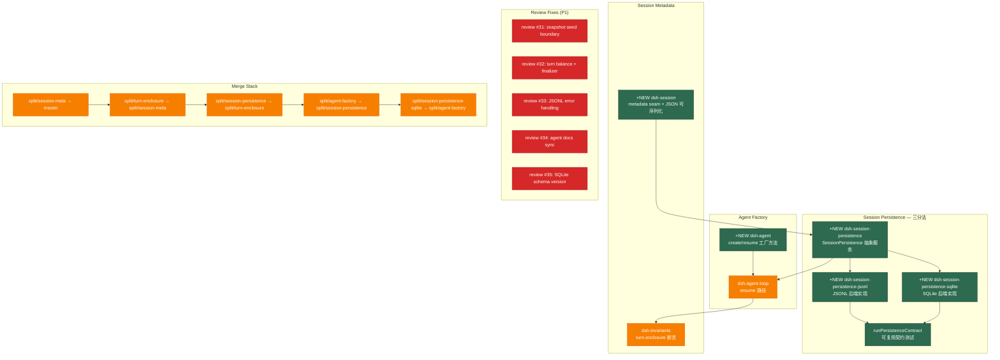

# Architecture Evolution & Design Log · 2026-06-15

## 1. 每日架构演进图

> 本图反映当日最重要的架构演进路径和设计拓扑。当日 commit 数量为32个，核心工作是实现 session persistence（三层）、agent factory、以及大量 review 修复。



## 2. 设计模式与重构

- **应用的设计模式**：
  - **Capability Seam 三分法（bash 模板的第二次应用）**：session persistence 严格遵循 ADR 0009 的三分法——`SessionPersistence`（接口）→ `SessionPersistenceJsonl` / `SessionPersistenceSqlite`（实现）→ agent-loop resume / ACP session/load（消费者）。这是 bash 三分法的第二个验证实例。
  - **Contract Test 模式**：`runPersistenceContract` 是一个可复用的契约测试套件——任何 `SessionPersistence` 实现都必须通过这套测试。这确保了实现之间的可替换性。
  - **Factory Method Pattern（agent factory）**：`AgentRegistry.create()` 和 `AgentRegistry.resume()` 是工厂方法——`create` 是同步的（内存中的 session），`resume` 是异步的（从持久化加载）。

- **模块解耦与接口定义**：
  - **Metadata Seam**：`dsh-session` 新增了 `SessionHeader`（不可变）和 `SessionSummary`（可变），通过 `session.header` 只读属性暴露给消费者。元数据与事件日志分离——元数据不是可重放的对话状态，所以不在 `SessionEventMap` 中。
  - **Turn-Enclosure Invariant**：ADR 0017 确立了"每个 session event 都必须在一个 turn 内"的不变量。idle 状态下的 `agent.inject()` 会包装在一个 one-shot turn 中。这确保了 persistence backend 的"最后 `turn/end` = 提交点"规则完整。

- **基础设施与性能**：
  - **JSONL 后端**：每个 session 一个文件（header line + events），按 cwd 分目录（pi-style），lazy materialization（第一个 event 才创建文件），crash tail 在 `load` 时截断修复。
  - **SQLite 后端**：`SessionEvent` 映射到 `(session_id, seq, type, time, data)` 行，`append` 是 INSERT（事务中验证 contiguous-seq），`load` 是 SELECT ORDER BY seq。

## 3. 特性交付与系统影响

- **核心特性**：
  - **Session Persistence 三层**：抽象接口 `SessionPersistence`（create/append/load/list/has/delete/update）→ JSONL 实现（append-only 文件 + atomic sidecar）→ SQLite 实现（WAL + transaction）。可复用契约测试 `runPersistenceContract` 确保实现之间的可替换性。
  - **Agent Factory**：`AgentRegistry.create()`（同步）和 `AgentRegistry.resume()`（异步，从持久化加载）是 agent 的工厂方法。`resume` 加载 session events 作为 seed，重建 live session，然后构造 `LoopAgent`。
  - **Session Metadata Seam**：`SessionStore.create(id, { seed?, meta? })` 附加 `SessionHeader` 到 `Session`（只读 `session.header`）。`SessionMeta = SessionHeader & SessionSummary`。
  - **Turn-Enclosure Invariant**：ADR 0017 确立了"每个 session event 都在一个 turn 内"的不变量。idle injection 包装在 one-shot turn 中。

- **系统拓扑影响**：
  - 新增 `packages/session-persistence`、`packages/session-persistence-jsonl`、`packages/session-persistence-sqlite` 三个包，monorepo 从"能跑的 MVP"扩展为"有持久化能力的 agent 框架"。
  - `dsh-agent` 从纯词汇包扩展为有工厂方法（create/resume）的服务包。
  - `dsh-invariants` 增加了 turn-enclosure 断言——idle injection 必须在一个 turn 内。

## 4. 架构决策与 Roadmap 对齐

- **关键技术决策（ADR 推断）**：

  - **ADR 0016: Session Persistence 作为抽象服务**
    - **背景与痛点**：session 只存在于内存中，无法持久化、恢复、或 fork。示例的 `session-jsonl.ts` 是只写遥测——没有读/重放路径、没有 crash safety、没有 format versioning。
    - **选择的方案与 Trade-offs**：持久化单位是 `SessionEvent` 本身（无转换类型），append-only 文件后端，`load` 返回到最后一个完整 `turn/end`，crash tail 在下次 `append` 时截断修复。元数据（format version、cwd、lineage）与事件日志分离——元数据不是可重放状态。
    - **决策推断**：选择"文件后端规范，DB 后端可替换"——`SessionEvent` 映射到 `(session_id, seq, type, time, data)` 行，SQLite 是 drop-in 替换。这确保了当前的 JSONL 实现不会成为永久的技术债务。

  - **ADR 0017: Turn-Enclosure Invariant**
    - **背景与痛点**：persistence backend 使用 `turn/end` 作为 crash recovery 边界——`load` 返回到最后一个完整 `turn/end`，crash tail 在 `append` 时截断。但之前有两个路径在 turn 外记录 event：(1) queued user message 在 `turn/start` 之前，(2) idle `agent.inject()` 在 turn 外。
    - **选择的方案与 Trade-offs**：producer-side 不变量——"每个 session event 都在一个 turn 内"。idle injection 包装在 one-shot turn 中（`turn/start{trigger:{kind:'injection'}}` → `context/message` → `turn/end{completed}`）。
    - **决策推断**：选择 producer-side 而非 reader-side——"一个可检查的简单规则"优于"更宽松的边界扫描"。这确保了未来的新 backend（SQLite/WAL）继承相同的干净边界。

  - **Agent Factory: create/resume 分离**
    - **背景与痛点**：`AgentLoop.create()` 是同步的（构造函数调用），无法 `await` persistence `load()`。但 resume 需要异步加载。
    - **选择的方案与 Trade-offs**：`create` 是同步的（内存中的 session），`resume` 是异步的（从持久化加载）。两个方法保持独立——`create` 不会因为 `resume` 的存在而变为异步。
    - **决策推断**：选择"同步 create + 异步 resume"而非"统一异步 create"——同步 create 保持了现有的所有 non-persistent 示例不变，异步 resume 是可选的扩展。

- **产品 Roadmap 支撑**：Day 6 对应 **MVP 持久化能力交付**——session persistence（JSONL + SQLite）+ agent factory（create/resume）+ metadata seam = agent 可以从磁盘恢复过去的会话。这是 Phase 2（编辑器集成）的前提。

## 5. 开发者/架构师决策推断

- **开发者意图重建**：
  - **思维模型**：开发者在 Day 5 设计了 4 个 RFC，Day 6 开始实现。实现顺序严格遵循依赖链：session metadata（基础）→ turn-enclosure（不变量）→ session persistence（抽象 + JSONL）→ agent factory（消费者）→ SQLite（第二个验证实现）。
  - **优先级排序**：
    1. **先建立 metadata seam**（`dsh-session` 的 `SessionHeader`/`SessionSummary`）——没有 metadata 就没有 persistence。
    2. **再建立 turn-enclosure invariant**（ADR 0017）——没有不变量就没有 crash recovery。
    3. **然后建立 persistence 抽象 + JSONL 实现**——这是核心能力。
    4. **接着建立 agent factory**（create/resume）——这是 persistence 的消费者。
    5. **最后建立 SQLite 实现**——这是"第二个验证实现"，确保抽象的通用性。
  - **有意取舍**：
    - **"暂时这样"**：JSONL 后端不支持 fsync-less 的 power loss——append-only + flush 对部分尾部写入有鲁棒性，但对 mid-line power loss 不安全。DB/WAL 后端是更强的选项。
    - **"就要这样"**：`SessionEvent` 逐字持久化（包括 `assistant/chunk`）是硬性规则——不是优化选择，是正确性要求。过滤 chunk 会破坏 `seq` 连续性。
    - **"就要这样"**：turn-enclosure invariant 是 producer-side 强制的——不是 reader-side 容忍。这确保了未来的新 backend 继承相同的干净边界。

- **架构师决策推断**：
  - **模块拆分粒度的选择依据**：session persistence 的三包拆分（接口 / JSONL / SQLite）遵循 ADR 0009 的 bash 模板。拆分的理由是"有真实的第二个实现计划"（SQLite），不是投机性拆分。`runPersistenceContract` 套件确保了实现之间的可替换性。
  - **抽象层引入时机的考量**：metadata seam 在 persistence 之前引入——因为 persistence 需要 `SessionHeader` 来存储 format version、cwd、lineage。turn-enclosure invariant 在 persistence 之前引入——因为 persistence 的 crash recovery 依赖于 `turn/end` 边界。
  - **对后续可扩展性的影响**：SQLite 后端的引入验证了抽象的通用性——如果只有 JSONL 一个实现，抽象可能是"为 JSONL 量身定制的"。SQLite 是"drop-in 替换"，证明了抽象的通用性。
  - **作为架构师，你会赞同/质疑哪些选择**：
    - **强烈赞同**：`runPersistenceContract` 套件——这是"契约测试"的教科书案例。任何新的 persistence 实现都必须通过这套测试，确保了可替换性。
    - **赞同**：metadata 与事件日志分离——元数据不是可重放状态，所以不在 `SessionEventMap` 中。这是"关注点分离"的正确应用。
    - **质疑**：JSONL 后端的 crash safety——`ftruncate` + `fsync` 对 mid-line power loss 不安全。RFC 诚实声明了这个限制，但生产环境可能需要 DB/WAL 后端。
    - **质疑**：agent factory 的 `resume` 是异步的但 `create` 是同步的——这种不对称可能导致消费者困惑。更好的做法是统一为异步（`create` 返回 `Promise<LoopAgent>`），但这会破坏现有的所有 non-persistent 示例。

- **Code Review 视角**：
  - **作为 reviewer，你首先关注哪个变更**：`packages/session-persistence/src/index.ts`（`SessionPersistence` 抽象类）——这是整个 persistence 能力的契约。需要确认：(1) 方法签名是否覆盖了所有必要的操作（create/append/load/list/has/delete/update），(2) 契约文档（append-only、contiguous-seq、JSON-serializable）是否清晰。
  - **你会向提交者提出什么问题**：
    1. `SessionPersistence.load()` 返回"到最后一个完整 `turn/end`"——如果 session 只有 `turn/start` 没有 `turn/end`（crash 在 turn 中间），load 返回什么？空事件列表？
    2. JSONL 后端的 `append` 使用 `ftruncate` + `fsync` 修复 crash tail——如果 `ftruncate` 成功但 `fsync` 失败（power loss），文件会处于什么状态？
    3. SQLite 后端的 `append` 在事务中验证 contiguous-seq——如果事务中检测到 seq gap，整个事务回滚？还是抛出异常？
    4. agent factory 的 `resume` 加载 session events 作为 seed——如果 seed 中有未完成的 tool call（没有对应的 `tool/result`），loop 如何处理？
  - **哪些做得好**：
    - `runPersistenceContract` 套件是"契约测试"的典范——确保了实现之间的可替换性。
    - turn-enclosure invariant 的设计简洁而完整——"每个 event 都在一个 turn 内"是一个可检查的简单规则。
    - metadata 与事件日志分离——元数据不是可重放状态，所以不在 `SessionEventMap` 中。这是"关注点分离"的正确应用。
  - **哪些可以改进**：
    - JSONL 后端的 crash safety 可以通过 `fsync` 目录（`fsync(dir)`）来增强——这确保了文件元数据的持久化。
    - agent factory 的 `resume` 应该验证 seed 中的 `tool/result` 是否与 `tool/call` 匹配——未匹配的 tool call 应该被合成 `tool/result`（error: 'aborted'）。
    - SQLite 后端的 schema version 应该在 `load` 时验证——未知 version 应该 reject 而不是 silent migration。

## 6. 技术债务与风险评估

- **已知风险 / 变通方案**：
  - **JSONL 后端的 crash safety**：append-only + flush 对部分尾部写入有鲁棒性，但对 fsync-less 的 power loss mid-line 不安全。RFC 诚实声明了这个限制——DB/WAL 后端是更强的选项。
  - **Agent factory 的 resume 不验证 seed 完整性**：`resume` 加载 session events 作为 seed，但不验证 seed 中的 `tool/call` 是否有对应的 `tool/result`。未匹配的 tool call 可能导致 loop 状态异常。建议在 `resume` 中合成缺失的 `tool/result`。
  - **SQLite 后端的 schema version 未知处理**：`load` 拒绝未知 version——但没有 migration 路径。如果 format 升级，旧版本的 session 文件将无法加载。建议在 `load` 中实现 forward-compatible 解析（忽略未知字段）。
  - **Turn-enclosure 的 idle injection one-shot turn**：idle injection 包装在 one-shot turn 中（`turn/start` → `context/message` → `turn/end`），这增加了日志行数。`deriveMessages()` 已经处理了这种情况（纯注入 turn 没有 assistant output），但性能影响需要评估。

- **建议的下一步**：
  1. 为 JSONL 后端添加 `fsync` 目录支持——确保文件元数据的持久化。
  2. 为 agent factory 的 `resume` 添加 seed 完整性验证——合成缺失的 `tool/result`（error: 'aborted'）。
  3. 为 SQLite 后端添加 schema version migration——至少支持 forward-compatible 解析。
  4. 为 persistence backend 添加 benchmark——JSONL vs SQLite 的性能对比，特别是在高并发 session 场景下。

---

## 阶段性深度分析

### Phase 1: Session Metadata + Turn-Enclosure Invariant

**涉及的 Commits**: `0731ed374b`, `b0bc0b5792`, `3783f3e178`

**阶段意图**：建立 session 的元数据 seam 和 turn-enclosure 不变量——这是 persistence 的前提条件。metadata seam 为 session 提供了 format version、cwd、lineage 等存储元数据；turn-enclosure invariant 确保了每个 session event 都在一个 turn 内，为 crash recovery 提供了干净的边界。

**开发者视角推断**：
- **思维模型**：开发者将 session 视为"两个部分"——可重放的对话状态（events）和不可重放的存储元数据（header）。这两个部分以不同的速率演化：events 的形状在 ADR 0003 中冻结，header 的字段可以扩展。turn-enclosure 是"events 必须在一个 turn 内"的不变量——idle injection 必须包装在 one-shot turn 中。
- **优先级选择**：metadata 在 persistence 之前——因为 persistence 需要 `SessionHeader` 来存储元数据。turn-enclosure 在 persistence 之前——因为 persistence 的 crash recovery 依赖于 `turn/end` 边界。
- **有意取舍**：
  - **"暂时这样"**：idle injection 的 one-shot turn 增加了日志行数——这是"正确性优先于性能"的选择。
  - **"就要这样"**：metadata 与 events 分离是硬性规则——元数据不是可重放状态，所以不在 `SessionEventMap` 中。

**架构师视角推断**：
- **粒度考量**：metadata seam 只暴露了最小的 API——`SessionStore.create(id, { seed?, meta? })` 和 `session.header`（只读）。这是"最小 API"原则——只暴露必要的接口，不暴露实现细节。
- **时机判断**：metadata 和 turn-enclosure 在 Day 6 的第一个 commit——这是"先建立基础再构建上层"的时序。
- **后续影响**：metadata seam 为 persistence 提供了 format version 和 cwd；turn-enclosure 为 persistence 提供了 crash recovery 边界。

**重点关注的文档/代码**：

| 文件/模块 | 路径 | 阅读要点 |
|-----------|------|----------|
| SessionHeader | `packages/session/src/types.ts` | 不可变元数据：id, version, createdAt, cwd?, parentSession? |
| SessionSummary | `packages/session/src/types.ts` | 可变元数据：updatedAt, title?, firstPrompt? |
| session.header | `packages/session/src/index.ts` | 只读属性：附加到 Session 的 metadata |
| turn-enclosure | `packages/agent-loop/src/loop.ts` | idle injection 的 one-shot turn 包装 |

**关键代码模式**：
```typescript
// packages/session/src/types.ts
export interface SessionHeader {
  readonly id: SessionId
  readonly version: number
  readonly createdAt: number
  readonly cwd?: string
  readonly parentSession?: SessionId
}

export interface SessionSummary {
  updatedAt: number
  title?: string
  firstPrompt?: string
}

// packages/agent-loop/src/loop.ts
// idle injection 包装在 one-shot turn 中
if (agent.status === 'idle') {
  session.append({ type: 'turn/start', trigger: { kind: 'injection' } })
  session.append({ type: 'context/message', data: { content } })
  session.append({ type: 'turn/end', reason: 'completed' })
}
```

**领域建模洞察**（DDD 视角）：
- **值对象**：`SessionHeader`（不可变）和 `SessionSummary`（可变）是 session 的值对象——它们描述了 session 的存储属性，而不是对话状态。
- **不变量**：turn-enclosure 是 agent-loop 的不变量——"每个 session event 都在一个 turn 内"。`dsh-invariants` 在 dev-mode 下检查这个不变量。

**AI Agent 能力演进**：
- metadata seam 为 agent 增加了"持久化记忆"的存储属性——agent 可以知道 session 的创建时间、工作目录、父 session。
- turn-enclosure invariant 为 agent 增加了"crash safety"保证——agent 在 crash 后可以从最后一个完整 turn 恢复。

---

### Phase 2: Session Persistence — 抽象 + JSONL + SQLite

**涉及的 Commits**: `df4b7d3d9a`, `9126697d87`

**阶段意图**：实现 session persistence 的三层结构——抽象接口 `SessionPersistence`、JSONL 实现、SQLite 实现。可复用契约测试 `runPersistenceContract` 确保实现之间的可替换性。

**开发者视角推断**：
- **思维模型**：开发者将 persistence 视为"capability seam 的第二个实例"——bash 是第一个（执行能力），persistence 是第二个（持久化能力）。三分法（接口/实现/消费者）确保了实现和消费者独立演化。
- **优先级选择**：抽象接口在实现之前——因为消费者（agent factory、ACP）编程 against 接口，不 against 实现。JSONL 在 SQLite 之前——JSONL 是"文件后端规范"，SQLite 是"DB 后端验证"。
- **有意取舍**：
  - **"暂时这样"**：JSONL 后端不支持 fsync-less 的 power loss——这是"先验证设计再增强 safety"的选择。
  - **"就要这样"**：`SessionEvent` 逐字持久化（包括 `assistant/chunk`）是硬性规则——不是优化选择，是正确性要求。

**架构师视角推断**：
- **粒度考量**：`runPersistenceContract` 套件的粒度是"一个行为一个测试"——append-only、contiguous-seq、lazy-materialization、crash-recovery 各自独立。这确保了每个行为都可以被独立验证。
- **时机判断**：JSONL 和 SQLite 在同一个 PR 中实现——这是"同时验证两个实现"的策略，确保抽象不是为单一实现量身定制的。
- **后续影响**：SQLite 后端的引入验证了抽象的通用性——如果只有 JSONL 一个实现，抽象可能是"为 JSONL 量身定制的"。SQLite 是"drop-in 替换"，证明了抽象的通用性。

**重点关注的文档/代码**：

| 文件/模块 | 路径 | 阅读要点 |
|-----------|------|----------|
| SessionPersistence | `packages/session-persistence/src/index.ts` | 抽象服务：create/append/load/list/has/delete/update |
| SessionPersistenceJsonl | `packages/session-persistence-jsonl/src/index.ts` | JSONL 实现：header + events、atomic sidecar、crash tail 截断 |
| SessionPersistenceSqlite | `packages/session-persistence-sqlite/src/index.ts` | SQLite 实现：WAL + transaction、contiguous-seq 验证 |
| runPersistenceContract | `packages/session-persistence/tests/contract.ts` | 可复用契约测试：append-only、contiguous-seq、lazy-materialization |

**关键代码模式**：
```typescript
// packages/session-persistence/src/index.ts
export abstract class SessionPersistence extends Service {
  abstract create(meta: SessionMeta): Promise<void>
  abstract append(id: SessionId, events: readonly SessionEvent[]): Promise<void>
  abstract load(id: SessionId): Promise<{ meta: SessionMeta; events: SessionEvent[] }>
  abstract list(): Promise<SessionMeta[]>
  abstract has(id: SessionId): Promise<boolean>
  abstract delete(id: SessionId): Promise<void>
  abstract update(id: SessionId, summary: Partial<SessionSummary>): Promise<void>
}

// packages/session-persistence-jsonl/src/index.ts
// JSONL 格式：header line + event lines
// { type: 'session', version, id, cwd, createdAt, parentSession? }
// { type: 'turn/start', seq: 0, time: ..., data: ... }
// { type: 'user/message', seq: 1, time: ..., data: ... }
// { type: 'turn/end', seq: 2, time: ..., data: ... }

// packages/session-persistence/tests/contract.ts
// 可复用契约测试
export function runPersistenceContract(createBackend: () => SessionPersistence) {
  test('append-only: committed events are never rewritten', ...)
  test('contiguous seq: events[i].seq === i', ...)
  test('lazy materialization: no file until first event', ...)
  test('crash recovery: load returns up to last turn/end', ...)
}
```

**领域建模洞察**（DDD 视角）：
- **聚合根**：`SessionPersistence` 是 persistence 领域的聚合根——所有持久化操作都通过它管理。
- **值对象**：`SessionEvent`（逐字持久化）、`SessionMeta`（元数据）是 persistence 的值对象。
- **领域事件**：`session/created`、`session/event`、`session/flush` 是 persistence 的领域事件——它们触发持久化操作。

**AI Agent 能力演进**：
- persistence 为 agent 增加了"持久化记忆"能力——agent 可以从磁盘恢复过去的会话，支持 durable resume 和 durable fork。

---

### Phase 3: Agent Factory + Resume Path

**涉及的 Commits**: `9a4006cb2b`

**阶段意图**：建立 agent 的工厂方法（create/resume）——`create` 是同步的（内存中的 session），`resume` 是异步的（从持久化加载）。这是 persistence 的消费者，也是 ACP `session/load` 的基础。

**开发者视角推断**：
- **思维模型**：开发者将 agent 视为"两个生命周期"——创建（同步，内存中的 session）和恢复（异步，从持久化加载）。两个生命周期共享同一个 `LoopAgent` 接口，但初始化路径不同。
- **优先级选择**：agent factory 在 persistence 之后——因为 `resume` 需要 persistence 的 `load()` 方法。
- **有意取舍**：
  - **"暂时这样"**：`resume` 不验证 seed 中的 `tool/call` 是否有对应的 `tool/result`——未匹配的 tool call 可能导致 loop 状态异常。
  - **"就要这样"**：`create` 保持同步——这确保了现有的所有 non-persistent 示例不变。

**架构师视角推断**：
- **粒度考量**：`create` 和 `resume` 是两个独立的方法，而不是 `create` 的可选参数。这确保了同步/异步的语义清晰——消费者明确知道哪个路径是同步的，哪个是异步的。
- **时机判断**：agent factory 在 persistence 之后——这是"先建基础设施再建消费者"的时序。
- **后续影响**：agent factory 为 ACP 提供了 `session/load` 的基础——ACP 桥接调用 `resume` 来加载持久化的 session。

**重点关注的文档/代码**：

| 文件/模块 | 路径 | 阅读要点 |
|-----------|------|----------|
| AgentRegistry.create | `packages/agent/src/index.ts` | 同步创建：内存中的 session |
| AgentRegistry.resume | `packages/agent/src/index.ts` | 异步恢复：从持久化加载 |
| LoopAgent | `packages/agent-loop/src/index.ts` | agent 循环：create/resume 路径 |

**关键代码模式**：
```typescript
// packages/agent/src/index.ts
export class AgentRegistry extends Service {
  // 同步创建：内存中的 session
  create(agentId: string, options?: AgentOptions): LoopAgent {
    const session = ctx.sessions.create(options?.sessionId)
    return new LoopAgent(ctx, agentId, session, options)
  }

  // 异步恢复：从持久化加载
  async resume(agentId: string, resumeSessionId: SessionId, options?: AgentOptions): Promise<LoopAgent> {
    const { meta, events } = await ctx.sessionPersistence.load(resumeSessionId)
    const session = ctx.sessions.create(resumeSessionId, { seed: events, meta })
    return new LoopAgent(ctx, agentId, session, options)
  }
}
```

**领域建模洞察**（DDD 视角）：
- **工厂方法**：`create` 和 `resume` 是 agent 的工厂方法——它们封装了 agent 的创建逻辑，消费者不需要知道 session 是从内存还是从磁盘加载的。
- **值对象**：`AgentOptions`（配置）是 agent 的值对象——它描述了 agent 的行为属性。

**AI Agent 能力演进**：
- agent factory 为 agent 增加了"恢复"能力——agent 可以从磁盘恢复过去的会话，继续之前的工作。

---

### Phase 4: Review Fixes — P1 系列

**涉及的 Commits**: `ccbc4f533f`, `5299e43bed`, `4535bfab75`, `01621d38b6`, `5284ed4806`, `f1dac1b1ed`, `3e1ca8a425`, `9838fdb626`, `1b1385e4f7`

**阶段意图**：修复 review 过程中发现的问题（#31-#35），涉及 snapshot seed boundary、turn balance、JSONL error handling、agent docs sync、SQLite schema version。

**开发者视角推断**：
- **思维模型**：开发者将 review 视为"架构验证"——不是"写完就合并"，而是"写完 → review → 修改 → 再 review → 合并"。每个 review fix 都有对应的测试覆盖。
- **优先级选择**：#31（snapshot seed）和 #32（turn balance）优先级最高——它们影响 session log 的正确性。#33（JSONL error handling）次之——影响 persistence 的鲁棒性。#34（agent docs sync）和 #35（SQLite schema version）最后——影响文档和兼容性。
- **有意取舍**：
  - **"暂时这样"**：#35 的 SQLite schema version 在 `load` 时验证——未知 version 拒绝，没有 migration 路径。这是"先安全后兼容"的选择。
  - **"就要这样"**：#32 的 turn balance 从日志中决定——"从日志中决定 turn balance + idle-injection flush"确保了日志是唯一的真实来源。

**架构师视角推断**：
- **粒度考量**：每个 review fix 都有独立的测试——这是"每个 fix 一个测试"的策略，确保修复的正确性可验证。
- **时机判断**：review fixes 在 Day 6 而非 Day 5——Day 5 是"实现日"，Day 6 是"review + fix 日"。
- **后续影响**：review fixes 增强了 persistence 的鲁棒性——crash recovery、error handling、schema version 都得到了加强。

**重点关注的文档/代码**：

| 文件/模块 | 路径 | 阅读要点 |
|-----------|------|----------|
| review #31 | `packages/session/src/index.ts` | snapshot seed boundary：seed + appended data 的边界处理 |
| review #32 | `packages/agent-loop/src/loop.ts` | turn balance：从日志中决定 turn balance |
| review #33 | `packages/session-persistence-jsonl/src/index.ts` | JSONL error handling：surface non-ENOENT errors |
| review #35 | `packages/session-persistence-sqlite/src/index.ts` | SQLite schema version：persist + validate |

**关键代码模式**：
```typescript
// review #32: turn balance 从日志中决定
// 修复前：loop 维护私有计数器
// 修复后：从 session log 的最后一个 turn/end 推导
function lastTurnNumber(session: Session): number {
  const lastTurn = session.events.filter(e => e.type === 'turn/end').pop()
  return lastTurn?.data.turnNumber ?? 0
}

// review #33: JSONL error handling
// 修复前：所有 storage error 都被静默
// 修复后：surface non-ENOENT errors
if (err.code !== 'ENOENT') {
  throw err  // 非文件不存在的错误被 surface
}
```

**领域建模洞察**（DDD 视角）：
- **不变量**：review fixes 强化了 persistence 的不变量——contiguous-seq、crash recovery、schema version。
- **领域事件**：`session/flush` 是 persistence 的领域事件——它触发持久化操作。

**AI Agent 能力演进**：
- review fixes 增强了 agent 的"可靠性"——crash recovery 更鲁棒、error handling 更完整、schema version 更安全。

---

### Phase 5: Merge Stack — Stacked PR 合并

**涉及的 Commits**: `611791ba7f`, `3cc074ba5c`, `5f3a1e4d60`, `6455a1600d`, `bc670e69f3`, `da81709a31`, `b4785e598b`, `06d5f60bac`, `ca4e1c3a1c`, `091dd12531`, `d76d02b666`, `b218e027d5`, `11e166db71`

**阶段意图**：合并 stacked PR——split/session-meta → split/turn-enclosure → split/session-persistence → split/agent-factory → split/session-persistence-sqlite。每个分支在前一个分支的基础上构建。

**开发者视角推断**：
- **思维模型**：开发者将 stacked PR 视为"依赖链的物理表达"——session metadata 是 turn-enclosure 的前提，turn-enclosure 是 persistence 的前提，persistence 是 agent factory 的前提，agent factory 是 SQLite 的前提。合并顺序反映了这个依赖链。
- **优先级选择**：从底层到顶层合并——先合并被依赖的，再合并依赖的。
- **有意取舍**：
  - **"暂时这样"**：合并使用了 merge-forward（非 rebase）——这保留了每个分支的独立历史，但增加了 merge commit 的噪音。
  - **"就要这样"**：合并顺序严格遵循依赖链——不是"先合并简单的"，而是"先合并被依赖的"。

**架构师视角推断**：
- **粒度考量**：5 个分支各自独立，但有明确的依赖关系。这种"独立开发、顺序合并"的模式验证了 stacked PR 工作流的有效性。
- **时机判断**：merge stack 在 Day 6 的最后——这是"实现 → review → merge"的完整迭代。
- **后续影响**：merge stack 将所有 persistence 相关的变更整合到 master，为后续的 ACP 实现建立了基线。

**重点关注的文档/代码**：

| 文件/模块 | 路径 | 阅读要点 |
|-----------|------|----------|
| split/session-meta | 分支 | metadata seam：SessionHeader/SessionSummary |
| split/turn-enclosure | 分支 | turn-enclosure invariant：每个 event 都在一个 turn 内 |
| split/session-persistence | 分支 | persistence 抽象 + JSONL 实现 |
| split/agent-factory | 分支 | agent factory：create/resume |
| split/session-persistence-sqlite | 分支 | SQLite 实现：第二个验证实现 |

**关键代码模式**：
```
// Stacked PR 合并顺序
split/session-meta
  → split/turn-enclosure
    → split/session-persistence
      → split/agent-factory
        → split/session-persistence-sqlite

// 每个分支在前一个分支的基础上构建
// 合并顺序反映了依赖链
```

**领域建模洞察**（DDD 视角）：
- **边界上下文**：每个 split 分支定义了一个边界上下文——metadata、turn-enclosure、persistence、agent factory、SQLite。

**AI Agent 能力演进**：
- merge stack 将所有 persistence 相关的变更整合到 master——agent 从"能跑的 MVP"升级为"有持久化能力的 agent 框架"。

---

### Phase 6: Agent-Loop 修复 — Turn Balance + Finalizer

**涉及的 Commits**: `4535bfab75`, `3e1ca8a425`

**阶段意图**：修复 agent-loop 的 turn balance 和 finalizer 问题——turn balance 从日志中决定（而非私有计数器），finalizer 确保 append-listener 异常被包含。

**开发者视角推断**：
- **思维模型**：开发者将 agent-loop 视为"状态机"——turn 的生命周期有严格的顺序和平衡约束。turn balance 从日志中决定确保了日志是唯一的真实来源。finalizer 确保异常不会破坏 turn 的关闭。
- **优先级选择**：turn balance 优先级最高——如果 balance 错误，session log 会损坏。finalizer 次之——是防御性修复。
- **有意取舍**：
  - **"暂时这样"**：turn balance 从日志中推导——每次迭代都扫描日志，性能开销是 O(n)。后续可以用缓存优化。
  - **"就要这样"**：finalizer 确保 append-listener 异常被包含——这是"异常安全"的硬性规则。

**架构师视角推断**：
- **粒度考量**：turn balance 和 finalizer 是两个独立的修复，但都与 agent-loop 的状态管理相关。它们被合并在一个 PR 中，因为都涉及 `loop.ts` 的核心逻辑。
- **时机判断**：agent-loop 修复在 Day 6 而非 Day 5——Day 5 修复了 P1-1/P1-5/P1-6/P1-7，Day 6 修复了 review #32 发现的问题。
- **后续影响**：turn balance 从日志中决定确保了 persistence 的 crash recovery 正确——`load` 返回到最后一个完整 `turn/end`，`resume` 从正确的 turn number 继续。

**重点关注的文档/代码**：

| 文件/模块 | 路径 | 阅读要点 |
|-----------|------|----------|
| turn balance | `packages/agent-loop/src/loop.ts` | 从日志中决定：lastTurnNumber(session) |
| finalizer | `packages/agent-loop/src/loop.ts` | contain finalizer append-listener throws |

**关键代码模式**：
```typescript
// turn balance 从日志中决定
// 修复前：loop 维护私有计数器
// 修复后：从 session log 的最后一个 turn/end 推导
function lastTurnNumber(session: Session): number {
  const lastTurn = session.events.filter(e => e.type === 'turn/end').pop()
  return lastTurn?.data.turnNumber ?? 0
}

// finalizer 确保异常被包含
try {
  await turnEnd()
} catch (error) {
  // 异常被包含，不破坏 turn 的关闭
  logger.error('turn-end listener threw:', error)
} finally {
  closeTurn()
}
```

**领域建模洞察**（DDD 视角）：
- **不变量**：turn balance 是 agent-loop 的不变量——turn number 必须严格递增。从日志中推导确保了这个不变量在 crash recovery 后仍然成立。

**AI Agent 能力演进**：
- turn balance 修复确保 agent 在 resume 后从正确的 turn number 继续——这是 durable resume 的正确性基础。

---

### Phase 7: JSONL + SQLite 后续修复

**涉及的 Commits**: `01621d38b6`, `f1dac1b1ed`, `1b1385e4f7`, `3bef6b38c7`

**阶段意图**：修复 JSONL 和 SQLite 后端的后续问题——JSONL error handling、SQLite schema version、SQLite materialized column 简化。

**开发者视角推断**：
- **思维模型**：开发者将 persistence 后端视为"需要持续加固"的组件——初始实现建立了功能骨架，后续修复增强了鲁棒性。JSONL 的 non-ENOENT error surfacing、SQLite 的 schema version persist、SQLite 的 materialized column 简化都是"加固"操作。
- **优先级选择**：JSONL error handling 优先——影响所有 persistence 操作的鲁棒性。SQLite schema version 次之——影响兼容性。SQLite materialized column 简化最后——是重构，不影响功能。
- **有意取舍**：
  - **"暂时这样"**：SQLite 的 materialized column 被简化为 row existence——"use row existence as the signal"替代了 `materialized` 布尔字段。
  - **"就要这样"**：JSONL 的 non-ENOENT error 被 surface——"surface non-ENOENT storage errors"确保了错误不会被静默。

**架构师视角推断**：
- **粒度考量**：每个修复都是独立的，但都与 persistence 后端的鲁棒性相关。它们被分在独立的 commit 中，确保可独立回滚。
- **时机判断**：后续修复在 Day 6 的最后——这是"实现 → review → 修复 → 再 review"的迭代。
- **后续影响**：后续修复增强了 persistence 后端的鲁棒性——error handling、schema version、materialized column 都得到了加强。

**重点关注的文档/代码**：

| 文件/模块 | 路径 | 阅读要点 |
|-----------|------|----------|
| JSONL error handling | `packages/session-persistence-jsonl/src/index.ts` | surface non-ENOENT errors |
| SQLite schema version | `packages/session-persistence-sqlite/src/schema.ts` | persist schema version |
| SQLite materialized | `packages/session-persistence-sqlite/src/index.ts` | row existence as signal |

**关键代码模式**：
```typescript
// JSONL error handling
try {
  await fs.promises.readFile(filePath)
} catch (err: any) {
  if (err.code === 'ENOENT') return null  // 文件不存在返回 null
  throw err  // 非文件不存在的错误被 surface
}

// SQLite schema version
CREATE TABLE schema_version (version INTEGER PRIMARY KEY)
INSERT INTO schema_version VALUES (1)

// SQLite materialized 简化
// 修复前：materialized BOOLEAN COLUMN
// 修复后：row existence as signal
// SELECT 1 FROM sessions WHERE id = ? → 存在则 materialized
```

**领域建模洞察**（DDD 视角）：
- **不变量**：后续修复强化了 persistence 后端的不变量——error handling、schema version、materialized column。

**AI Agent 能力演进**：
- 后续修复增强了 agent 的"持久化可靠性"——error handling 更完整、schema version 更安全、materialized column 更简洁。

---
