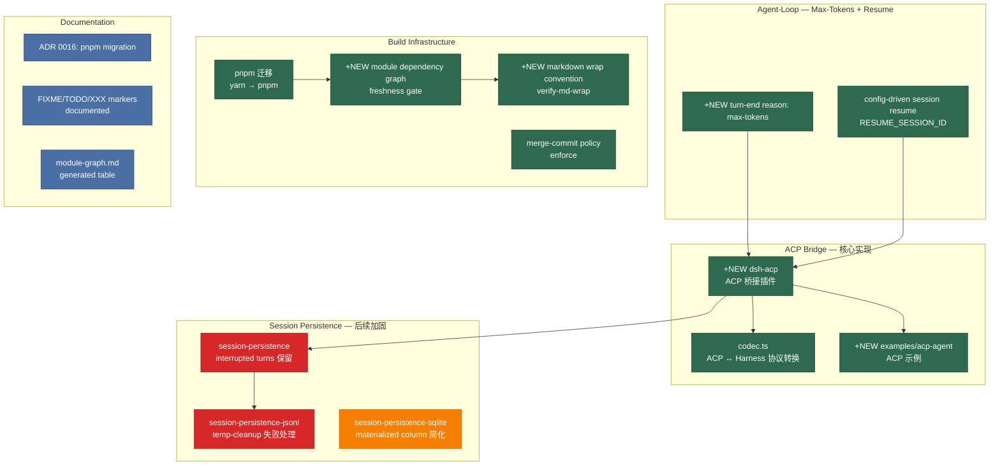

# Architecture Evolution & Design Log · 2026-06-16

## 1. 每日架构演进图

> 本图反映当日最重要的架构演进路径和设计拓扑。当日 commit 数量为40+个，核心工作是 ACP bridge 实现、pnpm 迁移、module graph 门禁、以及 session persistence 后续加固。



## 2. 设计模式与重构

- **应用的设计模式**：
  - **Adapter Pattern（ACP 协议适配）**：`dsh-acp` 是 ACP 协议（JSON-RPC stdio）到 harness seam（agent/events）的适配器。它不是 capability seam 的三分法——它是一个消费者插件，消费已有的 `agent/*` 事件分类和 `tools/execute` waterfall。
  - **Mediator Pattern（ACP 多会话）**：ACP 桥接充当多个并发会话的中介——每个会话有自己的 child Cordis context、in-flight prompt 状态、pending permission registry。全局 `tools/execute` 监听器通过 `agent→sessionId` reverse map 路由到正确的会话。
  - **Strategy Pattern（persistence 后端）**：JSONL 和 SQLite 是 `SessionPersistence` 接口的两个策略实现。`runPersistenceContract` 确保策略之间的可替换性。

- **模块解耦与接口定义**：
  - **ACP 桥接的 inject 设计**：`dsh-acp` 声明 `inject = ['agents', 'sessions', 'sessionPersistence']`——它不注入 `agentLoop`（因为 `session/new` 和 `session/load` 走 `agents.create/resume`，不直接操作 loop）。这确保了 ACP 桥接与 agent-loop 的解耦。
  - **Max-Tokens Turn-End Reason**：`TurnEndReasonMap` 新增 `max-tokens` 变体——这是对 `FinishReasonMap` 的扩展（DeepSeek 将 `length` 映射为 `max-tokens`）。ACP 桥接使用这个 reason 来确定 `stopReason`。

- **基础设施与性能**：
  - **pnpm 迁移**：从 yarn 迁移到 pnpm——更快的安装速度、更严格的依赖解析、更好的 monorepo 支持。46 个文件变更，4697 行新增，5064 行删除。
  - **Module Dependency Graph**：`gen-module-graph.ts` 生成模块依赖表，topologically ordered（low→high level）。freshness gate 确保表与代码同步。
  - **Markdown Wrap Convention**：`verify-md-wrap.ts` 使用 mdast AST 检测硬换行——替代了 regex 方案，更准确。

## 3. 特性交付与系统影响

- **核心特性**：
  - **ACP Bridge（完整实现）**：`dsh-acp` 实现了 ACP 协议的完整映射——`initialize`（协议版本协商）、`session/new`（agent 创建）、`session/load`（从持久化恢复）、`session/prompt`（agent.send）、`session/cancel`（agent.abort）。多会话支持：per-session child context、per-session permission ownership、per-session cancel routing。
  - **Max-Tokens Turn-End Reason**：`TurnEndReasonMap` 新增 `max-tokens`——当模型达到 token 限制时，turn 以 `max-tokens` 结束（而非 `completed`）。ACP 桥接使用这个 reason 来确定 `stopReason`。
  - **Config-Driven Session Resume**：`RESUME_SESSION_ID` 环境变量允许配置驱动的 session 恢复——agent 启动时自动从持久化加载指定的 session。
  - **Module Dependency Graph**：`gen-module-graph.ts` 生成模块依赖表，topologically ordered。freshness gate 确保表与代码同步——如果模块依赖变化，表过时会导致 CI 失败。

- **系统拓扑影响**：
  - 新增 `packages/acp`、`examples/acp-agent`——monorepo 从"CLI agent"扩展为"可被编辑器驱动的 agent"。
  - pnpm 迁移影响了所有包的 `package.json`、`pnpm-workspace.yaml`、CI 配置。
  - module graph 门禁影响了所有包的依赖声明——过时的依赖会导致 CI 失败。

## 4. 架构决策与 Roadmap 对齐

- **关键技术决策（ADR 推断）**：

  - **ADR 0016: pnpm 迁移**
    - **背景与痛点**：yarn 的依赖解析不够严格，monorepo 支持不够好。pnpm 提供了更快的安装速度、更严格的依赖解析、更好的 workspace 支持。
    - **选择的方案与 Trade-offs**：全面迁移（46 个文件），而非渐进式。代价是大量文件变更，收益是统一的包管理器和更好的 monorepo 支持。`pnpm-workspace.yaml` 定义了 workspace 包，`pnpm-lock.yaml` 替代了 `yarn.lock`。
    - **决策推断**：选择全面迁移而非渐进式——渐进式迁移会导致 yarn 和 pnpm 共存，增加维护成本。全面迁移是一次性投入，长期收益。

  - **ACP 多会话隔离**
    - **背景与痛点**：编辑器需要多个并发会话——用户打开多个线程，或客户端预热会话。RFC 010 的单会话限制是 MVP scope cut，RFC 011 lift 了这个限制。
    - **选择的方案与 Trade-offs**：per-session child Cordis context + per-session permission ownership + per-session cancel routing。代价是每个 session 增加 listeners 和 state，收益是真正的会话隔离。
    - **决策推断**：选择 child context 而非全局注册表——child context 确保了 disposing 一个 session 只移除它自己的 listeners，不影响其他 session。

  - **Module Graph Freshness Gate**
    - **背景与痛点**：模块依赖表可能与代码不同步——新增包或修改依赖后，表过时会导致误导。
    - **选择的方案与 Trade-offs**：`gen-module-graph.ts` 生成 topologically ordered 的依赖表，freshness gate 在 CI 中验证表与代码同步。代价是每次依赖变化都需要重新生成表，收益是文档与代码的机械同步。
    - **决策推断**：选择 topological order 而非 alphabetical order——topological order 反映了依赖关系，更易于理解系统的分层结构。

- **产品 Roadmap 支撑**：Day 7 对应 **Phase 2 核心交付**——ACP bridge（编辑器集成）+ session resume（持久化恢复）+ pnpm（构建基础设施）= agent 可以被外部编辑器驱动，支持多会话和持久化恢复。

## 5. 开发者/架构师决策推断

- **开发者意图重建**：
  - **思维模型**：开发者在 Day 5 设计了 RFC，Day 6 实现了 persistence，Day 7 实现了 ACP bridge。实现顺序严格遵循依赖链：persistence → agent factory → ACP bridge。pnpm 迁移和 module graph 门禁是"构建基础设施加固"，独立于功能路径。
  - **优先级排序**：
    1. **先实现 ACP bridge**——这是 product roadmap 的关键路径（编辑器集成）。
    2. **再实现 session resume**——ACP 的 `session/load` 需要 resume 路径。
    3. **然后迁移 pnpm**——构建基础设施加固，为后续开发建立更好的基础。
    4. **最后建立 module graph 门禁**——确保模块依赖的机械同步。
  - **有意取舍**：
    - **"暂时这样"**：ACP bridge 的权限门控（`tools/execute` veto seam）推迟到后续 PR——RFC 010 中标记为 `TODO(rfc010-permission-gate)`。
    - **"暂时这样"**：ACP bridge 只支持单会话（MVP scope）——RFC 011 的多会话支持在后续 PR 中实现。
    - **"就要这样"**：pnpm 迁移是全面迁移（46 个文件）——不是渐进式，而是一次性投入。

- **架构师决策推断**：
  - **模块拆分粒度的选择依据**：ACP bridge 是一个消费者插件，不是 capability seam 的三分法。它消费已有的 `agent/*` 事件分类和 `tools/execute` waterfall，不需要拆分为接口/实现/消费者。这是因为 ACP 桥接只有一个实现（JSON-RPC stdio），没有可交换的后端。
  - **抽象层引入时机的考量**：max-tokens turn-end reason 在 ACP bridge 之前引入——因为 ACP 桥接需要这个 reason 来确定 `stopReason`。session resume 在 ACP bridge 之前引入——因为 ACP 的 `session/load` 需要 resume 路径。
  - **对后续可扩展性的影响**：pnpm 迁移为后续的依赖管理建立了更好的基础——更严格的依赖解析减少了"幽灵依赖"的风险。module graph 门禁确保了模块依赖的机械同步——新增包或修改依赖后，表会自动更新。
  - **作为架构师，你会赞同/质疑哪些选择**：
    - **强烈赞同**：ACP 桥接的 inject 设计——`inject = ['agents', 'sessions', 'sessionPersistence']` 不注入 `agentLoop`，确保了 ACP 桥接与 agent-loop 的解耦。
    - **赞同**：pnpm 全面迁移——渐进式迁移会导致 yarn 和 pnpm 共存，增加维护成本。全面迁移是一次性投入，长期收益。
    - **质疑**：ACP 桥接的权限门控推迟——权限是安全关键功能，推迟到后续 PR 可能导致安全风险。建议在 ACP bridge 中至少实现基本的权限门控。
    - **质疑**：module graph 的 freshness gate 在 CI 中运行——如果表过时，CI 会失败，但开发者可能不知道需要重新生成表。建议在 pre-push hook 中也运行 freshness gate。

- **Code Review 视角**：
  - **作为 reviewer，你首先关注哪个变更**：`packages/acp/src/index.ts`（ACP 桥接核心）——这是整个 ACP 能力的实现。需要确认：(1) 协议映射是否正确（initialize/session/new/session/prompt/session/cancel），(2) 多会话隔离是否完整（per-session child context、permission ownership、cancel routing），(3) 异常处理是否安全（listener exceptions 不会破坏 turn）。
  - **你会向提交者提出什么问题**：
    1. ACP 桥接的 `session/load` 加载持久化 session 后，如何处理未完成的 tool call（没有对应的 `tool/result`）？是否需要合成 `tool/result`？
    2. ACP 多会话的 bash task ownership——RFC 011 提到 `bash_output`/`bash_kill` 不检查调用者，一个 session 的 agent 可能读取或杀死另一个 session 的 background task。这个 gap 是否在多会话实现中修复？
    3. pnpm 迁移后，`pnpm-workspace.yaml` 中的 `onlyBuiltDependencies` 列表是否完整？是否有遗漏的依赖需要 build scripts？
    4. module graph 的 freshness gate 在 CI 中运行——如果表过时，错误消息是否清晰？开发者是否知道需要运行 `pnpm gen-module-graph`？
  - **哪些做得好**：
    - ACP 桥接的协议映射完整且清晰——每个 ACP 方法都有明确的 harness seam 映射。
    - pnpm 迁移是全面的——46 个文件变更，包括 CI 配置、lefthook、所有 package.json。
    - module graph 的 topological order 反映了依赖关系——比 alphabetical order 更易于理解系统分层。
  - **哪些可以改进**：
    - ACP 桥接的权限门控应该至少实现基本版本——即使不是完整的 RFC 010 设计，也应该有基本的 `tools/execute` 监听器。
    - module graph 的 freshness gate 应该在 pre-push hook 中运行——而不仅仅在 CI 中。
    - pnpm 迁移的 `allowBuilds` 列表应该有文档说明——为什么这些依赖需要 build scripts，其他的不需要。

## 6. 技术债务与风险评估

- **已知风险 / 变通方案**：
  - **ACP 桥接的权限门控推迟**：RFC 010 的 `tools/execute` veto seam 是安全关键功能，但推迟到后续 PR。当前的 ACP 桥接允许所有工具调用不经权限检查——这在编辑器集成场景中可能是不可接受的。建议在后续 PR 中尽快实现。
  - **ACP 多会话的 bash task ownership**：RFC 011 提到 `bash_output`/`bash_kill` 不检查调用者——一个 session 的 agent 可能读取或杀死另一个 session 的 background task。这是一个 pre-existing gap，多会话使其成为真实的隔离漏洞。
  - **pnpm 迁移的 `allowBuilds` 列表**：`pnpm-workspace.yaml` 中的 `onlyBuiltDependencies` 列表需要维护——新增依赖可能需要 build scripts，但列表不会自动更新。建议在 CI 中验证列表的完整性。
  - **Module graph 的 freshness gate**：如果模块依赖变化但表没有重新生成，CI 会失败。错误消息应该清晰地告诉开发者需要运行 `pnpm gen-module-graph`。

- **建议的下一步**：
  1. 实现 ACP 桥接的基本权限门控——至少检查 `exec.agent` 是否是 ACP owned。
  2. 修复 bash task ownership gap——`bash_output`/`bash_kill` 应该验证调用者是否是 task owner。
  3. 在 pre-push hook 中运行 module graph freshness gate——确保开发者在推送前更新表。
  4. 为 pnpm 迁移添加迁移指南——记录 yarn → pnpm 的变更、`allowBuilds` 的维护策略。

---

## 阶段性深度分析

### Phase 1: ACP Bridge — 核心实现

**涉及的 Commits**: `fb9636db44`, `b3ea13749c`

**阶段意图**：实现 ACP bridge 的核心功能——ACP 协议映射（initialize/session/new/session/prompt/session/cancel）、多会话支持（per-session child context、permission ownership、cancel routing）、bash task ownership。

**开发者视角推断**：
- **思维模型**：开发者将 ACP bridge 视为"编辑器与 agent 之间的翻译器"——ACP 协议是编辑器的语言，harness seam 是 agent 的语言，bridge 负责翻译。多会话是"多个翻译器共享一个连接"——每个会话有自己的翻译器实例。
- **优先级选择**：单会话在多会话之前——MVP 先验证协议映射，多会话是增强。
- **有意取舍**：
  - **"暂时这样"**：权限门控推迟——RFC 010 中标记为 `TODO(rfc010-permission-gate)`。
  - **"就要这样"**：per-session child context 是硬性规则——确保disposing 一个 session 只移除它自己的 listeners。

**架构师视角推断**：
- **粒度考量**：ACP bridge 是一个消费者插件，不是 capability seam 的三分法。它消费已有的 seam，不需要拆分为接口/实现/消费者。
- **时机判断**：ACP bridge 在 persistence 之后——因为 `session/load` 需要 persistence 的 `load()` 方法。
- **后续影响**：ACP bridge 为 agent 增加了"编辑器集成"能力——agent 可以被 Zed 等 ACP 客户端驱动。

**重点关注的文档/代码**：

| 文件/模块 | 路径 | 阅读要点 |
|-----------|------|----------|
| ACP bridge | `packages/acp/src/index.ts` | 协议映射：initialize/session/new/session/prompt/session/cancel |
| codec.ts | `packages/acp/src/codec.ts` | ACP ↔ Harness 协议转换：block 转换、stop reason 映射 |
| acp-agent | `examples/acp-agent/cordis.yml` | ACP 示例配置：加载 persistence + ACP bridge |

**关键代码模式**：
```typescript
// packages/acp/src/index.ts
export const inject = ['agents', 'sessions', 'sessionPersistence']

// session/new → ctx.agents.create
case 'session/new': {
  const agent = ctx.agents.create({ sessionId, meta: { cwd } })
  return { sessionId }
}

// session/prompt → agent.send()
case 'session/prompt': {
  agent.send(prompt)
  // settle on turn-end
}

// session/cancel → agent.abort()
case 'session/cancel': {
  agent.abort('user cancelled')
}
```

**领域建模洞察**（DDD 视角）：
- **值对象**：`InitializeRequest`、`NewSessionRequest`、`PromptRequest` 是 ACP 协议的值对象——它们描述了客户端的请求。
- **领域事件**：`session/update` 是 ACP 协议的领域事件——它通知客户端 agent 的状态变化。

**AI Agent 能力演进**：
- ACP bridge 为 agent 增加了"编辑器集成"能力——agent 可以被外部编辑器驱动，支持 streaming render、tool-call display、permission UI。

---

### Phase 2: Max-Tokens + Session Resume

**涉及的 Commits**: `add59a3336`, `0000cdb2c2`

**阶段意图**：为 agent-loop 增加 max-tokens turn-end reason 和 config-driven session resume——max-tokens 是 ACP 桥接需要的 stop reason，session resume 是 ACP `session/load` 的基础。

**开发者视角推断**：
- **思维模型**：开发者将 turn-end reason 视为"模型行为的结构化表示"——`completed`（正常结束）、`aborted`（用户取消）、`error`（错误）、`disposed`（loop 销毁）、`max-tokens`（token 限制）。每个 reason 对应一种恢复策略。
- **优先级选择**：max-tokens 在 ACP bridge 之前——因为 ACP 桥接需要这个 reason 来确定 `stopReason`。session resume 在 ACP bridge 之前——因为 ACP 的 `session/load` 需要 resume 路径。
- **有意取舍**：
  - **"暂时这样"**：session resume 通过 `RESUME_SESSION_ID` 环境变量配置——后续可以通过 ACP `session/load` 动态触发。
  - **"就要这样"**：max-tokens 是独立的 turn-end reason（不是 `completed` 的子类型）——这确保了消费者可以精确区分模型行为。

**架构师视角推断**：
- **粒度考量**：max-tokens 是 `TurnEndReasonMap` 的新变体——通过 declaration merging 添加，不破坏现有消费者。
- **时机判断**：max-tokens 和 session resume 在 ACP bridge 之前——这是"先建立基础设施再构建消费者"的时序。
- **后续影响**：max-tokens 为 ACP 桥接提供了精确的 stop reason；session resume 为 ACP `session/load` 提供了恢复路径。

**重点关注的文档/代码**：

| 文件/模块 | 路径 | 阅读要点 |
|-----------|------|----------|
| max-tokens | `packages/session/src/types.ts` | TurnEndReasonMap 新增 max-tokens 变体 |
| max-tokens loop | `packages/agent-loop/src/loop.ts` | 从 finish reason 推导 turn-end reason |
| session resume | `packages/agent-loop/src/index.ts` | RESUME_SESSION_ID 配置驱动恢复 |

**关键代码模式**：
```typescript
// packages/session/src/types.ts
// TurnEndReasonMap 通过 declaration merging 扩展
interface TurnEndReasonMap {
  completed: void
  aborted: void
  error: void
  disposed: void
  maxTokens: void  // 新增
}

// packages/agent-loop/src/loop.ts
// 从 finish reason 推导 turn-end reason
if (assembler.finish?.reason === 'length') {
  turnEndReason = 'max-tokens'
} else if (aborted) {
  turnEndReason = 'aborted'
} else {
  turnEndReason = 'completed'
}

// packages/agent-loop/src/index.ts
// config-driven session resume
if (process.env.RESUME_SESSION_ID) {
  const agent = await ctx.agents.resume('main', process.env.RESUME_SESSION_ID)
}
```

**领域建模洞察**（DDD 视角）：
- **值对象**：`TurnEndReason`（completed/aborted/error/disposed/maxTokens）是 turn 的值对象——它描述了 turn 的结束原因。
- **领域事件**：`turn/end` 事件携带 `reason` 字段——消费者可以根据 reason 决定恢复策略。

**AI Agent 能力演进**：
- max-tokens 为 agent 增加了"token 限制感知"能力——agent 知道 turn 是因为 token 限制而结束，而不是正常完成。
- session resume 为 agent 增加了"配置驱动恢复"能力——agent 启动时可以从持久化自动恢复指定的 session。

---

### Phase 3: Session Persistence 后续加固

**涉及的 Commits**: `efee449cfe`, `2bae18f811`

**阶段意图**：加固 session persistence 后端——保留 interrupted turns（不截断）、为 interrupted tool calls 合成 `tool/result`（error: 'aborted'）。

**开发者视角推断**：
- **思维模型**：开发者将 persistence 的 crash recovery 视为"需要精确处理"的场景——crash 可能发生在 turn 中间、tool call 中间、或 idle 状态。每种场景都需要不同的恢复策略。
- **优先级选择**：保留 interrupted turns 优先——这是正确性问题。合成 `tool/result` 次之——这是鲁棒性问题。
- **有意取舍**：
  - **"暂时这样"**：合成 `tool/result` 使用 `error: 'aborted'`——后续可以使用更精确的错误类型。
  - **"就要这样"**：保留 interrupted turns 而非截断——这是"数据完整性优先于简洁性"的选择。

**架构师视角推断**：
- **粒度考量**：每个加固都是独立的，但都与 crash recovery 相关。它们被分在独立的 commit 中，确保可独立回滚。
- **时机判断**：加固在 ACP bridge 之前——因为 ACP 的 `session/load` 需要正确的 crash recovery。
- **后续影响**：加固确保了 ACP `session/load` 在各种 crash 场景下都能正确恢复。

**重点关注的文档/代码**：

| 文件/模块 | 路径 | 阅读要点 |
|-----------|------|----------|
| interrupted turns | `packages/session-persistence/src/index.ts` | load 返回到最后一个完整 turn/end，保留 interrupted turns |
| tool/result synthesis | `packages/session/src/repair.ts` | 为 interrupted tool calls 合成 tool/result (error: 'aborted') |

**关键代码模式**：
```typescript
// packages/session/src/repair.ts
// 为 interrupted tool calls 合成 tool/result
function repairInterruptedToolCalls(events: SessionEvent[]): SessionEvent[] {
  const callIds = new Set<string>()
  const resultIds = new Set<string>()

  for (const event of events) {
    if (event.type === 'tool/call') callIds.add(event.data.callId)
    if (event.type === 'tool/result') resultIds.add(event.data.callId)
  }

  // 为没有 result 的 call 合成 result
  for (const callId of callIds) {
    if (!resultIds.has(callId)) {
      events.push({
        type: 'tool/result',
        seq: events.length,
        time: Date.now(),
        data: { callId, result: [{ type: 'text', text: 'Tool call interrupted: session crashed' }], isError: true }
      })
    }
  }

  return events
}
```

**领域建模洞察**（DDD 视角）：
- **不变量**：crash recovery 的不变量是"load 返回的 events 是完整的"——每个 `tool/call` 都有对应的 `tool/result`，每个 turn 都有 `turn/start` 和 `turn/end`。
- **值对象**：合成的 `tool/result` 是 repair 操作的值对象——它描述了 interrupted tool call 的恢复结果。

**AI Agent 能力演进**：
- 加固确保了 agent 在 crash 后可以正确恢复——即使 crash 发生在 tool call 中间，resume 后也能继续工作。

---

### Phase 4: Build Infrastructure — pnpm + Module Graph + Markdown Wrap

**涉及的 Commits**: `dabc2ff411`, `49e74ed8d0`, `ce484c0e2d`, `6c931b8869`, `5e36f990ab`, `4c8c1da8b3`, `b33668ef05`, `8e6fd91e15`, `19518ebfd9`, `67447fcdc3`, `8511b9639c`, `63425a2b87`, `840dfbab84`

**阶段意图**：建立构建基础设施——pnpm 迁移（更快的安装、更严格的依赖解析）、module graph 门禁（依赖同步）、markdown wrap convention（文档质量）。

**开发者视角推断**：
- **思维模型**：开发者将构建基础设施视为"长期投资"——pnpm 迁移是一次性投入但长期收益；module graph 门禁是机械化的依赖同步；markdown wrap convention 是文档质量保证。
- **优先级选择**：pnpm 迁移在 module graph 之前——因为 module graph 的 `gen-module-graph.ts` 需要 pnpm 的 workspace 解析。markdown wrap 在最后——是文档质量加固。
- **有意取舍**：
  - **"暂时这样"**：module graph 的 freshness gate 只在 CI 中运行——pre-push hook 中运行是后续增强。
  - **"就要这样"**：pnpm 全面迁移（46 个文件）——不是渐进式，而是一次性投入。

**架构师视角推断**：
- **粒度考量**：pnpm 迁移是全面的——包括 CI 配置、lefthook、所有 package.json、pnpm-workspace.yaml。module graph 是一个独立的门禁——它有自己的脚本和 CI 任务。
- **时机判断**：构建基础设施在功能实现之后——Day 7 是"功能 + 基础设施"的混合日。
- **后续影响**：pnpm 迁移为后续的依赖管理建立了更好的基础；module graph 门禁确保了模块依赖的机械同步。

**重点关注的文档/代码**：

| 文件/模块 | 路径 | 阅读要点 |
|-----------|------|----------|
| pnpm-workspace.yaml | 根目录 | workspace 包定义、onlyBuiltDependencies |
| gen-module-graph.ts | `scripts/` | 模块依赖图生成：topological order |
| verify-md-wrap.ts | `scripts/` | markdown 硬换行检测：mdast AST |
| ADR 0016 | `docs/adr/0016-pnpm-over-yarn.md` | pnpm 迁移的理由和 trade-offs |

**关键代码模式**：
```yaml
# pnpm-workspace.yaml
packages:
  - 'packages/*'
  - 'vendor/*'
  - 'examples/*'

onlyBuiltDependencies:
  - '@agentclientprotocol/sdk'
  - '@earendil-works/pi-ai'
  # ... 其他需要 build scripts 的依赖

# scripts/gen-module-graph.ts
// topologically ordered 模块依赖表
// low → high level
| Package | Depends On |
|---------|------------|
| dsh-bash | cordis |
| dsh-bash-local | dsh-bash, cordis |
| dsh-tool-bash | dsh-bash, dsh-tools |
```

**领域建模洞察**（DDD 视角）：
- **不变量**：module graph 的不变量是"表与代码同步"——freshness gate 确保每次 push 时表都是最新的。
- **值对象**：module graph 表是系统分层的值对象——topological order 反映了依赖关系。

**AI Agent 能力演进**：
- 构建基础设施是 agent 能力的"元能力"——它确保 agent 的代码库是可维护的、可扩展的、可审计的。

---

### Phase 5: Agent-Loop 修复 + Documentation

**涉及的 Commits**: `f1dac1b1ed`, `3e1ca8a425`, `9838fdb626`, `3a6ebd1954`, `326b026ab3`, `53b37b39c5`, `e31e19d99b`, `ffc107aa57`

**阶段意图**：修复 agent-loop 和 persistence 的后续问题（review #32-#35），并建立文档规范（TODO markers、ADR renumbering、AGENTS.md cleanup）。

**开发者视角推断**：
- **思维模型**：开发者将 review fixes 和 documentation 视为"持续加固"——不是一次性工作，而是持续的过程。每个 review fix 都有对应的测试覆盖；每个文档变更都与代码同步。
- **优先级选择**：review fixes 在 documentation 之前——正确性优先于文档。
- **有意取舍**：
  - **"暂时这样"**：ADR renumbering（0016 → 0018）是因为 pnpm 迁移占用了 ADR 0016 编号——后续应该有更好的 ADR 编号管理策略。
  - **"就要这样"**：TODO markers 文档化（FIXME/TODO/XXX 语义）——这是"约定优于配置"的应用。

**架构师视角推断**：
- **粒度考量**：每个 review fix 都是独立的，但都与 persistence 或 agent-loop 的鲁棒性相关。
- **时机判断**：review fixes 和 documentation 在 Day 7 的最后——这是"实现 → review → 修复 → 文档"的完整迭代。
- **后续影响**：review fixes 增强了 persistence 和 agent-loop 的鲁棒性；documentation 建立了文档规范。

**重点关注的文档/代码**：

| 文件/模块 | 路径 | 阅读要点 |
|-----------|------|----------|
| review #35 | `packages/session-persistence-sqlite/src/index.ts` | crash-tail repair 延迟到 append |
| review #32 round 2 | `packages/agent-loop/src/loop.ts` | contain finalizer append-listener throws |
| TODO markers | `docs/development.md` | FIXME/TODO/XXX 语义文档化 |

**关键代码模式**：
```typescript
// review #35: crash-tail repair 延迟到 append
// 修复前：load 时立即修复 crash tail
// 修复后：append 时才修复 crash tail
async load(id: SessionId) {
  // 只读取到最后一个完整 turn/end
  // 不修改文件
  return { meta, events: events up to last turn/end }
}

async append(id: SessionId, events: readonly SessionEvent[]) {
  // 第一次 append 时修复 crash tail
  if (needsRepair) {
    await ftruncate(fd, lastCompleteTurnEnd)
    await fsync(fd)
  }
  // 然后追加新 events
}
```

**领域建模洞察**（DDD 视角）：
- **不变量**：crash recovery 的不变量是"load 不修改文件，append 时修复"——这确保了 crash tail 只在有新数据时才被修复。

**AI Agent 能力演进**：
- review fixes 增强了 agent 的"持久化可靠性"——crash recovery 更鲁棒、error handling 更完整。

---
