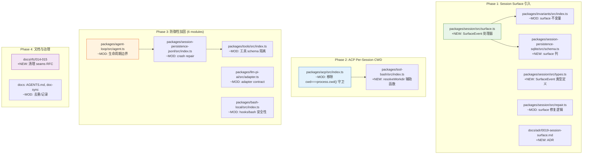

# Architecture Evolution & Design Log · 2026-06-17

> **Commits:** 23 (10 non-merge, 13 merge) · **PRs landed:** #33, #34, #35, #37→#41→#42→#48, #44
> **Authors:** Tianyi Cui, Hypatia May
> **核心主题：** Session Surface 引入 (ADR 0019)、ACP Per-Session CWD、跨 6 模块的防御性加固

---

## 1. 每日架构演进图

> 本图反映当日最重要的架构演进路径和设计拓扑。

---

## 2. 设计模式与重构

### 2.1 Surface Event 抽象（CQRS View 模式）

**应用的设计模式**：Session Surface 引入了类似 CQRS 中 "Read Model" 的概念 — `SurfaceEvent` 是 `SessionEvent` 的一个投影子集，仅包含对模型可见的事件（user/message、assistant/message、tool/result）。

**关键变更**：
- `packages/session/src/surface.ts`（+129 行）：新增 `SurfaceEvent` 处理器，负责从完整事件流中提取 surface-eligible 事件
- `packages/session/src/types.ts`（+36 行）：定义 `SurfaceEventType`、`SurfaceOp`、`SurfaceEvent` 类型
- `packages/invariants/src/index.ts`（+30 行）：新增 surface 不变量验证
- `packages/session-persistence-sqlite/src/schema.ts`（+38 行）：SQLite 表新增 surface 列

**模块解耦**：Surface 逻辑从 `session/index.ts`（126 行变更）中分离到独立的 `surface.ts`，遵循单一职责原则。

### 2.2 Workspace 隔离模式

**应用的设计模式**：Per-session CWD 实现了 "Process-per-Session" 的逻辑隔离模式（虽然共享物理进程）。

**关键变更**：
- `packages/acp/src/index.ts`：移除 `cwd === process.cwd()` 守卫，允许每个 session 携带独立 cwd
- `packages/tool-bash/src/index.ts`（+29 行）：新增 `resolveWorkdir()` 辅助函数，从 `exec.agent.session.header.cwd` 解析工作目录

**设计要点**：workdir 来源是 per-call 的 `exec.agent` 而非 executor config，因为 N 个 session 共享一个 `ctx.bash` executor。

### 2.3 防御性编程模式（6 模块联动）

**涉及的模块**：agent-loop、persistence-jsonl、persistence-sqlite、tools、llm-pi-ai、bash-local

| 模块 | 变更类型 | 防御目标 |
|------|----------|----------|
| agent-loop | lifecycle hardening | 生命周期边界竞争条件 |
| persistence-jsonl | crash repair + dispose | 崩溃恢复与资源释放 |
| persistence-sqlite | dispose semantics | SQLite 连接生命周期 |
| tools | waterfall isolation | 工具 schema 失败隔离 |
| llm-pi-ai | adapter contract | LLM adapter 接口契约 |
| bash-local | hooks/bash safety | Bash 执行安全性 |

---

## 3. 特性交付与系统影响

### 3.1 Session Surface（ADR 0019）

**核心特性**：引入 `SurfaceEvent` 作为 session 事件流的投影视图，确保「model-visible ⟺ logged」不变式。

**技术实现路径**：
1. 定义 `SurfaceEventType = 'user/message' | 'assistant/message' | 'tool/result'`
2. 实现 `surface.ts` 处理器，从 `SessionEventMap` 中过滤 surface-eligible 事件
3. 在 SQLite schema 中持久化 surface 列
4. 在 invariants 中强制 surface 不变量

**系统拓扑影响**：
- `session` 包成为 surface 的 single source of truth
- `session-persistence-sqlite` 需要迁移 schema（新增列）
- `invariants` 成为 surface 完整性的验证层

### 3.2 ACP Per-Session CWD

**核心特性**：ACP 服务器现在支持 N 个并发 session 各自运行在不同工作目录中。

**技术实现路径**：
1. 移除 `validateWorkspaceParams` 中的 `cwd === process.cwd()` 守卫
2. 在 `tool-bash` 中新增 `resolveWorkdir()` 辅助函数
3. Bash workdir 来源：`exec.agent.session.header.cwd`（per-call）
4. 相对路径基于 session cwd 解析

**系统拓扑影响**：
- `acp` 与 `tool-bash` 之间建立了新的依赖路径
- 非 ACP 场景的 behavior 保持不变（fallback 到 executor default）

### 3.3 防御性加固

**覆盖范围**：6 个核心模块，37+ 测试用例新增

**关键测试**：
- `packages/agent-loop/tests/agent.spec.ts`（+65 行）
- `packages/agent-loop/tests/loop.spec.ts`（+66 行）
- `packages/session-persistence-jsonl/tests/jsonl.spec.ts`（+44 行）
- `packages/invariants/tests/invariants.spec.ts`（+41 行）

---

## 4. 架构决策与 Roadmap 对齐

### 4.1 Session Surface 的引入时机

**背景与痛点**：在引入 Session Surface 之前，session 事件流是一个 flat list，没有区分"对模型可见"和"仅供内部使用"的事件。这导致：
- 模型请求的上下文构建需要手动过滤事件
- surface 完整性无法自动验证
- compaction（上下文压缩）缺乏明确的投影目标

**选择的方案**：引入 `SurfaceEvent` 作为 `SessionEvent` 的投影子集，通过 invariants 强制完整性。

**Trade-offs**：
- ✅ 获得：明确的 surface 语义、自动完整性验证、compaction 的投影目标
- ❌ 牺牲：SQLite schema 需要迁移、surface 处理器增加了事件处理路径的复杂度

### 4.2 Per-Session CWD 的信任模型

**决策**：cwd 来源是 ACP client（用户的编辑器），与旧的 launch dir 信任级别相同。

**验证**：`additionalDirectories`（scope widening / sandbox）仍然被拒绝。

### 4.3 防御性加固的范围选择

**决策**：同时加固 6 个模块，而非逐个渐进。

**推断**：这是一次"安全冲刺"（security sprint），优先级是快速建立防御基线，而非逐模块精细化。

---

## 5. 开发者/架构师决策推断

### 5.1 开发者意图重建

**思维模型**：开发者（Tianyi Cui 和 Hypatia May）在这一天的脑中系统画面是：
- Session 是一个有结构的事件流，需要区分"模型可见"和"内部使用"
- ACP 需要支持多 session 并发，每个 session 有独立的工作目录
- 系统的防御性需要全面提升，特别是生命周期、crash recovery、schema 隔离

**优先级排序**：
1. Session Surface（Hypatia May）— 这是架构基础，影响后续所有 compaction 和 surface 相关工作
2. Per-Session CWD（Tianyi Cui）— ACP 功能链的关键环节
3. 防御性加固（Tianyi Cui）— 为后续功能开发建立安全基线

**有意取舍**：
- Session Surface 的 schema 迁移被接受为必要的破坏性变更
- Per-Session CWD 保持了"cwd 来源于 ACP client"的信任模型，而非引入新的验证层
- 防御性加固选择了"广泛覆盖"而非"深度修复"

### 5.2 架构师决策推断

**模块拆分粒度**：
- Session Surface 被拆分为独立的 `surface.ts`（129 行），而非保留在 `session/index.ts` 中。这遵循了「surface 是一个独立关注点」的架构判断。
- `resolveWorkdir()` 被放在 `tool-bash` 而非 `acp`，因为 workdir 解析是 bash tool 的职责，acp 只是提供 cwd 来源。

**抽象层引入时机**：
- Surface 抽象在 ACP feature chain 完成之前引入，因为 compaction 和 surface 相关工作依赖这个基础。
- 这是一个"前置基础设施"决策 — 先建立 surface 语义，再在此基础上构建 compaction。

**后续影响**：
- Surface 不变量为后续的 compaction 提供了投影目标
- Per-Session CWD 为后续的多 session 功能打开了门
- 防御性加固为后续的功能开发建立了安全基线

### 5.3 Code Review 视角

**首先关注的变更**：`c5a1c494e7`（session surface）— 这是当日最大的变更（1046 additions），引入了新的架构概念。

**会提出的问题**：
1. Surface 的投影逻辑是否应该在 persistence 层而非 session 层？
2. `resolveWorkdir()` 的 fallback 策略是否足够明确？当 session cwd 缺失时的行为是什么？
3. 6 模块的防御性加固是否有统一的测试策略？

**做得好的地方**：
- Session Surface 有完整的 ADR（0019），记录了决策背景和替代方案
- Per-Session CWD 的信任模型分析清晰，明确说明了与旧模型的等价性
- 防御性加固附带了充分的测试（37+ 新测试用例）

**可以改进的地方**：
- Session Surface 的 invariants 验证是否应该在 persistence 写入时强制（而非仅在读取时检查）？
- Per-Session CWD 的 `resolveWorkdir()` 缺少对 Windows 路径的处理

---

## 6. 技术债务与风险评估

### 6.1 已知风险

| 风险 | 等级 | 描述 |
|------|------|------|
| Surface schema 迁移 | 中 | SQLite surface 列的迁移需要向后兼容 |
| resolveWorkdir 路径处理 | 低 | 仅处理 POSIX 路径，Windows 兼容性未验证 |
| 防御性加固覆盖深度 | 低 | 广泛覆盖但部分模块的修复可能不够深入 |

### 6.2 建议的下一步

1. **Session Surface**：验证 compaction 能正确使用 surface 投影
2. **Per-Session CWD**：添加 Windows 路径处理的测试
3. **防御性加固**：为 6 个模块分别建立 regression test suite
4. **RFC 014/015**：推进 agent lifecycle ownership 和 persistence coordinator 的实现

---

*Generated: 2026-06-17 · Commits analyzed: 23 · PRs landed: 6*
