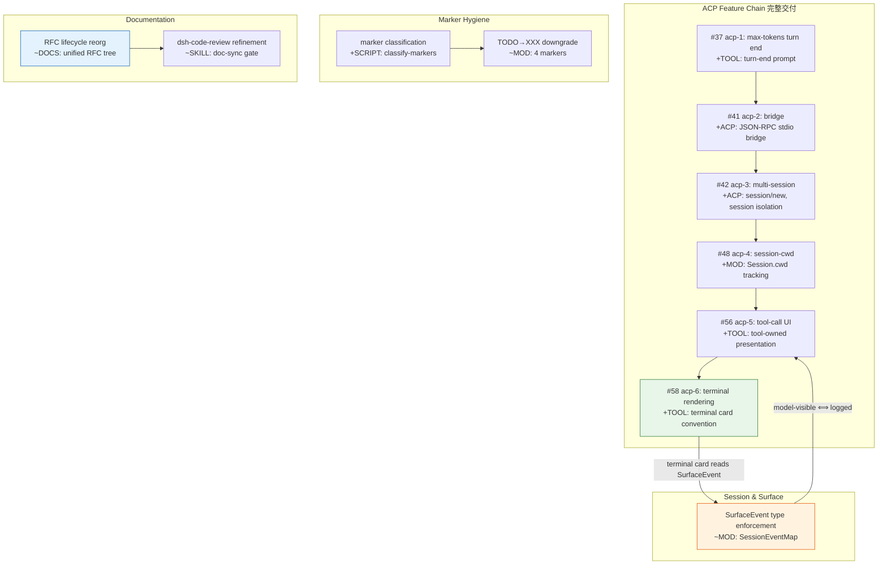
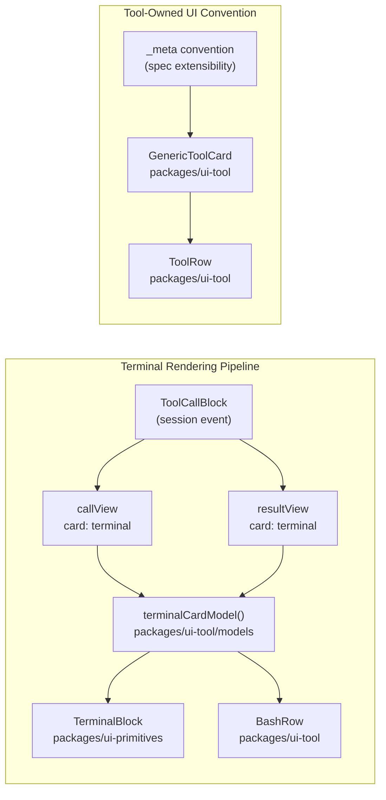
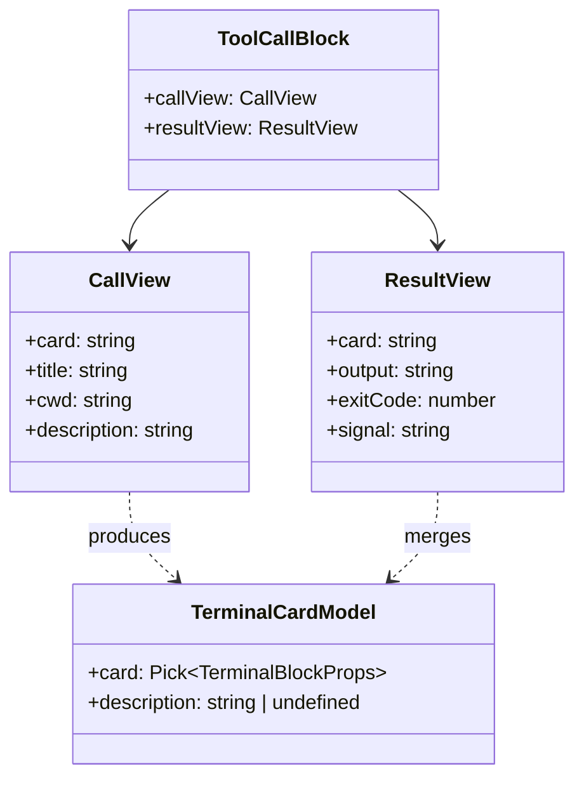
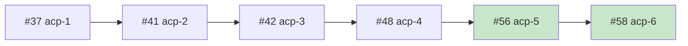

# Architecture Evolution & Design Log · 2026-06-18

> **Commits:** 41 (23 non-merge, 18 merge) · **PRs landed:** #37, #41, #42, #48, #51, #53, #56, #58
> **核心主题：** ACP Feature Chain 完整交付（6 个 stacked PR）、Tool-Owned UI 模式、RFC 生命周期重组

---

## 1. 每日架构演进图

> 本图反映当日最重要的架构演进路径和设计拓扑。





---

## 2. 设计模式与重构

### 2.1 Tool-Owned Presentation Pattern

ACP 的 tool-call UI 展示将 UI 呈现权交还给 tool 自身，而非由客户端统一渲染。这一设计通过 `_meta` 规范扩展点实现：tool 在 `tool/result` 事件中携带 `meta` 字段，客户端通过 `terminalCardModel()` 派生出 `TerminalBlockProps` 进行渲染。

**关键路径**：`ToolCallBlock` → `block.callView.card === 'terminal'` → `terminalCardModel()` → `TerminalBlock`



**架构决策**：将 UI 呈现权交给 tool 本身遵循了「一个 capability seam 包含 Definition / Provider / Consumer 三角色」的 repo 约定。`_meta` 作为 spec extensibility point 而非硬编码路由，使未来新工具类型（如 LSP、workflow）可自行定义 card 形状而不需修改客户端核心。

### 2.2 Terminal Card Convention

Terminal card 是 bash tool 结果的展示约定，由 Zed 参考适配器定义。其设计包括：

- **命令标题**：`callView.title` 渲染为终端提示行
- **描述块**：`callView.description` 渲染在 card 上方
- **退出药丸**：`exitCode` / `signal` 渲染为状态指示器
- **Working directory 解析**：`resolveTerminalCwd()` 处理相对/绝对路径和 home 折叠

`terminalFailed()` 函数检测失败退出（`exitCode !== 0` 或 `signal` 存在），因为 bash tool 将命令失败标记为 `isError: false`（退出状态是结果数据），失败信号仅在 card 展开时可见——这是 collapsed row 的唯一失败指示。

### 2.3 RFC Lifecycle Reorganization

commit `7c400e9c02` 将分散的 ADR/RFC 文档树统一为按生命周期组织的 RFC 树。这一重构与 Agent Note 的 `proposed/implemented/rejected` 三态结构对齐，使设计决策文档获得与代码变更相同的生命周期管理能力。

**重构原则**：
- `proposed/` — 待决 RFC
- `implemented/` — 已实现决策
- `rejected/` — 已否决决策

---

## 3. 特性交付与系统影响

### 3.1 ACP Feature Chain 完整交付

6 个 stacked PR 构成完整的 ACP 功能链：

| PR | 标题 | 关键变更 | 系统影响 |
|---|---|---|---|
| #37 | acp-1: max-tokens turn end | turn-end prompt settlement | LLM 请求终止协议 |
| #41 | acp-2: bridge | JSON-RPC stdio bridge | ACP 入口点 |
| #42 | acp-3: multi-session | session/new, session isolation | 多会话并发 |
| #48 | acp-4: session-cwd | Session.cwd tracking | 工作目录感知 |
| #56 | acp-5: tool-call UI | tool-owned presentation | UI 呈现权转移 |
| #58 | acp-6: terminal rendering | terminal card convention | bash 结果可视化 |

**堆叠依赖关系**：



### 3.2 SurfaceEvent Type Enforcement

commit `0279cf09d6` 强制 `SurfaceEvent` 类型约束。`SurfaceEvent` 是 `SessionEvent<SurfaceEventType>` 的子集，携带 `surfaceOp` 标记。

**类型约束链**：
```
SurfaceEventType = 'user/message' | 'assistant/message' | 'tool/result'
SurfaceEvent = SessionEvent<SurfaceEventType> & { surfaceOp: SurfaceOp }
isSurfaceEvent() → type guard narrowing
```

这确保了「model-visible ⟺ logged」不变式：只有 surface-eligible 的事件才能出现在模型可见的表面上。

### 3.3 Marker Classification & Repo Hygiene

两组 marker 清理工作：

1. **TODO→XXX 降级**（`ede9c1bb15`, `b4a5c9da40`）：4 个 TODO marker 按 repo 标准降级为 XXX
2. **Marker 分类报告**（`00bf3968ee`）：新增 marker 分类脚本，区分 `FIXME`/`TODO`/`XXX` 的紧急程度

**Repo 标准**：`FIXME` 表示需立即修复，`TODO` 表示计划改进，`XXX` 表示已知问题但非阻塞。

---

## 4. 架构决策与 Roadmap 对齐

### 4.1 Tool-Owned UI 的决策依据

**决策**：将 tool-call 的 UI 呈现权交给 tool 自身，通过 `_meta` spec extension point 传递。

**替代方案**：客户端维护一个 tool-name → rendering 的映射表。

**选择理由**：
- 遵循 capability seam 三角色模式（Definition / Provider / Consumer）
- `_meta` 作为 spec extension point 具有前向兼容性
- 每个 tool 自行定义其 card 形状，避免客户端成为所有工具的 UI 知识库
- 符合「Registrations are effects」的 Cordis 原则

### 4.2 _meta Convention 设计

`_meta` 字段在 `tool/result` 事件中作为 `JsonValue` 携带，其 shape 由 tool 自行定义但对 core 是 opaque 的。

**约束**：
- 必须是 JSON-serializable（`Session.append` 运行时验证 `isJsonValue`）
- 持久化日志会原样重现相同的 card
- 缺失时回退到 args-derived summary

### 4.3 RFC Reorg 决策

**决策**：将分散的 ADR/RFC 文档统一为按生命周期组织的 RFC 树。

**动机**：ADR 和 RFC 是同一概念的不同名称，按决策状态（proposed/implemented/rejected）组织比按文档类型（ADR vs RFC）更符合 repo 的 Agent Note 生命周期管理模型。

---

## 5. 开发者/架构师决策推断

### 5.1 ACP Feature Chain 的渐进式交付策略

6 个 stacked PR 的设计反映了一种「foundation over blast radius」的 pre-release 策略：

1. **先建立协议层**（#37 max-tokens → #41 bridge → #42 multi-session）
2. **再构建会话感知**（#48 session-cwd）
3. **最后交付 UI 层**（#56 tool-call UI → #58 terminal rendering）

**推断**：开发者有意将 ACP 的「不可见」基础设施先完成，再构建用户可见的 UI 层。这与 AGENTS.md 中「Pre-release stance: foundation over blast radius」的指导原则一致。

### 5.2 Session.cwd 的设计取舍

`resolveTerminalCwd()` 函数处理三种情况：
- viewCwd 缺失 → 使用 sessionCwd
- sessionCwd 缺失 → 使用 normalizeSegments(viewCwd)
- 两者都存在 → resolveWorkspacePath(sessionCwd, viewCwd) + normalizeSegments

**推断**：当 window 丢失 call head 时，card 无法知道原始 cwd，因此 prompt 绘制 bare `$` 而非目录名。这是对「窗口丢帧」场景的防御性处理。

### 5.3 dsh-code-review Skill 的 Gate 强化

两个 commit 强化了 dsh-code-review skill：

1. `c58bbf22eb`：将 `doc-sync` + `module-graph` 加入 hard-blocker gate list
2. `5f6ccf91ec`：scope judgment 使 documented blockers 保持权威性

**推断**：开发者认识到文档同步和模块图是代码变更的关键验证点，将其提升为 hard-blocker 而非 soft-check。

---

## 6. 技术债务与风险评估

### 6.1 当前技术债务

| 标记 | 位置 | 描述 | 风险等级 |
|---|---|---|---|
| FIXME | ToolPresentation type shapes | 需要重新思考 type shapes | 中 |
| TODO | persistent bash timeout | 超时报告仅说 timeout，不区分 OOM | 低 |
| parseExitStatus residual | tool-bash | signal marker 的 parseExitStatus 残留问题 | 低 |

### 6.2 架构风险

1. **TerminalCardModel 测试覆盖不足**：`terminalCardModel()` 函数无覆盖测试，这是 ACP terminal rendering 的核心路径。

2. **GenericToolCard 的多调用者**：9 个调用者 + 6 个测试文件，任何 terminal card 行为变更的 blast radius 较大。

3. **_meta 的 JSON-serializable 约束**：虽然 `Session.append` 运行时验证，但 tool 开发者可能在开发时忽略此约束，导致运行时拒绝。

### 6.3 建议的后续工作

1. 为 `terminalCardModel()` 和 `terminalFailed()` 添加单元测试
2. 将 FIXME ToolPresentation type shapes 的重新设计纳入 roadmap
3. 考虑为 `_meta` 添加开发时的 TypeScript 类型约束（而非仅运行时 JSON 验证）

---

*Generated: 2026-06-18 · Commits analyzed: 41 · PRs landed: 8*
