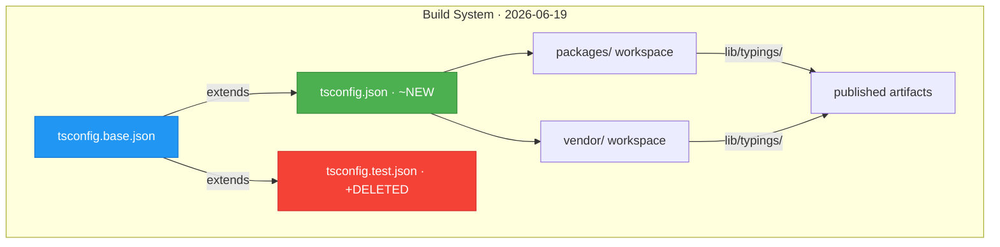
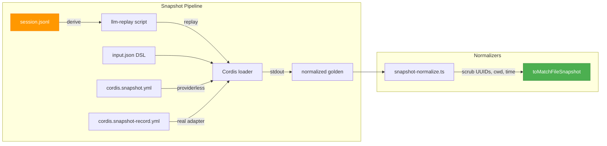
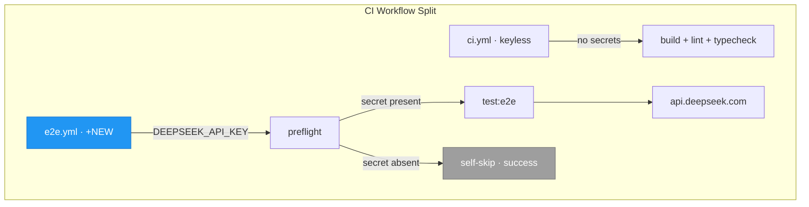
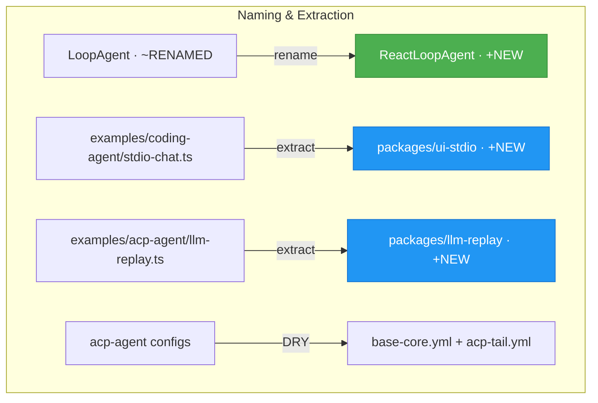

# Architecture Evolution & Design Log · 2026-06-19

> **Commits:** 48 (30 non-merge, 18 merge) · **PRs landed:** #50, #59, #62, #63, #64
> **核心主题：** TSC-first Build 统一、ACP Snapshot Testing 框架、Real-API e2e CI、Agent-Loop 重命名

---

## 1. 每日架构演进图

> 本图反映当日最重要的架构演进路径和设计拓扑。

### Phase 1: Build System Consolidation (~11 commits)

### Phase 2: ACP Snapshot Testing (~15 commits)

### Phase 3: Real-API e2e CI (~4 commits)

### Phase 4: Agent-Loop Rename & Example Extraction (~8 commits)

---

## 2. 设计模式与重构

### 2.1 TSC-first Build + One TSConfig

**模式:** 从分散的 per-package tsconfig 迁移到单一 `tsconfig.json` 入口，通过 `extends` 继承 base 配置。

**变更摘要:**
- 删除 `tsconfig.test.json` 和 `tsconfig.typecheck.json` (~DELETED)
- 新建统一 `tsconfig.json`，按规则区分 vendor/packages (~NEW)
- packages 和 vendor 均使用 `lib/typings/` 作为输出子目录 (~MOD)
- 全量 TypeScript 文件迁移到 extensionless import（ESM 规范）

**决策推断:** 团队判断多 tsconfig 维护成本高于收益，统一入口降低了 contributor 的认知负担。Extensionless import 迁移确保与 Node ESM 一致，避免了 CJS/ESM 混合问题。

### 2.2 ACP Snapshot Test Framework

**模式:** Record-once / Replay-deterministic — 用真实 API 录制 session JSONL，回放时无需 API key。

**变更摘要:**
- `snapshot-harness.ts`: 启动真实 acp-agent 子进程，通过 Cordis Loader 保留 TSX_TSCONFIG_PATH 解析 (~NEW)
- `snapshot-normalize.ts`: 纯函数 normalizer，擦除 UUID/session ID/cwd/时间戳，保留 seq (~NEW)
- `input.json` DSL: 声明式场景描述（initialize/newSession/cancel）(~NEW)
- `cordis.snapshot.yml` / `cordis.snapshot-record.yml`: providerless vs real adapter 配置 (~NEW)
- 五个快照场景: text-turn, tool-call-turn, multi-turn, error-finish, cancel (~NEW)

**决策推断:** 团队需要在 CI 中验证 LLM 交互的 transcript 和 UX 行为，但无法依赖实时 API。录制真实响应后 deterministic replay 解决了这一矛盾。`seq` 不擦除保证了重放的顺序确定性。

### 2.3 Persistence Backend Guards 共享

**模式:** Extract shared pure guards 到 `session-persistence` 公共模块。

**变更摘要:**
- `session-persistence/src/index.ts`: 新增共享的 backend guard 纯函数 (+NEW)
- `session-persistence-jsonl` 和 `session-persistence-sqlite` 各自删除重复的 guard 逻辑 (~MOD)
- `acp/src/index.ts`: share turn-end prompt settlement 逻辑 (~MOD)

**决策推断:** 两个 persistence backend 有相同的 guard 逻辑，提取到共享层消除了重复并确保行为一致。

### 2.4 ReactLoopAgent 重命名

**模式:** 语义精确化重命名 — `LoopAgent` → `ReactLoopAgent`。

**变更摘要:**
- `agent-loop/src/agent.ts`: class 重命名 (~MOD)
- 所有 test 文件引用更新 (~MOD)
- `architecture.md` / `AGENTS.md` / READMEs 同步更新 (~MOD)
- Plugin export name (`AgentLoop`) 和 service key (`ctx.agentLoop`) 不变

**决策推断:** ReAct-style loop 的命名应明确反映其推理模式，避免与未来其他 loop 实现混淆。保持 plugin 名不变确保向后兼容。

---

## 3. 特性交付与系统影响

### 3.1 Build System (TSC-first + One TSConfig)

| 维度 | 影响 |
|---|---|
| 构建时间 | 统一 config 减少重复编译，packages/vendor 两步构建 |
| 维护成本 | 删除 2 个冗余 tsconfig，单一入口降低 contributor 认知负担 |
| 兼容性 | Extensionless import 与 Node ESM 完全一致 |
| 破坏性 | 低 — 主要是内部重构，对外 API 不变 |

### 3.2 ACP Snapshot Testing

| 维度 | 影响 |
|---|---|
| CI 覆盖 | 无需 API key 即可验证 LLM 交互 transcript |
| 开发体验 | 新增 `test:snapshot` / `test:snapshot:record` 命令 |
| 质量门 | 预推送检查包含 snapshot 测试 |
| 安全性 | 录制模式使用 repo secret，回放模式完全 keyless |

### 3.3 Real-API e2e CI

| 维度 | 影响 |
|---|---|
| CI 矩阵 | 新增 `e2e.yml` workflow，与 `ci.yml` 分离 |
| 安全模型 | Fork PR 自动 skip，secret 仅用于 trusted 上下文 |
| 可靠性 | Preflight 硬失败防止 secret 配置错误的假绿 |
| 频率 | Nightly 08:17 CST (00:17 UTC) + PR trigger |

### 3.4 Example Extraction

| 维度 | 影响 |
|---|---|
| 覆盖率 | 从 examples/（不受 100% gate）移入 packages/（受 gate） |
| 复用性 | `ui-stdio` 和 `llm-replay` 成为可复用的 workspace 包 |
| 去重 | 消除 coding-agent 和 echo-agent 中 stdio-chat.ts 的重复 |
| 示例契约 | `examples/AGENTS.md` codifies keyless+with-key smoke convention |

---

## 4. 架构决策与 Roadmap 对齐

### ADR: TSC-first Build and One TSConfig

| 字段 | 内容 |
|---|---|
| 决策 | 统一为单一 `tsconfig.json`，删除 per-purpose 变体 |
| 理由 | 多 config 维护成本 > 单一入口的灵活性损失 |
| 替代方案 | 保留 `tsconfig.test.json` / `tsconfig.typecheck.json` |
| 状态 | 已实现 (implemented) |
| 验证 | typecheck + build + hygiene 全部通过 |

### RFC: ACP Snapshot Tests (Record-once / Replay-deterministic)

| 字段 | 内容 |
|---|---|
| 决策 | 用真实 API 录制 JSONL，CI 中 deterministic replay |
| 理由 | 实时 API 不确定性阻碍 CI 可靠性 |
| 替代方案 | Mock provider（无法覆盖真实 LLM 行为）|
| 状态 | 已实现 (implemented) |
| 验证 | 5 个快照场景 + cancel/error 操作 |

### RFC: Real-API e2e CI Security Model

| 字段 | 内容 |
|---|---|
| 决策 | 独立 `e2e.yml` workflow，secret-scoped to preflight+e2e |
| 理由 | CI 需要覆盖 with-key 场景，但不能暴露 secret 给 fork PR |
| 安全模型 | Job-level skip (success) 防止 fork PR 阻塞 merge |
| 状态 | 已实现 (implemented) |

---

## 5. 开发者/架构师决策推断

### 5.1 Build Consolidation Strategy

团队采用「先破坏后修复」策略：先统一 tsconfig 结构，再逐步修复编译问题。`ec9b093cb0` (build: two-step) 先建立 packages/vendor 两步构建流程，`dc04fea749` (feat: one tsconfig.json) 再完成合并。这表明团队有明确的迁移路线图，且对构建系统的稳定性有信心。

### 5.2 Snapshot Testing Philosophy

团队选择了「录制真实、回放确定性」而非「mock provider」路线。这反映了架构师对「model-visible ⟺ logged」原则的坚持 — 快照必须来自真实 LLM 交互，而非人工构造。`input.json` DSL 的设计表明团队预见了场景增长的需要，提前建立了声明式框架。

### 5.3 CI Security Split

`e2e.yml` 与 `ci.yml` 的分离表明团队在「CI 覆盖」与「安全隔离」之间做了明确权衡。Job-level skip (success) 而非 skip (failure) 的设计选择说明团队理解 GitHub branch protection 的语义 — required check 不能因 skip 而阻塞。

### 5.4 Example → Package Extraction Pattern

`examples/` → `packages/` 的提取模式（`ui-stdio`, `llm-replay`）表明团队在建立「examples 是 smoke test，packages 是 tested code」的分层契约。`examples/AGENTS.md` 的 codification 说明这不是一次性重构，而是建立长期规范。

### 5.5 Naming Precision over Brevity

`LoopAgent` → `ReactLoopAgent` 的重命名（23 文件，91 insertions/deletions）表明团队愿意为命名精确性支付重构成本。保持 `AgentLoop` export name 和 `ctx.agentLoop` service key 不变显示了对向后兼容的审慎。

---

## 6. 技术债务与风险评估

### 6.1 已识别风险

| 风险 | 等级 | 缓解措施 |
|---|---|---|
| Extensionless import 迁移可能遗漏 | 中 | typecheck + build gate 全量覆盖 |
| Snapshot normalizer 漏掉新 identifier 类型 | 低 | `snapshot-normalize.spec.ts` 纯函数测试 |
| e2e.yml secret 配置错误导致 false green | 低 | Preflight 硬失败 + self-skip 机制 |
| ui-stdio / llm-replay 提取后 examples 烟雾测试失效 | 低 | keyless smoke test 验证 cordis.yml 加载 |

### 6.2 已解决技术债

| 债务 | 解决方式 | 影响 |
|---|---|---|
| 多 tsconfig 维护负担 | 统一为单一 `tsconfig.json` | 降低 contributor 认知成本 |
| persistence backend guard 重复 | 提取到 `session-persistence` 共享模块 | 消除重复，确保一致性 |
| stdio-chat.ts 跨 examples 重复 | 提取到 `packages/ui-stdio` | 单一 source of truth |
| LoopAgent 命名模糊 | 重命名为 ReactLoopAgent | 语义精确化 |
| examples/ 代码不受覆盖率 gate | 移入 packages/ workspace | 受 per-file 100% gate |

### 6.3 待观察项

| 项目 | 状态 | 备注 |
|---|---|---|
| `packages/README.md` FIXME: regroup packages into hierarchy | 待处理 | 提取后的新包需要归组 |
| Snapshot 场景扩展（reasoning/max-tokens） | 延迟 | 难以从 live model 强制确定性输出 |
| ACP snapshot goldens 维护成本 | 待观察 | 5 个场景，未来可能增长 |
| Nightly e2e 稳定性 | 待观察 | 真实 API 的延迟/可用性波动 |

---

*Generated: 2026-06-19 · Commits analyzed: 48 · PRs landed: 5*
