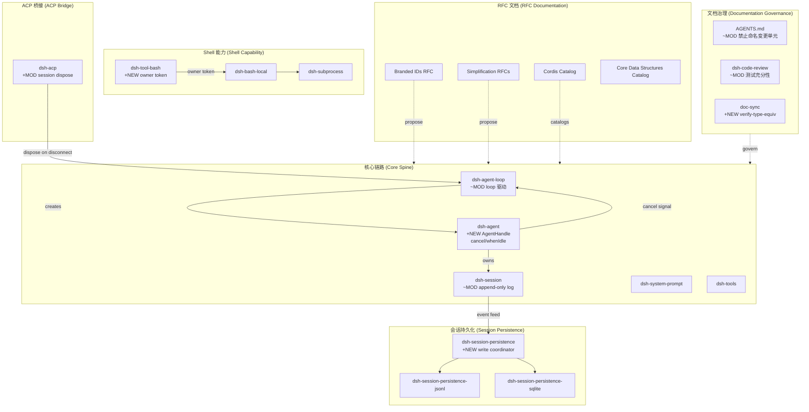

# Architecture Evolution & Design Log · 2026-06-20

> 87 commits — 2026 年最高产出日。Merge PR #66–#78（多个 worktree 分支）。

---

## 1. 每日架构演进图



---

## 2. 设计模式与重构

### Phase A — Agent 生命周期与所有权 (8 commits)

**涉及 commit：** `2a4d89a4bd`, `a53a56ff48`, `ee4cad3ada`, `5a5b7d19c3`, `c4bc6e0e38`, `9ee22bc6f6`, `6a1e381e38`, `f58b031465`

**设计模式：** **Owner Handle + Composite Effect 有序拆解**

`AgentHandle` 引入异步 per-agent disposer，将 agent 的生命周期绑定到持有者的 Cordis effect。核心机制：

```ts
interface AgentHandle {
  agent: Agent
  dispose(): Promise<void>  // 停止 loop → 等待退出 → 注销 agent → 移除 session → 解绑 scope
}
```

**关键决策：**
- `a53a56ff48` 将 session 生命周期折叠进 agent effect，实现有序拆解（session removal 在 loop closing events commit 之后），避免 sibling effect 竞态导致 publication hooks 过早移除
- `c4bc6e0e38` 添加 queue-aware `Agent.cancel()` 原语，支持 `keepInbox` 选项保留队列
- `9ee22bc6f6` 修复 pre-step cancel 时 `whenIdle()` 的提前 resolve 竞态
- `6a1e381e38` 在 marker-only windows 中携带 `cancel(reason)`，消除取消原因丢失窗口
- `5a5b7d19c3` 在 register disposer 中包含 throwing agent/disposed listener，防止泄漏

**架构影响：** Agent 从"可注册的值"演进为"有所有权约束的能力"。只有持有 `AgentHandle` 的消费者才能拆解 agent，structural provider（loop factory）通过内部 teardown 达到同等效果。Config 创建的 agent（loop startup）由 loop fiber 持有，无需 handle。

### Phase B — 持久化写协调器 (3 commits)

**涉及 commit：** `ab02e9acec`, `3d67a98291`, `301a3d1233`

**设计模式：** **Write Coordinator + CWD Scope Exactness**

`ab02e9acec` 从 session-persistence 中提取共享 write coordinator，将 append 批处理窗口（固定 deadline、拒绝阻塞生产者、失败事件保留）从各 backend 实现中解耦。`3d67a98291` 精确化 JSONL backend 的 loadLive cwd scope — 只匹配精确 cwd 而非前缀匹配，防止跨项目 session 泄漏。`301a3d1233` 进一步限定 ownerless-state 声明到特定 cwd。

**架构影响：** 持久化层从"每个 backend 自己管理写缓冲"演进为"共享 coordinator + backend 只负责物理写入"。这为后续 SQLite backend 的并发写入和 JSONL 的 atomic batch 写入奠定了统一抽象。

### Phase C — Bash Owner Token (3 commits)

**涉及 commit：** `d1b7c3bf95`, `b58f1dd5c8`, `be6cf4510b`

**设计模式：** **Opaque Ownership Token at Capability Seam**

`d1b7c3bf95` 在 bash executor seam 上添加 opaque owner token，将 background task 的所有权从 plugin-local Map 转移到 session-scoped token。`b58f1dd5c8` 重构为按 session token 归属 background tasks，而非 plugin-local Map。`be6cf4510b` 修复 test fixture 中 agentId 与 session token 的混淆。

**架构影响：** Bash 能力从"plugin 持有全局状态"演进为"session-scoped ownership token"。Background task 的生命周期现在绑定到 session 而非 plugin 实例，支持 session fork 和 resume 场景下的正确归属。

### Phase D — 包层级重组与构建清理 (5 commits)

**涉及 commit：** `d02e9f1bd6`, `ed94daed9e`, `7f131dd4d8`, `8c16524b90`, `38cc62b644`

**设计模式：** **Modular Hierarchy + Build Artifact Normalization**

`d02e9f1bd6` 将 packages 重组为模块化层级结构（core/api/llm/e2b/shell 等分组）。`ed94daed9e` 修复构建配置审查发现。`7f131dd4d8` 将 build typings 目录重命名为 `types`（消除歧义）。`8c16524b90` 清理 knip dead entry pattern 并在 config hints 上 fail-fast。`38cc62b644` 在 AGENTS.md 中禁止命名变更单元（PR/commit）于注释和测试名称中。

**架构影响：** 仓库从扁平 packages/ 结构演进为分层 group/pkg 结构，为后续 package group 的 subsystem 文档映射奠定基础。

### Phase E — RFC 文档与简化提案 (14 commits)

**涉及 commit：** `ae5a908a21`, `034779d761`, `605587e79c`, `d614f3aabf`, `800e08e930`, `d324b06e74`, `4e5c08ef82`, `0e73a45dc9`, `cc47f76cea`, `ea5697e354`, `0f7abc9808`, `07048983e0`, `94a762658f`, `d9c9c5d403`

**设计模式：** **Decision Record + Catalog Generation**

- **Branded IDs RFC** (`ae5a908a21`)：提议在所有应属之处使用 branded IDs（`SessionId`, `CallId`, `JobId` 等），消除跨包边界的裸 string 互换风险
- **RFC 分类** (`605587e79c`)：通过 path-encoded subdirectories 按 kind 分类 RFCs
- **Cordis Catalog** (`4e5c08ef82`)：生成 events + services 目录，作为 Cordis API surface 的权威参考
- **Core Data Structures Catalog** (`0f7abc9808`)：编目核心数据结构，配合 `verify-type-equiv` gate 确保 verbatim type pastes 不漂移
- **Simplification RFCs** (`cc47f76cea`, `552612622c`)：提出简化候选，审查并折叠来自 PR 74 的有用 RFC
- **废弃 RFC** (`94a762658f`)：拒绝 superseded providerless-example-base RFC

**架构影响：** 文档从"散落在各处的说明"演进为"结构化 decision record + 自动生成的 catalog"。`verify-type-equiv` gate 确保 subsystem 文档中的 verbatim type pastes 与源码保持同步。

### Phase F — 文档治理与规范 (10+ commits)

**涉及 commit：** `d0c75d68f`, `8597cc2c58`, `44762efbd7`, `16304872e1`, `329e5c3e2e`, `90a19f072d`, `1bb201365d`, `de0c4605bd`, `7a94d36c46`, `5a6243900d`

**设计模式：** **Doc-Current-State Convention + Cross-reference Lint**

- 禁止在文档中使用"Previously/Now/No longer"等时间性叙述，改为陈述当前事实
- 禁止命名变更单元（PR/commit）于注释和测试名称
- `5a6243900d` 修复 `verify-type-equiv` scan gap 并修正 persistence prose
- `7a94d36c46` 在 dsh-code-review skill 中要求"真实使用"而非仅"100% coverage"

**架构影响：** 文档治理从"事后补充"演进为"结构化 gate + 自动化验证"。`verify-type-equiv` 和 `verify-md-links` 确保文档与代码的一致性。

---

## 3. 特性交付与系统影响

### +NEW: AgentHandle with Async Disposer

**Commit:** `2a4d89a4bd`

Agent 生命周期管理的核心变革。消费者通过 `AgentHandle.dispose()` 控制 agent 的有序拆解：

```ts
// 消费者所有权模式
const handle = await ctx.agents.create({ ... })
// ... 使用 agent ...
await handle.dispose()  // 有序拆解：stop loop → await drain → unregister → remove session → unwind scope
```

**系统影响：**
- ACP server 在 disconnect/teardown 时 dispose session agent (`ee4cad3ada`)
- Loop 的 session lifecycle 折叠进 agent effect (`a53a56ff48`)
- Agent registry 的 `enter()` + `announce()` 两步发布模式支持 async factory

### +NEW: Agent.cancel() Queue-Aware Primitive

**Commit:** `c4bc6e0e38`

```ts
cancel(cause: AgentCancelCause, options?: CancelOptions): void
// options.keepInbox = true  → 保留队列，仅取消活跃 turn
// options.keepInbox = false → 清空队列 + 取消活跃 turn
```

**系统影响：**
- `whenIdle()` 在 pre-step cancel 时不提前 resolve (`9ee22bc6f6`)
- Marker-only windows 携带 cancel reason (`6a1e381e38`)
- Window-2 early-whenIdle 竞态修复 (`f58b031465`)

### +NEW: Bash Owner Token

**Commit:** `d1b7c3bf95`

Opaque ownership token at executor seam，将 background task 归属从 plugin-local Map 转移到 session-scoped token。

**系统影响：**
- Background tasks 按 session token 归属 (`b58f1dd5c8`)
- Session fork/resume 场景下 background task 归属正确
- Test fixture 中 agentId 与 session token 分离 (`be6cf4510b`)

### +NEW: Session Persistence Write Coordinator

**Commit:** `ab02e9acec`

共享 write coordinator 从各 backend 实现中解耦写缓冲逻辑。

**系统影响：**
- JSONL/SQLite backend 只负责物理写入
- CWD scope exactness 精确化 (`3d67a98291`)
- Ownerless-state 声明限定到特定 cwd (`301a3d1233`)

### +NEW: verify-type-equiv Gate

**Commit:** `07048983e0`

自动化 gate 验证 subsystem 文档中的 verbatim type pastes 与源码同步。

**系统影响：**
- `5a6243900d` 修复 scan gap
- Core Data Structures Catalog 与源码保持同步
- Subsystem 文档的 type equiv 声明可机器验证

### ~MOD: Package Hierarchy Reorganization

**Commit:** `d02e9f1bd6`

Packages 重组为模块化层级：

```
packages/
  core/          # session, agent, tools, agent-loop, scope, system-prompt
  api/           # Remote BFF assembly
  llm/           # LLM capability
  shell/         # bash capability
  session/       # persistence backends
  ...
```

**系统影响：** 每个 package group 对应一个 subsystem 文档页面，文档树与代码树对齐。

### ~MOD: AGENTS.md Conventions Update

**Commit:** `d0c75d68f`, `38cc62b644`

禁止在注释和测试名称中命名变更单元（PR/commit），强化"文档当前状态"约定。

---

## 4. 架构决策与 Roadmap 对齐

### ADR-1: AgentHandle 作为所有权能力

**决策：** Agent 拆解是 capability — 只有持有者可以 teardown agent，structural provider 通过内部 teardown 达到同等效果。

**替代方案：** 全局 agent registry + `ctx.agents.dispose(id)` — 任何持有 id 的调用者都能拆解 agent。

**权衡：** 选择了更严格的所有权模型，以支持 async factory 的 ordered teardown（session lifecycle 折叠进 agent effect），代价是消费者必须持有 handle。

**Roadmap 对齐：** 为后续 subagent delegation 和 multi-session orchestration 奠定所有权基础。

### ADR-2: Write Coordinator 与 Backend 解耦

**决策：** 持久化写缓冲逻辑提取到共享 coordinator，backend 只负责物理写入（JSONL atomic batch / SQLite row insert）。

**替代方案：** 每个 backend 自己管理写缓冲。

**权衡：** 增加了 coordinator 抽象层，但消除了 JSONL 和 SQLite 在批处理窗口、失败重试、flush checkpoint 上的重复实现。为后续并发写入和 write-ahead log 奠定基础。

**Roadmap 对齐：** 支持 session persistence 的 extensibility — 新 backend 只需实现物理写入，无需重新实现批处理逻辑。

### ADR-3: Opaque Owner Token at Capability Seam

**决策：** Bash executor seam 使用 opaque owner token 归属 background task，而非 plugin-local Map。

**替代方案：** 保持 plugin-local Map。

**权衡：** 增加了 token 传递的复杂度，但支持 session fork/resume 场景下的正确归属。Token 是 session-scoped 的，session 结束时 background task 自然失去归属。

**Roadmap 对齐：** 为后续 remote sandbox 和 E2B integration 奠定所有权基础 — remote 执行的 background task 同样需要 session-scoped 归属。

### ADR-4: Branded IDs 全面推广

**决策（RFC 提案）：** 在所有应属之处使用 branded IDs，消除跨包边界的裸 string 互换风险。

**现状：** `SessionId` (dsh-session) 和 `CallId` (dsh-llm) 已 branded；`JobId` (dsh-jobs) 等由 capability packages branded。

**Roadmap 对齐：** 与 TypeScript strict mode 和 `noImplicitAny` 一致，编译时捕获 id 类型混淆。

### ADR-5: 文档治理自动化

**决策：** 文档一致性通过自动化 gate 验证（`verify-type-equiv`, `verify-md-links`, `verify-doc-budgets`），而非人工审查。

**替代方案：** 仅依赖 code review 中的人工检查。

**权衡：** 增加了 CI gate 的维护成本，但消除了文档漂移的系统性风险。`verify-type-equiv` 确保 subsystem 文档中的 type pastes 与源码同步。

**Roadmap 对齐：** 为后续 bilingual 文档（中英对齐）和 VitePress 网站构建奠定基础。

---

## 5. 开发者/架构师决策推断

### 推断 1: Agent 生命周期正从"创建-运行-销毁"演进为"创建-运行-所有权管理-有序销毁"

**证据：**
- `AgentHandle` 引入异步 disposer (`2a4d89a4bd`)
- Session lifecycle 折叠进 agent effect (`a53a56ff48`)
- ACP server 在 disconnect 时 dispose session agent (`ee4cad3ada`)
- Throwing agent/disposed listener 在 register disposer 中包含 (`5a5b7d19c3`)

**推断：** 架构师预见到 multi-session orchestration（ACP server 管理多个 session agent）和 subagent delegation（parent agent 创建 child agent）场景，需要明确的所有权链。当前的 `AgentHandle` 是这个方向的第一步。

### 推断 2: 持久化层正从"backend 自治"演进为"coordinator 统一调度"

**证据：**
- Write coordinator 提取 (`ab02e9acec`)
- CWD scope exactness 精确化 (`3d67a98291`)
- Ownerless-state 声明限定 (`301a3d1233`)
- Crash recovery 保留 interrupted turn 而非 truncate

**推断：** 架构师预见到更多 persistence backends（如远程存储、WAL-based backends）和更复杂的 crash recovery 场景。统一 coordinator 使得新 backend 只需实现物理写入层。

### 推断 3: 文档治理正从"事后补充"演进为"结构性约束"

**证据：**
- 禁止命名变更单元于注释和测试名称 (`d0c75d68f`)
- Doc-current-state convention 确立 (`1bb201365d`)
- verify-type-equiv gate 引入 (`07048983e0`)
- Core Data Structures Catalog 编目 (`0f7abc9808`)
- 测试充分性要求"真实使用" (`7a94d36c46`)

**推断：** 架构师预见到文档漂移是系统性风险，通过自动化 gate 和结构化约束（禁止时间性叙述、禁止命名变更单元）来根治。这与 AGENTS.md 中的"文档当前状态"约定一致。

### 推断 4: 能力 seam 正从"接口+实现"演进为"接口+实现+所有权token"

**证据：**
- Bash executor seam 引入 owner token (`d1b7c3bf95`)
- Background task 按 session token 归属 (`b58f1dd5c8`)
- AgentHandle 作为 ownership capability

**推断：** 架构师预见到 remote execution（E2B sandbox）和 multi-session 场景下，capability seam 需要携带所有权信息。Owner token 是这个方向的通用模式。

### 推断 5: RFC 流程正从"讨论文档"演进为"结构化 decision record"

**证据：**
- RFC 按 kind 分类 (`605587e79c`)
- Branded IDs RFC 提出系统性方案 (`ae5a908a21`)
- Simplification RFCs 提出并审查 (`cc47f76cea`)
- 废弃 RFC 被拒绝 (`94a762658f`)

**推断：** 架构师预见到 RFC 数量增长，通过 path-encoded subdirectories 和 kind 分类来管理。每个 RFC 是一个 decision record，记录"为什么"而非"怎么做"。

---

## 6. 技术债务与风险评估

### 高优先级

| 债务/风险 | 涉及 commit | 影响 | 缓解建议 |
|---|---|---|---|
| Agent.cancel() 在 marker-only windows 的 reason 传递 | `6a1e381e38` | 取消原因在特定窗口丢失，调试困难 | 已修复；需监控后续 window-2 竞态 |
| Write coordinator 的并发写入语义未文档化 | `ab02e9acec` | 多 backend 同时写入时的行为不确定 | 补充 coordinator 的并发 contract 文档 |
| Bash owner token 的 remote sandbox 适配 | `d1b7c3bf95` | E2B sandbox 场景下 token 传递未验证 | 在 E2B integration 中验证 token 传递 |

### 中优先级

| 债务/风险 | 涉及 commit | 影响 | 缓解建议 |
|---|---|---|---|
| Package hierarchy 重组后，部分 cross-package import 路径可能漂移 | `d02e9f1bd6` | 构建失败或运行时 import 错误 | 运行 `pnpm run typecheck && pnpm run lint` 验证 |
| verify-type-equiv 的 scan gap 修复后，仍有未 catalog 的新 type | `5a6243900d` | 新 type 未在 subsystem 文档中声明 | 运行 `pnpm run gen-cordis-catalog` 重新生成 |
| Branded IDs RFC 的迁移计划未制定 | `ae5a908a21` | 从 bare string 到 branded ID 的迁移成本不确定 | 制定迁移计划，分 phase 推进 |

### 低优先级

| 债务/风险 | 涉及 commit | 影响 | 缓解建议 |
|---|---|---|---|
| AGENTS.md 禁止命名变更单元后，存量注释/测试名称需清理 | `d0c75d68f` | 存量代码中的 PR/commit 引用 | 后续 PR 中逐步清理 |
| Cordis catalog 和 data structures catalog 需定期重新生成 | `4e5c08ef82`, `0f7abc9808` | catalog 与源码漂移 | 在 CI gate 中添加 freshness check |
| knip dead entry pattern 清理后，可能引入新的 dead code | `8c16524b90` | 死代码累积 | 定期运行 `pnpm run hygiene` |
