# Architecture Evolution & Design Log · 2026-06-21

> **Commits:** 73 · **PRs landed:** #79, #82–#89
> **核心主题：** Subagent Capability Seam 引入、Simplification Wave（8 个简化分支）、Session Format v0 Pin、App Spine Extraction

---

## 1. 每日架构演进图

> 本图反映当日最重要的架构演进路径和设计拓扑。

```mermaid
graph TD
    subgraph "Subagent Capability Seam (PR#89)"
        Reg["ctx.subagents<br/>(named-provider registry)"]
        Interface["SubagentProvider<br/>SubagentRun"]
        Events["subagent/start<br/>subagent/end"]
        Tool["dsh-tool-subagent<br/>(model-facing)"]
    end

    subgraph "Simplification Wave (PR#82–#88)"
        LLM_S["LLM Surface 简化<br/>~MOD: 删除未使用方法"]
        Prune["Prune Seam<br/>~MOD: 删除死方法"]
        Brand["Branded IDs<br/>+NEW: dsh-brand 包"]
        Stop["Agent Stop<br/>~MOD: 删除 abort()"]
        Trace["Trace Events<br/>~MOD: 折叠 usage/error"]
        Gold["Snapshot Goldens<br/>~MOD: 统一 session.jsonl"]
        Spine["App Spine<br/>+NEW: dsh-agent-core"]
    end

    subgraph "Session Format"
        SF["SESSION_FORMAT_VERSION = 0<br/>+PIN: pre-release 格式"]
    end

    Tool --> Reg
    Reg --> Interface
    LLM_S --> Prune --> Brand --> Stop --> Trace --> Gold --> Spine

    style Reg fill:#e8f5e9,stroke:#2e7d32
    style Brand fill:#e3f2fd,stroke:#1565c0
    style SF fill:#fff3e0,stroke:#e65100
```



---

## 2. 设计模式与重构

### 2.1 Named-Provider Registry 模式（Subagent）

Subagent capability seam 采用 named-provider registry 而非 single-implementation，支持多种传输方式共存：

- **In-process spawn**：创建全新 child agent
- **In-process fork**：基于 seed 创建 child agent
- **ACP out-of-process**：通过 ACP 协议委托到外部进程
- **Future providers**：A2A、Claude Code、Codex

**设计要点**：
- `SubagentService` 是 registry，不是 singleton
- `SubagentProvider` 是 capability interface，不同传输方式各自实现
- `subagent/start` 和 `subagent/end` 生命周期事件用于 observability

### 2.2 Seam Surface Pruning（简化浪潮）

8 个 worktree 分支按级联顺序合并，逐层简化系统：

```
PR#82 (llm-surface) → PR#83 (prune-seam) → PR#84 (branded-ids) → PR#85 (agent-stop)
  → PR#86 (trace-events) → PR#87 (snapshot-goldens) → PR#88 (extract-examples)
    → PR#89 (lessons-learned)
```

**关键简化**：
- LLM：删除未消费的 `streamBlocks()`、`generate()`、`adapter-change` 事件
- Session Persistence：删除 `has()`、`delete()` 死方法
- Bash：删除公共 `get()`、`list()`（保留内部实现路径）
- Agent：删除未使用的公共 `abort()`，保留 load-bearing `whenIdle()`

### 2.3 Brand-at-Boundary 类型安全

`Branded<B>` 提取到独立包 `dsh-brand`，修复了依赖方向问题：

- **之前**：`dsh-bash` 间接依赖 `dsh-llm`（因为 `Branded` 位于 `dsh-llm`）
- **之后**：`dsh-brand` 是零依赖类型包，任何 capability package 都不会拉入无关词汇

**新 branded types**：
- `BashTaskId = Branded<'BashTask'>`
- `OwnerToken = Branded<'OwnerToken'>`（与 `SessionId` 完全不同的 brand）

### 2.4 App Spine 提取

从 examples 中提取厚组装逻辑为独立 packages：

- `dsh-agent-core`：providerless/executor-less/UI-less spine
- `dsh-stdio-agent`：terminal chat APP
- `dsh-acp-agent`：ACP server APP

**设计洞察**：之前每个 example 是一个 "thick" 模块（手写 start.ts、infrastructure preamble、嵌套 base.yml）。提取将 composition 从代码移到 config 层，每个 example 变成 thin leaf `cordis.yml`。

---

## 3. 特性交付与系统影响

### 3.1 Subagent Capability Seam

| 组件 | 路径 | 角色 |
|------|------|------|
| `dsh-subagent` | `packages/subagent/subagent/` | Service Definition + registry |
| `dsh-subagent-mock` | `packages/subagent/subagent-mock/` | 测试用 scripted provider |
| `dsh-tool-subagent` | `packages/subagent/tool-subagent/` | Model-facing tool |

**系统影响**：
- Agent 可以委托任务到 child agent
- 支持 in-process 和 out-of-process 两种执行模式
- 为后续 A2A、Claude Code 集成奠定基础

### 3.2 Session Format v0 Pin

`SESSION_FORMAT_VERSION` 固定为 0：pre-release 阶段不执行 monotonic bump。

**设计理由**：
- 首次 tagged release 之前，on-disk format 不稳定
- 允许 breaking shape churn 在 v0 吸收
- 任何非 0 log 在加载时被拒绝，无需 migration path

### 3.3 Trace Event 折叠

- Token usage 从独立 `usage` 事件折叠为 `assistant/message` 的可选 `usage` 字段
- Max-tokens 路径记录空内容的 `assistant/message { content: [], usage }`
- `deriveMessages()` 跳过空内容 assistant 消息

---

## 4. 架构决策与 Roadmap 对齐

### 4.1 Subagent Named-Provider vs Single-Implementation

**决策**：Subagent 使用 named-provider registry，而非 bash 风格的 single-implementation。

**理由**：Subagent 天然支持多种传输方式（in-process、ACP、future A2A），registry 允许 coexisting providers。

**替代方案**：Single-implementation + transport 配置（类似 bash）。

### 4.2 Branded 提取到独立包

**决策**：`Branded<B>` 从 `dsh-llm` 提取到 `dsh-brand`。

**理由**：修复依赖方向 — `dsh-bash` 不应间接依赖 `dsh-llm`。

**影响**：70+ 处引用需要更新，但 brand 是 zero-cost cast，不影响运行时。

### 4.3 App Spine 的 Config-Driven Composition

**决策**：将 composition 从代码移到 config 层。

**理由**：Examples 的 thick start.ts 增加了维护成本，thin leaf cordis.yml 更易理解和修改。

**替代方案**：保持 thick examples，添加更多 templates。

---

## 5. 开发者/架构师决策推断

### 5.1 开发者意图重建

**思维模型**：开发者在这一天的脑中系统画面是：
- 系统需要支持 agent 委托任务到 child agent（subagent）
- 现有 seam surface 有大量未使用的推测性方法需要清理
- Examples 的组装逻辑应该提取为可复用的 packages
- Branded types 需要更合理的依赖位置

**优先级排序**：
1. Subagent capability seam — 核心功能，影响后续所有 multi-agent 场景
2. Simplification wave — 技术债务清理，为后续开发建立清晰基线
3. App spine extraction — 提升 examples 的可维护性
4. Branded IDs extraction — 修复依赖方向问题

**有意取舍**：
- Subagent 的 mock provider 优先于真实实现，因为需要先建立测试基础设施
- Simplification 选择了"广泛覆盖"而非"深度修复"
- App spine 提取保持了向后兼容（examples 仍然可以使用旧模式）

### 5.2 架构师决策推断

**模块拆分粒度**：
- Subagent 被拆分为3个包（definition、mock、tool），而非单一包。这是因为：
  - Definition 和 tool 的依赖方向不同
  - Mock provider 只在测试中使用
  - Tool 需要 model-facing 的依赖

**抽象层引入时机**：
- Subagent 在 simplification wave 之后引入，确保系统在添加新功能之前已经清理干净
- 这是一个"先清理再建设"的策略

**后续影响**：
- Subagent 为 multi-agent orchestration 打开了门
- Simplification wave 为后续功能开发建立了清晰基线
- App spine extraction 为 examples 的可维护性奠定了基础

### 5.3 Code Review 视角

**首先关注的变更**：`1a81f2cccd`（subagent capability seam）— 这是当日最大的功能变更。

**会提出的问题**：
1. Subagent 的 lifecycle containment 是 per-listener 还是 per-emit？
2. ACP subagent backend 的 dispose 语义是否与 in-process 一致？
3. Simplification wave 中删除的方法是否有隐藏的消费者？

**做得好的地方**：
- Subagent 有完整的 capability seam 三角色（definition、provider、consumer）
- Simplification wave 有清晰的级联合并顺序
- Brand extraction 修复了真实的依赖方向问题

**可以改进的地方**：
- Subagent 的 mock provider 可能过于简单，需要更多 edge case 覆盖
- Simplification wave 的 revert（`fd55d20548`）表明 rebase 流程需要改进

---

## 6. 技术债务与风险评估

### 6.1 已知风险

| 风险 | 等级 | 描述 |
|------|------|------|
| Subagent lifecycle containment | 高 | per-emit → per-listener 的修正可能遗漏其他场景 |
| Session format v0 pin | 低 | Pre-release 阶段可接受，但首次 release 前需要 migration plan |
| Branded type extraction 的 70+ call sites | 中 | Pure type change，但可能有遗漏 |
| Stacked PR rebase 引入 non-branch changes | 中 | `fd55d20548` revert 模式需要流程改进 |

### 6.2 建议的下一步

1. **Subagent**：继续推进 PR#2（per-session snapshot replay）和 PR#3（ACP out-of-process）
2. **Simplification**：监控简化后的系统稳定性
3. **App Spine**：验证 examples 的 smoke test 覆盖
4. **Branded IDs**：制定从 bare string 到 branded ID 的迁移计划

---

*Generated: 2026-06-21 · Commits analyzed: 73 · PRs landed: 9*
