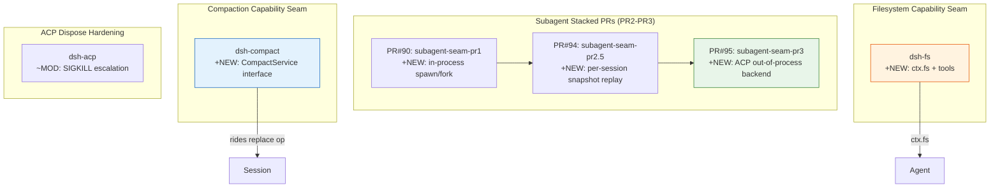

# Architecture Evolution & Design Log · 2026-06-22

> **Commits:** 39 · **PRs landed:** #36, #79, #90–#95
> **核心主题：** Subagent 重构与 PR2-PR3 交付、Compaction Capability Seam、Filesystem Capability Seam、ACP Dispose 加固

---

## 1. 每日架构演进图

> 本图反映当日最重要的架构演进路径和设计拓扑。



---

## 2. 设计模式与重构

### 2.1 Subagent In-Process Backends (PR2)

**Commit:** `7aabd2a3df`

引入两种 in-process subagent 后端：
- **Spawn**：创建全新 child agent，fresh context
- **Fork**：基于 seed 创建 child agent，继承 parent 的 session 历史

**设计要点**：
- `dsh-subagent-inprocess` 提取共享 in-process driver
- Fork 的 seed boundary 确保 child replay 路由正确（`b3d40d427e`）
- `dsh-subagent-mock` 保留为 keyless 测试用

### 2.2 Per-Session Snapshot Replay (PR2.5)

**Commit:** `e68496fd79`

为 nested agents 添加 per-session snapshot replay 能力。

**设计要点**：
- Fork-child 的 replay 路由需要 seed boundary 持久化
- `b3d40d427e` 将 seed boundary 持久化，确保 fork-child replay 路由正确

### 2.3 ACP Out-of-Process Backend (PR3)

**Commit:** `f393043b03`

ACP subagent backend 通过 out-of-process delegation 实现跨进程 agent 托管。

**设计要点**：
- ACP child 有独立的进程生命周期
- EOF grace window 让 child 优雅退出（`4565161c64`）
- SIGKILL escalation 作为最后手段（`6801130f8c`）
- Pre-aborted signal 跳过 spawn（`6801130f8c`）

### 2.4 Compaction Capability Seam

**Commit:** `e45053f0f5`

引入 `CompactService` 抽象接口，定义上下文压缩的能力边界。

**设计要点**：
- Compaction rides the replace op on an existing event type
- Abstract interface 允许不同 compaction 策略的实现
- 为后续 compact-basic 后端奠定基础

### 2.5 Filesystem Capability Seam

**Commit:** `5e01564afb`

引入 `ctx.fs` filesystem 能力和相关 tools。

**设计要点**：
- Filesystem 是 agent 的基础能力之一
- 与 tool-bash 的 workdir 解析互补

### 2.6 ACP Dispose 加固

**Commits:** `6801130f8c`, `4565161c64`, `2ff112962b`

ACP dispose 状态机增加多层防御：

```
dispose() → EOF grace (让 child quiesce)
         → SIGTERM (强制终止)
         → SIGKILL escalation (最后手段)
         → skip spawn when pre-aborted
```

**设计要点**：
- EOF grace window 宽度超过 nested-teardown headroom
- SIGTERM rung 被证明可达（`2ff112962b`）
- Pre-aborted signal 跳过 spawn 避免不必要的资源分配

---

## 3. 特性交付与系统影响

### 3.1 Subagent Stacked PR 完整交付

| PR | 关键变更 | 系统影响 |
|---|---|---|
| PR#90 (PR1) | In-process spawn/fork backends | 基础 subagent 执行能力 |
| PR#94 (PR2.5) | Per-session snapshot replay | Nested agents 的确定性测试 |
| PR#95 (PR3) | ACP out-of-process backend | 跨进程 agent 托管 |

**堆叠依赖**：PR1 → PR2.5 → PR3

### 3.2 Compaction Interface

`CompactService` 接口定义了：
- 上下文压缩的触发条件
- 压缩结果的返回格式
- 与现有 event type 的集成方式

**系统影响**：为后续 compact-basic 后端和 compaction 策略提供统一抽象。

### 3.3 Filesystem Tools

`ctx.fs` 提供了 agent 的文件系统访问能力，与 tool-bash 的 workdir 解析互补。

### 3.4 ACP Dispose Hardening

多层 dispose 防御确保 ACP child 进程的可靠终止，防止 zombie 进程。

---

## 4. 架构决策与 Roadmap 对齐

### 4.1 In-Process vs Out-of-Process Subagent

**决策**：同时支持 in-process（spawn/fork）和 out-of-process（ACP）两种 subagent 模式。

**理由**：
- In-process：低延迟、共享 memory、适合简单 delegation
- Out-of-process：隔离性、容错性、适合 untrusted code

**替代方案**：仅支持 out-of-process（如 Docker-based）。

### 4.2 Compaction Rides Existing Event Type

**决策**：Compaction 使用现有的 event type 进行 replace op，而非引入新的 event type。

**理由**：减少 event type 膨胀，保持 session log 的简洁性。

### 4.3 ACP Dispose Multi-Layer Defense

**决策**：ACP dispose 使用三层防御（EOF grace → SIGTERM → SIGKILL）。

**理由**：Child 进程可能无法响应 EOF，需要 escalate 到更强的终止信号。

---

## 5. 开发者/架构师决策推断

### 5.1 开发者意图重建

**思维模型**：开发者在这一天的脑中系统画面是：
- Subagent 需要完整的执行能力（in-process + out-of-process）
- Compaction 需要统一的抽象接口
- Filesystem 是 agent 的基础能力
- ACP dispose 需要多层防御以确保可靠性

**优先级排序**：
1. Subagent stacked PR 完整交付 — 核心功能
2. Compaction interface — 为后续 compaction 后端奠定基础
3. Filesystem tools — 基础能力
4. ACP dispose hardening — 可靠性保障

**有意取舍**：
- Subagent 优先交付 in-process 后端，out-of-process 在后续 PR
- Compaction 保持抽象接口，具体实现推迟
- ACP dispose 的 EOF grace 宽度选择了"宁可过宽不可过窄"

### 5.2 架构师决策推断

**模块拆分粒度**：
- Subagent 被拆分为多个包（inprocess、mock、acp），遵循"每个 transport 一个包"的原则
- Compaction 保持单一抽象接口，具体实现推迟到后续 PR

**抽象层引入时机**：
- Compaction 在 subagent 之后引入，因为 subagent 的 session replay 依赖 compaction
- Filesystem 在 tool-bash 之后引入，因为两者有互补关系

**后续影响**：
- Subagent stacked PR 为 multi-agent orchestration 打开了门
- Compaction interface 为后续 compaction 策略奠定基础
- ACP dispose hardening 提升了系统的可靠性

### 5.3 Code Review 视角

**首先关注的变更**：`f393043b03`（ACP out-of-process backend）— 这是当日最复杂的变更。

**会提出的问题**：
1. ACP child 的 EOF grace window 宽度是否足够？
2. SIGKILL escalation 是否有 fallback 策略？
3. Fork 的 seed boundary 持久化是否影响性能？

**做得好的地方**：
- Subagent stacked PR 有清晰的级联依赖关系
- ACP dispose 有多层防御，考虑了 edge cases
- Compaction 保持抽象接口，避免过早实现

**可以改进的地方**：
- Subagent 的 in-process 后端可能需要更多 edge case 覆盖
- Filesystem tools 的安全模型需要明确

---

## 6. 技术债务与风险评估

### 6.1 已知风险

| 风险 | 等级 | 描述 |
|------|------|------|
| ACP dispose EOF grace 过宽 | 中 | 可能导致不必要的延迟 |
| Fork seed boundary 持久化 | 低 | 可能影响性能 |
| Filesystem tools 安全模型 | 中 | 需要明确 access control |

### 6.2 建议的下一步

1. **Subagent**：继续推进 snapshot replay 的 edge case 覆盖
2. **Compaction**：实现 compact-basic 后端
3. **Filesystem**：明确 access control 策略
4. **ACP dispose**：监控 EOF grace 的实际效果

---

*Generated: 2026-06-22 · Commits analyzed: 39 · PRs landed: 6*
