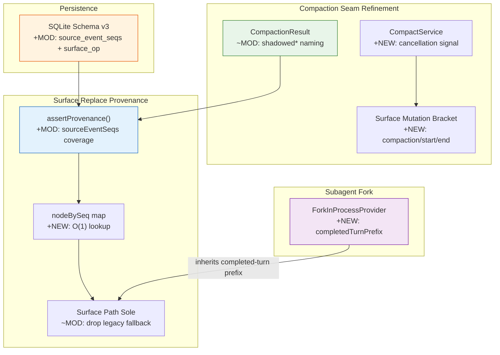

# Architecture Evolution & Design Log · 2026-06-23

> **Commits:** 23 · **PRs landed:** #90, #92, #94, #95, #100, #101
> **核心主题：** Compaction Surface 重构（shadowed* 命名、Cancellation Signal、Mutation Bracketing）、Surface Replace Provenance 强制执行、SQLite Schema v3、Subagent Fork 场景

---

## 1. 每日架构演进图

> 本图反映当日最重要的架构演进路径和设计拓扑。

---

## 2. 设计模式与重构

### 2.1 Shadowed* 命名对齐

将 compaction seam 的返回值统一为 `shadowedSeqs` / `shadowedRange` / `shadowedTokenCount` 三元组。

**设计推理**：compaction 本质上是 surface replace 操作——summary 节点 **shadow**（遮蔽/替代）了一组表面节点。`shadowed*` 比 `replaced*` 更精确：replace 是操作语义，shadow 是结果语义。

### 2.2 Cancellation Signal 注入

在 `CompactionEngine.compactRegion` 和 `compactNow` 的签名中加入可选 `AbortSignal` 参数。

**设计推理**：compaction 是长时间运行的摘要 LLM 调用，若用户在摘要期间取消，必须及时中止 LLM 请求以释放 KV-cache。使用 `AbortSignal.any()` 合并两个独立的 abort 来源（agent 生命周期 + compaction 请求）。

### 2.3 Surface Mutation Bracketing

用 `compaction/start` → `compaction/summary` → `compaction/end` 事件对将 surface mutation **括住**。

**设计推理**：
1. **锁语义** — `compaction/start` 是 durable lock，阻止并发 compact
2. **事务边界** — 异常时 `compaction/end` 带 error 字段标记失败
3. **UI 关联** — trajectory UI 通过 `eventCompactionId()` 关联四元组

### 2.4 Surface Replace Provenance 强制执行

`assertProvenance()` 强制要求 `sourceEventSeqs ⊇ shadowedSeqs`。

**设计推理**：`sourceEventSeqs` 是 replace event 对历史的 provenance 声明。若遗漏某个 shadowed seq，该 seq 对应的消息将永久消失，造成对话历史的不可逆丢失。

### 2.5 NodeBySeq Map 性能优化

将 `SurfaceManager._replace` 中的 `indexOf` 线性查找替换为 `Map<number, number>` 的 O(1) 查找。

**性能影响**：对话长度 > 1000 节点时，replace 操作从 O(n) 降至 O(1)。

### 2.6 Session Surface 成为唯一 Derivation 路径

移除 `deriveMessages()` 中对 legacy fallback 的依赖，surface 成为 LLM message history 的 sole derivation path。

---

## 3. 特性交付与系统影响

### 3.1 Compaction Interface 完善

| 组件 | 变更 | 系统影响 |
|------|------|----------|
| `shadowed*` naming | CompactionResult 字段重命名 | 降低认知摩擦 |
| Cancellation signal | AbortSignal 参数注入 | 支持用户取消 |
| Mutation bracketing | compaction/start/end 事件对 | 原子可识别的 replace 操作 |

### 3.2 Surface Replace Provenance

| 组件 | 变更 | 系统影响 |
|------|------|----------|
| `assertProvenance()` | 强制 sourceEventSeqs 覆盖 | 防止消息永久丢失 |
| `nodeBySeq` map | O(1) replace 定位 | 性能优化 |
| Sole derivation path | 移除 legacy fallback | 语义完整性 |

### 3.3 SQLite Schema v3

新增 `source_event_seqs` 和 `surface_op` 两列，支持 surface replace 的持久化。

### 3.4 Subagent Fork 场景

`ForkInProcessProvider` 使用 `completedTurnPrefix()` 截取父 agent 的已完成 turn 历史作为 seed。

---

## 4. 架构决策与 Roadmap 对齐

### 4.1 Shadowed vs Replaced 命名

**决策**：使用 `shadowed*` 而非 `replaced*`。

**理由**：shadow 是结果语义（summary 遮蔽了哪些节点），replace 是操作语义（执行了什么操作）。结果语义对消费者更直观。

### 4.2 SourceEventSeqs 必须完全覆盖

**决策**：`assertProvenance()` 强制 `sourceEventSeqs ⊇ shadowedSeqs`。

**理由**：防止消息永久丢失。compaction 实现必须精确计算被替换范围。

### 4.3 SQLite Reject-and-Rebuild

**决策**：非当前版本的数据库直接拒绝打开，要求用户重建。

**理由**：Pre-release stance — 正确性优先于兼容性。首次 tagged release 前必须实现 migration。

---

## 5. 开发者/架构师决策推断

### 5.1 开发者意图重建

**思维模型**：
- Compaction 需要精确的 provenance 追踪，防止消息丢失
- Surface replace 操作需要原子可识别的事务边界
- 性能优化（nodeBySeq）为长对话场景奠定基础

**优先级排序**：
1. Provenance 强制执行 — 正确性保障
2. Mutation bracketing — 可观测性
3. Naming alignment — 认知一致性
4. Performance optimization — 可扩展性

### 5.2 架构师决策推断

**抽象层引入时机**：
- Compaction 在 subagent 之后引入，因为 subagent 的 session replay 依赖 compaction
- Surface 成为 sole derivation path 是在 provenance 强制执行之后，确保语义完整性

**后续影响**：
- Provenance 不变式为后续的 compaction 审计奠定基础
- Sole derivation path 为后续的 surface replace 扩展提供了 clean 语义基础

---

## 6. 技术债务与风险评估

### 6.1 已知风险

| 风险 | 等级 | 描述 |
|------|------|------|
| SQLite schema reject-and-rebuild | 低 | Pre-release 可接受，首次 release 前需 migration |
| Fork in-process 测试覆盖 | 中 | 需补充 edge case 测试 |
| Cancellation signal 的 race condition | 低 | AbortSignal.any() 已处理 |

### 6.2 建议的下一步

1. **Compaction**：验证 summary 质量审计的可行性
2. **Surface**：监控 sole derivation path 的稳定性
3. **SQLite**：制定 migration plan 或明确 reject policy
4. **Subagent Fork**：补充 edge case 测试

---

*Generated: 2026-06-23 · Commits analyzed: 23 · PRs landed: 6*
