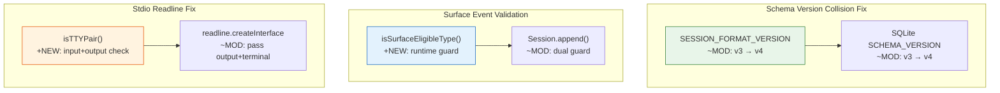

# Architecture Evolution & Design Log · 2026-06-24

> **Commits:** 3 · **PRs landed:** #61
> **核心主题：** SCHEMA_VERSION 碰撞修复、Surface Event 运行时校验、Stdio Readline 终端检测

---

## 1. 每日架构演进图

> 本图反映当日最重要的架构演进路径和设计拓扑。

---

## 2. 设计模式与重构

### 2.1 SCHEMA_VERSION 碰撞修复

**问题**：两个合并父节点各自发布 `SCHEMA_VERSION=3`，但分别对应不同布局（`seed_length` 与 surface 列）。磁盘上版本号 3 语义歧义。

**方案**：将 `SESSION_FORMAT_VERSION` 提升至 4，代表合并后的统一布局。版本检查拒绝两个已废弃的 v3 格式。

**架构意义**：版本号是持久化层的唯一契约标识符。合并功能分支时必须同步验证版本号单调递增且语义唯一。

### 2.2 Surface Event 运行时校验

**问题**：`SessionEvent` 的 `surfaceOp` 标记仅在类型参数为字面量类型时被 TypeScript 强制。联合类型拓宽导致条件 rest 参数退化为可选，编译器不再校验。

**方案**：
- 运行时在 `append()` 和种子构造函数中增加双重守卫
- 导出 `isSurfaceEligibleType()` 辅助函数
- 种子 fixture 显式携带 `surfaceOp`

**架构意义**：编译时类型守卫与运行时守卫不能互换——集合类型拓宽是 TypeScript 的已知缺口。关键路径校验必须在两个层面同时存在。

### 2.3 Stdio Readline 终端检测修复

**问题**：`createInterface()` 仅接收 `input`，未传入 `output` 和 `terminal` 选项。在非 TTY 环境下 readline 无法正确判断行编辑模式。

**方案**：引入 `isTTYPair(input, output)` 辅助函数，同时检查输入输出流的 `isTTY` 属性。

**架构意义**：Readline 的终端检测需要完整的输入输出对信息。单流判断不足以覆盖管道场景。

---

## 3. 特性交付与系统影响

### 3.1 Schema Version Bump

| 组件 | 变更 | 系统影响 |
|------|------|----------|
| `SESSION_FORMAT_VERSION` | v3 → v4 | 拒绝旧格式 |
| SQLite `SCHEMA_VERSION` | v3 → v4 | 拒绝旧 schema |

### 3.2 Surface Event Validation

| 组件 | 变更 | 系统影响 |
|------|------|----------|
| `isSurfaceEligibleType()` | 新增 runtime guard | 防止无标记事件泄漏 |
| `Session.append()` | 双重守卫 | 编译时 + 运行时 |

### 3.3 Readline Terminal Detection

| 组件 | 变更 | 系统影响 |
|------|------|----------|
| `isTTYPair()` | 新增 input+output 检查 | 正确判断行编辑模式 |
| `createInterface()` | 传递 output+terminal | 修复管道场景 |

---

## 4. 架构决策与 Roadmap 对齐

### 4.1 Version Bump Strategy

**决策**：碰撞后直接 bump 到 v4，拒绝旧格式。

**理由**：Pre-release stance — 正确性优先于兼容性。没有外部消费者，无需 migration shim。

### 4.2 Dual Guard Pattern

**决策**：编译时 + 运行时双重守卫。

**理由**：TypeScript 的集合类型拓宽是已知缺口，关键路径必须在两个层面同时存在。

### 4.3 Input+Output TTY Check

**决策**：`isTTYPair()` 同时检查输入输出流。

**理由**：管道场景（输入为 TTY、输出为管道）需要完整上下文。

---

## 5. 开发者/架构师决策推断

### 5.1 开发者意图重建

**思维模型**：
- 合并分支时版本号碰撞需要立即修复
- TypeScript 类型系统的缺口需要运行时回补
- Readline 终端检测需要完整上下文

**优先级排序**：
1. Version bump — 防止数据损坏
2. Runtime guard — 防止消息丢失
3. Readline fix — 修复用户体验

### 5.2 架构师决策推断

**后续影响**：
- Version bump 为首次 tagged release 前的 format 稳定性奠定基础
- Runtime guard 模式可复用到其他关键路径
- Readline fix 为后续 CLI 改进提供参考

---

## 6. 技术债务与风险评估

### 6.1 已知风险

| 风险 | 等级 | 描述 |
|------|------|------|
| Schema v4 拒绝旧数据 | 低 | Pre-release 可接受 |
| Runtime guard 性能开销 | 低 | 仅在 append 时检查 |

### 6.2 质量门禁

全部通过：typecheck、test（1115）、snapshot（14）、doc-sync、lint、build、hygiene。

---

*Generated: 2026-06-24 · Commits analyzed: 3 · PRs landed: 1*
