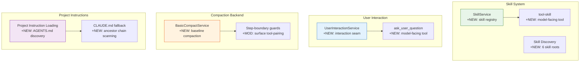

# Architecture Evolution & Design Log · 2026-06-25

> **Commits:** 7 · **核心主题：** Skill Discovery & Loading、ask_user_question 交互工具、compact-basic 后端、Project Instruction 加载

---

## 1. 每日架构演进图

---

## 2. 设计模式与重构

### 2.1 Skill Discovery & Loading

引入 `SkillService` 作为 skill registry，支持 6 个 skill roots 的发现和加载。

**设计要点**：
- `tool-skill` 是 model-facing tool，agent 通过它请求 skill
- Progressive disclosure 通过 `agent/request` waterfall 实现
- Skill roots 包括本地文件系统、内置 skills 等

### 2.2 User Interaction Tool

引入 `UserInteractionService` 作为 interaction seam，`ask_user_question` 是 model-facing tool。

**设计要点**：
- Single-provider constraint：一个 provider 实现交互逻辑
- Abort signal propagation：用户取消时及时中止
- 与 approval/interaction 系统互补

### 2.3 compact-basic Backend

引入 `BasicCompactService` 作为 baseline compaction 后端。

**设计要点**：
- Step-boundary guards：通过 surface tool-pairing 强制步对齐
- Structured summarization prompt：结构化摘要提示
- Fail-closed truncation：失败时回退到截断

### 2.4 Project Instruction Loading

引入 `AGENTS.md` 发现机制，支持 `CLAUDE.md` fallback 和 ancestor chain scanning。

**设计要点**：
- 64KB byte budget：限制指令文件大小
- Ancestor chain scanning：向上扫描目录树
- 与 cordis.yml 的 plugin config 互补

---

## 3. 特性交付与系统影响

### 3.1 Skill System

| 组件 | 路径 | 角色 |
|------|------|------|
| `SkillService` | `packages/skill/skill/` | Service Definition |
| `tool-skill` | `packages/skill/tool-skill/` | Model-facing tool |

**系统影响**：Agent 可以发现和加载 skills，扩展能力边界。

### 3.2 User Interaction

| 组件 | 路径 | 角色 |
|------|------|------|
| `UserInteractionService` | `packages/interaction/interaction/` | Service Definition |
| `ask_user_question` | `packages/interaction/interaction/` | Model-facing tool |

**系统影响**：Agent 可以向用户提问，获取交互式输入。

### 3.3 Compaction Backend

| 组件 | 路径 | 角色 |
|------|------|------|
| `BasicCompactService` | `packages/compaction/compaction-basic/` | Service Provider |

**系统影响**：提供 baseline compaction 能力，支持上下文压缩。

### 3.4 Project Instructions

| 组件 | 路径 | 角色 |
|------|------|------|
| Project Instruction Loading | `packages/context/` | Context provider |

**系统影响**：Agent 可以发现和加载项目指令文件。

---

## 4. 架构决策与 Roadmap 对齐

### 4.1 Skill Discovery via Waterfall

**决策**：使用 `agent/request` waterfall 实现 progressive disclosure。

**理由**：Skills 需要按需加载，waterfall 允许拦截和过滤。

### 4.2 Single-Provider Interaction

**决策**：`UserInteractionService` 使用 single-provider constraint。

**理由**：交互逻辑需要统一的 UI 体验，多 provider 会导致不一致。

### 4.3 Fail-Closed Compaction

**决策**：`BasicCompactService` 使用 fail-closed truncation。

**理由**：Compaction 失败时，截断比静默丢失更安全。

---

## 5. 开发者/架构师决策推断

### 5.1 开发者意图重建

**思维模型**：
- Agent 需要发现和加载外部能力（skills）
- Agent 需要与用户交互获取输入
- Compaction 需要 baseline 实现
- 项目指令需要自动发现

**优先级排序**：
1. Skill discovery — 扩展 agent 能力边界
2. User interaction — 支持交互式场景
3. Compaction backend — 基础功能
4. Project instructions — 上下文增强

### 5.2 架构师决策推断

**后续影响**：
- Skill system 为后续 skill catalog 和 marketplace 奠定基础
- User interaction 为后续 approval/interaction 流程提供基础
- Compaction backend 为后续 compaction 策略提供参考实现

---

## 6. 技术债务与风险评估

### 6.1 已知风险

| 风险 | 等级 | 描述 |
|------|------|------|
| Skill discovery 的 6 roots 可能不够 | 低 | 需要监控实际使用 |
| ask_user_question 的 abort 语义 | 中 | 需要确保用户取消时正确清理 |
| Compaction 的 fail-closed 可能过于激进 | 低 | 需要监控实际效果 |

---

*Generated: 2026-06-25 · Commits analyzed: 7*
