# Architecture Evolution & Design Log · 2026-06-26

> **Commits:** 28 · **PRs landed:** #49, #97
> **核心主题：** Web Capability Seam、Filesystem Seam 拆分、Compaction 修复、中文术语表

---

## 1. 每日架构演进图

```mermaid
graph TD
    subgraph "Web Capability Seam"
        CW["ctx.web<br/>+NEW: unified search/fetch"]
        SP["search/fetch providers<br/>+NEW: exa, perplexity"]
        WT["web tools<br/>+NEW: model-facing"]
    end

    subgraph "Filesystem Seam Split"
        FS["ctx.fs<br/>~MOD: provider contract"]
        FC["ctx.fileContext<br/>+NEW: policy/event gate"]
        EVT["fs/* events<br/>+NEW: observation channel"]
    end

    subgraph "Compaction Fixes"
        TE["threshold-equality<br/>+FIX: reject equal"]
        SA["step-alignment<br/>+FIX: tool-pairing boundary"]
        PS["pre-step pressure<br/>+FIX: stress check"]
    end

    subgraph "Documentation"
        CT["Chinese terminology<br/>+NEW: i18n table"]
    end

    CW --> SP --> WT
    FS --> FC --> EVT
    TE --> SA --> PS

    style CW fill:#e8f5e9,stroke:#2e7d32
    style FS fill:#e3f2fd,stroke:#1565c0
    style TE fill:#fff3e0,stroke:#e65100
    style CT fill:#f3e5f5,stroke:#7b1fa2
```

---

## 2. 设计模式与重构

### 2.1 Web Capability Seam

引入 `ctx.web` 作为统一的搜索/抓取能力入口，6 个包组成完整 capability seam。

**设计要点**：
- Provider-selection 不依赖注册顺序
- `available()` 禁止网络调用（纯检查）
- 与 bash/fs 互补，扩展 agent 的信息获取能力

### 2.2 Filesystem Seam 拆分

将 filesystem seam 拆分为四层架构：工具→策略(event gate)→provider contract→provider。

**设计要点**：
- 策略通过 `fs/*` 事件通信而非服务依赖
- 事件通道提供观测性
- Provider contract 与实现解耦

### 2.3 Compaction 修复

三个关键修复确保 compaction 的正确性：

1. **Threshold-equality rejection**：拒绝阈值等值配置，保持 compaction convergent
2. **Step-alignment via tool-pairing**：通过 tool-pairing 边界强制步对齐
3. **Pre-step pressure check**：在 compaction 前检查压力，避免不必要的触发

### 2.4 中文术语表

引入中英统一译法表，约定 seam/capability/compaction 等关键术语。

---

## 3. 特性交付与系统影响

### 3.1 Web Capability

| 组件 | 路径 | 角色 |
|------|------|------|
| `ctx.web` | `packages/web/web/` | Service Definition |
| exa/perplexity providers | `packages/web/` | Service Providers |
| web tools | `packages/web/tool-web/` | Model-facing tools |

**系统影响**：Agent 可以搜索和抓取网页，扩展信息获取能力。

### 3.2 Filesystem Split

| 组件 | 路径 | 角色 |
|------|------|------|
| `ctx.fs` | `packages/fs/fs/` | Provider contract |
| `ctx.fileContext` | `packages/fs/file-context/` | Policy/event gate |
| `fs/*` events | — | Observation channel |

**系统影响**：Filesystem 访问获得策略控制和观测性。

### 3.3 Compaction Fixes

| 修复 | 影响 |
|------|------|
| Threshold-equality | 防止无限循环 |
| Step-alignment | 确保 compaction 在正确边界触发 |
| Pre-step pressure | 避免不必要的 compaction |

---

## 4. 架构决策与 Roadmap 对齐

### 4.1 Web Seam Provider-Selection

**决策**：Provider-selection 不依赖注册顺序。

**理由**：确保 determinism，避免 provider 注册顺序影响行为。

### 4.2 Filesystem Event-Gate Policy

**决策**：Policy 通过事件通道通信，而非服务依赖。

**理由**：解耦 policy 和 provider，允许独立演进。

### 4.3 Compaction Convergent Guarantee

**决策**：拒绝阈值等值配置。

**理由**：确保 compaction 总是 convergent，防止无限循环。

---

## 5. 开发者/架构师决策推断

### 5.1 开发者意图重建

**思维模型**：
- Agent 需要统一的 web 访问能力
- Filesystem 需要策略控制和观测性
- Compaction 需要正确的边界和压力检查
- 文档需要中英统一术语

**优先级排序**：
1. Web capability — 信息获取能力
2. Filesystem split — 安全和观测性
3. Compaction fixes — 正确性
4. Terminology — 文档一致性

### 5.2 架构师决策推断

**后续影响**：
- Web seam 为后续 web scraping 和 search integration 奠定基础
- Filesystem split 为后续 access control 和 audit 提供框架
- Compaction fixes 确保系统稳定性

---

## 6. 技术债务与风险评估

### 6.1 已知风险

| 风险 | 答级 | 描述 |
|------|------|------|
| Web providers 的网络可靠性 | 中 | 需要 fallback 策略 |
| Filesystem event-gate 的性能 | 低 | 事件通道可能引入延迟 |
| Compaction pre-step 的准确性 | 低 | 需要监控误触发 |

---

*Generated: 2026-06-26 · Commits analyzed: 28 · PRs landed: 2*
