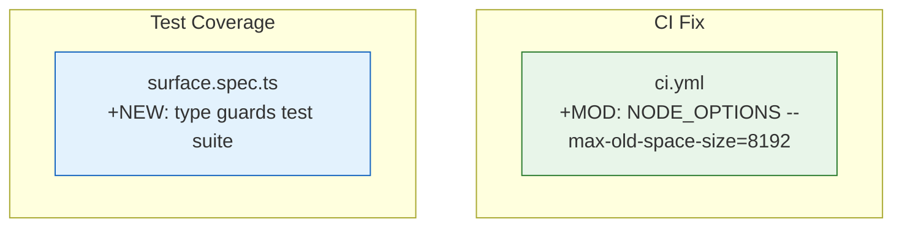

# Architecture Evolution & Design Log · 2026-06-27

> **Commits:** 2 (merge-only) · **核心主题：** CI Lint OOM 修复、Surface Type Guard 测试覆盖

---

## 1. 每日架构演进图

---

## 2. 设计模式与重构

### 2.1 CI Lint OOM 修复

**问题**：Type-aware ESLint 通过 project service 加载每个包的 tsconfig，峰值内存约 3.4 GB，而 V8 默认老生代上限约 2 GB，导致 OOM（退出码 134）。

**方案**：lint 步骤显式设置 `NODE_OPTIONS: --max-old-space-size=8192`。

**架构意义**：项目规模增长带来的基础设施压力。该修复方案是标准做法，但暗示需要监控包数量增长。

### 2.2 Surface Type Guard 测试覆盖

**问题**：`isSurfaceEligibleType` 和 `isSurfaceEvent` 两个运行时类型守卫缺少测试覆盖。

**方案**：新增 `surface type guards` 测试套件，覆盖：
- 仅消息产出类型返回 `true`
- 边界事件返回 `false`
- 缺少 `surfaceOp` 标记的事件被正确拒绝

**架构意义**：关闭 session 模块 surface 导出的测试覆盖率缺口。

---

## 3. 特性交付与系统影响

### 3.1 CI 可靠性

| 组件 | 变更 | 系统影响 |
|------|------|----------|
| `ci.yml` | 显式内存上限 | CI lint 恢复正常运行 |

### 3.2 测试覆盖

| 组件 | 变更 | 系统影响 |
|------|------|----------|
| `surface.spec.ts` | 新增 type guards 测试 | 覆盖率缺口关闭 |

---

## 4. 架构决策与 Roadmap 对齐

### 4.1 CI Memory Limit

**决策**：显式设置 `--max-old-space-size=8192`。

**理由**：标准做法，解决 V8 默认限制与项目内存需求的不匹配。

---

## 5. 开发者/架构师决策推断

### 5.1 开发者意图重建

**思维模型**：
- CI lint 因 OOM 失败需要立即修复
- Surface type guards 缺少测试覆盖需要补齐

**优先级排序**：
1. CI fix — 恢复 CI 正常运行
2. Test coverage — 关闭覆盖率缺口

---

## 6. 技术债务与风险评估

### 6.1 已知风险

| 风险 | 等级 | 描述 |
|------|------|------|
| CI lint OOM 可能再次出现 | 中 | 随包数量增长，需要监控 |
| compact-basic-refactor 分支合并 | 低 | 需要关注架构影响 |

---

*Generated: 2026-06-27 · Commits analyzed: 2*
