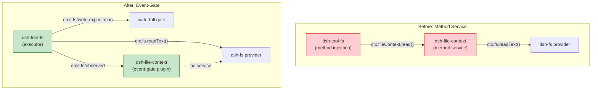

# Architecture Evolution & Design Log · 2026-06-28

> **Commits:** 6 · **核心主题：** Filesystem Tool 简化（Subpath Plugins 移除）、File-Context Event-Gate 反转、Single-TSConfig Build 适配

---

## 1. 每日架构演进图

---

## 2. 设计模式与重构

### 2.1 Event-Gate 反转

**问题**：`dsh-file-context` 原本是 method service，tool-fs 通过注入调用其方法。移除 file-context 会令 tool-fs 崩溃（service resolution 失败），而非降级。

**决策**：反转控制流 — tool-fs 成为 executor，file-context 变为 pure event-gate plugin。

**关键变化**：
- `dsh-tool-fs` 直接调用 `ctx.fs`，own read windowing，dispatch events
- `dsh-file-context` 通过 `ctx.on()` / `ctx.waterfall()` 监听事件，不再注册任何 service
- `ctx.fs` provider 的 version guard 变为 optional

**架构意义**：策略层与执行层解耦，移除 policy plugin 时系统降级而非崩溃。

### 2.2 Subpath Plugins 移除

**问题**：`tool-fs` 和 `tool-web` 有 subpath exports（`/read`, `/write`, `/edit`, `/search`, `/fetch`），但没有任何 consumer 使用这种粒度。

**决策**：移除所有 subpath exports，adopt single-root-plugin shape。

**关键变化**：
- `tool-fs`：exports 从 `{ ".": ..., "./read": ..., "./write": ..., "./edit": ... }` 简化为 `{ ".": ... }`
- `tool-web`：exports 从 `{ ".": ..., "./search": ..., "./fetch": ... }` 简化为 `{ ".": ... }`
- 删除 bespoke `tsdown.config.ts` 和 `subpaths.spec.ts`

**架构意义**：所有 tool packages 统一为 single-root-plugin shape，与 `tool-bash` 一致。

### 2.3 Single-TSConfig Build 适配

两个 fs package（`file-context/`, `fs-local/`）的 `package.json` 同步 adopt `"types": "./lib/types/index.d.ts"`，与仓库统一的 `lib/types` outDir convention 对齐。

---

## 3. 特性交付与系统影响

### 3.1 File-Context Event-Gate

| 组件 | 变更 | 系统影响 |
|------|------|----------|
| `dsh-tool-fs` | 成为 executor | 直接调用 `ctx.fs`，dispatch events |
| `dsh-file-context` | 变为 event-gate | 不再注册 service，通过事件通信 |
| `ctx.fs` | version guard optional | 无 policy 时为无条件 I/O |

### 3.2 Subpath Simplification

| 组件 | Before | After |
|------|--------|-------|
| `tool-fs` exports | 4 entries | 1 entry |
| `tool-web` exports | 3 entries | 1 entry |
| Bespoke tsdown configs | 2 | 0 |
| Subpath tests | 1 (83 lines) | 0 |

---

## 4. 架构决策与 Roadmap 对齐

### 4.1 Event-Gate vs Method Service

**决策**：File-context 从 method service 翻转为 event-gate plugin。

**理由**：Graceful degradation — 移除 policy plugin 时系统降级而非崩溃。策略是 deployment-varying concern，应为 additive overlay。

### 4.2 Subpath Removal

**决策**：移除所有 subpath exports，adopt single-root-plugin shape。

**理由**：没有 consumer 使用这种粒度，维护成本不成比例。`tool-bash` 证明了 config-level enablement 足以覆盖同一需求。

---

## 5. 开发者/架构师决策推断

### 5.1 开发者意图重建

**思维模型**：
- Filesystem 策略应为可选 overlay，而非 mandatory path
- Tool packages 应统一为 single-root-plugin shape
- 构建配置应尽可能简化

**优先级排序**：
1. Event-gate 反转 — 架构正确性
2. Subpath removal — 构建简化
3. Single-tsconfig adapt — 一致性

### 5.2 架构师决策推断

**后续影响**：
- Event-gate 模式可复用到其他 policy plugin
- Subpath removal 为后续 tool packages 建立统一 shape
- 构建简化降低了 contributor 的认知负担

---

## 6. 技术债务与风险评估

### 6.1 已知风险

| 风险 | 等级 | 描述 |
|------|------|------|
| File-context 降级行为 | 中 | 需要在 product docs 中明确标注 "unconstrained mode" |
| Edit tool prompt 改动 | 低 | 需要 snapshot 测试覆盖 |
| Workspace constraints gate | 低 | 需确认没有其他 multi-entry 包触发 gate |

---

*Generated: 2026-06-28 · Commits analyzed: 6*
