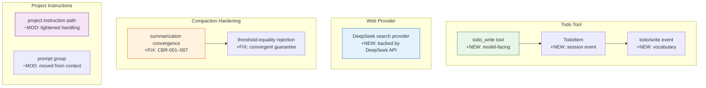

# Architecture Evolution & Design Log · 2026-06-29

> **Commits:** 30 · **PRs landed:** #116, #117
> **核心主题：** todo_write Tool、DeepSeek Web Search Provider、Compact-Basic 收敛性加固、Project Instruction Path Handling

---

## 1. 每日架构演进图

---

## 2. 设计模式与重构

### 2.1 todo_write Tool

引入 `todo_write` 作为 model-facing tool，支持 agent 管理 todo list。

**设计要点**：
- `TodoItem` 是 session event 词汇的一部分
- Whole-list replacement 语义：每次写入替换整个 todo list
- 与 `plan` tool 互补（plan 是 logged state，todo 是 model-facing）

### 2.2 DeepSeek Web Search Provider

引入 DeepSeek-backed web search provider，作为 `ctx.web` 的新 provider。

**设计要点**：
- 使用 DeepSeek API 进行搜索
- 与 exa/perplexity providers 共存
- Provider-selection 不依赖注册顺序

### 2.3 Compaction 收敛性加固

多个修复确保 compaction 的收敛性：

- **CBR-001**: step-alignment 通过 tool-pairing 边界强制
- **CBR-002**: threshold-equality rejection
- **CBR-003**: seam docs alignment
- **CBR-004**: stale comment fix
- **CBR-005**: surface-order JSDoc correction
- **CBR-006**: disposal to HMR-safety suite
- **CBR-007**: compaction e2e sizing

### 2.4 Project Instruction Path Handling

收紧 project instruction path handling，移动到 prompt group。

---

## 3. 特性交付与系统影响

### 3.1 Todo Tool

| 组件 | 路径 | 角色 |
|------|------|------|
| `todo_write` | `packages/todo/tool-todo/` | Model-facing tool |
| `TodoItem` | `packages/core/session/` | Session event vocabulary |

**系统影响**：Agent 可以管理 todo list，扩展任务管理能力。

### 3.2 Web Provider

| 组件 | 路径 | 角色 |
|------|------|------|
| DeepSeek search | `packages/web/` | Service Provider |

**系统影响**：Web 搜索获得新的 provider 选项。

### 3.3 Compaction Fixes

| 修复 | CBR | 影响 |
|------|-----|------|
| Step-alignment | CBR-001 | 正确边界触发 |
| Threshold-equality | CBR-002 | 防止无限循环 |
| Summarization convergence | CBR-007 | 确保收敛 |

---

## 4. 架构决策与 Roadmap 对齐

### 4.1 Whole-List Replacement for Todo

**决策**：Todo 使用 whole-list replacement 语义。

**理由**：简化实现，避免 partial update 的复杂性。Todo list 通常较小，whole-list replacement 的性能开销可接受。

### 4.2 Compaction Convergent Guarantee

**决策**：通过多个修复确保 compaction 总是 convergent。

**理由**：Compaction 是 session management 的核心，不收敛会导致无限循环或数据丢失。

---

## 5. 开发者/架构师决策推断

### 5.1 开发者意图重建

**思维模型**：
- Agent 需要 todo 管理能力
- Web 搜索需要更多 provider 选项
- Compaction 需要确保收敛性
- Project instructions 需要更严格的路径处理

**优先级排序**：
1. Todo tool — 功能交付
2. Compaction fixes — 正确性
3. Web provider — 能力扩展
4. Project instructions — 健壮性

### 5.2 架构师决策推断

**后续影响**：
- Todo tool 为后续 task management 奠定基础
- Compaction convergence 为后续 compaction 策略提供可靠基础
- Web provider 为后续 search integration 提供参考

---

## 6. 技术债务与风险评估

### 6.1 已知风险

| 风险 | 等级 | 描述 |
|------|------|------|
| Todo whole-list replacement 性能 | 低 | 大 list 时可能需要优化 |
| Compaction convergence 的 edge cases | 中 | 需要监控实际使用 |
| Web provider 的网络可靠性 | 中 | 需要 fallback 策略 |

---

*Generated: 2026-06-29 · Commits analyzed: 30 · PRs landed: 2*
