# Architecture Evolution & Design Log · 2026-06-30

> **Commits:** 20 · **核心主题：** Event Interception Seams（typed-Decision for Hooks）、Session Fork Service、Bash Trusted-Plugin Surface、Subagent Lifecycle Enrichment

---

## 1. 每日架构演进图

```mermaid
graph TD
    subgraph "Event Interception"
        IS["typed-Decision surface<br/>+NEW: interception seams"]
        TK["5 interception points<br/>+NEW: compile-time checkable"]
    end

    subgraph "Session Fork"
        SF["session fork service<br/>+NEW: child agent history snapshot"]
        FE["fork errors<br/>+FIX: classification + stabilization"]
    end

    subgraph "Bash Surface"
        BS["stdin + extra env<br/>+NEW: trusted-plugin surface"]
    end

    subgraph "Subagent Lifecycle"
        SL["subagent/start + end<br/>+MOD: enriched lifecycle events"]
        SC["structuredClone<br/>+FIX: observe-only protection"]
    end

    subgraph "Compaction"
        CC["compaction convergence<br/>+FIX: pre-step cancellation"]
        CS["session ids<br/>+FIX: stamp summarization"]
    end

    IS --> TK
    SF --> FE
    SL --> SC

    style IS fill:#e8f5e9,stroke:#2e7d32
    style SF fill:#e3f2fd,stroke:#1565c0
    style BS fill:#fff3e0,stroke:#e65100
    style SL fill:#f3e5f5,stroke:#7b1fa2
```

---

## 2. 设计模式与重构

### 2.1 Event Interception Seams

引入 typed-Decision surface 作为 hooks 的拦截点，5 个拦截点统一为编译时可检查的 Decision 类型。

**设计要点**：
- Session/agent/tools 事件域从惯例上升为显式约束
- Decision 联合体在编译时可检查
- 与 Claude Code/Codex hook 协议对齐

### 2.2 Session Fork Service

引入 session fork service，支持子 agent 的历史快照启动。

**设计要点**：
- Fork errors 被分类和稳定化
- 子 agent 继承父的 completed-turn prefix
- 与 subagent fork-in-process 互补

### 2.3 Bash Trusted-Plugin Surface

在 bash executor seam 上添加 stdin + extra env 作为 trusted-plugin surface。

**设计要点**：
- 通过调用方语义区分而非包边界
- Trusted plugins 可以传递 stdin 和额外环境变量
- 与 owner token 互补

### 2.4 Subagent Lifecycle Enrichment

丰富 subagent/start + subagent/end 生命周期事件，添加 structuredClone 保护 observe-only 契约。

**设计要点**：
- structuredClone 保护异步 detached 路径的只读契约
- Lifecycle events 从 observe-only 开始
- 与 subagent tool bridge 互补

### 2.5 Compaction Convergence

修复 pre-step cancellation 和 compaction convergence，stamp summarization session ids。

**设计要点**：
- Pre-step cancellation 确保 compaction 在正确边界触发
- Session ids stamp 确保 summarization 可追溯
- 与 CBR-001~007 修复互补

---

## 3. 特性交付与系统影响

### 3.1 Event Interception

| 组件 | 路径 | 角色 |
|------|------|------|
| typed-Decision | `packages/hooks/` | Interception surface |

**系统影响**：Hooks 获得编译时可检查的拦截点。

### 3.2 Session Fork

| 组件 | 路径 | 角色 |
|------|------|------|
| session fork service | `packages/session/` | Fork provider |

**系统影响**：子 agent 可以继承父的历史快照。

### 3.3 Bash Surface

| 组件 | 路径 | 角色 |
|------|------|------|
| stdin + extra env | `packages/shell/bash/` | Trusted-plugin surface |

**系统影响**：Trusted plugins 可以传递 stdin 和额外环境变量。

### 3.4 Subagent Lifecycle

| 组件 | 路径 | 角色 |
|------|------|------|
| enriched events | `packages/subagent/` | Lifecycle observability |

**系统影响**：Subagent 获得更丰富的生命周期事件。

---

## 4. 架构决策与 Roadmap 对齐

### 4.1 Typed-Decision for Hooks

**决策**：使用 typed-Decision surface 作为 hooks 的拦截点。

**理由**：编译时可检查，与 Claude Code/Codex hook 协议对齐。

### 4.2 Session Fork Service

**决策**：引入 session fork service 支持子 agent 历史快照。

**理由**：Subagent 需要继承父的对话上下文，fork 提供了这种能力。

### 4.3 Trusted-Plugin Surface

**决策**：通过调用方语义区分而非包边界。

**理由**：保持灵活性，trusted plugins 可以在不修改包边界的情况下传递 stdin 和环境变量。

---

## 5. 开发者/架构师决策推断

### 5.1 开发者意图重建

**思维模型**：
- Hooks 需要编译时可检查的拦截点
- Subagent 需要继承父的历史
- Bash 需要支持 trusted plugins 的 stdin/env
- Subagent lifecycle 需要更丰富的事件

**优先级排序**：
1. Event interception — 架构基础
2. Session fork — 功能交付
3. Bash surface — 能力扩展
4. Subagent lifecycle — 可观测性

### 5.2 架构师决策推断

**后续影响**：
- Event interception 为后续 hook 系统提供统一抽象
- Session fork 为后续 multi-agent orchestration 奠定基础
- Bash surface 为后续 trusted plugin 扩展提供框架

---

## 6. 技术债务与风险评估

### 6.1 已知风险

| 风险 | 等级 | 描述 |
|------|------|------|
| Session fork error classification | 低 | 需要监控实际使用 |
| structuredClone 性能 | 低 | 大 session 时可能需要优化 |
| Pre-step cancellation race condition | 中 | 需要确保正确边界 |

---

*Generated: 2026-06-30 · Commits analyzed: 20*
