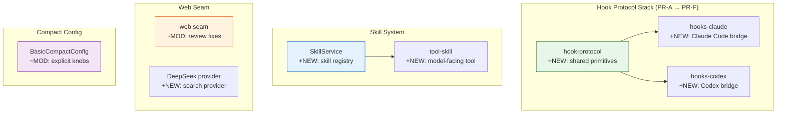
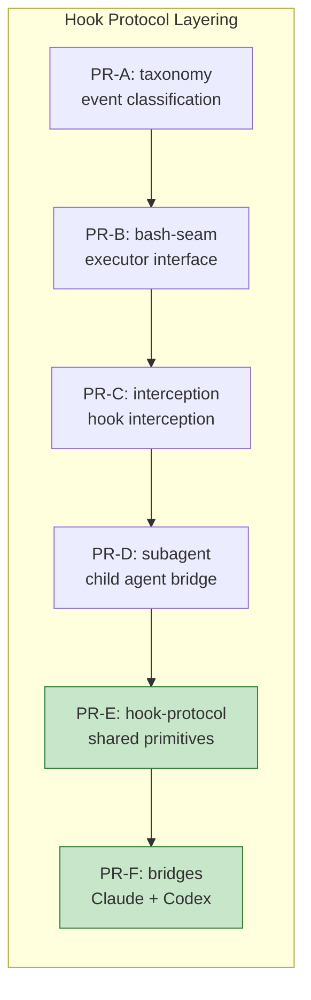

# Architecture Evolution & Design Log · 2026-07-01

> **Commits:** 40 · **核心主题：** Hook 协议栈（PR-A 到 PR-F）、Skill 系统、Web Seam 审查、Compact 配置重构、中文术语国际化

---

## 1. 每日架构演进图

> 本图反映当日最重要的架构演进路径和设计拓扑。

---

## 2. 设计模式与重构

### 2.1 Hook Protocol 分层架构

将 Claude Code 和 Codex 共享的协议逻辑提取为独立库 `dsh-hook-protocol`，每个桥接插件仅实现方言特定部分。

**核心组件**：
- **Matcher**：统一匹配器，支持 `claude`（字面量/正则）和 `codex`（始终正则）两种模式
- **Codec**：解码器，将 exit code + stdout 转换为中立 `HookOutput`
- **Runner**：执行器，通过 `ctx.bash` 运行命令钩子
- **Merge**：合并器，实现 `deny > ask > allow` 的最严格折叠
- **Detached Runs**：异步跟踪，确保 fiber.dispose() 时无残留钩子工作

**架构约束**：协议库是纯库，不注册/注入任何内容。桥接插件导入并使用这些原语。

### 2.2 Skill 能力接缝

Skill 系统保持在核心控制脊柱之外，可使用本地、嵌入式或远程提供者。

**设计原则**：不改变模型面向的契约，Skill 发现和加载是可选 overlay。

### 2.3 Compact 显式配置

除 `auto` 外，所有 `BasicCompactConfig` 键必须显式指定。

**理由**：目前没有数据证明默认阈值/预算的合理性，消费者应声明每个值。

---

## 3. 特性交付与系统影响

### 3.1 Hook Protocol Stack

| PR | 组件 | 角色 |
|----|------|------|
| PR-A | taxonomy | 事件分类 |
| PR-B | bash-seam | 执行器接口 |
| PR-C | interception | 钩子拦截 |
| PR-D | subagent | 子代理桥接 |
| PR-E | hook-protocol | 共享原语 |
| PR-F | hooks-claude/codex | 桥接实现 |

**系统影响**：Claude Code 和 Codex 的 hook 集成获得统一协议层。

### 3.2 Skill System

| 组件 | 路径 | 角色 |
|------|------|------|
| `SkillService` | `packages/skill/skill/` | Service Definition |
| `tool-skill` | `packages/skill/tool-skill/` | Model-facing tool |

**系统影响**：Agent 可以发现和加载 skills，扩展能力边界。

### 3.3 Web Seam Fixes

| 组件 | 变更 | 系统影响 |
|------|------|----------|
| Web seam | Review fixes | 边界条件处理改进 |
| DeepSeek provider | New | 搜索提供者扩展 |

### 3.4 Compact Config

| 组件 | 变更 | 系统影响 |
|------|------|----------|
| `BasicCompactConfig` | Explicit knobs | 配置透明度提升 |

---

## 4. 架构决策与 Roadmap 对齐

### 4.1 Hook Protocol 分层

**决策**：将共享协议逻辑提取为独立库。

**理由**：避免 Claude Code 和 Codex 间的代码重复，减少维护成本。

**替代方案**：每个桥接插件独立实现协议逻辑。

### 4.2 Explicit Compact Config

**决策**：除 `auto` 外，所有配置键必须显式指定。

**理由**：防止默认值掩盖真实需求，提高配置透明度。

**替代方案**：保留合理默认值。

### 4.3 Skill Externalization

**决策**：Skill 系统保持在核心脊柱之外。

**理由**：保持核心脊柱轻量，提高可扩展性。

---

## 5. 开发者/架构师决策推断

### 5.1 开发者意图重建

**思维模型**：
- Hook 需要统一协议层避免重复
- Skill 需要可选 overlay 而非 mandatory path
- Compact 需要显式配置提高透明度
- Web seam 需要健壮性修复

**优先级排序**：
1. Hook protocol — 架构基础
2. Skill system — 能力扩展
3. Compact config — 正确性
4. Web seam — 健壮性

### 5.2 架构师决策推断

**后续影响**：
- Hook protocol 为后续 hook 系统扩展提供统一抽象
- Skill system 为后续 skill catalog 和 marketplace 奠定基础
- Compact config 为后续 compaction 策略提供可靠基础

---

## 6. 技术债务与风险评估

### 6.1 已知风险

| 风险 | 等级 | 描述 |
|------|------|------|
| HookOutput.updatedInput 未启用 | 低 | 输入重写是待解决的设计问题 |
| Skill filesystem 仅支持本地 | 低 | 远程发现需要网络访问 |
| Compact token estimation 粗糙 | 中 | char/4 估计需替换为真实分词器 |

### 6.2 建议的下一步

1. **Hook protocol**：启用 `updatedInput` 输入重写能力
2. **Skill system**：添加远程 Skill 注册表支持
3. **Compact**：集成真实分词器替换 char/4 估计
4. **Web seam**：实现异步提供者健康检查

---

*Generated: 2026-07-01 · Commits analyzed: 40*
