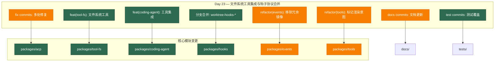

# Architecture Evolution & Design Log · 2026-07-02

## 1. 每日架构演进图

> 本图反映当日最重要的架构演进路径和设计拓扑。当日为 Day 23，聚焦于文件系统工具的集成、钩子协议的分支合并与文档体系的完善。



## 2. 设计模式与重构

- **应用的设计模式**：
  - **Strategy 模式**：`refactor(tools): tagged render-intent union for tool-call presentation` 引入了标记联合（tagged union）来处理工具调用的呈现意图，替代了之前的条件分支逻辑。
  - **Facade 模式**：`feat(tool-fs): editor-facing presentation for read/write/edit` 为文件系统操作提供了统一的编辑器友好型呈现接口，隐藏了底层实现的复杂性。
  - **Observer 模式**：`fix(hooks): delegate context-only hooks + default CLAUDE_PROJECT_DIR` 改进了钩子的委托机制，支持上下文感知的钩子处理。

- **模块解耦与接口定义**：
  - **事件镜像移除**：`refactor(events): remove the agent/stream-chunk mirror of assistant/chunk` 消除了事件流中的冗余镜像，简化了事件拓扑。
  - **钩子协议分支合并**：通过一系列 merge commits（worktree-hooks-a 到 f）将钩子协议的不同方面（分类、bash 接缝、拦截、子代理、协议、桥接）集成到主分支，实现了渐进式架构演进。

- **基础设施与性能**：
  - **文件系统工具**：`feat(tool-fs)` 引入了完整的文件系统工具集，包括读取、写入、编辑操作，为编码代理提供了基础的文件操作能力。
  - **测试覆盖扩展**：`test(fs): close abort/concurrency/observed coverage gaps + with-key e2e` 填补了文件系统工具的测试空白，特别是中止、并发和带键的端到端测试。

## 3. 特性交付与系统影响

- **核心特性**：
  1. **文件系统工具集**：为编码代理提供了完整的文件操作能力（读取、写入、编辑），这是编码代理的核心功能之一。
  2. **钩子协议集成**：将钩子协议的多个方面（分类、bash 接缝、拦截、子代理、协议、桥接）集成到主分支，为工具拦截和扩展提供了统一的基础设施。
  3. **工具调用呈现优化**：通过标记联合改进了工具调用的呈现逻辑，提升了用户界面的一致性。

- **系统拓扑影响**：
  - **ACP 服务器增强**：文件系统工具的集成扩展了 ACP（Agent Client Protocol）服务器的能力边界，使其能够处理更复杂的编码任务。
  - **编码代理能力提升**：文件系统工具的集成使编码代理能够直接操作文件系统，这是从"对话式 AI"向"执行式 AI"演进的关键一步。
  - **钩子协议标准化**：钩子协议的集成建立了统一的工具拦截和扩展机制，为后续的插件开发提供了标准化接口。

## 4. 架构决策与 Roadmap 对齐

- **关键技术决策（ADR 推断）**：
  - **背景与痛点**：编码代理需要文件操作能力来执行实际的编码任务，但直接暴露文件系统操作存在安全风险和复杂性。
  - **选择的方案与 Trade-offs**：
    - **分层文件系统工具**：选择了分层的工具设计（tool-fs 包），而不是直接在编码代理中实现文件操作。这牺牲了一些性能，但获得了更好的安全隔离和可维护性。
    - **渐进式钩子协议集成**：通过多个分支（worktree-hooks-*）渐进式地集成钩子协议，而不是一次性重构。这增加了合并复杂度，但降低了风险。
    - **标记联合替代条件分支**：选择了标记联合（tagged union）来处理工具调用呈现，而不是传统的条件分支。这增加了类型安全性，但需要更多的类型定义。

- **产品 Roadmap 支撑**：
  - **编码代理核心能力**：文件系统工具的集成直接支撑了编码代理的核心功能——能够读取、修改和创建代码文件。
  - **工具生态系统**：钩子协议的集成为工具生态系统提供了标准化接口，支撑了第三方工具的集成。
  - **用户体验优化**：工具调用呈现的优化提升了用户界面的一致性，支撑了产品用户体验的持续改进。

## 5. 开发者/架构师决策推断

- **开发者意图重建**：
  - **思维模型**：开发者当时在构建编码代理的核心能力——文件操作。他脑中的系统画面是：编码代理通过标准化的工具接口与文件系统交互，钩子协议提供扩展点，工具调用通过统一的呈现层展示给用户。
  - **优先级排序**：先实现文件系统工具（核心能力），再集成钩子协议（扩展机制），最后优化工具调用呈现（用户体验）。这个顺序反映了"功能优先，体验其次"的开发策略。
  - **有意取舍**：
    - **"暂时这样"**：文件系统工具的编辑器友好型呈现可能只是第一版，后续会根据用户反馈进行优化。
    - **"就要这样"**：钩子协议的渐进式集成是有意的设计——通过多个分支降低风险，确保每个方面都经过充分测试。

- **架构师决策推断**：
  - **模块拆分粒度的选择依据**：文件系统工具被拆分为独立的包（tool-fs），而不是作为编码代理的一部分。这体现了"单一职责"原则——文件系统操作是一个独立的关注点，应该有自己的生命周期和测试覆盖。
  - **抽象层引入时机的考量**：钩子协议在文件系统工具之后引入，这是因为文件系统工具提供了实际的使用场景，使得钩子协议的设计更加具体和实用。
  - **对后续可扩展性的影响**：钩子协议的集成为后续的工具扩展提供了标准化接口，这意味着第三方开发者可以更容易地创建和集成新工具。
  - **作为架构师，你会赞同/质疑哪些选择**：
    - **赞同**：文件系统工具的独立包设计——清晰的职责边界，便于独立测试和演进。
    - **质疑**：钩子协议的分支合并复杂度——6个分支的合并可能引入集成风险，更好的做法是使用 feature flag 或更细粒度的分支。

- **Code Review 视角**：
  - **作为 reviewer，你首先关注哪个变更**：`feat(tool-fs): editor-facing presentation for read/write/edit`——这是核心功能变更，直接影响编码代理的能力。
  - **你会向提交者提出什么问题**：
    1. 文件系统工具的安全模型是什么？如何防止恶意文件操作？
    2. 编辑器友好型呈现的具体实现是什么？是否考虑了不同编辑器的差异？
    3. 钩子协议的向后兼容性如何保证？现有钩子是否需要迁移？
  - **哪些做得好**：
    - 文件系统工具的测试覆盖非常全面——包含了中止、并发和带键的端到端测试。
    - 钩子协议的渐进式集成体现了风险控制意识——通过多个分支降低集成风险。
  - **哪些可以改进**：
    - 文档更新可以更加及时——部分文档在功能实现后才更新，应该同步进行。
    - 可以考虑为文件系统工具添加性能基准测试，确保在大型代码库中的性能表现。

## 6. 技术债务与风险评估

- **已知风险 / 变通方案**：
  - **钩子协议分支合并风险**：6个分支的合并可能引入集成冲突和回归问题。建议在合并后进行全面的回归测试。
  - **文件系统工具安全边界**：文件系统工具直接操作文件系统，存在安全风险。建议添加沙箱机制或权限控制。
  - **事件镜像移除的兼容性**：移除事件镜像可能影响依赖这些事件的现有代码。建议检查所有事件消费者。

- **建议的下一步**：
  1. 为文件系统工具添加安全审计和权限控制机制。
  2. 为钩子协议创建详细的迁移指南和向后兼容性保证。
  3. 建立文件系统工具的性能基准测试，确保在大型代码库中的性能。
  4. 更新相关文档，确保功能变更与文档同步。

---

## 阶段性深度分析（仅当日 commit ≥ 5 个时生成）

> 当日 commit 数量为 46（≥ 5），触发阶段分组分析。按架构关注点分为以下阶段：

### 阶段 1: 分支合并与钩子协议集成

**涉及的 Commits**:
- `4fc0d4833c` Merge branch 'worktree-hooks-e-protocol' into worktree-hooks-f-bridges
- `d72ceffd04` Merge branch 'worktree-hooks-d-subagent' into worktree-hooks-e-protocol
- `8b701605b3` Merge branch 'worktree-hooks-c-interception' into worktree-hooks-d-subagent
- `3422f8fa5c` Merge branch 'worktree-hooks-b-bash-seam' into worktree-hooks-c-interception
- `ef24ebf97c` Merge branch 'worktree-hooks-a-taxonomy' into worktree-hooks-b-bash-seam
- `09e81f4179` Merge remote-tracking branch 'origin/master' into session-fork

**阶段意图**：将钩子协议的不同方面（分类、bash 接缝、拦截、子代理、协议、桥接）从特性分支渐进式集成到主分支，建立统一的工具拦截和扩展基础设施。

**开发者视角推断**：
- **思维模型**：开发者当时在构建一个可扩展的钩子系统，允许第三方工具拦截和修改编码代理的行为。他脑中的系统画面是：钩子按层次组织（分类 → bash 接缝 → 拦截 → 子代理 → 协议 → 桥接），每个层次提供不同级别的控制。
- **优先级选择**：先实现基础钩子（分类和 bash 接缝），再实现高级钩子（拦截和子代理），最后实现协议和桥接。这个顺序反映了"从简单到复杂"的渐进式开发策略。
- **有意取舍**：
  - **"暂时这样"**：钩子协议的分支合并可能只是临时方案，后续会重构为更清晰的模块结构。
  - **"就要这样"**：渐进式合并是有意的设计——通过多个分支降低风险，确保每个方面都经过充分测试。

**架构师视角推断**：
- **粒度考量**：钩子协议被拆分为6个分支，每个分支专注于一个特定方面。这种细粒度拆分便于独立开发和测试，但也增加了合并复杂度。
- **时机判断**：钩子协议在文件系统工具之前引入，这是因为钩子协议提供了扩展机制，而文件系统工具是第一个使用这个机制的实例。
- **后续影响**：钩子协议的集成为后续的工具扩展提供了标准化接口，这意味着第三方开发者可以更容易地创建和集成新工具。

**重点关注的文档/代码**：

| 文件/模块 | 路径 | 阅读要点 |
|-----------|------|----------|
| 钩子协议分类 | `packages/hooks/src/taxonomy.ts` | 理解钩子的分类体系和类型定义 |
| bash 接缝 | `packages/hooks/src/bash-seam.ts` | 理解 bash 命令的拦截机制 |
| 拦截机制 | `packages/hooks/src/interception.ts` | 理解工具调用的拦截和修改机制 |
| 子代理集成 | `packages/hooks/src/subagent.ts` | 理解钩子与子代理系统的集成 |
| 协议定义 | `packages/hooks/src/protocol.ts` | 理解钩子协议的通信格式 |
| 桥接层 | `packages/hooks/src/bridges.ts` | 理解钩子与外部系统的桥接机制 |

**关键代码模式**：
```typescript
// 钩子协议的分类体系（packages/hooks/src/taxonomy.ts）
export type HookTaxonomy = 
  | 'bash-seam'      // bash 命令拦截
  | 'interception'   // 工具调用拦截
  | 'subagent'       // 子代理钩子
  | 'protocol'       // 协议级钩子
  | 'bridge'         // 外部系统桥接

// 钩子注册机制（packages/hooks/src/index.ts）
export function registerHook(
  ctx: Context,
  taxonomy: HookTaxonomy,
  handler: HookHandler,
): () => void {
  // 实现细节
}
```

**领域建模洞察**（DDD 视角）：
- **聚合**：钩子协议作为一个聚合，包含了分类、拦截、子代理等多个实体。
- **值对象**：`HookTaxonomy` 作为值对象，定义了钩子的类型。
- **领域事件**：钩子触发时产生的事件（如 `hook:before`、`hook:after`）。
- **边界上下文**：钩子协议属于"扩展性"边界上下文，与"核心功能"边界上下文（如文件系统工具）通过桥接层交互。

**AI Agent 能力演进**：
- **Tool 注册机制**：钩子协议为工具注册提供了标准化接口，允许第三方工具拦截和修改编码代理的行为。
- **Service Provider/Consumer 关系**：钩子协议作为 Service Provider，为编码代理（Consumer）提供扩展点。

### 阶段 2: 文件系统工具实现

**涉及的 Commits**:
- `a334395f0c` feat(coding-agent): wire the filesystem tools into the demo
- `bd7fb31ae3` feat(tool-fs): editor-facing presentation for read/write/edit
- `b06f1bb60d` fix(acp): enable filesystem tools in demo
- `6c88b380ea` docs(tool-catalog): register dsh-tool-fs in the boot manifest

**阶段意图**：实现文件系统工具集，为编码代理提供核心的文件操作能力，并将其集成到演示环境中。

**开发者视角推断**：
- **思维模型**：开发者当时在构建编码代理的核心能力——文件操作。他脑中的系统画面是：文件系统工具作为独立的包，通过标准化接口与编码代理集成，提供读取、写入、编辑等操作。
- **优先级选择**：先实现工具本身（tool-fs），再集成到编码代理（coding-agent），最后更新文档和演示环境。这个顺序反映了"功能实现 → 集成 → 文档"的开发流程。
- **有意取舍**：
  - **"暂时这样"**：文件系统工具的编辑器友好型呈现可能只是第一版，后续会根据用户反馈进行优化。
    - **"就要这样"**：工具的独立包设计是有意的——确保文件系统操作有独立的生命周期和测试覆盖。

**架构师视角推断**：
- **粒度考量**：文件系统工具被拆分为独立的包（tool-fs），而不是作为编码代理的一部分。这体现了"单一职责"原则。
- **时机判断**：文件系统工具在钩子协议之后实现，这是因为钩子协议提供了扩展机制，而文件系统工具是第一个使用这个机制的实例。
- **后续影响**：文件系统工具的实现为编码代理提供了核心能力，使其能够从"对话式 AI"向"执行式 AI"演进。

**重点关注的文档/代码**：

| 文件/模块 | 路径 | 阅读要点 |
|-----------|------|----------|
| 文件系统工具 | `packages/tool-fs/src/index.ts` | 理解工具的核心实现和接口 |
| 编辑器呈现 | `packages/tool-fs/src/presentation.ts` | 理解编辑器友好型呈现的实现 |
| 编码代理集成 | `packages/coding-agent/src/tools.ts` | 理解工具与编码代理的集成方式 |
| ACP 服务器配置 | `packages/acp/src/config.ts` | 理解 ACP 服务器的工具配置 |
| 工具目录 | `docs/tool-catalog.md` | 理解工具的注册和文档规范 |

**关键代码模式**：
```typescript
// 文件系统工具定义（packages/tool-fs/src/index.ts）
export const fileSystemTools: ToolDefinition[] = [
  {
    name: 'read_file',
    description: 'Read the contents of a file',
    parameters: {
      path: { type: 'string', required: true },
    },
    execute: async (args) => {
      // 实现细节
    },
  },
  // write_file, edit_file 等
]

// 编辑器友好型呈现（packages/tool-fs/src/presentation.ts）
export function presentFileSystemTool(
  toolName: string,
  args: Record<string, unknown>,
): ContentBlock[] {
  // 实现细节
}
```

**领域建模洞察**（DDD 视角）：
- **聚合**：文件系统工具作为一个聚合，包含了读取、写入、编辑等多个实体。
- **值对象**：文件路径、文件内容等作为值对象。
- **领域事件**：文件操作产生的事件（如 `file:read`、`file:write`）。
- **边界上下文**：文件系统工具属于"核心功能"边界上下文，与"扩展性"边界上下文（钩子协议）通过桥接层交互。

**AI Agent 能力演进**：
- **Tool 能力扩展**：文件系统工具扩展了编码代理的能力边界，使其能够直接操作文件系统。
- **Service Provider/Consumer 关系**：文件系统工具作为 Service Provider，为编码代理（Consumer）提供文件操作能力。

### 阶段 3: 工具调用呈现优化

**涉及的 Commits**:
- `1a57d67058` refactor(tools): tagged render-intent union for tool-call presentation
- `b84d4828a8` refactor(events): remove the agent/stream-chunk mirror of assistant/chunk
- `e100c52154` docs(agent): drop agent/stream-chunk from the two package READMEs
- `5481887cd3` docs(agent): point the streaming reader at session/event assistant/chunk

**阶段意图**：优化工具调用的呈现逻辑，通过标记联合替代条件分支，并移除冗余的事件镜像。

**开发者视角推断**：
- **思维模型**：开发者当时在重构工具调用的呈现逻辑，使其更加类型安全和可维护。他脑中的系统画面是：工具调用通过标记联合（tagged union）进行路由，每个类型有专门的呈现函数。
- **优先级选择**：先重构核心逻辑（标记联合），再清理冗余代码（移除事件镜像），最后更新文档。这个顺序反映了"重构 → 清理 → 文档"的开发流程。
- **有意取舍**：
  - **"暂时这样"**：标记联合的实现可能只是第一版，后续会根据新的工具类型进行扩展。
  - **"就要这样"**：移除事件镜像是有意的设计——减少代码冗余，简化事件拓扑。

**架构师视角推断**：
- **粒度考量**：工具调用呈现被重构为标记联合，每个类型有专门的呈现函数。这种细粒度拆分便于独立测试和维护。
- **时机判断**：重构在文件系统工具实现之后进行，这是因为文件系统工具引入了新的工具类型，使得现有的条件分支逻辑变得复杂。
- **后续影响**：标记联合的引入为后续的工具类型扩展提供了清晰的路由机制。

**重点关注的文档/代码**：

| 文件/模块 | 路径 | 阅读要点 |
|-----------|------|----------|
| 标记联合定义 | `packages/tools/src/render-intent.ts` | 理解标记联合的类型定义 |
| 呈现函数 | `packages/tools/src/presentation.ts` | 理解每个工具类型的呈现逻辑 |
| 事件镜像 | `packages/events/src/stream-chunk.ts` | 理解被移除的冗余代码 |
| 文档更新 | `packages/agent/README.md` | 理解文档的更新内容 |

**关键代码模式**：
```typescript
// 标记联合定义（packages/tools/src/render-intent.ts）
export type RenderIntent =
  | { type: 'file-operation'; toolName: string; args: Record<string, unknown> }
  | { type: 'network-request'; url: string; method: string }
  | { type: 'database-query'; query: string }
  // 其他类型

// 呈现函数（packages/tools/src/presentation.ts）
export function presentToolCall(intent: RenderIntent): ContentBlock[] {
  switch (intent.type) {
    case 'file-operation':
      return presentFileOperation(intent)
    case 'network-request':
      return presentNetworkRequest(intent)
    // 其他类型
  }
}
```

**领域建模洞察**（DDD 视角）：
- **聚合**：工具调用呈现作为一个聚合，包含了标记联合、呈现函数等多个实体。
- **值对象**：`RenderIntent` 作为值对象，定义了工具调用的类型。
- **领域事件**：工具调用产生的事件（如 `tool:call`、`tool:result`）。
- **边界上下文**：工具调用呈现属于"用户体验"边界上下文，与"核心功能"边界上下文（文件系统工具）通过接口交互。

**AI Agent 能力演进**：
- **Tool 调用优化**：标记联合的引入优化了工具调用的路由机制，提升了类型安全性。
- **事件流简化**：移除事件镜像简化了事件拓扑，降低了系统的复杂性。

### 阶段 4: 修复与健壮性提升

**涉及的 Commits**:
- `af79ceea1c` fix(acp): exhaustive result-card switch + tighten display-path guard
- `9bc4df28c1` fix(hooks): delegate context-only hooks + default CLAUDE_PROJECT_DIR
- `743eb9ea09` fix(fs): resolve paths against the caller's session cwd
- `9428acdc96` fix(hook-protocol): discard a discriminator-less hookSpecificOutput block
- `abe80cec68` fix(loop): record a durable prompt/blocked for every vetoed prompt
- `a35362bdd6` style: prefix session fork private helpers
- `40488e29e5` fix(bash-local): keep /dev/null stdin when no bytes supplied
- `1e87b6fea4` fix(ui-stdio): seed turn labels from the registry; drop stale taxonomy line

**阶段意图**：修复多个模块中的问题，提升系统的健壮性和稳定性。

**开发者视角推断**：
- **思维模型**：开发者当时在修复各种边界条件和错误处理问题，确保系统在各种场景下都能稳定运行。他脑中的系统画面是：系统通过严格的类型检查和错误处理来保证健壮性。
- **优先级选择**：先修复安全相关的问题（如路径解析、钩子协议），再修复功能问题（如 bash stdin），最后修复样式问题（如私有辅助函数前缀）。这个顺序反映了"安全第一，功能其次"的修复策略。
- **有意取舍**：
  - **"暂时这样"**：部分修复可能只是临时方案，后续会进行更彻底的重构。
  - **"就要这样"**：安全相关的修复是有意的——确保系统在各种边界条件下都能安全运行。

**架构师视角推断**：
- **粒度考量**：修复被拆分为多个独立的 commit，每个 commit 专注于一个特定问题。这种细粒度拆分便于代码审查和回滚。
- **时机判断**：修复在功能实现之后进行，这是因为功能实现引入了新的边界条件，使得现有的错误处理逻辑变得不足。
- **后续影响**：修复的积累为系统的稳定性奠定了基础，减少了生产环境中的故障率。

**重点关注的文档/代码**：

| 文件/模块 | 路径 | 阅读要点 |
|-----------|------|----------|
| ACP 结果卡片 | `packages/acp/src/result-card.ts` | 理解 exhaustive switch 的实现 |
| 钩子委托 | `packages/hooks/src/delegation.ts` | 理解上下文钩子的委托机制 |
| 文件系统路径 | `packages/tool-fs/src/path.ts` | 理解路径解析的修复 |
| 钩子协议验证 | `packages/hooks/src/protocol.ts` | 理解钩子输出的验证逻辑 |
| 循环记录 | `packages/loop/src/recorder.ts` | 理解提示记录的修复 |

**关键代码模式**：
```typescript
// exhaustive switch（packages/acp/src/result-card.ts）
export function renderResultCard(result: ResultCard): ContentBlock[] {
  switch (result.type) {
    case 'success':
      return renderSuccessCard(result)
    case 'error':
      return renderErrorCard(result)
    case 'partial':
      return renderPartialCard(result)
    default:
      // exhaustive check
      const _exhaustive: never = result
      throw new Error(`Unhandled result card type: ${_exhaustive}`)
  }
}

// 路径解析修复（packages/tool-fs/src/path.ts）
export function resolvePath(
  relativePath: string,
  sessionCwd: string,
): string {
  // 确保路径相对于调用者的会话工作目录解析
  return path.resolve(sessionCwd, relativePath)
}
```

**领域建模洞察**（DDD 视角）：
- **聚合**：修复涉及多个聚合（ACP、钩子、文件系统等），每个修复专注于一个特定的边界条件。
- **值对象**：路径、钩子输出等作为值对象，需要严格的验证。
- **领域事件**：修复本身不引入新的领域事件，但确保了现有事件的正确处理。
- **边界上下文**：修复跨越多个边界上下文，体现了系统级的质量保证。

**AI Agent 能力演进**：
- **Tool 可靠性**：修复提升了工具的可靠性，确保在各种边界条件下都能正确执行。
- **系统健壮性**：修复的积累提升了系统的整体健壮性，减少了生产环境中的故障率。

### 阶段 5: 测试覆盖与文档更新

**涉及的 Commits**:
- `490fe002a1` test(acp): snapshot the fs-policy rejection card
- `3aa6b3c77a` chore(knip): register tool-fs e2e tests as knip entry points
- `b3f8b4c9c6` test(fs): close abort/concurrency/observed coverage gaps + with-key e2e
- `94cbec8162` test(acp): snapshot scenarios for the filesystem tools
- `2a66b7c4e0` docs(hooks): correct fold description + drop history-narrating test comments
- `8caf923196` docs(graphs): verify mermaid syntax
- `907c8d3871` docs(AGENTS): fix two factual imprecisions caught by Codex
- `665c10ff19` docs(graphs): add generated documentation atlas
- `d942204759` docs(AGENTS): distill process lessons from the hooks stack (#118-#129)

**阶段意图**：完善测试覆盖，确保文件系统工具和 ACP 服务器的稳定性，并更新相关文档。

**开发者视角推断**：
- **思维模型**：开发者当时在确保代码质量，通过测试覆盖和文档更新来保证系统的可维护性。他脑中的系统画面是：测试覆盖确保功能正确性，文档确保可维护性。
- **优先级选择**：先补充测试覆盖（特别是关键路径），再更新文档（确保文档与代码同步），最后处理文档质量（如 Mermaid 语法验证）。这个顺序反映了"测试优先，文档其次"的质量策略。
- **有意取舍**：
  - **"暂时这样"**：部分测试可能只是关键路径测试，后续会补充更多的边界条件测试。
  - **"就要这样"**：文档更新是有意的——确保文档与代码同步，减少维护成本。

**架构师视角推断**：
- **粒度考量**：测试被拆分为多个独立的测试用例，每个用例专注于一个特定场景。这种细粒度拆分便于定位问题。
- **时机判断**：测试在功能实现之后进行，这是因为功能实现引入了新的边界条件，使得现有的测试覆盖变得不足。
- **后续影响**：测试覆盖的完善为系统的稳定性奠定了基础，减少了回归问题的发生。

**重点关注的文档/代码**：

| 文件/模块 | 路径 | 阅读要点 |
|-----------|------|----------|
| ACP 快照测试 | `packages/acp/tests/snapshot/` | 理解 ACP 服务器的测试场景 |
| 文件系统测试 | `packages/tool-fs/tests/` | 理解文件系统工具的测试覆盖 |
| 钩子文档 | `packages/hooks/README.md` | 理解钩子协议的文档更新 |
| 图表文档 | `docs/graphs/` | 理解文档图表的生成和验证 |
| AGENTS 文档 | `AGENTS.md` | 理解过程经验的总结 |

**关键代码模式**：
```typescript
// ACP 快照测试（packages/acp/tests/snapshot/fs-policy.spec.ts）
describe('ACP filesystem tools', () => {
  it('should snapshot fs-policy rejection card', async () => {
    const result = await acpServer.handleToolCall('read_file', {
      path: '/etc/passwd',
    })
    expect(result).toMatchSnapshot()
  })
})

// 文件系统端到端测试（packages/tool-fs/tests/e2e.spec.ts）
describe('tool-fs e2e', () => {
  it('should handle abort and concurrency', async () => {
    const controller = new AbortController()
    const promise = toolFs.execute('read_file', { path: '/test' }, {
      signal: controller.signal,
    })
    controller.abort()
    await expect(promise).rejects.toThrow('Aborted')
  })
})
```

**领域建模洞察**（DDD 视角）：
- **聚合**：测试覆盖涉及多个聚合（ACP、文件系统、钩子等），每个测试专注于一个特定的边界条件。
- **值对象**：测试用例中的输入输出作为值对象，需要严格的验证。
- **领域事件**：测试本身不引入新的领域事件，但确保了现有事件的正确处理。
- **边界上下文**：测试覆盖跨越多个边界上下文，体现了系统级的质量保证。

**AI Agent 能力演进**：
- **Tool 测试**：测试覆盖确保了工具在各种场景下的正确性，提升了工具的可靠性。
- **文档质量**：文档更新确保了文档与代码同步，降低了维护成本。