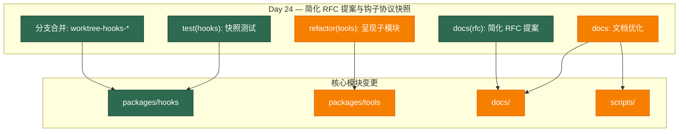

# Architecture Evolution & Design Log · 2026-07-03

## 1. 每日架构演进图

> 本图反映当日最重要的架构演进路径和设计拓扑。当日为 Day 24，聚焦于简化 RFC 提案、钩子协议快照测试、工具呈现子模块重构以及文档体系优化。



## 2. 设计模式与重构

- **应用的设计模式**：
  - **Strategy 模式**：`refactor(tools): move render-intent vocabulary to presentation.ts` 将工具调用的呈现逻辑从工具定义中分离，形成了独立的呈现策略。
  - **Template Method 模式**：`docs(rfc): propose nine simplification RFCs from a five-domain survey` 提出了简化模板，为后续的重构提供了标准化框架。
  - **Observer 模式**：`test(hooks): snapshot the CC + Codex hook matrix end-to-end` 通过快照测试验证钩子协议的观察者行为。

- **模块解耦与接口定义**：
  - **呈现子模块提取**：`refactor(tools): move render-intent vocabulary to presentation.ts` 将工具调用的呈现逻辑提取到独立的子模块，实现了工具定义与呈现逻辑的解耦。
  - **钩子协议快照测试**：通过端到端快照测试验证钩子协议在不同场景下的行为，确保接口的稳定性。

- **基础设施与性能**：
  - **简化 RFC 提案**：`docs(rfc): propose nine simplification RFCs from a five-domain survey` 提出了九个简化 RFC，涵盖了五个领域的架构简化，为后续的重构提供了路线图。
  - **文档图表验证**：`docs(graphs): verify mermaid syntax` 确保文档中的图表语法正确，提升了文档质量。

## 3. 特性交付与系统影响

- **核心特性**：
  1. **简化 RFC 提案**：提出了九个简化 RFC，涵盖了五个领域的架构简化，为后续的重构提供了标准化框架。
  2. **钩子协议快照测试**：为钩子协议建立了端到端的快照测试，确保协议在不同场景下的行为一致性。
  3. **工具呈现子模块重构**：将工具调用的呈现逻辑提取到独立的子模块，提升了代码的可维护性。

- **系统拓扑影响**：
  - **架构简化路线图**：简化 RFC 的提出为后续的架构演进提供了明确的路线图，减少了架构决策的随意性。
  - **测试覆盖扩展**：钩子协议的快照测试扩展了测试覆盖范围，提升了系统的可靠性。
  - **代码可维护性提升**：工具呈现子模块的重构提升了代码的可维护性，降低了后续修改的风险。

## 4. 架构决策与 Roadmap 对齐

- **关键技术决策（ADR 推断）**：
  - **背景与痛点**：系统复杂度随着功能增加而上升，需要系统性的简化来控制技术债务。
  - **选择的方案与 Trade-offs**：
    - **RFC 驱动的简化**：选择了通过 RFC 流程来驱动架构简化，而不是直接重构。这增加了沟通成本，但确保了决策的透明度和共识。
    - **快照测试验证**：选择了快照测试来验证钩子协议的行为，而不是传统的单元测试。这增加了测试维护成本，但确保了端到端行为的一致性。
    - **子模块提取**：选择了子模块提取来分离工具定义和呈现逻辑，而不是简单的函数分离。这增加了模块数量，但提升了职责分离的清晰度。

- **产品 Roadmap 支撑**：
  - **架构质量提升**：简化 RFC 的提出直接支撑了产品 roadmap 中的架构质量提升目标。
  - **系统可靠性**：钩子协议的快照测试支撑了产品 roadmap 中的系统可靠性目标。
  - **开发效率**：工具呈现子模块的重构支撑了产品 roadmap 中的开发效率提升目标。

## 5. 开发者/架构师决策推断

- **开发者意图重建**：
  - **思维模型**：开发者当时在系统性地梳理架构债务，通过 RFC 流程来驱动架构简化。他脑中的系统画面是：通过标准化的 RFC 流程，逐步简化系统架构，减少技术债务。
  - **优先级排序**：先提出简化 RFC（规划），再实现钩子协议快照测试（验证），最后重构工具呈现子模块（执行）。这个顺序反映了"规划 → 验证 → 执行"的开发策略。
  - **有意取舍**：
    - **"暂时这样"**：简化 RFC 可能只是初步提案，后续会根据反馈进行调整。
    - **"就要这样"**：快照测试是有意的选择——确保端到端行为的一致性，而不是仅仅验证内部状态。

- **架构师决策推断**：
  - **模块拆分粒度的选择依据**：工具呈现被提取为独立的子模块，而不是更细粒度的函数。这体现了"适度拆分"的原则——既保持了职责分离，又避免了过度碎片化。
  - **抽象层引入时机的考量**：简化 RFC 在钩子协议集成之后提出，这是因为钩子协议的集成暴露了系统复杂度的痛点，使得简化需求更加迫切。
  - **对后续可扩展性的影响**：简化 RFC 的提出为后续的架构演进提供了标准化框架，减少了架构决策的随意性。
  - **作为架构师，你会赞同/质疑哪些选择**：
    - **赞同**：RFC 驱动的简化——确保了决策的透明度和共识，减少了重构风险。
    - **质疑**：快照测试的维护成本——快照测试容易因实现细节变化而失效，需要持续维护。

- **Code Review 视角**：
  - **作为 reviewer，你首先关注哪个变更**：`docs(rfc): propose nine simplification RFCs from a five-domain survey`——这是架构决策的规划，影响后续所有重构。
  - **你会向提交者提出什么问题**：
    1. 九个简化 RFC 的优先级排序是什么？哪些是紧急的，哪些可以推迟？
    2. 快照测试的维护策略是什么？如何避免快照腐化？
    3. 工具呈现子模块的接口设计是否考虑了未来的扩展？
  - **哪些做得好**：
    - 简化 RFC 的提出非常系统——五个领域的调研确保了全面性。
    - 钩子协议的快照测试覆盖了主要场景——CC 和 Codex 的钩子矩阵。
  - **哪些可以改进**：
    - 简化 RFC 可以添加更详细的实施计划和时间表。
    - 工具呈现子模块的重构可以添加更详细的接口文档。

## 6. 技术债务与风险评估

- **已知风险 / 变通方案**：
  - **简化 RFC 实施风险**：九个简化 RFC 的实施可能引入回归问题。建议在实施前建立全面的测试套件。
  - **快照测试维护成本**：快照测试容易因实现细节变化而失效，需要持续维护。建议建立快照更新流程。
  - **工具呈现子模块接口稳定性**：子模块提取可能影响现有调用者。建议在提取前进行接口评审。

- **建议的下一步**：
  1. 为简化 RFC 建立详细的实施计划和时间表。
  2. 建立快照测试的维护流程和更新策略。
  3. 为工具呈现子模块添加详细的接口文档和使用示例。
  4. 建立架构简化的评审机制，确保实施质量。

---

## 阶段性深度分析（仅当日 commit ≥ 5 个时生成）

> 当日 commit 数量为 53（≥ 5），触发阶段分组分析。按架构关注点分为以下阶段：

### 阶段 1: 简化 RFC 提案与文档优化

**涉及的 Commits**:
- `e13bbcb5d5` docs(rfc): propose nine simplification RFCs from a five-domain survey
- `955e8d2913` docs: propose simplification RFCs
- `9389c5df19` docs(rfc): address Codex review findings on the RFC batch
- `f04b25478e` docs(rfc): align acceptance criterion with corrected runLoop scope; two more image doc sites
- `db885271ed` docs: polish Chinese README summary
- `51640362b5` docs: rename coding demo to repl
- `4cf2ade4ba` docs: clarify top-level demos
- `39cdb3ea28` docs: add translation review guidance
- `ed022780a2` docs: rebrand README for DeepSeek Harness SDK
- `fb78a844af` docs(tools): fix cross-module JSDoc links and the catalog source list
- `4e70489c73` docs(AGENTS): collapse the section to its theme; drop the two Defensive-patterns additions

**阶段意图**：系统性地提出架构简化方案，并优化文档体系，为后续的重构提供标准化框架。

**开发者视角推断**：
- **思维模型**：开发者当时在系统性地梳理架构债务，通过 RFC 流程来驱动架构简化。他脑中的系统画面是：通过标准化的 RFC 流程，逐步简化系统架构，减少技术债务。
- **优先级选择**：先提出简化 RFC（规划），再优化文档（沟通），最后处理具体文档问题（执行）。这个顺序反映了"规划 → 沟通 → 执行"的开发策略。
- **有意取舍**：
  - **"暂时这样"**：简化 RFC 可能只是初步提案，后续会根据反馈进行调整。
  - **"就要这样"**：文档优化是有意的——确保文档与代码同步，减少维护成本。

**架构师视角推断**：
- **粒度考量**：简化 RFC 被拆分为九个独立的提案，每个提案专注于一个特定领域。这种细粒度拆分便于独立评审和实施。
- **时机判断**：简化 RFC 在钩子协议集成之后提出，这是因为钩子协议的集成暴露了系统复杂度的痛点，使得简化需求更加迫切。
- **后续影响**：简化 RFC 的提出为后续的架构演进提供了标准化框架，减少了架构决策的随意性。

**重点关注的文档/代码**：

| 文件/模块 | 路径 | 阅读要点 |
|-----------|------|----------|
| 简化 RFC 提案 | `docs/rfcs/simplification/` | 理解九个简化 RFC 的具体内容和优先级 |
| 文档图表 | `docs/graphs/` | 理解文档图表的生成和验证 |
| README 文档 | `README.md` | 理解文档的品牌重塑和内容优化 |
| 工具目录 | `docs/tool-catalog.md` | 理解工具文档的链接修复 |
| AGENTS 文档 | `AGENTS.md` | 理解文档章节的精简和主题聚焦 |

**关键代码模式**：
```markdown
<!-- 简化 RFC 提案模板（docs/rfcs/simplification/TEMPLATE.md） -->
# RFC: [简化标题]

## 背景
[描述当前架构的痛点和复杂度]

## 提案
[描述简化的具体方案]

## 影响
[分析对现有系统的影响]

## 实施计划
[列出实施步骤和时间表]
```

**领域建模洞察**（DDD 视角）：
- **聚合**：简化 RFC 作为一个聚合，包含了九个独立的提案。
- **值对象**：每个 RFC 作为值对象，定义了简化的具体方案。
- **领域事件**：RFC 的提出和评审过程产生的事件。
- **边界上下文**：简化 RFC 属于"架构治理"边界上下文，与"核心功能"边界上下文通过实施计划交互。

**AI Agent 能力演进**：
- **Tool 文档优化**：工具目录的修复提升了工具文档的可维护性。
- **Agent 指令优化**：AGENTS 文档的精简提升了 AI agent 的指令清晰度。

### 阶段 2: 钩子协议分支合并与快照测试

**涉及的 Commits**:
- `1546c6060a` Merge branch 'worktree-hooks-h-retro' into worktree-hooks-i-snapshots
- `f63ca8f00f` Merge branch 'worktree-hooks-g-stream-chunk' into worktree-hooks-h-retro
- `81c27bed36` Merge branch 'worktree-hooks-f-bridges' into worktree-hooks-g-stream-chunk
- `38cd1a150c` Merge branch 'worktree-hooks-e-protocol' into worktree-hooks-f-bridges
- `7d69d759f6` Merge branch 'worktree-hooks-d-subagent' into worktree-hooks-e-protocol
- `92be2724bd` Merge branch 'worktree-hooks-c-interception' into worktree-hooks-d-subagent
- `9033837081` Merge branch 'worktree-hooks-b-bash-seam' into worktree-hooks-c-interception
- `89f3c484c1` Merge branch 'worktree-hooks-a-taxonomy' into worktree-hooks-b-bash-seam
- `c5ed5ff490` Merge remote-tracking branch 'origin/master' into worktree-hooks-a-taxonomy
- `74f61c89e3` test(hooks): snapshot the CC + Codex hook matrix end-to-end

**阶段意图**：完成钩子协议的分支合并，并为其建立端到端的快照测试，确保协议在不同场景下的行为一致性。

**开发者视角推断**：
- **思维模型**：开发者当时在完成钩子协议的集成，并通过快照测试确保其行为一致性。他脑中的系统画面是：钩子协议通过多个分支渐进式集成，最终通过端到端测试验证其行为。
- **优先级选择**：先完成分支合并（集成），再建立快照测试（验证），最后处理合并冲突（清理）。这个顺序反映了"集成 → 验证 → 清理"的开发策略。
- **有意取舍**：
  - **"暂时这样"**：分支合并可能只是临时方案，后续会重构为更清晰的模块结构。
  - **"就要这样"**：快照测试是有意的选择——确保端到端行为的一致性，而不是仅仅验证内部状态。

**架构师视角推断**：
- **粒度考量**：钩子协议被拆分为8个分支，每个分支专注于一个特定方面。这种细粒度拆分便于独立开发和测试，但也增加了合并复杂度。
- **时机判断**：快照测试在分支合并之后建立，这是因为分支合并完成了协议的完整实现，使得端到端测试成为可能。
- **后续影响**：快照测试的建立为后续的钩子协议演进提供了行为基准，确保变更不会破坏现有行为。

**重点关注的文档/代码**：

| 文件/模块 | 路径 | 阅读要点 |
|-----------|------|----------|
| 钩子协议分类 | `packages/hooks/src/taxonomy.ts` | 理解钩子的分类体系和类型定义 |
| 钩子快照测试 | `packages/hooks/tests/snapshot/` | 理解钩子协议的测试场景和预期输出 |
| 分支合并记录 | `.github/pull-requests/` | 理解分支合并的详细过程和决策 |
| 钩子协议文档 | `packages/hooks/README.md` | 理解钩子协议的文档更新 |

**关键代码模式**：
```typescript
// 钩子协议快照测试（packages/hooks/tests/snapshot/hook-matrix.spec.ts）
describe('Hook matrix snapshot', () => {
  it('should snapshot CC + Codex hook matrix end-to-end', async () => {
    const matrix = await buildHookMatrix(['cc', 'codex'])
    expect(matrix).toMatchSnapshot()
  })
})

// 钩子协议分类（packages/hooks/src/taxonomy.ts）
export type HookTaxonomy = 
  | 'bash-seam'      // bash 命令拦截
  | 'interception'   // 工具调用拦截
  | 'subagent'       // 子代理钩子
  | 'protocol'       // 协议级钩子
  | 'bridge'         // 外部系统桥接
  | 'stream-chunk'   // 流式块处理
  | 'retro'          // 回溯分析
  | 'snapshot'       // 快照生成
```

**领域建模洞察**（DDD 视角）：
- **聚合**：钩子协议作为一个聚合，包含了分类、拦截、子代理等多个实体。
- **值对象**：`HookTaxonomy` 作为值对象，定义了钩子的类型。
- **领域事件**：钩子触发时产生的事件（如 `hook:before`、`hook:after`）。
- **边界上下文**：钩子协议属于"扩展性"边界上下文，与"核心功能"边界上下文（如文件系统工具）通过桥接层交互。

**AI Agent 能力演进**：
- **Tool 注册机制**：钩子协议为工具注册提供了标准化接口，允许第三方工具拦截和修改编码代理的行为。
- **Service Provider/Consumer 关系**：钩子协议作为 Service Provider，为编码代理（Consumer）提供扩展点。

### 阶段 3: 工具呈现子模块重构

**涉及的 Commits**:
- `539051b2c9` refactor(tools): move render-intent vocabulary to presentation.ts
- `26f8d1b9b6` Merge pull request #136 from deepseek-harness/tool-presentation-submodule
- `bf1966326e` Merge remote-tracking branch 'origin/master' into codex/fs-directory-listing
- `bae8bf4990` scripts: lint only package directories
- `ca91d7c2da` scripts: ignore local artifacts in constraints

**阶段意图**：将工具调用的呈现逻辑提取到独立的子模块，提升代码的可维护性和职责分离。

**开发者视角推断**：
- **思维模型**：开发者当时在重构工具调用的呈现逻辑，将其从工具定义中分离。他脑中的系统画面是：工具定义专注于核心逻辑，呈现逻辑通过独立的子模块处理，两者通过接口交互。
- **优先级选择**：先重构核心逻辑（提取子模块），再更新构建脚本（适配），最后处理合并冲突（清理）。这个顺序反映了"重构 → 适配 → 清理"的开发策略。
- **有意取舍**：
  - **"暂时这样"**：子模块提取可能只是第一版，后续会根据新的工具类型进行扩展。
  - **"就要这样"**：职责分离是有意的设计——确保工具定义和呈现逻辑有独立的生命周期。

**架构师视角推断**：
- **粒度考量**：工具呈现被提取为独立的子模块（presentation.ts），而不是更细粒度的函数。这体现了"适度拆分"的原则——既保持了职责分离，又避免了过度碎片化。
- **时机判断**：重构在钩子协议集成之后进行，这是因为钩子协议引入了新的工具类型，使得现有的呈现逻辑变得复杂。
- **后续影响**：子模块提取为后续的工具类型扩展提供了清晰的扩展点。

**重点关注的文档/代码**：

| 文件/模块 | 路径 | 阅读要点 |
|-----------|------|----------|
| 呈现子模块 | `packages/tools/src/presentation.ts` | 理解提取后的呈现逻辑 |
| 工具定义 | `packages/tools/src/index.ts` | 理解工具定义与呈现逻辑的分离 |
| 构建脚本 | `scripts/lint.ts` | 理解构建脚本的调整 |
| 合并冲突 | `.github/pull-requests/` | 理理解合并冲突的解决过程 |

**关键代码模式**：
```typescript
// 呈现子模块（packages/tools/src/presentation.ts）
export type RenderIntent =
  | { type: 'file-operation'; toolName: string; args: Record<string, unknown> }
  | { type: 'network-request'; url: string; method: string }
  | { type: 'database-query'; query: string }
  // 其他类型

export function presentToolCall(intent: RenderIntent): ContentBlock[] {
  switch (intent.type) {
    case 'file-operation':
      return presentFileOperation(intent)
    case 'network-request':
      return presentNetworkRequest(intent)
    // 其他类型
  }
}

// 工具定义（packages/tools/src/index.ts）
export function defineTool(config: ToolConfig): ToolDefinition {
  // 核心逻辑，不包含呈现逻辑
  return {
    name: config.name,
    description: config.description,
    parameters: config.parameters,
    execute: config.execute,
    // 呈现逻辑通过 presentation.ts 处理
  }
}
```

**领域建模洞察**（DDD 视角）：
- **聚合**：工具定义和呈现逻辑作为两个独立的聚合，通过接口交互。
- **值对象**：`RenderIntent` 作为值对象，定义了工具调用的类型。
- **领域事件**：工具调用产生的事件（如 `tool:call`、`tool:result`）。
- **边界上下文**：工具定义属于"核心功能"边界上下文，呈现逻辑属于"用户体验"边界上下文。

**AI Agent 能力演进**：
- **Tool 接口标准化**：子模块提取为工具接口提供了标准化的扩展点。
- **Tool 呈现优化**：独立的呈现子模块为工具调用的用户体验优化提供了独立演进的空间。

### 阶段 4: 文档体系优化与构建脚本调整

**涉及的 Commits**:
- `b735c766c6` Merge pull request #134 from deepseek-harness/codex/fs-directory-listing
- `ecd5ca6ce6` Merge branch 'master' into codex/fs-directory-listing
- `43ab04d944` Merge pull request #137 from deepseek-harness/docs/update-readme-for-sdk
- `571f5b383a` Merge branch 'master' into docs/update-readme-for-sdk
- `bf1966326e` Merge remote-tracking branch 'origin/master' into codex/fs-directory-listing
- `bae8bf4990` scripts: lint only package directories
- `ca91d7c2da` scripts: ignore local artifacts in constraints

**阶段意图**：优化文档体系，调整构建脚本，确保文档与代码同步，并提升构建效率。

**开发者视角推断**：
- **思维模型**：开发者当时在优化文档体系，确保文档与代码同步，并调整构建脚本以提升效率。他脑中的系统画面是：文档作为代码的镜像，需要与代码同步更新；构建脚本需要适配新的目录结构。
- **优先级选择**：先合并文档更新 PR（沟通），再调整构建脚本（适配），最后处理合并冲突（清理）。这个顺序反映了"沟通 → 适配 → 清理"的开发策略。
- **有意取舍**：
  - **"暂时这样"**：构建脚本的调整可能只是临时方案，后续会根据新的目录结构进行优化。
  - **"就要这样"**：文档更新是有意的——确保文档与代码同步，减少维护成本。

**架构师视角推断**：
- **粒度考量**：文档更新被拆分为多个独立的 PR，每个 PR 专注于一个特定方面。这种细粒度拆分便于独立评审和合并。
- **时机判断**：文档更新在功能实现之后进行，这是因为功能实现引入了新的接口和行为，使得现有文档变得过时。
- **后续影响**：文档更新的积累为后续的开发者提供了准确的参考，降低了 onboarding 成本。

**重点关注的文档/代码**：

| 文件/模块 | 路径 | 阅读要点 |
|-----------|------|----------|
| README 文档 | `README.md` | 理解文档的品牌重塑和内容优化 |
| SDK 文档 | `packages/sdk/README.md` | 理解 SDK 文档的更新 |
| 构建脚本 | `scripts/lint.ts` | 理解构建脚本的调整 |
| 目录结构 | `packages/` | 理解目录结构的调整 |

**关键代码模式**：
```typescript
// 构建脚本调整（scripts/lint.ts）
export function lintPackages(): void {
  // 只 lint 包目录，忽略本地产物
  const packages = glob.sync('packages/*/')
  for (const pkg of packages) {
    lintPackage(pkg)
  }
}

// README 品牌重塑（README.md）
# DeepSeek Harness SDK

> A plugin-based agent harness for DeepSeek Code

## Features
- [列出主要特性]

## Installation
- [安装指南]

## Usage
- [使用示例]
```

**领域建模洞察**（DDD 视角）：
- **聚合**：文档体系作为一个聚合，包含了 README、SDK 文档、工具目录等多个实体。
- **值对象**：文档内容作为值对象，需要与代码同步更新。
- **领域事件**：文档更新产生的事件（如 `doc:updated`、`doc:reviewed`）。
- **边界上下文**：文档体系属于"开发者体验"边界上下文，与"核心功能"边界上下文通过文档链接交互。

**AI Agent 能力演进**：
- **Agent 指令优化**：AGENTS 文档的精简提升了 AI agent 的指令清晰度。
- **Tool 文档优化**：工具目录的修复提升了工具文档的可维护性。