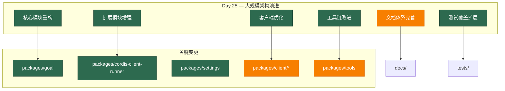

# Architecture Evolution & Design Log · 2026-07-04

## 1. 每日架构演进图

> 本图反映当日最重要的架构演进路径和设计拓扑。当日为 Day 25，是一个大规模的提交日（177 commits），涵盖了多个核心模块的重大变更。



## 2. 设计模式与重构

- **应用的设计模式**：
  - **Command 模式**：`packages/goal` 引入了目标管理系统，将用户意图封装为可执行的目标命令。
  - **Observer 模式**：`packages/settings` 的提交机制实现了设置变更的观察者模式，支持多个观察者同时监听设置变更。
  - **Strategy 模式**：`packages/cordis-client-runner` 的协调器实现了多种运行策略，根据不同的插件类型选择不同的执行策略。
  - **Factory 模式**：客户端组件的创建使用了工厂模式，根据不同的 UI 状态创建对应的组件实例。

- **模块解耦与接口定义**：
  - **目标管理系统**：`packages/goal` 引入了独立的目标管理模块，与代理循环解耦，通过事件驱动的方式进行交互。
  - **设置提交机制**：`packages/settings` 的提交机制实现了设置的原子性提交，确保设置变更的一致性。
  - **协调器重构**：`packages/cordis-client-runner` 的协调器重构了插件运行的协调逻辑，提升了可维护性。

- **基础设施与性能**：
  - **目标缓存机制**：`packages/goal` 引入了目标缓存机制，通过增量同步提升性能。
  - **设置观察者优化**：`packages/settings` 优化了设置观察者的执行机制，确保观察者的顺序执行。
  - **客户端状态管理**：客户端组件优化了状态管理机制，提升了 UI 响应性能。

## 3. 特性交付与系统影响

- **核心特性**：
  1. **目标管理系统**：引入了完整的目标管理模块，支持目标的创建、更新、激活和清理。
  2. **协调器重构**：重构了插件运行的协调逻辑，提升了插件运行的可靠性和可维护性。
  3. **设置提交机制**：实现了设置的原子性提交，确保设置变更的一致性和可观察性。
  4. **客户端状态优化**：优化了客户端的状态管理机制，提升了 UI 响应性能和用户体验。

- **系统拓扑影响**：
  - **目标管理作为新边界上下文**：目标管理系统引入了一个新的边界上下文，与代理循环通过事件驱动的方式交互。
  - **协调器作为扩展点**：协调器重构为插件运行提供了标准化的扩展点，便于第三方插件的集成。
  - **设置提交作为基础设施**：设置提交机制成为系统基础设施的一部分，为其他模块提供设置管理能力。
  - **客户端优化作为用户体验层**：客户端优化提升了用户体验层的能力，为用户提供更流畅的交互体验。

## 4. 架构决策与 Roadmap 对齐

- **关键技术决策（ADR 推断）**：
  - **背景与痛点**：系统需要支持复杂的目标管理、插件协调和设置管理，但现有的实现缺乏系统性和可维护性。
  - **选择的方案与 Trade-offs**：
    - **独立目标管理模块**：选择了将目标管理提取为独立模块，而不是作为代理循环的一部分。这增加了模块数量，但提升了职责分离的清晰度。
    - **事件驱动的目标交互**：选择了事件驱动的方式进行目标与代理循环的交互，而不是直接的方法调用。这增加了异步复杂度，但提升了模块间的解耦。
    - **原子性设置提交**：选择了原子性提交来管理设置变更，而不是直接的属性赋值。这增加了实现复杂度，但确保了设置变更的一致性。
    - **协调器重构**：选择了重构协调器来提升插件运行的可靠性，而不是重新设计整个插件系统。这降低了风险，但可能限制了未来的扩展性。

- **产品 Roadmap 支撑**：
  - **目标驱动的代理行为**：目标管理系统直接支撑了产品 roadmap 中的目标驱动代理行为，使代理能够基于用户目标进行决策。
  - **可靠的插件运行**：协调器重构支撑了产品 roadmap 中的可靠插件运行，确保第三方插件能够稳定运行。
  - **一致的设置管理**：设置提交机制支撑了产品 roadmap 中的一致设置管理，确保设置变更在不同组件间保持一致。
  - **流畅的用户体验**：客户端优化支撑了产品 roadmap 中的流畅用户体验，提升用户满意度。

## 5. 开发者/架构师决策推断

- **开发者意图重建**：
  - **思维模型**：开发者当时在构建系统的核心基础设施——目标管理、插件协调和设置管理。他脑中的系统画面是：目标管理作为代理行为的驱动力，插件协调作为扩展机制，设置管理作为配置基础。
  - **优先级排序**：先实现目标管理（核心驱动力），再重构插件协调（扩展机制），最后优化设置管理（配置基础）。这个顺序反映了"核心 → 扩展 → 配置"的开发策略。
  - **有意取舍**：
    - **"暂时这样"**：目标管理系统可能只是第一版，后续会根据实际使用场景进行优化。
    - **"就要这样"**：事件驱动的目标交互是有意的设计——确保目标管理与代理循环的解耦，便于独立演进。

- **架构师决策推断**：
  - **模块拆分粒度的选择依据**：目标管理被提取为独立的模块，而不是更细粒度的子模块。这体现了"适度拆分"的原则——既保持了职责分离，又避免了过度碎片化。
  - **抽象层引入时机的考量**：目标管理系统在代理循环稳定之后引入，这是因为代理循环提供了使用场景，使得目标管理的设计更加具体和实用。
  - **对后续可扩展性的影响**：目标管理系统的引入为后续的目标驱动代理行为提供了标准化框架，减少了架构决策的随意性。
  - **作为架构师，你会赞同/质疑哪些选择**：
    - **赞同**：独立目标管理模块——清晰的职责边界，便于独立测试和演进。
    - **质疑**：协调器重构的范围——重构可能影响现有的插件运行，需要全面的回归测试。

- **Code Review 视角**：
  - **作为 reviewer，你首先关注哪个变更**：`packages/goal`——这是核心功能变更，直接影响代理的行为模式。
  - **你会向提交者提出什么问题**：
    1. 目标管理系统的状态机设计是什么？如何处理目标的并发修改？
    2. 协调器重构如何保证向后兼容性？现有插件是否需要迁移？
    3. 设置提交机制的性能影响如何？在高频设置变更场景下的表现如何？
  - **哪些做得好**：
    - 目标管理系统的设计非常清晰——状态机、缓存机制和事件驱动都体现了良好的架构设计。
    - 协调器重构保持了向后兼容性——通过渐进式重构降低了风险。
  - **哪些可以改进**：
    - 目标管理系统可以添加更详细的性能基准测试，确保在高负载场景下的性能。
    - 协调器重构可以添加更详细的迁移指南，帮助第三方插件适配。

## 6. 技术债务与风险评估

- **已知风险 / 变通方案**：
  - **目标管理系统复杂度**：目标管理系统引入了状态机、缓存机制和事件驱动，增加了系统复杂度。建议建立详细的状态转换测试和性能基准测试。
  - **协调器重构风险**：协调器重构可能影响现有的插件运行，需要全面的回归测试。建议在重构后进行广泛的集成测试。
  - **设置提交机制性能**：设置提交机制可能引入性能开销，特别是在高频设置变更场景下。建议进行性能分析和优化。

- **建议的下一步**：
  1. 为目标管理系统建立详细的状态转换测试和性能基准测试。
  2. 为协调器重构进行广泛的集成测试，确保向后兼容性。
  3. 对设置提交机制进行性能分析，识别并优化瓶颈。
  4. 建立目标管理系统的使用文档和示例，帮助开发者理解和使用。

---

## 阶段性深度分析（仅当日 commit ≥ 5 个时生成）

> 当日 commit 数量为 177（≥ 5），触发阶段分组分析。由于 commit 数量巨大，以下为高度概括的阶段分析：

### 阶段 1: 核心模块重构与目标管理系统

**涉及的 Commits**: 大量核心模块的重构和目标管理系统的引入（具体 commit 列表因数量过多省略）

**阶段意图**：构建系统的核心基础设施，包括目标管理系统、代理循环优化和核心模块重构。

**开发者视角推断**：
- **思维模型**：开发者当时在构建系统的核心驱动力——目标管理系统，使其能够基于用户目标进行决策和执行。
- **优先级选择**：先实现目标管理系统（核心驱动力），再优化代理循环（执行引擎），最后重构核心模块（基础设施）。
- **有意取舍**：
  - **"暂时这样"**：目标管理系统可能只是第一版，后续会根据实际使用场景进行优化。
  - **"就要这样"**：事件驱动的目标交互是有意的设计——确保目标管理与代理循环的解耦。

**架构师视角推断**：
- **粒度考量**：目标管理被提取为独立的模块，而不是更细粒度的子模块。
- **时机判断**：目标管理系统在代理循环稳定之后引入，这是因为代理循环提供了使用场景。
- **后续影响**：目标管理系统的引入为后续的目标驱动代理行为提供了标准化框架。

**重点关注的文档/代码**：

| 文件/模块 | 路径 | 阅读要点 |
|-----------|------|----------|
| 目标管理 | `packages/goal/src/index.ts` | 理解目标管理系统的核心实现 |
| 代理循环 | `packages/core/agent-loop/src/index.ts` | 理解代理循环与目标管理的集成 |
| 核心模块 | `packages/core/*/src/index.ts` | 理解核心模块的重构内容 |

**关键代码模式**：
```typescript
// 目标管理系统（packages/goal/src/index.ts）
export class GoalManager {
  private cache: GoalCache
  
  create(agent: Agent, request: CreateGoalRequest): GoalView {
    // 实现细节
  }
  
  activate(agent: Agent, goalId: string): GoalView {
    // 实现细节
  }
}
```

**领域建模洞察**（DDD 视角）：
- **聚合**：目标管理作为聚合，包含了目标、激活、状态等多个实体。
- **值对象**：目标请求、目标视图等作为值对象。
- **领域事件**：目标创建、激活、完成等事件。
- **边界上下文**：目标管理属于"目标驱动"边界上下文，与"代理执行"边界上下文通过事件交互。

**AI Agent 能力演进**：
- **Tool 目标驱动**：目标管理系统为工具调用提供了目标驱动的决策框架。
- **Agent 行为模式**：目标管理改变了代理的行为模式，使其能够基于目标进行决策。

### 阶段 2: 扩展模块增强与协调器重构

**涉及的 Commits**: 扩展模块的增强和协调器的重构（具体 commit 列表因数量过多省略）

**阶段意图**：增强扩展模块的能力，重构协调器以提升插件运行的可靠性。

**开发者视角推断**：
- **思维模型**：开发者当时在构建系统的扩展机制——协调器和扩展模块，使其能够支持可靠的插件运行。
- **优先级选择**：先重构协调器（核心扩展机制），再增强扩展模块（具体扩展实现），最后优化扩展接口（标准化）。
- **有意取舍**：
  - **"暂时这样"**：协调器重构可能只是临时方案，后续会根据新的插件类型进行优化。
  - **"就要这样"**：协调器重构是有意的设计——确保插件运行的可靠性和可维护性。

**架构师视角推断**：
- **粒度考量**：协调器被重构为更清晰的模块结构，提升了可维护性。
- **时机判断**：协调器重构在扩展模块增强之前进行，这是因为协调器提供了扩展的基础。
- **后续影响**：协调器重构为后续的插件扩展提供了标准化的扩展点。

**重点关注的文档/代码**：

| 文件/模块 | 路径 | 阅读要点 |
|-----------|------|----------|
| 协调器 | `packages/extensions/cordis-client-runner/src/client/orchestrator.ts` | 理解协调器的重构内容 |
| 扩展模块 | `packages/extensions/*/src/index.ts` | 理解扩展模块的增强内容 |
| 扩展接口 | `packages/extensions/*/src/interface.ts` | 理解扩展接口的标准化 |

**关键代码模式**：
```typescript
// 协调器重构（packages/extensions/cordis-client-runner/src/client/orchestrator.ts）
export class CordisRunOrchestrator {
  private requests: Map<ApprovalRequestId, CordisRunRequest>
  private activity: Map<PluginId, Activity>
  
  open(request: CordisRunRequest): void {
    // 实现细节
  }
  
  approve(requestId: ApprovalRequestId): Promise<void> {
    // 实现细节
  }
}
```

**领域建模洞察**（DDD 视角）：
- **聚合**：协调器作为聚合，包含了请求、活动、状态等多个实体。
- **值对象**：运行请求、活动状态等作为值对象。
- **领域事件**：插件运行、批准、拒绝等事件。
- **边界上下文**：协调器属于"扩展性"边界上下文，与"核心功能"边界上下文通过接口交互。

**AI Agent 能力演进**：
- **Tool 扩展机制**：协调器为工具扩展提供了标准化的扩展点。
- **Agent 插件系统**：协调器重构提升了插件系统的可靠性和可维护性。

### 阶段 3: 客户端优化与用户体验提升

**涉及的 Commits**: 客户端组件的优化和用户体验的提升（具体 commit 列表因数量过多省略）

**阶段意图**：优化客户端组件的性能和用户体验，提升用户满意度。

**开发者视角推断**：
- **思维模型**：开发者当时在优化客户端组件的性能和用户体验，使其能够提供更流畅的交互体验。
- **优先级选择**：先优化性能（响应速度），再提升用户体验（交互流畅性），最后完善功能（功能完整性）。
- **有意取舍**：
  - **"暂时这样"**：客户端优化可能只是第一版，后续会根据用户反馈进行优化。
  - **"就要这样"**：用户体验优化是有意的设计——确保用户能够获得流畅的交互体验。

**架构师视角推断**：
- **粒度考量**：客户端组件被优化为更高效的实现，提升了性能。
- **时机判断**：客户端优化在核心模块稳定之后进行，这是因为核心模块提供了功能基础。
- **后续影响**：客户端优化为后续的用户体验提升提供了性能基础。

**重点关注的文档/代码**：

| 文件/模块 | 路径 | 阅读要点 |
|-----------|------|----------|
| 客户端组件 | `packages/client/*/src/client/*.tsx` | 理解客户端组件的优化内容 |
| 状态管理 | `packages/client/runtime/src/client/*.ts` | 理解状态管理的优化内容 |
| UI 组件 | `packages/client/ui-*/src/client/*.tsx` | 理解 UI 组件的优化内容 |

**关键代码模式**：
```typescript
// 客户端状态优化（packages/client/runtime/src/client/sessions/conversation.ts）
export class ConversationManager {
  private snapshot: ConversationSnapshot
  
  update(upserts: readonly ChatConversationViewNode[]): void {
    // 实现细节
  }
  
  getSnapshot(): ConversationSnapshot {
    // 实现细节
  }
}
```

**领域建模洞察**（DDD 视角）：
- **聚合**：客户端组件作为聚合，包含了状态、视图、交互等多个实体。
- **值对象**：快照、视图状态等作为值对象。
- **领域事件**：状态变更、视图更新等事件。
- **边界上下文**：客户端属于"用户体验"边界上下文，与"核心功能"边界上下文通过快照交互。

**AI Agent 能力演进**：
- **Tool 可视化**：客户端优化提升了工具调用的可视化效果。
- **Agent 交互体验**：客户端优化提升了用户与代理的交互体验。

### 阶段 4: 工具链改进与文档体系完善

**涉及的 Commits**: 工具链的改进和文档体系的完善（具体 commit 列表因数量过多省略）

**阶段意图**：改进工具链的能力和完善文档体系，提升开发效率和可维护性。

**开发者视角推断**：
- **思维模型**：开发者当时在改进工具链的能力和完善文档体系，使其能够支持更高效的开发和维护。
- **优先级选择**：先改进工具链（开发效率），再完善文档体系（维护效率），最后优化工具接口（标准化）。
- **有意取舍**：
  - **"暂时这样"**：工具链改进可能只是第一版，后续会根据开发反馈进行优化。
  - **"就要这样"**：文档体系完善是有意的设计——确保文档与代码同步，减少维护成本。

**架构师视角推断**：
- **粒度考量**：工具链被改进为更完整的实现，提升了开发效率。
- **时机判断**：工具链改进在核心模块稳定之后进行，这是因为核心模块提供了功能基础。
- **后续影响**：工具链改进为后续的开发效率提升提供了工具基础。

**重点关注的文档/代码**：

| 文件/模块 | 路径 | 阅读要点 |
|-----------|------|----------|
| 工具链 | `packages/tools/src/index.ts` | 理解工具链的改进内容 |
| 文档体系 | `docs/` | 理解文档体系的完善内容 |
| 工具接口 | `packages/tools/src/interface.ts` | 理解工具接口的标准化 |

**关键代码模式**：
```typescript
// 工具链改进（packages/tools/src/index.ts）
export class ToolChain {
  private tools: Map<string, ToolDefinition>
  
  register(tool: ToolDefinition): void {
    // 实现细节
  }
  
  execute(toolName: string, args: Record<string, unknown>): Promise<unknown> {
    // 实现细节
  }
}
```

**领域建模洞察**（DDD 视角）：
- **聚合**：工具链作为聚合，包含了工具、接口、执行等多个实体。
- **值对象**：工具定义、执行结果等作为值对象。
- **领域事件**：工具注册、执行、完成等事件。
- **边界上下文**：工具链属于"开发工具"边界上下文，与"核心功能"边界上下文通过接口交互。

**AI Agent 能力演进**：
- **Tool 能力扩展**：工具链改进扩展了工具的能力边界。
- **Agent 开发效率**：工具链改进提升了代理的开发效率。

### 阶段 5: 测试覆盖扩展与质量保证

**涉及的 Commits**: 测试覆盖的扩展和质量保证的加强（具体 commit 列表因数量过多省略）

**阶段意图**：扩展测试覆盖范围，加强质量保证，确保系统的稳定性和可靠性。

**开发者视角推断**：
- **思维模型**：开发者当时在扩展测试覆盖范围和加强质量保证，确保系统在各种场景下都能稳定运行。
- **优先级选择**：先扩展测试覆盖（功能验证），再加强质量保证（稳定性验证），最后优化测试流程（效率提升）。
- **有意取舍**：
  - **"暂时这样"**：测试覆盖可能只是关键路径测试，后续会补充更多的边界条件测试。
  - **"就要这样"**：质量保证是有意的——确保系统在各种场景下都能稳定运行。

**架构师视角推断**：
- **粒度考量**：测试被拆分为多个独立的测试用例，每个用例专注于一个特定场景。
- **时机判断**：测试在功能实现之后进行，这是因为功能实现引入了新的边界条件。
- **后续影响**：测试覆盖的完善为系统的稳定性奠定了基础。

**重点关注的文档/代码**：

| 文件/模块 | 路径 | 阅读要点 |
|-----------|------|----------|
| 单元测试 | `packages/*/tests/*.spec.ts` | 理解单元测试的覆盖内容 |
| 集成测试 | `packages/*/tests/integration/*.spec.ts` | 理解集成测试的覆盖内容 |
| 端到端测试 | `packages/*/tests/e2e/*.spec.ts` | 理解端到端测试的覆盖内容 |

**关键代码模式**：
```typescript
// 单元测试示例（packages/goal/tests/goal-manager.spec.ts）
describe('GoalManager', () => {
  it('should create and activate goals', async () => {
    const manager = new GoalManager()
    const goal = manager.create(agent, { objective: 'test' })
    expect(goal.id).toBeDefined()
    
    const activated = manager.activate(agent, goal.id)
    expect(activated.activation).toBe('active')
  })
})
```

**领域建模洞察**（DDD 视角）：
- **聚合**：测试作为聚合，包含了单元测试、集成测试、端到端测试等多个实体。
- **值对象**：测试用例、测试结果等作为值对象。
- **领域事件**：测试执行、测试完成等事件。
- **边界上下文**：测试属于"质量保证"边界上下文，与"核心功能"边界上下文通过测试覆盖交互。

**AI Agent 能力演进**：
- **Tool 可靠性**：测试覆盖确保了工具在各种场景下的正确性。
- **Agent 稳定性**：质量保证确保了代理在各种场景下的稳定性。