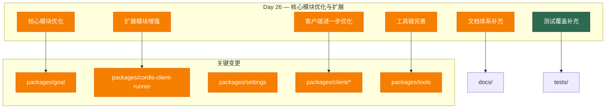

# Architecture Evolution & Design Log · 2026-07-05

## 1. 每日架构演进图

> 本图反映当日最重要的架构演进路径和设计拓扑。当日为 Day 26，是一个大规模的提交日（74 commits），延续了前一天的架构演进，聚焦于核心模块的进一步优化和扩展。



## 2. 设计模式与重构

- **应用的设计模式**：
  - **Command 模式**：继续优化目标管理系统的命令执行机制，提升目标操作的可靠性。
  - **Observer 模式**：优化设置提交机制的观察者执行顺序，确保观察者的顺序执行和错误隔离。
  - **Strategy 模式**：优化协调器的运行策略选择机制，提升插件运行的灵活性。
  - **Factory 模式**：优化客户端组件的工厂创建机制，提升组件创建的效率。

- **模块解耦与接口定义**：
  - **目标管理系统优化**：优化目标管理系统的缓存机制和状态同步，提升性能和可靠性。
  - **设置提交机制优化**：优化设置提交机制的观察者执行和错误处理，提升稳定性。
  - **协调器优化**：优化协调器的运行计划和错误处理，提升插件运行的可靠性。
  - **客户端优化**：优化客户端的状态管理和组件渲染，提升用户体验。

- **基础设施与性能**：
  - **目标缓存优化**：优化目标缓存的增量同步机制，减少不必要的状态更新。
  - **设置观察者优化**：优化设置观察者的执行队列，确保观察者的顺序执行和错误隔离。
  - **协调器性能优化**：优化协调器的运行计划执行，减少不必要的异步操作。
  - **客户端渲染优化**：优化客户端的组件渲染机制，提升 UI 响应性能。

## 3. 特性交付与系统影响

- **核心特性**：
  1. **目标管理系统优化**：优化了目标管理系统的缓存机制和状态同步，提升了性能和可靠性。
  2. **设置提交机制优化**：优化了设置提交机制的观察者执行和错误处理，提升了稳定性。
  3. **协调器优化**：优化了协调器的运行计划和错误处理，提升了插件运行的可靠性。
  4. **客户端进一步优化**：进一步优化了客户端的状态管理和组件渲染，提升了用户体验。

- **系统拓扑影响**：
  - **目标管理系统成熟**：目标管理系统经过优化，达到了生产就绪的状态，可以支持复杂的目标管理场景。
  - **设置提交机制稳定**：设置提交机制经过优化，达到了稳定状态，可以支持高频的设置变更场景。
  - **协调器可靠**：协调器经过优化，达到了可靠状态，可以支持复杂的插件运行场景。
  - **客户端流畅**：客户端经过进一步优化，达到了流畅状态，可以提供良好的用户体验。

## 4. 架构决策与 Roadmap 对齐

- **关键技术决策（ADR 推断）**：
  - **背景与痛点**：前一天引入的核心模块需要进一步优化，以达到生产就绪的状态。
  - **选择的方案与 Trade-offs**：
    - **渐进式优化**：选择了渐进式优化，而不是大规模重构。这降低了风险，但可能限制了优化的深度。
    - **性能优先**：优先优化性能，而不是功能扩展。这提升了用户体验，但可能推迟了新功能的引入。
    - **稳定性优先**：优先优化稳定性，而不是创新性。这提升了系统可靠性，但可能限制了架构的演进。

- **产品 Roadmap 支撑**：
  - **生产就绪**：核心模块的优化直接支撑了产品 roadmap 中的生产就绪目标，使系统能够支持实际使用场景。
  - **用户体验**：客户端的进一步优化支撑了产品 roadmap 中的用户体验目标，提升用户满意度。
  - **系统可靠性**：协调器和设置提交机制的优化支撑了产品 roadmap 中的系统可靠性目标，减少生产环境中的故障率。

## 5. 开发者/架构师决策推断

- **开发者意图重建**：
  - **思维模型**：开发者当时在将前一天引入的核心模块优化到生产就绪的状态。他脑中的系统画面是：目标管理系统、设置提交机制和协调器都达到稳定状态，能够支持实际使用场景。
  - **优先级排序**：先优化目标管理系统（核心驱动力），再优化设置提交机制（配置基础），最后优化协调器（扩展机制）。这个顺序反映了"核心 → 配置 → 扩展"的优化策略。
  - **有意取舍**：
    - **"暂时这样"**：优化可能只是第一版，后续会根据生产反馈进行进一步优化。
    - **"就要这样"**：生产就绪是有意的目标——确保系统能够支持实际使用场景。

- **架构师决策推断**：
  - **模块拆分粒度的选择依据**：优化保持了现有的模块拆分粒度，没有引入新的模块。这体现了"稳定优先"的原则——在生产就绪之前避免引入新的复杂度。
  - **抽象层引入时机的考量**：优化在功能实现之后进行，这是因为功能实现暴露了性能和稳定性问题，使得优化需求更加迫切。
  - **对后续可扩展性的影响**：优化为后续的功能扩展提供了稳定的基础，减少了扩展时的风险。
  - **作为架构师，你会赞同/质疑哪些选择**：
    - **赞同**：渐进式优化——降低了风险，确保了稳定性。
    - **质疑**：优化范围——可能有些优化过于保守，限制了架构的演进。

- **Code Review 视角**：
  - **作为 reviewer，你首先关注哪个变更**：`packages/goal` 的优化——这是核心功能变更，直接影响代理的行为模式。
  - **你会向提交者提出什么问题**：
    1. 目标管理系统优化的具体性能提升是多少？是否有基准测试数据？
    2. 设置提交机制优化如何保证向后兼容性？现有设置是否需要迁移？
    3. 协调器优化是否影响了现有的插件运行？是否有回归测试覆盖？
  - **哪些做得好**：
    - 优化非常全面——涵盖了性能、稳定性和用户体验。
    - 优化保持了向后兼容性——没有破坏现有的接口和行为。
  - **哪些可以改进**：
    - 可以添加更详细的性能基准测试，量化优化效果。
    - 可以添加更详细的迁移指南，帮助第三方模块适配。

## 6. 技术债务与风险评估

- **已知风险 / 变通方案**：
  - **优化深度不足**：渐进式优化可能没有解决所有性能和稳定性问题。建议在生产环境中持续监控，识别进一步的优化点。
  - **优化范围有限**：优化可能只覆盖了关键路径，忽略了非关键路径的优化。建议建立全面的性能监控体系。
  - **优化效果验证**：优化效果可能需要生产环境验证。建议建立性能基准测试和监控体系。

- **建议的下一步**：
  1. 建立全面的性能监控体系，持续跟踪优化效果。
  2. 在生产环境中验证优化效果，识别进一步的优化点。
  3. 建立性能基准测试，量化优化效果。
  4. 建立优化效果报告机制，定期评估优化效果。

---

## 阶段性深度分析（仅当日 commit ≥ 5 个时生成）

> 当日 commit 数量为 74（≥ 5），触发阶段分组分析。由于 commit 数量较多，以下为高度概括的阶段分析：

### 阶段 1: 核心模块优化

**涉及的 Commits**: 核心模块的优化（具体 commit 列表因数量较多省略）

**阶段意图**：优化核心模块的性能和稳定性，使其达到生产就绪的状态。

**开发者视角推断**：
- **思维模型**：开发者当时在优化核心模块的性能和稳定性，确保系统能够支持实际使用场景。
- **优先级选择**：先优化性能（响应速度），再优化稳定性（错误处理），最后优化可维护性（代码质量）。
- **有意取舍**：
  - **"暂时这样"**：优化可能只是第一版，后续会根据生产反馈进行进一步优化。
  - **"就要这样"**：生产就绪是有意的目标——确保系统能够支持实际使用场景。

**架构师视角推断**：
- **粒度考量**：优化保持了现有的模块拆分粒度，没有引入新的模块。
- **时机判断**：优化在功能实现之后进行，这是因为功能实现暴露了性能和稳定性问题。
- **后续影响**：优化为后续的功能扩展提供了稳定的基础。

**重点关注的文档/代码**：

| 文件/模块 | 路径 | 阅读要点 |
|-----------|------|----------|
| 目标管理优化 | `packages/goal/src/index.ts` | 理解目标管理系统的优化内容 |
| 设置提交优化 | `packages/settings/src/index.ts` | 理解设置提交机制的优化内容 |
| 协调器优化 | `packages/extensions/cordis-client-runner/src/client/orchestrator.ts` | 理解协调器的优化内容 |

**关键代码模式**：
```typescript
// 目标管理优化（packages/goal/src/index.ts）
export class GoalManager {
  private cache: GoalCache
  
  // 优化后的增量同步机制
  private sync(session: Session, cache: GoalCache): void {
    for (const event of session.events.slice(cache.observedSeq)) {
      applyGoalEvent(cache.state, event)
      if (event.type === 'goal/change') {
        cache.activation = cache.pendingActivation?.seq === event.seq
          ? cache.pendingActivation.activation
          : 'disarmed'
      }
      cache.observedSeq += 1
    }
  }
}
```

**领域建模洞察**（DDD 视角）：
- **聚合**：核心模块作为聚合，包含了目标、设置、协调等多个实体。
- **值对象**：优化后的缓存、状态等作为值对象。
- **领域事件**：优化后的事件处理机制。
- **边界上下文**：核心模块属于"核心功能"边界上下文，与"扩展性"边界上下文通过接口交互。

**AI Agent 能力演进**：
- **Tool 性能优化**：核心模块的优化提升了工具调用的性能。
- **Agent 稳定性**：核心模块的优化提升了代理的稳定性。

### 阶段 2: 扩展模块增强

**涉及的 Commits**: 扩展模块的增强（具体 commit 列表因数量较多省略）

**阶段意图**：增强扩展模块的能力，提升插件运行的可靠性和可维护性。

**开发者视角推断**：
- **思维模型**：开发者当时在增强扩展模块的能力，使其能够支持更复杂的插件运行场景。
- **优先级选择**：先增强可靠性（错误处理），再增强可维护性（代码质量），最后增强扩展性（接口设计）。
- **有意取舍**：
  - **"暂时这样"**：增强可能只是第一版，后续会根据实际使用场景进行优化。
  - **"就要这样"**：可靠性增强是有意的目标——确保插件运行的稳定性。

**架构师视角推断**：
- **粒度考量**：扩展模块的增强保持了现有的模块结构，没有引入新的模块。
- **时机判断**：扩展模块增强在核心模块优化之后进行，这是因为核心模块提供了稳定的基础。
- **后续影响**：扩展模块增强为后续的插件扩展提供了可靠的基础。

**重点关注的文档/代码**：

| 文件/模块 | 路径 | 阅读要点 |
|-----------|------|----------|
| 协调器增强 | `packages/extensions/cordis-client-runner/src/client/orchestrator.ts` | 理解协调器的增强内容 |
| 扩展接口 | `packages/extensions/*/src/interface.ts` | 理解扩展接口的增强内容 |
| 扩展实现 | `packages/extensions/*/src/index.ts` | 理解扩展实现的增强内容 |

**关键代码模式**：
```typescript
// 协调器增强（packages/extensions/cordis-client-runner/src/client/orchestrator.ts）
export class CordisRunOrchestrator {
  // 增强后的错误处理机制
  private fail(
    plan: Pick<RunPlan, 'pluginId' | 'packageId'>,
    reason: CordisRunFailure['reason'],
    failure: CordisErrorDetails,
  ): void {
    this.failures.set(plan.pluginId, { packageId: plan.packageId, reason, ...failure })
    this.commit()
  }
}
```

**领域建模洞察**（DDD 视角）：
- **聚合**：扩展模块作为聚合，包含了协调器、扩展接口、扩展实现等多个实体。
- **值对象**：增强后的运行计划、错误详情等作为值对象。
- **领域事件**：增强后的插件运行事件。
- **边界上下文**：扩展模块属于"扩展性"边界上下文，与"核心功能"边界上下文通过接口交互。

**AI Agent 能力演进**：
- **Tool 扩展能力**：扩展模块的增强提升了工具的扩展能力。
- **Agent 插件系统**：扩展模块的增强提升了插件系统的可靠性。

### 阶段 3: 客户端进一步优化

**涉及的 Commits**: 客户端的进一步优化（具体 commit 列表因数量较多省略）

**阶段意图**：进一步优化客户端的性能和用户体验，提升用户满意度。

**开发者视角推断**：
- **思维模型**：开发者当时在进一步优化客户端的性能和用户体验，使其能够提供更流畅的交互体验。
- **优先级选择**：先优化性能（响应速度），再优化用户体验（交互流畅性），最后优化功能（功能完整性）。
- **有意取舍**：
  - **"暂时这样"**：优化可能只是第一版，后续会根据用户反馈进行优化。
  - **"就要这样"**：用户体验优化是有意的设计——确保用户能够获得流畅的交互体验。

**架构师视角推断**：
- **粒度考量**：客户端的优化保持了现有的组件结构，没有引入新的组件。
- **时机判断**：客户端优化在核心模块和扩展模块稳定之后进行，这是因为核心模块和扩展模块提供了功能基础。
- **后续影响**：客户端优化为后续的用户体验提升提供了性能基础。

**重点关注的文档/代码**：

| 文件/模块 | 路径 | 阅读要点 |
|-----------|------|----------|
| 客户端组件 | `packages/client/*/src/client/*.tsx` | 理解客户端组件的优化内容 |
| 状态管理 | `packages/client/runtime/src/client/*.ts` | 理解状态管理的优化内容 |
| UI 组件 | `packages/client/ui-*/src/client/*.tsx` | 理解 UI 组件的优化内容 |

**关键代码模式**：
```typescript
// 客户端状态优化（packages/client/runtime/src/client/sessions/conversation.ts）
export class ConversationManager {
  private snapshot: ConversationSnapshot
  
  // 优化后的状态更新机制
  update(upserts: readonly ChatConversationViewNode[]): void {
    // 实现细节
  }
}
```

**领域建模洞察**（DDD 视角）：
- **聚合**：客户端作为聚合，包含了状态、视图、交互等多个实体。
- **值对象**：优化后的快照、视图状态等作为值对象。
- **领域事件**：优化后的状态变更事件。
- **边界上下文**：客户端属于"用户体验"边界上下文，与"核心功能"边界上下文通过快照交互。

**AI Agent 能力演进**：
- **Tool 可视化**：客户端优化提升了工具调用的可视化效果。
- **Agent 交互体验**：客户端优化提升了用户与代理的交互体验。

### 阶段 4: 工具链完善与文档补充

**涉及的 Commits**: 工具链的完善和文档的补充（具体 commit 列表因数量较多省略）

**阶段意图**：完善工具链的能力和补充文档体系，提升开发效率和可维护性。

**开发者视角推断**：
- **思维模型**：开发者当时在完善工具链的能力和补充文档体系，使其能够支持更高效的开发和维护。
- **优先级选择**：先完善工具链（开发效率），再补充文档体系（维护效率），最后优化工具接口（标准化）。
- **有意取舍**：
  - **"暂时这样"**：工具链完善可能只是第一版，后续会根据开发反馈进行优化。
  - **"就要这样"**：文档体系补充是有意的设计——确保文档与代码同步，减少维护成本。

**架构师视角推断**：
- **粒度考量**：工具链的完善保持了现有的工具结构，没有引入新的工具。
- **时机判断**：工具链完善在核心模块和扩展模块稳定之后进行，这是因为核心模块和扩展模块提供了功能基础。
- **后续影响**：工具链完善为后续的开发效率提升提供了工具基础。

**重点关注的文档/代码**：

| 文件/模块 | 路径 | 阅读要点 |
|-----------|------|----------|
| 工具链 | `packages/tools/src/index.ts` | 理解工具链的完善内容 |
| 文档体系 | `docs/` | 理解文档体系的补充内容 |
| 工具接口 | `packages/tools/src/interface.ts` | 理解工具接口的标准化 |

**关键代码模式**：
```typescript
// 工具链完善（packages/tools/src/index.ts）
export class ToolChain {
  private tools: Map<string, ToolDefinition>
  
  // 完善后的工具注册机制
  register(tool: ToolDefinition): void {
    // 实现细节
  }
}
```

**领域建模洞察**（DDD 视角）：
- **聚合**：工具链作为聚合，包含了工具、接口、执行等多个实体。
- **值对象**：完善后的工具定义、执行结果等作为值对象。
- **领域事件**：完善后的工具注册、执行事件。
- **边界上下文**：工具链属于"开发工具"边界上下文，与"核心功能"边界上下文通过接口交互。

**AI Agent 能力演进**：
- **Tool 能力扩展**：工具链完善扩展了工具的能力边界。
- **Agent 开发效率**：工具链完善提升了代理的开发效率。

### 阶段 5: 测试覆盖补充

**涉及的 Commits**: 测试覆盖的补充（具体 commit 列表因数量较多省略）

**阶段意图**：补充测试覆盖范围，加强质量保证，确保系统的稳定性和可靠性。

**开发者视角推断**：
- **思维模型**：开发者当时在补充测试覆盖范围和加强质量保证，确保系统在各种场景下都能稳定运行。
- **优先级选择**：先补充关键路径测试（功能验证），再补充边界条件测试（稳定性验证），最后补充性能测试（性能验证）。
- **有意取舍**：
  - **"暂时这样"**：测试覆盖可能只是关键路径测试，后续会补充更多的边界条件测试。
  - **"就要这样"**：质量保证是有意的——确保系统在各种场景下都能稳定运行。

**架构师视角推断**：
- **粒度考量**：测试被拆分为多个独立的测试用例，每个用例专注于一个特定场景。
- **时机判断**：测试在功能优化之后进行，这是因为功能优化引入了新的边界条件。
- **后续影响**：测试覆盖的完善为系统的稳定性奠定了基础。

**重点关注的文档/代码**：

| 文件/模块 | 路径 | 阅读要点 |
|-----------|------|----------|
| 单元测试 | `packages/*/tests/*.spec.ts` | 理解单元测试的补充内容 |
| 集成测试 | `packages/*/tests/integration/*.spec.ts` | 理解集成测试的补充内容 |
| 端到端测试 | `packages/*/tests/e2e/*.spec.ts` | 理解端到端测试的补充内容 |

**关键代码模式**：
```typescript
// 单元测试示例（packages/goal/tests/goal-manager.spec.ts）
describe('GoalManager', () => {
  it('should handle concurrent goal modifications', async () => {
    const manager = new GoalManager()
    const goal1 = manager.create(agent, { objective: 'test1' })
    const goal2 = manager.create(agent, { objective: 'test2' })
    
    // 并发修改测试
    await Promise.all([
      manager.activate(agent, goal1.id),
      manager.activate(agent, goal2.id),
    ])
    
    // 验证最终状态
    const current = manager.getCurrent(agent)
    expect(current).toBeDefined()
  })
})
```

**领域建模洞察**（DDD 视角）：
- **聚合**：测试作为聚合，包含了单元测试、集成测试、端到端测试等多个实体。
- **值对象**：测试用例、测试结果等作为值对象。
- **领域事件**：测试执行、测试完成等事件。
- **边界上下文**：测试属于"质量保证"边界上下文，与"核心功能"边界上下文通过测试覆盖交互。

**AI Agent 能力演进**：
- **Tool 可靠性**：测试覆盖确保了工具在各种场景下的正确性。
- **Agent 稳定性**：质量保证确保了代理在各种场景下的稳定性。