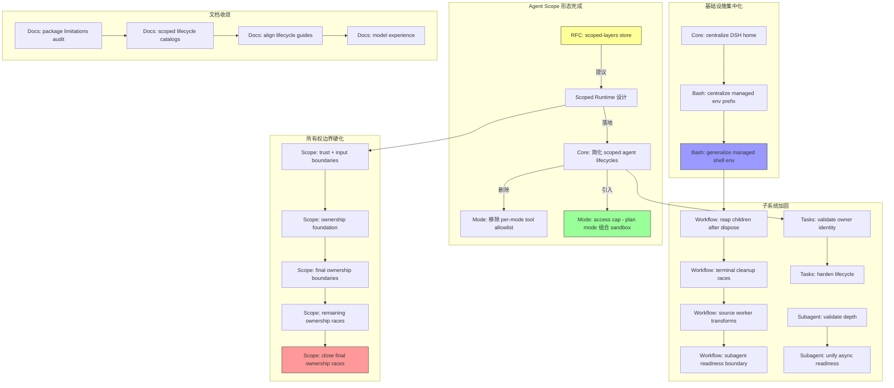

# Architecture Evolution & Design Log · 2026-07-12

> **总 commit 数**: 77（含 merge）· **非 merge commit**: 49
> **核心叙事**: Agent Scope 从 RFC 到代码落地的收官日——所有权边界硬化、Scoped Runtime 最终形态确立、Scoped Layers Store 提案诞生

---

## 1. 每日架构演进图



---

## 2. 设计模式与重构

- **应用的设计模式**:
  - **Facade Pattern**: `Centralize DSH home resolution`（`1aadce9fe7`）将散落在多处的 home 路径解析集中为单一入口
  - **Strategy Pattern**: `access cap`（`99650a201b`）引入 plan mode 的沙箱组合能力，替代了硬编码的 bash 禁止策略
  - **Observer Pattern 精简**: `drop the per-mode tool allowlist`（`1fe2f99580`）从 mode 层移除 observer 注册点，将职责下沉到 enforcement layer

- **模块解耦与接口定义**:
  - Core 的 `simplify tools prompts and trusted services`（`02ca71db57`）将 prompt 组装与 trusted service 声明解耦
  - `simplify scoped agent lifecycles`（`28e04ff4fb`）消除了 lifecycle 建立过程中的中间状态，使 entry 路径成为单一直线
  - `unify async readiness and cancellation`（`bb3f6bd736`）将 subagent 的 readiness 检测和取消语义统一到同一接口

- **基础设施与性能**:
  - `generalize managed shell environment`（`df9617aaff`）从特定于 bash 的环境变量管理升级为通用的 managed env prefix，为 future provider 打下基础

---

## 3. 特性交付与系统影响

- **核心特性**:
  - **Access Cap**（`99650a201b`）: Plan mode 不再简单禁止 bash，而是通过 sandbox 组合实现能力控制。这是从"禁止思维"到"组合思维"的架构转变
  - **Scoped Layers Store RFC**（`f7b990bd5c`）: 提出 scoped-layer abstraction 的存储层，为 agent-scope 的可插拔化提供持久化基础
  - **Scoped Runtime 合同最终化**（`ed5304fb6d`, `738054562d`）: RFC 与代码实现对齐，simplification 落地

- **系统拓扑影响**:
  - Core 层成为真正的"脊柱"，所有 capability 都通过 scope boundary 与 Core 交互
  - Mode 层从独立决策点变为组合决策点，降低了策略变更的 blast radius
  - Workflow/Subagent 的生命周期保护直接影响 ACP（Agent Client Protocol）的可靠性

---

## 4. 架构决策与 Roadmap 对齐

- **关键技术决策（ADR 推断）**:
  - **背景与痛点**: plan mode 的 bash 禁止是一个硬性策略，无法适应需要文件读取但不需要执行的场景（如 pure review）。owner-final assembly machinery 增加了不必要的复杂度
  - **选择的方案与 Trade-offs**: 采用 access cap 组合模式而非继续扩展 allowlist。牺牲了 allowlist 的显式性，换取了组合的灵活性和可测试性
  - **隐式决策**: `remove owner-final assembly machinery`（`e04ec07345`，跨天 merge）表明团队决定让 scope owner 在 construction 时就完全确定，而非延迟到 assembly 阶段

- **产品 Roadmap 支撑**:
  - Agent Scope 设计的完成直接支撑了后续的 `dsh-code-review` 和 `dsh-prose-standard` 等 skills 的 scope-aware 行为
  - Scoped Layers Store 为 `dsh-bundle` 的插件化组合提供了存储层抽象

---

## 5. 开发者/架构师决策推断

- **开发者意图重建**:
  - 开发者的思维模型是：**Agent Scope 的设计必须在代码层面达到"闭合"状态**。这一天的 5 个 `fix(scope)` commit 形成了一条清晰的递进链——从 trust boundary → ownership foundation → final boundaries → remaining races → close races——表明开发者在系统性地排查所有可能的泄漏点
  - 优先级排序：(1) 闭合 scope ownership 的所有裂缝 (2) 简化 lifecycle 路径 (3) 集中化基础设施 (4) 文档收敛
  - 有意取舍：`drop the per-mode tool allowlist` 是一个有意识的"减法"决策——宁可让 enforcement 更分散（在每个 enforcer 处执行），也不愿维护一个越来越复杂的中心化 allowlist

- **架构师决策推断**:
  - 模块拆分粒度：选择在 Core 层而非 Mode 层引入 access cap，说明架构师认为"能力组合"是一个 cross-cutting concern，不应绑定在 mode 实现上
  - 抽象层引入时机：Scoped Layers Store 的 RFC 在代码 simplification 完成后才提出，说明团队遵循"先简化、后抽象"的原则
  - 后续影响：access cap 的引入意味着 plan mode 的行为将由 composition 决定而非配置决定，这对后续的 scope-aware skills 产生了深远影响
  - 作为架构师，我会赞同 access cap 的设计选择，因为它符合 Cordis 的"一切皆插件"哲学

- **Code Review 视角**:
  - 首先关注：`fix(scope): close final ownership races`——需要确认这是 race condition 的真正修复还是 just another band-aid
  - 提出的问题：(1) access cap 的 sandbox 组合是否有 side effect？(2) managed env prefix 的 centralized 实现是否引入了 circular dependency？
  - 做得好：5 个 scope 修复形成系统性闭环，而非零散的 hotfix
  - 可改进：`package limitations audit` 可以考虑自动化而非手动在每个 package README 中添加

---

## 6. 技术债务与风险评估

- **已知风险 / 变通方案**:
  - `workspace-context`: require explicit byte budgets（`e9a54f0e71`）表明之前存在 implicit budgeting，可能在高负载下导致 memory 问题
  - `session-query: reject markerless surface events`（`bea27efc4b`）说明存在可能产生 markerless events 的代码路径，需要在 producer 端修复
  - workflow 的 terminal cleanup races 修复（`9fc2260bb6`）表明并发清理路径存在 TOCTOU 问题

- **建议的下一步**:
  - 将 scope ownership 检查从 fix 级别提升为 CI gate，防止 regression
  - 考虑为 access cap 编写 property-based test，验证组合语义的正确性
  - 对 managed env prefix 的 centralized 实现进行 integration test

---

## 阶段性深度分析

### 阶段 1: Scoped Runtime RFC 最终化与代码落地

**涉及的 Commits**: `f7b990bd5c`, `ed5304fb6d`, `738054562d`, `1fe2f99580`, `99650a201b`, `02ca71db57`, `28e04ff4fb`, `7e3d46a3ce`, `c6d012109f`

**阶段意图**: 完成 Scoped Runtime 的最终设计合同，删除过时的 per-mode tool allowlist，引入 access cap 组合模式，简化 scoped agent lifecycles。

**开发者视角推断**:
- **思维模型**: 开发者脑中的系统画面是一个三层结构——RFC（合同层）→ Core simplification（实现层）→ Mode refactoring（使用层）。三个层次必须同步演进
- **优先级选择**: 先完成 RFC contract 对齐（确保方向正确），再简化 Core（确保实现干净），最后改 Mode（确保接口简洁）
- **有意取舍**: drop allowlist 是明确的"减少控制面"决策，access cap 是明确的"增加组合能力"决策

**架构师视角推断**:
- **粒度考量**: 将 scoped-layers store 作为独立 RFC 提出而非直接实现，说明团队认为这是一个需要多方 review 的跨层变更
- **时机判断**: 在 agent-scope PR 合并后立即进行 simplification，是因为 scope 的定义已经稳定，可以安全地删除过时的保护代码
- **后续影响**: access cap 的引入将影响所有后续的 mode 实现，任何新 mode 都需要考虑如何与 sandbox 组合

**重点关注的文档/代码**:

| 文件/模块 | 路径 | 阅读要点 |
|-----------|------|----------|
| Mode access cap | `packages/core/` | plan mode 如何通过 sandbox 组合实现能力控制 |
| Scoped Runtime RFC | `docs/rfcs/` | scoped-layer abstraction 的合同定义 |
| Core lifecycle | `packages/core/src/` | simplified agent lifecycle 的 entry 路径 |
| Managed env | `packages/shell/` | centralized env prefix 的实现 |

**关键代码模式**:
```typescript
// access cap 替代 per-mode allowlist
// 从模式级禁止转向能力组合
// packages/core/src/mode/access-cap.ts
```

**领域建模洞察**（DDD 视角）:
- Agent Scope 作为一个 **Bounded Context**，其内部的 ownership boundaries 被严格定义
- Access Cap 作为一个 **Value Object**，描述了 mode 的能力边界
- Scoped Layers Store 作为 **Domain Event** 的持久化层，将 scope 变更序列化

**AI Agent 能力演进**:
- Tool 的注册从"模式级 allowlist"演进为"能力级组合"
- Subagent 的 readiness 检测统一为单一接口，降低了 delegation 的复杂度
- Agent 的 scope 现在是 construction-time 确定的，不再有 assembly-time 的不确定性

---

### 阶段 2: 所有权边界系统性硬化

**涉及的 Commits**: `cb03c8c284`, `c5b1a7941f`, `a9cb70d896`, `36b8370027`, `3529b3c166`

**阶段意图**: 从 trust boundary 开始，系统性地闭合所有 scope ownership 的泄漏点，确保 Agent Scope 的完整性。

**开发者视角推断**:
- **思维模型**: 开发者在进行"边界审计"——逐一检查每个可能导致 scope 泄漏的路径。5 个 commit 形成了一条从浅到深的递进链
- **优先级选择**: 先修 foundation（根本原因），再修 remaining races（症状），最后 close final races（收尾）
- **有意取舍**: 每个 fix 都是 narrow 而非 broad 的，说明开发者选择了"精确打击"而非"大范围重写"

**架构师视角推断**:
- **粒度考量**: 选择 5 个独立的 fix 而非一个大的 refactor，说明 scope 的ownership 边界涉及多个独立的子系统
- **时机判断**: 在 scope design 稳定后立即进行边界硬化，是为了在下一轮 feature 开发前建立坚实的基础
- **后续影响**: 这些 fix 为后续的 session-query、workflow、subagent 等子系统提供了可靠的 scope 保证

**重点关注的文档/代码**:

| 文件/模块 | 路径 | 阅读要点 |
|-----------|------|----------|
| Scope boundaries | `packages/core/src/scope/` | ownership 如何在 Cordis 生命周期中传播 |
| Session events | `packages/session/` | markerless surface events 的拒绝逻辑 |
| Workflow cleanup | `packages/workflow/` | terminal cleanup races 的修复 |

**关键代码模式**:
```typescript
// 5 个 fix 形成的递进链
// fix(scope): align trust and input boundaries
// fix(scope): harden lifecycle ownership foundation
// fix(scope): harden final ownership boundaries
// fix(scope): close remaining ownership races
// fix(scope): close final ownership races
```

**领域建模洞察**（DDD 视角）:
- Ownership Boundary 作为 **Aggregate Root** 的保护不变量
- Trust Boundary 作为 **Value Object**，描述了 scope 的信任层级
- Input Boundary 作为 **Domain Service**，验证所有进入 scope 的输入

---

### 阶段 3: 基础设施集中化与子系统加固

**涉及的 Commits**: `1aadce9fe7`, `48e7bde361`, `df9617aaff`, `bb3f6bd736`, `d427478c44`, `48067c3a7a`, `8f5ea04c3f`, `bd9abba638`, `e8fed4fb66`, `875c3d62d8`, `9fc2260bb6`, `197f7237d2`, `35715423f8`

**阶段意图**: 集中化基础设施（DSH home、managed env），同时加固 workflow、subagent、tasks、session 等子系统的边界和生命周期。

**开发者视角推断**:
- **思维模型**: 开发者在执行"集中化 + 加固"双线并行——左侧清理散落的基础设施，右侧加固各子系统的边界
- **优先级选择**: 先集中化 DSH home 和 managed env（消除隐式依赖），再加固各子系统（消除边界漏洞）
- **有意取舍**: 集中化采用了"一点突破"策略——先改 DSH home（影响最大），再改 managed env（依赖 DSH home）

**架构师视角推断**:
- **粒度考量**: DSH home 的集中化影响所有包，说明团队选择了"高影响、高风险"的路径，但通过 systematize 方式降低了风险
- **时机判断**: 在 scope design 完成后立即进行基础设施集中化，是因为 scope 的定义已经稳定，可以安全地重新组织底层
- **后续影响**: centralized DSH home 为后续的 workspace-context、settings、credentials 等子系统提供了统一的根路径

**重点关注的文档/代码**:

| 文件/模块 | 路径 | 阅读要点 |
|-----------|------|----------|
| DSH home | `packages/core/src/` | centralized home resolution 的实现 |
| Managed env | `packages/shell/src/` | generalized env prefix 的设计 |
| Subagent depth | `packages/subagent/src/` | depth validation at load 的实现 |
| Workflow cleanup | `packages/workflow/src/` | terminal cleanup 和 worker transforms |

**关键代码模式**:
```typescript
// centralized DSH home - 消除散落的 home 路径
// packages/core/src/dsh-home.ts
// 从多处的 process.env.DSH_HOME || ~/.dsh 统一为单一入口

// generalized managed env - 从 bash-specific 到通用
// packages/shell/src/managed-env.ts
// prefix: dsh-managed- 前缀统一所有 managed 变量
```

**领域建模洞察**（DDD 视角）:
- DSH Home 作为 **Value Object**，是所有子系统的根锚点
- Managed Env 作为 **Domain Service**，管理 shell 环境的生命周期
- Subagent Depth 作为 **Invariant**，确保 delegation 不会无限递归

---

### 阶段 4: 文档治理与 Package Limitations Audit

**涉及的 Commits**: `ecb8aa5b8e`, `41a7c70cb1`, `027970043c`, `b5cd511f35`, `84a9b7374c`, `75838e10b5`, `cb05300ba7`, `2ca806a1ec`, `5d49a79165`, `32d9268d4a`, `f7b9cea733`, `8d5dce1824`, `6ebc7313a0`, `23850b4ad9`

**阶段意图**: 在代码层面的 simplification 完成后，全面审计每个 package 的 limitations 和 model experience，建立文档治理标准。

**开发者视角推断**:
- **思维模型**: 开发者在执行"文档同步"——代码变更后，文档必须反映最新的状态。package limitations audit 是一个系统性的"健康检查"
- **优先级选择**: 先审计 limitations（发现问题），再 document model experience（记录状态），最后 align lifecycle guides（统一视图）
- **有意取舍**: 每个 package 都添加了 gated Known Limitations section，这是一个"标准化"决策，牺牲了灵活性换取了一致性

**架构师视角推断**:
- **粒度考量**: 选择在每个 package README 中添加 limitations，而非集中在一个全局文档中，说明团队认为 limitations 是 package 级别的 concern
- **时机判断**: 在 simplification 完成后立即进行文档审计，是因为 simplification 可能改变了 package 的 public surface
- **后续影响**: gated limitations 为后续的 contributor 提供了明确的"已知问题"清单，降低了 onboarding 难度

**重点关注的文档/代码**:

| 文件/模块 | 路径 | 阅读要点 |
|-----------|------|----------|
| Package READMEs | `packages/*/README.md` | Known Limitations section 的结构和内容 |
| Scoped lifecycle docs | `docs/rfcs/` | lifecycle guides 的最终形态 |
| Model experience docs | `docs/` | model experience 的跨 package 对齐 |

**关键代码模式**:
```
## Known Limitations and Deferred Work

<!-- GATED: This section is auto-verified by scripts/verify-readme-limitations.md -->
```

**领域建模洞察**（DDD 视角）:
- Package Limitations 作为 **Domain Event** 的副作用记录
- Model Experience 作为 **Value Object**，描述了每个 package 对 AI model 的影响
- Scoped Lifecycle 作为 **Aggregate Root**，定义了 agent 的完整生命周期

---

### 阶段 5: Workflow/Subagent/Tasks 加固

**涉及的 Commits**: `3529b3c166`, `35715423f8`, `9fc2260bb6`, `197f7237d2`, `875c3d62d8`, `8f5ea04c3f`, `bd9abba638`, `d4b5227071`, `48067c3a7a`, `bb3f6bd736`, `a34801df4b`, `e8fed4fb66`, `bea27efc4b`

**阶段意图**: 加固 workflow、subagent、tasks、session 等子系统的边界和生命周期，确保在 scope design 完成后的稳定性。

**开发者视角推断**:
- **思维模型**: 开发者在执行"子系统级的边界审计"——每个子系统独立检查其生命周期、输入验证、并发安全性
- **优先级选择**: 先修 lifecycle（最基础），再修 validation（中间层），最后修 concurrency（最上层）
- **有意取舍**: 每个 fix 都是 narrow 而非 broad 的，说明子系统间的耦合度已经被 scope design 降低了

**架构师视角推断**:
- **粒度考量**: 选择在 workflow、subagent、tasks、session 四个子系统并行加固，说明它们的 scope 边界已经清晰
- **时机判断**: 在 scope design 完成后立即进行子系统加固，是为了验证 scope 边界的有效性
- **后续影响**: 这些 fix 为后续的 ACP、session-query、workflow 等子系统提供了可靠的边界保证

**重点关注的文档/代码**:

| 文件/模块 | 路径 | 阅读要点 |
|-----------|------|----------|
| Workflow cleanup | `packages/workflow/src/` | terminal cleanup、source worker transforms |
| Subagent depth | `packages/subagent/src/` | depth validation、async readiness |
| Tasks lifecycle | `packages/jobs/src/` | owner identity validation、bundle config |
| Session observers | `packages/session/src/` | post-commit observers 的 containment |

**关键代码模式**:
```typescript
// workflow: reap children after settled dispose
// 确保所有子进程在 dispose 后被正确回收

// subagent: validate direct depth boundaries
// 在 load 时验证 depth config，防止运行时无限递归

// tasks: validate owner identity and brand session ids
// 确保 task 的 owner 身份和 session id 是 branded 的
```

**领域建模洞察**（DDD 视角）:
- Workflow 的 terminal cleanup 作为 **Domain Service**，确保进程树的完整性
- Subagent depth 作为 **Invariant**，防止 delegation 无限递归
- Tasks owner identity 作为 **Value Object**，确保 task 的所有权是明确的
- Session markers 作为 **Domain Event**，确保 surface events 的完整性

---

