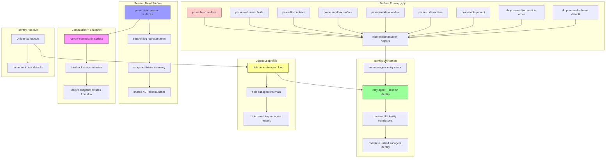

# Architecture Evolution & Design Log · 2026-07-14

> **总 commit 数**: 528（含 merge）· **非 merge commit**: 151
> **核心叙事**: 大简化日——20+ 并行分支同时推进 Surface Pruning、Identity Unification、Agent Loop 隐藏、Session Dead Surface 清理、Compaction 优化、Snapshot Noise Trim

---

## 1. 每日架构演进图



---

## 2. 设计模式与重构

- **应用的设计模式**:
  - **Facade Pattern（大规模应用）**: 20+ 个 `simp-*` 分支同时执行 Surface Pruning，将内部实现 helpers 隐藏在 public facade 后面
  - **Adapter Pattern**: `unify agent and session identity`（`709cc7200e`）将 agent identity 和 session identity 统一为单一模型
  - **Mediator Pattern**: `share ACP callback cleanup`（`d4c96deac3`）将 ACP 的 cleanup 逻辑集中到共享的 mediator 中

- **模块解耦与接口定义**:
  - **Surface Pruning 系列**（`225796c90d`, `f85b831bd2`, `65521b589f`, `0236a12324`, `01da49a3ab`, `4f40197e16`, `f9db1a6a08`, `8c8b422f17`, `b2025337b5`, `c3148d46d5`, `5c82310f47`, `91075e010a`, `3ab35de64f`, `0c88df78b2`, `582a8ba288`, `26e2fe9356`, `0815ff4db4`, `f1373cd7ab`, `5e9131e824`）: 系统性地将 15+ 个包的 internal helpers 隐藏，只暴露 public facade
  - **Identity Unification 系列**（`709cc7200e`, `61136b22bb`, `7a33ee94be`, `17c99efcc1`）: 将 agent identity 和 session identity 统一为单一模型，移除翻译层
  - **Compaction Surface 精简**（`d7de8a8d13`）: 收窄 compaction 的 public surface，只暴露必要的接口

- **基础设施与性能**:
  - `derive event graphs and scope invariants from TypeScript`（`c67c3d9413`）: 从 TypeScript 源码自动推导 event graph 和 scope invariant，消除了手动维护的开销
  - `derive snapshot session fixtures from disk`（`e481288a3a`）: 从磁盘自动推导 snapshot fixture，消除了手动维护的开销
  - `share loader smoke harness`（`0815ff4db4`）: 共享 loader smoke test 的 harness，减少了测试代码的重复

---

## 3. 特性交付与系统影响

- **核心特性**:
  - **Surface Pruning 完成**: 15+ 个包的 internal helpers 被隐藏，只暴露 public facade。这是 DeepSeek Harness 从"开放实现"到"封装实现"的关键转折
  - **Identity Unification**: Agent identity 和 session identity 统一为单一模型，消除了翻译层和 entry mirror
  - **Agent Loop 封装**: Concrete agent loop 和 subagent internals 被隐藏在 public interface 后面
  - **Session Dead Surface 清理**: 死代码、过时的 surface、snapshot noise 被系统性清理
  - **Cross-family File Sandbox**（`2dc62497ce`）: 引入跨平台的文件沙箱策略

- **系统拓扑影响**:
  - 所有包的 public surface 被严格定义，internal implementation 不再是 API 的一部分
  - Identity 的统一意味着 agent 和 session 的身份管理可以共享代码和测试
  - Agent Loop 的封装意味着外部代码不再依赖 agent loop 的内部结构
  - Session Dead Surface 的清理减少了维护负担和认知负荷

---

## 4. 架构决策与 Roadmap 对齐

- **关键技术决策（ADR 推断）**:
  - **背景与痛点**: 随着包数量增长，每个包的 internal helpers 都可能被外部代码依赖，导致 refactoring 困难。Agent identity 和 session identity 的分离导致了翻译层和维护负担
  - **选择的方案与 Trade-offs**: 采用"大规模并行 simplification"策略——20+ 个分支同时推进，每个分支专注于一个包或一个关注点。牺牲了单个 PR 的 review 深度，换取了整体的推进速度
  - **隐式决策**: `derive event graphs from TypeScript` 表明团队决定将 event graph 的定义从文档/手写代码迁移到 TypeScript 类型系统，以确保一致性

- **产品 Roadmap 支撑**:
  - Surface Pruning 为后续的 API 稳定性承诺提供了基础
  - Identity Unification 为后续的 agent 管理和 session 管理提供了统一的模型
  - Agent Loop 封装为后续的 agent 替换和 hot-swap 提供了基础
  - Cross-family File Sandbox 为后续的跨平台支持提供了基础

---

## 5. 开发者/架构师决策推断

- **开发者意图重建**:
  - 开发者的思维模型是：**DeepSeek Harness 需要从"开发态"过渡到"产品态"**。Surface Pruning、Identity Unification、Agent Loop 封装都是为了建立清晰的 public API boundary
  - 优先级排序：(1) Surface Pruning（最大面积的清理） (2) Identity Unification（消除翻译层） (3) Agent Loop 封装（保护内部结构） (4) Session Dead Surface（减少维护负担） (5) Compaction + Snapshot（提升测试可靠性）
  - 有意取舍：20+ 个并行分支的策略是一个有意的"高吞吐量"决策——接受更多的 merge conflict 风险，换取更快的整体进度

- **架构师决策推断**:
  - 模块拆分粒度：Surface Pruning 按包粒度进行，每个包独立 pruning，说明团队认为包是 API boundary 的最小单元
  - 抽象层引入时机：Identity Unification 在 Surface Pruning 完成后才进行，是因为 identity 是 cross-cutting concern，需要在 surface 稳定后才能安全地统一
  - 后续影响：Surface Pruning 的完成意味着后续的 API 变更需要通过 semver 管理，而非直接修改 internal
  - 作为架构师，我会赞同大规模并行 simplification 的策略，因为它与 AGENTS.md 中的"Pre-release stance: foundation over blast radius"一致

- **Code Review 视角**:
  - 首先关注：`unify agent and session identity`（`709cc7200e`）——这是一个 cross-cutting change，影响所有依赖 identity 的代码
  - 提出的问题：(1) Surface Pruning 后，哪些 internal API 仍然被需要？(2) Identity Unification 是否引入了 backward incompatibility？(3) Agent Loop 封装后，hot-swap 的可行性如何？
  - 做得好：20+ 个并行分支的协调非常好，每个分支都有清晰的 scope 和 merge 策略
  - 可改进：可以考虑在 Surface Pruning 完成后添加 API surface 的自动化验证

---

## 6. 技术债务与风险评估

- **已知风险 / 变通方案**:
  - Surface Pruning 可能导致某些 external tool 或 plugin 的 API 依赖断裂
  - Identity Unification 可能引入 subtle 的 identity comparison 问题
  - Agent Loop 封装可能影响 ACP 的 hook 点和 extension mechanism
  - `fix: reject legacy session events on every path`（`b35d66b86d`）表明存在 legacy session event 的兼容性问题

- **建议的下一步**:
  - 为每个 pruned package 添加 API surface 的 automated test
  - 为 Identity Unification 添加 identity comparison 的 property-based test
  - 为 Agent Loop 封装添加 hook point 的 stability test
  - 考虑引入 API surface 的 automated diff 工具

---

## 阶段性深度分析

### 阶段 1: Surface Pruning 大军

**涉及的 Commits**: `225796c90d`, `f85b831bd2`, `65521b589f`, `0236a12324`, `01da49a3ab`, `4f40197e16`, `f9db1a6a08`, `8c8b422f17`, `b2025337b5`, `c3148d46d5`, `5c82310f47`, `91075e010a`, `3ab35de64f`, `0c88df78b2`, `582a8ba288`, `26e2fe9356`, `0815ff4db4`, `f1373cd7ab`, `5e9131e824`

**阶段意图**: 系统性地将 15+ 个包的 internal helpers 隐藏，建立清晰的 public API boundary。

**开发者视角推断**:
- **思维模型**: 开发者在执行"API boundary 建设"——每个包都有一个 public facade 和一个 hidden internal，refactoring 只影响 internal
- **优先级选择**: 先修 core surface（影响最大），再修 peripheral surfaces（影响较小），最后修 testing harness（确保可测试性）
- **有意取舍**: 每个 pruning 都是 narrow 而非 broad 的——只隐藏真正 internal 的 helpers，不改变 public API

**架构师视角推断**:
- **粒度考量**: 选择按包粒度进行 pruning，而非按功能粒度，是因为包是 TypeScript 模块系统的边界
- **时机判断**: 在 Identity Unification 和 Agent Loop 封装之前完成 Surface Pruning，是因为 surface 稳定后才能安全地统一 identity 和封装 loop
- **后续影响**: Surface Pruning 的完成意味着所有包的 public API 都是 explicitly defined，不再有 implicit 的 API surface

**重点关注的文档/代码**:

| 文件/模块 | 路径 | 阅读要点 |
|-----------|------|----------|
| Bash surface | `packages/shell/src/` | implementation helpers 的隐藏 |
| Web seam | `packages/web/src/` | seam fields 的 pruning |
| LLM contract | `packages/llm/src/` | adapter helpers 的隐藏 |
| Sandbox | `packages/sandbox/src/` | implementation helpers 的隐藏 |
| Workflow worker | `packages/workflow/src/` | worker surface 的 narrowing |
| Code runtime | `packages/code-runtime/src/` | surface 的 pruning |
| Tools prompt | `packages/core/src/` | tool and prompt surface 的 pruning |
| FS internals | `packages/fs/src/` | implementation helpers 的隐藏 |

**关键代码模式**:
```typescript
// before: internal helpers exposed as public API
export function internalHelper() { ... }

// after: internal helpers hidden behind facade
// packages/xxx/src/internal/ (not exported)
// packages/xxx/src/index.ts (only public API exported)
```

**领域建模洞察**（DDD 视角）:
- Public Facade 作为 **Aggregate Root** 的外部接口
- Internal Helpers 作为 **Domain Service** 的实现细节
- API Boundary 作为 **Bounded Context** 的边界

---

### 阶段 2: Identity Unification

**涉及的 Commits**: `709cc7200e`, `61136b22bb`, `7a33ee94be`, `17c99efcc1`, `9ebb40b84b`

**阶段意图**: 将 agent identity 和 session identity 统一为单一模型，消除翻译层和 entry mirror。

**开发者视角推断**:
- **思维模型**: 开发者的脑中是一个"统一的身份模型"——agent 和 session 共享同一个 identity，不再需要 translation
- **优先级选择**: 先移除 agent entry mirror（消除冗余），再统一 identity（合并模型），最后移除 UI translations（清理翻译层）
- **有意取舍**: 统一 identity 牺牲了 agent 和 session 的独立性，换取了代码的简洁性和一致性

**架构师视角推断**:
- **粒度考量**: 选择在 agent 和 session 之间统一 identity，而非在更细的粒度上统一，是因为 identity 是一个 cross-cutting concern
- **时机判断**: 在 Surface Pruning 完成后才进行 Identity Unification，是因为 surface 稳定后才能安全地改变 identity 的引用方式
- **后续影响**: Identity Unification 意味着后续的 agent 管理和 session 管理可以共享 identity 验证逻辑

**重点关注的文档/代码**:

| 文件/模块 | 路径 | 阅读要点 |
|-----------|------|----------|
| Agent identity | `packages/core/src/` | agent identity 的定义 |
| Session identity | `packages/session/src/` | session identity 的定义 |
| UI translations | `packages/sdk/src/` | identity translation 的移除 |
| Subagent identity | `packages/subagent/src/` | unified subagent identity |

**关键代码模式**:
```typescript
// before: agent identity 和 session identity 分离
agentId !== sessionId // 需要 translation

// after: 统一 identity
agentId === sessionId // 无需 translation
```

**领域建模洞察**（DDD 视角）:
- Identity 作为 **Value Object**，统一了 agent 和 session 的身份标识
- Translation Layer 作为 **Domain Service** 的冗余实现，被移除
- Entry Mirror 作为 **Aggregate Root** 的冗余引用，被移除

---

### 阶段 3: Agent Loop 封装

**涉及的 Commits**: `225796c90d`, `f85b831bd2`, `65521b589f`

**阶段意图**: 将 concrete agent loop 和 subagent internals 隐藏在 public interface 后面，保护内部结构。

**开发者视角推断**:
- **思维模型**: 开发者在构建"agent loop 的黑盒"——外部代码只需要知道 agent loop 的 public API，不需要知道内部实现
- **优先级选择**: 先隐藏 concrete agent loop（核心），再 hide subagent internals（依赖），最后 hide remaining helpers（收尾）
- **有意取舍**: 封装牺牲了 agent loop 的可调试性，换取了 API 的稳定性

**架构师视角推断**:
- **粒度考量**: Agent Loop 被封装为一个 black box，说明团队认为 loop 的内部实现是一个 implementation detail
- **时机判断**: 在 Surface Pruning 完成后才进行 Agent Loop 封装，是因为 surface 稳定后才能安全地改变 loop 的引用方式
- **后续影响**: Agent Loop 封装为后续的 agent 替换和 hot-swap 提供了基础

**重点关注的文档/代码**:

| 文件/模块 | 路径 | 阅读要点 |
|-----------|------|----------|
| Agent loop | `packages/core/src/agent-loop/` | concrete loop 的封装 |
| Subagent internals | `packages/subagent/src/` | internal helpers 的隐藏 |
| Remaining helpers | `packages/subagent/src/` | remaining helpers 的隐藏 |

**关键代码模式**:
```typescript
// before: concrete agent loop exposed
export class ConcreteAgentLoop { ... }

// after: concrete agent loop hidden
// packages/core/src/agent-loop/internal/ (not exported)
// packages/core/src/agent-loop/index.ts (only public API exported)
```

**领域建模洞察**（DDD 视角）:
- Agent Loop 作为 **Aggregate Root** 的内部实现，被封装在 black box 中
- Subagent Internals 作为 **Domain Service** 的实现细节，被隐藏
- Public Interface 作为 **Bounded Context** 的外部接口，被严格定义

---

### 阶段 4: Session Dead Surface 清理

**涉及的 Commits**: `d060c0dd4f`, `1123e946c0`, `e481288a3a`, `0e7d539bbc`, `8ffcef7db9`, `d958d9fac6`

**阶段意图**: 清理 session 的死代码、过时 surface、snapshot noise，提升测试可靠性。

**开发者视角推断**:
- **思维模型**: 开发者在执行"session 的健康检查"——逐一排查 dead surface、过时的 snapshot、noise
- **优先级选择**: 先清理 dead surface（消除死代码），再简化 log representation（提升可读性），最后从 disk 导出 fixture（自动化测试）
- **有意取舍**: 从 disk 导出 fixture 牺牲了 fixture 的灵活性，换取了自动化和一致性

**架构师视角推断**:
- **粒度考量**: Session Dead Surface 的清理按功能粒度进行，每个功能独立清理，说明 session 的功能边界已经清晰
- **时机判断**: 在 Identity Unification 和 Agent Loop 封装之后才进行 Session Dead Surface 清理，是因为 identity 和 loop 的稳定是 session 清理的前提
- **后续影响**: Session Dead Surface 的清理减少了维护负担，为后续的 session-query 和 session-persistence 提供了干净的基础

**重点关注的文档/代码**:

| 文件/模块 | 路径 | 阅读要点 |
|-----------|------|----------|
| Session surfaces | `packages/session/src/` | dead surface 的清理 |
| Session log | `packages/session/src/` | log representation 的简化 |
| Snapshot fixtures | `packages/session/` | fixture 的 disk 导出 |

**关键代码模式**:
```typescript
// before: dead session surfaces
export function deadSurface() { ... } // 从未被调用

// after: dead surface removed
// 消除了 dead code，减少了维护负担

// before: snapshot fixtures 手动维护
const fixture = { ... } // 手动编写

// after: snapshot fixtures 从 disk 导出
const fixture = readFromDisk('fixture.json') // 自动化
```

**领域建模洞察**（DDD 视角）:
- Dead Surface 作为 **Domain Event** 的过时实现，被移除
- Log Representation 作为 **Value Object**，简化了 session 的内部表示
- Snapshot Fixtures 作为 **Domain Service** 的测试数据，从 disk 自动导出

---

### 阶段 5: Compaction + Snapshot 优化

**涉及的 Commits**: `d7de8a8d13`, `f95a411b0a`, `458f87ea03`, `dbe65e1d13`, `b35d66b86d`, `6ad4b4fa42`

**阶段意图**: 精简 compaction 的 surface，清理 hook snapshot noise，确保 snapshot fixture 的一致性。

**开发者视角推断**:
- **思维模型**: 开发者在执行"compaction 和 snapshot 的优化"——收窄 compaction 的 public surface，清理 hook snapshot 的 noise
- **优先级选择**: 先 narrow compaction surface（消除冗余），再 trim hook snapshot noise（提升清晰度），最后 derive fixtures from disk（自动化）
- **有意取舍**: Compaction surface 的 narrowing 牺牲了灵活性，换取了接口的简洁性

**架构师视角推断**:
- **粒度考量**: Compaction surface 的 narrowing 按功能粒度进行，每个功能独立 narrowing，说明 compaction 的功能边界已经清晰
- **时机判断**: 在 Session Dead Surface 清理之后才进行 Compaction 优化，是因为 session 的稳定是 compaction 优化的前提
- **后续影响**: Compaction surface 的 narrowing 为后续的 compaction provider 提供了清晰的接口

**重点关注的文档/代码**:

| 文件/模块 | 路径 | 阅读要点 |
|-----------|------|----------|
| Compaction | `packages/compaction/src/` | surface 的 narrowing |
| Hook snapshot | `packages/hooks/` | noise 的清理 |
| Snapshot fixtures | `packages/session/` | fixture 的一致性 |

**关键代码模式**:
```typescript
// before: compaction surface 过宽
export function compactionHelper1() { ... }
export function compactionHelper2() { ... }
export function compactionHelper3() { ... }

// after: compaction surface 精简
export function compact() { ... } // 唯一的 public API
```

**领域建模洞察**（DDD 视角）:
- Compaction Surface 作为 **Aggregate Root** 的外部接口，被精简
- Hook Snapshot 作为 **Domain Event** 的测试数据，被清理
- Snapshot Fixtures 作为 **Domain Service** 的测试数据，从 disk 自动导出

---

