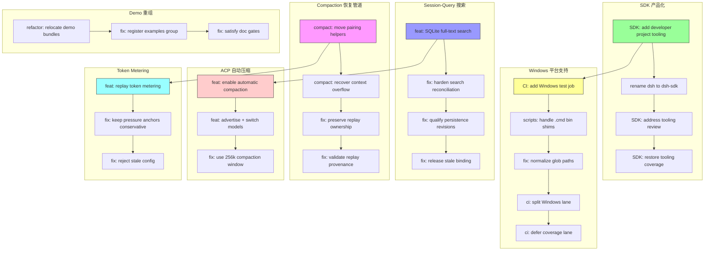

# Architecture Evolution & Design Log · 2026-07-15

> **总 commit 数**: 374（含 merge）· **非 merge commit**: 112
> **核心叙事**: SDK 产品化 + Windows 支持 + Session-Query 搜索 + Compaction 恢复管道 + Demo 重组 + ACP 自动压缩

---

## 1. 每日架构演进图



---

## 2. 设计模式与重构

- **应用的设计模式**:
  - **Builder Pattern**: SDK developer project tooling（`42b07a7022`）提供了构建 SDK 项目的标准化工具链
  - **Repository Pattern**: SQLite full-text search（`ecf90ff382`）将 session-query 的搜索能力从内存迁移到 SQLite FTS
  - **Strategy Pattern**: Provider-routed LLM adapters（`e547980d77`）将 LLM adapter 的选择与 provider 关联
  - **State Machine**: Automatic compaction（`6eddf38a77`）引入了 compaction 的状态机，管理从 normal 到 overflow 的转换

- **模块解耦与接口定义**:
  - `extract stdio plugin package`（`80fbeefbd6`）: 将 stdio plugin 从 core 拆分为独立 package，降低了 core 的依赖
  - `share ACP callback cleanup`（`d4c96deac3`）: 将 ACP 的 cleanup 逻辑集中到共享的实现中
  - `move workspace-context to context group`（`72bb02e68e`）: 将 workspace-context 从 core 迁移到 context group，符合功能分组

- **基础设施与性能**:
  - `perf(snapshot): parallelize replay scenarios`（`a28d95afb2`）: 将 snapshot replay 从串行优化为并行
  - `perf(gates): cap workers and reuse build output`（`cb153f3df8`）: 限制 CI gate 的 worker 数量并复用构建产物
  - `perf(docs): reuse built declarations for typecheck`（`092126ae50`）: 复用构建的 declarations 进行 typecheck

---

## 3. 特性交付与系统影响

- **核心特性**:
  - **SDK 产品化**（`42b07a7022`, `d8f6251e3a`, `e150bc446d`, `394706fa3c`）: 完整的 SDK developer project tooling，包括 rename（dsh → dsh-sdk）、tooling review、coverage 恢复
  - **Windows 平台支持**（`fd5931752c`, `65d07a490f`, `ae8aedb2fd`, `007001677d`, `47858df1ef`）: 完整的 Windows CI 支持，包括 test job、script fixes、path normalization、lane splitting
  - **Session-Query SQLite FTS**（`ecf90ff382`, `f88ca85ffd`, `35edf2a825`, `de863aab9a`）: 将 session-query 的搜索能力从内存迁移到 SQLite full-text search
  - **Compaction 恢复管道**（`cc546c4580`, `12484104c8`, `99dccf559a`, `634840d406`）: 完整的 compaction recovery pipeline，包括 pairing helpers、context overflow recovery、replay ownership preservation
  - **ACP 自动压缩**（`6eddf38a77`, `f1d39921c9`, `5ca3eab6ce`）: ACP 的自动 compaction 能力，包括 model switching 和 compaction window 配置
  - **Demo 重组**（`6f77da4c8c`, `e4691a2f79`, `2a48b31306`, `6dde9f70f0`）: 将 demo app bundles 重新组织到 `packages/examples/*-demo`
  - **Token Metering**（`f038780ff6`, `06e0450b8d`, `19a56ec542`）: replay token metering 和 pressure anchor 管理

- **系统拓扑影响**:
  - SDK 产品化扩展了 DeepSeek Harness 的 developer experience
  - Windows 支持扩展了 DeepSeek Harness 的平台覆盖
  - Session-Query FTS 提升了 session 搜索的性能和可扩展性
  - Compaction recovery pipeline 提升了长对话的稳定性
  - ACP auto-compaction 提升了 ACP 的自动化程度

---

## 4. 架构决策与 Roadmap 对齐

- **关键技术决策（ADR 推断）**:
  - **背景与痛点**: SDK 缺乏 developer project tooling，Windows 平台缺乏 CI 支持，session-query 的搜索依赖内存（无法持久化），compaction 缺乏 recovery 能力
  - **选择的方案与 Trade-offs**: SDK tooling 采用 "rename + tooling" 模式，牺牲了向后兼容性换取了命名的一致性。Windows 支持采用 "non-blocking" 模式（continue-on-error），牺牲了 Windows 的可靠性信号换取了 CI 的稳定性。Session-Query FTS 采用 SQLite 模式，牺牲了分布式能力换取了单机性能
  - **隐式决策**: Compaction recovery pipeline 的 "pairing helpers → context overflow recovery → replay ownership" 三阶段模式表明团队选择了渐进式恢复而非全量恢复

- **产品 Roadmap 支撑**:
  - SDK productization 支撑了 SDK 的 GA（General Availability）
  - Windows support 支撑了 Windows 开发者社区
  - Session-Query FTS 支撑了 session 的大规模搜索需求
  - Compaction recovery 支撑了长对话场景的稳定性
  - ACP auto-compaction 支撑了 ACP 的无人值守运行

---

## 5. 开发者/架构师决策推断

- **开发者意图重建**:
  - 开发者的思维模型是：**DeepSeek Harness 需要从 "Node.js-only, Linux-only" 进化为 "multi-platform, multi-language"**。SDK tooling、Windows support、Python SDK 都是这一进化的组成部分
  - 优先级排序：(1) SDK 产品化 (2) Windows 支持 (3) Session-Query 搜索 (4) Compaction 恢复 (5) ACP 自动压缩 (6) Demo 重组
  - 有意取舍：Windows CI 采用 non-blocking 模式是一个有意的"渐进式支持"决策——先确保不阻塞 CI，再逐步提升 Windows 的可靠性

- **架构师决策推断**:
  - 模块拆分粒度：Demo bundles 被重组到 `packages/examples/*-demo`，说明团队认为 demo 是 first-class 的 package，而非附属物
  - 抽象层引入时机：Session-Query FTS 在内存搜索的性能瓶颈出现后才引入，说明团队遵循 "先实现、后优化" 的原则
  - 后续影响：Compaction recovery pipeline 的引入意味着后续的 compaction provider 都需要支持 recovery 能力
  - 作为架构师，我会质疑 Windows CI 的 non-blocking 策略是否会导致 Windows-specific 的问题被忽略

- **Code Review 视角**:
  - 首先关注：`feat(compact): recover context overflow`（`12484104c8`）——这是 compaction recovery 的核心实现，需要仔细审查 recovery 逻辑的正确性
  - 提出的问题：(1) SDK rename 是否影响了所有内部引用？(2) Windows path normalization 是否覆盖了所有 edge case？(3) SQLite FTS 的 migration 是否向后兼容？
  - 做得好：Compaction recovery pipeline 的三阶段设计非常清晰，每一步都有明确的职责
  - 可改进：Windows CI 可以考虑添加 Windows-specific 的 integration test

---

## 6. 技术债务与风险评估

- **已知风险 / 变通方案**:
  - `fix: break chunk runs on time gaps that cannot subtract exactly`（`8f5c592b9f`）表明 session chunk 的时间处理存在 edge case
  - `fix: preserve interrupted post-tool context`（`edfc4dc4ac`）表明 post-tool context 的 interrupted 处理需要特别关注
  - `fix: drain failed ACP launches`（`2027c70a17`）表明 ACP launch 的 failure 处理需要 drain 而非 abort
  - `fix: reject legacy header deltas on append`（`539850578a`）表明 legacy session header 的兼容性需要特别处理

- **建议的下一步**:
  - 为 Windows 平台添加 integration test suite
  - 为 Compaction recovery pipeline 添加 property-based test
  - 为 Session-Query FTS 添加 performance benchmark
  - 为 SDK rename 添加 automated migration guide

---

## 阶段性深度分析

### 阶段 1: SDK 产品化

**涉及的 Commits**: `42b07a7022`, `d8f6251e3a`, `e150bc446d`, `394706fa3c`, `8f9c13ffaa`

**阶段意图**: 构建完整的 SDK developer project tooling，包括 rename（dsh → dsh-sdk）、tooling review、coverage 恢复。

**开发者视角推断**:
- **思维模型**: 开发者的脑中是一个完整的 SDK developer experience——从 project setup 到 build 到 test 到 publish，每个环节都需要标准化的 tooling
- **优先级选择**: 先 rename（命名一致性），再 tooling（开发者体验），最后 coverage（质量保证）
- **有意取舍**: rename 牺牲了向后兼容性，换取了命名的一致性和品牌清晰度

**架构师视角推断**:
- **粒度考量**: SDK tooling 被拆分为多个独立的 commit，说明团队认为 tooling 的每个方面都可以独立 review
- **时机判断**: 在 Surface Pruning 完成后才进行 SDK tooling，是因为 surface 稳定后才能建立可靠的 tooling
- **后续影响**: SDK tooling 的完成意味着后续的 SDK 变更都可以通过标准化的 tooling 进行

**重点关注的文档/代码**:

| 文件/模块 | 路径 | 阅读要点 |
|-----------|------|----------|
| SDK tooling | `packages/sdk/` | developer project tooling 的实现 |
| SDK rename | `packages/sdk/` | dsh → dsh-sdk 的 rename |
| SDK coverage | `packages/sdk/` | tooling coverage 的恢复 |

**关键代码模式**:
```typescript
// SDK rename: dsh → dsh-sdk
// packages/dsh-sdk/src/ (new name)
// packages/sdk/ → packages/dsh-sdk/ (rename)

// SDK tooling: developer project tooling
// packages/dsh-sdk/tooling/ (build, test, publish tools)
```

**领域建模洞察**（DDD 视角）:
- SDK Tooling 作为 **Domain Service**，提供了 SDK 项目的标准化工具链
- SDK Rename 作为 **Value Object**，统一了 SDK 的命名
- SDK Coverage 作为 **Invariant**，确保 SDK 的质量标准

---

### 阶段 2: Windows 平台支持

**涉及的 Commits**: `fd5931752c`, `65d07a490f`, `ae8aedb2fd`, `007001677d`, `47858df1ef`, `ae7b132f62`, `cb69ca80d6`, `32cfd6c513`, `82794c5681`, `7b0310cac4`, `e6e587b97d`

**阶段意图**: 构建完整的 Windows CI 支持，包括 test job、script fixes、path normalization、lane splitting。

**开发者视角推断**:
- **思维模型**: 开发者在执行"Windows 适配"——逐一排查每个可能在 Windows 上失败的点，从 path 到 script 到 CI lane
- **优先级选择**: 先添加 test job（基础），再 fix scripts（兼容性），最后 split lanes（隔离）
- **有意取舍**: Windows CI 采用 non-blocking 模式是一个有意的"渐进式支持"决策

**架构师视角推断**:
- **粒度考量**: Windows 支持被拆分为 10+ 个独立的 commit，说明团队认为 Windows 适配的每个方面都需要独立处理
- **时机判断**: 在 SDK productization 完成后才进行 Windows 支持，是因为 SDK 是 Windows 支持的前置依赖
- **后续影响**: Windows 支持的完成意味着 DeepSeek Harness 可以在 Windows 平台上运行

**重点关注的文档/代码**:

| 文件/模块 | 路径 | 阅读要点 |
|-----------|------|----------|
| CI workflow | `.github/workflows/` | Windows test job 的配置 |
| Scripts | `scripts/` | Windows path 和 script fixes |
| EditorConfig | `.editorconfig` | LF 和 final-newline 约定 |
| GitAttributes | `.gitattributes` | LF working trees 的配置 |

**关键代码模式**:
```bash
# Windows path normalization
split(sep).join('/') # 统一路径分隔符

# Windows script handling
node JS entry # 避免 .cmd bin shim 的问题

# CI lane splitting
windows-2025 job # 独立的 Windows CI lane
```

**领域建模洞察**（DDD 视角）:
- Windows Support 作为 **Bounded Context**，将平台特定的适配隔离在独立的 context 中
- Path Normalization 作为 **Value Object**，统一了跨平台的路径表示
- CI Lane Splitting 作为 **Domain Service**，将 Windows 的 CI 与 Linux 隔离

---

### 阶段 3: Session-Query SQLite FTS

**涉及的 Commits**: `ecf90ff382`, `f88ca85ffd`, `35edf2a825`, `de863aab9a`, `4505c6c55a`

**阶段意图**: 将 session-query 的搜索能力从内存迁移到 SQLite full-text search，提升性能和可扩展性。

**开发者视角推断**:
- **思维模型**: 开发者在执行"搜索能力升级"——从内存搜索迁移到 SQLite FTS，同时处理 persistence binding 和 reconciliation
- **优先级选择**: 先实现 FTS（核心能力），再 harden reconciliation（可靠性），最后 simplify binding（简化）
- **有意取舍**: SQLite FTS 牺牲了分布式能力，换取了单机性能和持久化

**架构师视角推断**:
- **粒度考量**: Session-Query FTS 被拆分为 5 个独立的 commit，说明团队认为搜索能力的每个方面都需要独立 review
- **时机判断**: 在 Identity Unification 完成后才进行 Session-Query FTS，是因为 identity 的稳定是 session 搜索的前提
- **后续影响**: SQLite FTS 的引入意味着后续的 session 搜索都可以通过 SQLite FTS 进行

**重点关注的文档/代码**:

| 文件/模块 | 路径 | 阅读要点 |
|-----------|------|----------|
| Session-Query | `packages/session-query/` | SQLite FTS 的实现 |
| Persistence | `packages/session-query/` | persistence binding 的 hardening |
| Reconciliation | `packages/session-query/` | search reconciliation 的处理 |

**关键代码模式**:
```sql
-- SQLite FTS: session search
CREATE VIRTUAL TABLE session_fts USING fts5(content);

-- Persistence binding: qualified by store
binding = getBinding(store) // 按 store 限定 binding
```

**领域建模洞察**（DDD 视角）:
- Session FTS 作为 **Domain Service**，提供了 session 的全文搜索能力
- Persistence Binding 作为 **Value Object**，描述了 session 的持久化绑定
- Reconciliation 作为 **Domain Service**，处理搜索结果的一致性

---

### 阶段 4: Compaction 恢复管道

**涉及的 Commits**: `cc546c4580`, `12484104c8`, `99dccf559a`, `634840d406`, `d3f8cb0f23`

**阶段意图**: 构建完整的 compaction recovery pipeline，包括 pairing helpers、context overflow recovery、replay ownership preservation。

**开发者视角推断**:
- **思维模型**: 开发者在构建"compaction 的恢复能力"——从 pairing helpers（基础）到 context overflow recovery（核心）到 replay ownership（可靠性）
- **优先级选择**: 先 move pairing helpers（重构），再 recover context overflow（核心），最后 preserve replay ownership（可靠性）
- **有意取舍**: 三阶段恢复模式牺牲了恢复的完整性，换取了恢复的渐进性和可调试性

**架构师视角推断**:
- **粒度考量**: Compaction recovery 被拆分为 5 个独立的 commit，说明团队认为 recovery 的每个阶段都需要独立 review
- **时机判断**: 在 Session-Query FTS 完成后才进行 Compaction recovery，是因为 session 的稳定性是 compaction recovery 的前提
- **后续影响**: Compaction recovery pipeline 的引入意味着后续的 compaction provider 都需要支持 recovery 能力

**重点关注的文档/代码**:

| 文件/模块 | 路径 | 阅读要点 |
|-----------|------|----------|
| Compaction | `packages/compaction/src/` | recovery pipeline 的实现 |
| Pairing | `packages/compaction/src/` | pairing helpers 的重构 |
| Replay | `packages/llm/src/` | replay ownership 的 preserved |

**关键代码模式**:
```typescript
// compaction recovery: 三阶段模式
// PR1: move pairing helpers
// PR2: recover context overflow
// PR3: preserve replay ownership

// context overflow recovery
if (context.overflowed()) {
  await compact(); // 触发 compaction
  await replay(); // 重放 tool results
}
```

**领域建模洞察**（DDD 视角）:
- Compaction Recovery 作为 **Domain Service**，提供了 compaction 的恢复能力
- Pairing Helpers 作为 **Value Object**，描述了 tool 的 pairing 关系
- Replay Ownership 作为 **Invariant**，确保 replay 的所有权正确

---

### 阶段 5: ACP 自动压缩 + Token Metering

**涉及的 Commits**: `6eddf38a77`, `f1d39921c9`, `5ca3eab6ce`, `f038780ff6`, `06e0450b8d`, `19a56ec542`

**阶段意图**: 实现 ACP 的自动 compaction 能力和 replay token metering。

**开发者视角推断**:
- **思维模型**: 开发者在构建"ACP 的自动化能力"——从 model switching（灵活性）到 auto-compaction（自动化）到 token metering（可观测性）
- **优先级选择**: 先 enable auto-compaction（核心），再 advertise + switch models（灵活性），最后 token metering（可观测性）
- **有意取舍**: Auto-compaction 的 256k window 是一个有意的"保守"决策——宁可多 compact，也不让 context overflow

**架构师视角推断**:
- **粒度考量**: ACP auto-compaction 和 token metering 被拆分为 6 个独立的 commit，说明团队认为自动化和可观测性的每个方面都需要独立 review
- **时机判断**: 在 Compaction recovery pipeline 完成后才进行 ACP auto-compaction，是因为 recovery 是 auto-compaction 的前提
- **后续影响**: ACP auto-compaction 的引入意味着 ACP 可以无人值守运行

**重点关注的文档/代码**:

| 文件/模块 | 路径 | 阅读要点 |
|-----------|------|----------|
| ACP | `packages/acp/` | auto-compaction 的实现 |
| LLM | `packages/llm/src/` | replay token metering 的实现 |
| Token meter | `packages/llm/src/` | pressure anchor 的管理 |

**关键代码模式**:
```typescript
// ACP auto-compaction
if (context.tokens > 256_000) {
  await compact(); // 自动触发 compaction
}

// token metering
const meter = new TokenMeter();
meter.measure(request); // 测量 token 使用量
meter.setAnchor('pressure', threshold); // 设置压力锚点
```

**领域建模洞察**（DDD 视角）:
- ACP Auto-compaction 作为 **Domain Service**，提供了 ACP 的自动压缩能力
- Token Metering 作为 **Value Object**，描述了 token 的使用量
- Pressure Anchor 作为 **Invariant**，确保 token 使用量不超过阈值

---

