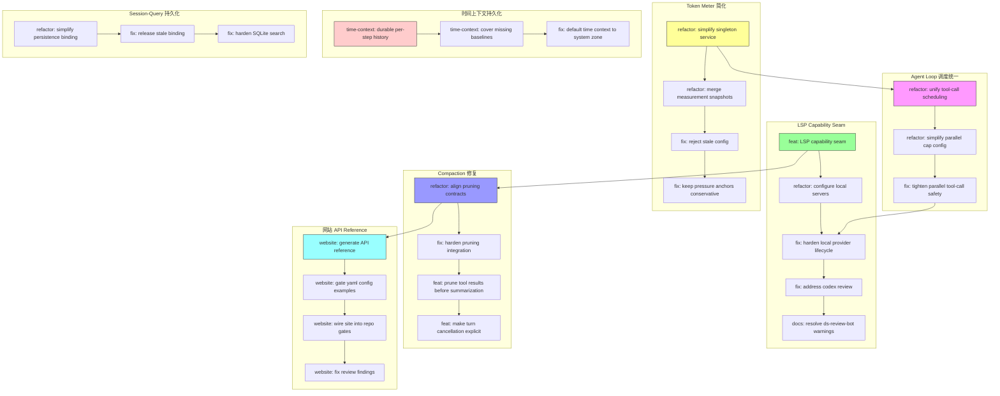

# Architecture Evolution & Design Log · 2026-07-16

> **总 commit 数**: 150（含 merge）· **非 merge commit**: 81
> **核心叙事**: LSP Capability Seam 落地 + Token Meter 简化 + Compaction 修复 + Agent Loop 调度统一 + 时间上下文持久化 + 网站 API Reference 生成

---

## 1. 每日架构演进图



---

## 2. 设计模式与重构

- **应用的设计模式**:
  - **Capability Seam Pattern**: LSP capability seam（`d0029d8d60`）完美体现了 DeepSeek Harness 的 capability seam 设计——Service Definition / Service Provider / Consumer 三角色完整
  - **Singleton Pattern**: Token meter singleton（`5c243e8a8d`）将 token metering 收敛为单一实例，简化了状态管理
  - **Pipeline Pattern**: Compaction pruning（`ce96104a77`）将 tool results 的 pruning 集成到 summarization pipeline 中
  - **Rolling Pool Pattern**: Agent loop scheduling（`3b1d1bfa12`）将 tool-call scheduling 统一到一个 rolling pool + factory cap default

- **模块解耦与接口定义**:
  - `configure local servers together`（`a63c55eb00`）: 将 LSP local server 的配置集中管理
  - `inline automatic listeners into the service`（`d027ea0d10`）: 将 compaction 的 automatic listeners 内联到 service 中，消除了外部注册点
  - `move workspace-context to context group`（`72bb02e68e`）: 将 workspace-context 迁移到 context group，符合功能分组
  - `store tool-pairing balance once per surface cut`（`2793325df0`): 将 tool-pairing balance 的存储从 per-surface 改为 per-cut，简化了状态管理

- **基础设施与性能**:
  - `add shared AgentLoop testkit`（`d3b959389a`）: 引入共享的 AgentLoop testkit，减少了测试代码的重复
  - `website: generate API reference from source`（`efba9fab0a`）: 从源码自动生成 API reference，消除了手动维护的开销
  - `website: gate every yaml config example`（`da26138592`）: 将 yaml config example 与真实 plugin surface 关联，确保文档的一致性

---

## 3. 特性交付与系统影响

- **核心特性**:
  - **LSP Capability Seam**（`d0029d8d60`, `a63c55eb00`, `0d8e7e98f7`, `8e8f90e235`, `0f3f0efd9c`, `43d419ac5c`）: 完整的 LSP capability seam，包括 Service Definition、generic stdio provider、lsp tool
  - **Token Meter 简化**（`5c243e8a8d`, `6d96b3e4a8`, `19a56ec542`, `06e0450b8d`）: Token meter 从复杂的多实例模式简化为 singleton service
  - **Compaction 修复**（`ba4a57c7d1`, `171bae5c20`, `ce96104a77`, `c238992fbb`）: Compaction pruning contracts 的对齐、pruning integration 的加固、tool results 的 summarization 前 pruning、turn cancellation 的显式化
  - **Agent Loop 调度统一**（`3b1d1bfa12`, `91da66e715`, `17fe9e5b1e`）: Tool-call scheduling 统一到 rolling pool + factory cap default
  - **时间上下文持久化**（`46e63a004c`, `c5381de8b2`, `528f9cba62`）: time-context 的 durable per-step history 和 baseline 覆盖
  - **网站 API Reference**（`efba9fab0a`, `da26138592`, `6ce9f16030`, `fcd9d8c391`）: 从源码自动生成 API reference，并集成到 repo gates
  - **Goal-based Loop RFC**（`8a33e7cd00`）: 提出 harness-level goal-based loop 的 RFC

- **系统拓扑影响**:
  - LSP capability seam 扩展了 DeepSeek Harness 的 LSP 集成能力
  - Token meter 简化降低了 token metering 的维护负担
  - Compaction 修复提升了长对话的稳定性
  - Agent loop 调度统一提升了并发 tool-call 的安全性和可预测性
  - 时间上下文持久化提升了 session 的时间感知能力
  - 网站 API Reference 提升了 developer documentation 的质量

---

## 4. 架构决策与 Roadmap 对齐

- **关键技术决策（ADR 推断）**:
  - **背景与痛点**: Token meter 的多实例模式导致状态管理复杂，tool-call scheduling 的分散导致并发安全性难以保证，compaction 的 pruning 与 summarization 耦合导致扩展困难
  - **选择的方案与 Trade-offs**: Token meter 采用 singleton 模式，牺牲了分布式能力换取了状态管理的简洁性。Tool-call scheduling 统一到 rolling pool，牺牲了调度的灵活性换取了并发安全性。Compaction pruning 从 summarization 中分离，牺牲了 pipeline 的简洁性换取了扩展性
  - **隐式决策**: LSP capability seam 的 generic stdio provider 表明团队决定将 LSP 集成作为 first-class capability，而非 special-case

- **产品 Roadmap 支撑**:
  - LSP capability seam 支撑了 IDE 集成和 code intelligence
  - Token meter 简化支撑了 token 使用量的可观测性
  - Compaction 修复支撑了长对话场景的稳定性
  - Agent loop 调度统一支撑了并发 tool-call 的安全性
  - 时间上下文持久化支撑了 session 的时间感知能力
  - 网站 API Reference 支撑了 developer documentation 的质量

---

## 5. 开发者/架构师决策推断

- **开发者意图重建**:
  - 开发者的思维模型是：**DeepSeek Harness 需要从 "feature-rich" 进化为 "production-ready"**。LSP capability seam、token meter simplification、compaction fixes 都是为了提升系统的可靠性和可维护性
  - 优先级排序：(1) LSP capability seam (2) Token meter simplification (3) Compaction fixes (4) Agent loop scheduling (5) Time context persistence (6) Website API Reference
  - 有意取舍：Token meter 的 singleton 模式是一个有意的"简化"决策——宁可牺牲分布式能力，也要确保状态管理的简洁性

- **架构师决策推断**:
  - 模块拆分粒度：LSP capability seam 被拆分为 6 个独立的 commit（含 review fixes），说明团队认为 capability seam 的每个方面都需要独立 review
  - 抽象层引入时机：Token meter 从多实例简化为 singleton，说明团队认为 token metering 是一个全局 concern，不需要多实例
  - 后续影响：Agent loop 调度统一意味着后续的 tool-call 都可以通过 rolling pool 进行调度
  - 作为架构师，我会赞同 LSP capability seam 的设计，因为它完美体现了 DeepSeek Harness 的 capability seam 架构

- **Code Review 视角**:
  - 首先关注：`feat(lsp): LSP capability seam`（`d0029d8d60`）——这是 LSP 集成的核心实现，需要仔细审查 capability seam 的三角色是否完整
  - 提出的问题：(1) Token meter singleton 是否引入了全局状态污染？(2) Compaction pruning 与 summarization 的分离是否引入了 ordering 问题？(3) Rolling pool 的 factory cap default 是否与 per-agent cap 冲突？
  - 做得好：LSP capability seam 的三角色设计非常清晰，符合 DeepSeek Harness 的架构哲学
  - 可改进：Website API Reference 可以考虑添加版本化的 API diff

---

## 6. 技术债务与风险评估

- **已知风险 / 变通方案**:
  - `fix: drain cross-realm execution promises`（`b1e19d8b69`）表明 cross-realm 的 promise 处理存在 edge case
  - `fix: preserve abort-observer replacements`（`55916f931d`）表明 abort observer 的 replacement 处理需要特别关注
  - `fix: reject duplicate configured identities`（`b2064cba10`）表明 configured identity 的重复检测需要加强
  - `fix: close startup failure gaps`（`d56cc8d424`）表明 startup failure 的处理存在 gap

- **建议的下一步**:
  - 为 LSP capability seam 添加 integration test with real LSP servers
  - 为 Token meter singleton 添加 concurrency test
  - 为 Compaction pruning 添加 property-based test
  - 为 Agent loop rolling pool 添加 stress test

---

## 阶段性深度分析

### 阶段 1: LSP Capability Seam

**涉及的 Commits**: `d0029d8d60`, `a63c55eb00`, `0d8e7e98f7`, `8e8f90e235`, `0f3f0efd9c`, `43d419ac5c`, `575feaddfa`, `3368f7924f`, `e92ec69f32`

**阶段意图**: 构建完整的 LSP capability seam，包括 Service Definition、generic stdio provider、lsp tool。

**开发者视角推断**:
- **思维模型**: 开发者的脑中是一个完整的 LSP 集成——从 Service Definition（合同层）到 generic stdio provider（传输层）到 lsp tool（使用层），三个层次必须完整
- **优先级选择**: 先定义 Service Definition（合同），再实现 generic stdio provider（传输），最后实现 lsp tool（使用）
- **有意取舍**: generic stdio provider 牺牲了 protocol-specific 的优化，换取了通用性

**架构师视角推断**:
- **粒度考量**: LSP capability seam 被拆分为 9 个独立的 commit（含 review fixes），说明团队认为 capability seam 的每个方面都需要独立 review
- **时机判断**: 在 Agent Loop 调度统一之后才进行 LSP capability seam，是因为 LSP tool 依赖于 tool-call scheduling
- **后续影响**: LSP capability seam 的完成意味着 DeepSeek Harness 可以集成任何 LSP server

**重点关注的文档/代码**:

| 文件/模块 | 路径 | 阅读要点 |
|-----------|------|----------|
| LSP Service Definition | `packages/lsp/` | capability seam 的合同定义 |
| LSP Provider | `packages/lsp/src/` | generic stdio provider 的实现 |
| LSP Tool | `packages/lsp/src/` | lsp tool 的实现 |
| LSP Config | `packages/lsp/` | lsp-local config fields |

**关键代码模式**:
```typescript
// LSP capability seam: 三角色完整
// Service Definition: 定义 LSP 的能力合同
// Service Provider: generic stdio provider 实现传输
// Consumer: lsp tool 暴露给 agent

// generic stdio provider
const provider = new GenericStdioProvider({
  command: 'typescript-language-server',
  args: ['--stdio'],
});
```

**领域建模洞察**（DDD 视角）:
- LSP Capability Seam 作为 **Bounded Context**，将 LSP 集成隔离在独立的 context 中
- Service Definition 作为 **Aggregate Root**，定义了 LSP 的能力合同
- Generic stdio provider 作为 **Domain Service**，提供了 LSP 的传输能力

---

### 阶段 2: Token Meter 简化

**涉及的 Commits**: `5c243e8a8d`, `6d96b3e4a8`, `19a56ec542`, `06e0450b8d`

**阶段意图**: 将 token meter 从复杂的多实例模式简化为 singleton service。

**开发者视角推断**:
- **思维模型**: 开发者在执行"token meter 的简化"——从多实例模式简化为 singleton，同时处理 stale config 和 pressure anchor
- **优先级选择**: 先 simplify singleton（核心），再 merge snapshots（优化），最后 reject stale config + conservative anchors（可靠性）
- **有意取舍**: Singleton 模式牺牲了分布式能力，换取了状态管理的简洁性

**架构师视角推断**:
- **粒度考量**: Token meter simplification 被拆分为 4 个独立的 commit，说明团队认为 token metering 的每个方面都需要独立 review
- **时机判断**: 在 LSP capability seam 完成后才进行 Token meter simplification，是因为 LSP tool 依赖于 token metering
- **后续影响**: Token meter simplification 意味着后续的 token 使用量管理都可以通过 singleton 进行

**重点关注的文档/代码**:

| 文件/模块 | 路径 | 阅读要点 |
|-----------|------|----------|
| Token meter | `packages/llm/src/` | singleton service 的实现 |
| Measurement | `packages/llm/src/` | measurement snapshots 的合并 |
| Config | `packages/llm/src/` | stale config 的检测 |

**关键代码模式**:
```typescript
// token meter singleton
const meter = TokenMeter.instance; // 单一实例

// measurement snapshots 合并
meter.mergeSnapshots(snapshots); // 合并多次测量

// stale config 检测
if (config.stale) {
  throw new Error('config is stale'); // 拒绝过时配置
}
```

**领域建模洞察**（DDD 视角）:
- Token Meter 作为 **Aggregate Root**，管理 token 使用量的状态
- Measurement Snapshots 作为 **Value Object**，描述了 token 的测量结果
- Pressure Anchor 作为 **Invariant**，确保 token 使用量不超过阈值

---

### 阶段 3: Compaction 修复

**涉及的 Commits**: `ba4a57c7d1`, `171bae5c20`, `ce96104a77`, `c238992fbb`, `d027ea0d10`, `2793325df0`

**阶段意图**: 对齐 compaction 的 pruning contracts，加固 pruning integration，在 summarization 前 pruning tool results，显式化 turn cancellation。

**开发者视角推断**:
- **思维模型**: 开发者在执行"compaction 的可靠性提升"——逐一排查 pruning contracts、integration、tool results、turn cancellation
- **优先级选择**: 先 align contracts（基础），再 harden integration（可靠性），最后 prune tool results + explicit cancellation（优化）
- **有意取舍**: Tool results pruning 在 summarization 前进行，牺牲了 summarization 的完整性，换取了 context 的控制

**架构师视角推断**:
- **粒度考量**: Compaction 修复被拆分为 6 个独立的 commit，说明团队认为 compaction 的每个方面都需要独立 review
- **时机判断**: 在 Token meter simplification 完成后才进行 Compaction 修复，是因为 compaction 依赖于 token metering
- **后续影响**: Compaction 修复意味着后续的 compaction provider 都需要支持 pruning contracts

**重点关注的文档/代码**:

| 文件/模块 | 路径 | 阅读要点 |
|-----------|------|----------|
| Compaction | `packages/compaction/src/` | pruning contracts 的对齐 |
| Pruning | `packages/compaction/src/` | tool results 的 pruning |
| Cancellation | `packages/core/src/` | turn cancellation 的显式化 |

**关键代码模式**:
```typescript
// pruning contracts: 确保 pruning 语义一致
interface PruningContract {
  prune(results: ToolResult[]): ToolResult[];
}

// tool results pruning: summarization 前 pruning
const pruned = contract.prune(toolResults); // 先 pruning
const summary = await summarize(pruned); // 再 summarization

// turn cancellation: 显式化
if (turn.cancelled) {
  throw new TurnCancelledError(); // 显式抛出
}
```

**领域建模洞察**（DDD 视角）:
- Compaction Pruning 作为 **Domain Service**，管理 tool results 的 pruning
- Pruning Contract 作为 **Value Object**，定义了 pruning 的语义
- Turn Cancellation 作为 **Domain Event**，描述了 turn 的取消状态

---

### 阶段 4: Agent Loop 调度统一

**涉及的 Commits**: `3b1d1bfa12`, `91da66e715`, `17fe9e5b1e`

**阶段意图**: 将 tool-call scheduling 统一到 rolling pool + factory cap default。

**开发者视角推断**:
- **思维模型**: 开发者在执行"调度统一"——将分散的 tool-call scheduling 收敛到一个 rolling pool，同时简化 parallel cap config
- **优先级选择**: 先 unify scheduling（核心），再 simplify config（优化），最后 tighten safety（可靠性）
- **有意取舍**: Rolling pool 牺牲了调度的灵活性，换取了并发安全性

**架构师视角推断**:
- **粒度考量**: Agent loop scheduling 被拆分为 3 个独立的 commit，说明团队认为调度的每个方面都需要独立 review
- **时机判断**: 在 Compaction 修复完成后才进行 Agent loop scheduling，是因为 compaction 依赖于 tool-call scheduling
- **后续影响**: Agent loop scheduling 统一意味着后续的 tool-call 都可以通过 rolling pool 进行调度

**重点关注的文档/代码**:

| 文件/模块 | 路径 | 阅读要点 |
|-----------|------|----------|
| Agent loop | `packages/core/src/agent-loop/` | rolling pool 的实现 |
| Scheduling | `packages/core/src/agent-loop/` | tool-call scheduling 的统一 |
| Safety | `packages/core/src/agent-loop/` | parallel tool-call safety |

**关键代码模式**:
```typescript
// rolling pool: 统一 tool-call scheduling
const pool = new RollingPool({
  maxParallel: factoryCapDefault, // factory cap default
});

// scheduling: 统一到 pool
pool.schedule(toolCall); // 通过 pool 调度

// safety: 严格验证
if (!pool.validate(toolCall)) {
  throw new SchedulingError(); // 拒绝不安全的调度
}
```

**领域建模洞察**（DDD 视角）:
- Rolling Pool 作为 **Aggregate Root**，管理 tool-call 的调度状态
- Factory Cap Default 作为 **Value Object**，描述了并发的默认上限
- Scheduling Safety 作为 **Invariant**，确保 tool-call 的调度是安全的

---

### 阶段 5: 时间上下文持久化 + 网站 API Reference

**涉及的 Commits**: `46e63a004c`, `c5381de8b2`, `528f9cba62`, `efba9fab0a`, `da26138592`, `6ce9f16030`, `fcd9d8c391`, `4c49677469`, `20bcd66dbf`, `83cb48441e`

**阶段意图**: 实现 time-context 的 durable per-step history，同时构建网站的 API Reference 生成管道。

**开发者视角推断**:
- **思维模型**: 开发者在并行推进两条线——(1) time-context 的持久化 (2) 网站的 API Reference 生成
- **优先级选择**: 先 time-context durable history（核心），再 website API reference（文档），最后 fix review findings（质量）
- **有意取舍**: Time-context 的 per-step history 牺牲了存储效率，换取了时间感知的精确性

**架构师视角推断**:
- **粒度考量**: Time-context 和 website 被拆分为 10 个独立的 commit，说明团队认为这两个方面可以独立 review
- **时机判断**: 在 Agent loop scheduling 完成后才进行 time-context，是因为 time-context 依赖于 tool-call scheduling
- **后续影响**: Time-context 的 durable history 意味着后续的 session 都可以有精确的时间感知

**重点关注的文档/代码**:

| 文件/模块 | 路径 | 阅读要点 |
|-----------|------|----------|
| Time-context | `packages/context/` | durable per-step history |
| Website | `website/` | API Reference 生成管道 |
| Cordis docs | `vendor/cordis/` | plugin-author surface 文档 |

**关键代码模式**:
```typescript
// time-context: durable per-step history
const history = new TimeContextHistory();
history.record(step, timestamp); // 记录每个 step 的时间

// website API reference: 从源码生成
const api = generateApiReference(source); // 自动生成
```

**领域建模洞察**（DDD 视角）:
- Time-context History 作为 **Value Object**，描述了 session 的时间历史
- API Reference 作为 **Domain Service**，提供了 developer documentation 的生成能力
- Plugin-author Surface 作为 **Aggregate Root**，定义了 plugin 的开发接口

---

