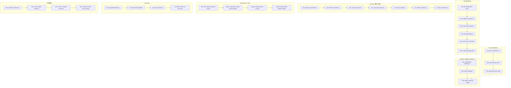

# Architecture Evolution & Design Log · 2026-07-18

> **总 commit 数**: 114（含 merge）· **非 merge commit**: ~60
> **核心叙事**: SDK 能力扩展（telemetry + create + headless）+ Desktop Harness Workbench 引入 + Windows 跨平台支持 + Trace Workbench 调试工具 + Simplification Chain 启动

---

## 1. 每日架构演进图



## 2. 设计模式与重构

### 应用的设计模式
- **Seam 演进模式（Seam Evolution）**: SDK 从 `dsh-plugin-fetch`（基于 giget/pacote）演进为原生 npm/pnpm 依赖 + cordis mount，体现了"渐进式替换"策略——先建立新 seam，再废弃旧实现。
- **Observer 模式（Telemetry）**: 新建的 telemetry 模块采用了 greenfield 设计，独立于现有功能模块，遵循了"关注点分离"原则。
- **工作台模式（Workbench Pattern）**: Desktop Harness Workbench 引入了"集成开发环境"式的设计，将多个调试视图（trace、session、plugin）统一到一个导航框架下。
- **Simplification Chain**: 从 `simp-drop-unused-schema-default` 到 `simp-hide-llm-adapter-helpers` 的链式简化，体现了"逐步清理"的重构策略。

### 模块解耦与接口定义
- **SDK create seam**: `create <source>` 通过 `--config/--config-json` 参数支持 headless 创建，建立了配置驱动的插件安装 seam。
- **Telemetry seam**: 独立的 telemetry 模块通过 `ctx.effect()` 注册，与业务逻辑完全解耦。
- **Desktop Workbench**: 通过 `feat(ui): add desktop workbench` 引入了统一的 UI 导航框架，将分散的调试视图整合。

### 基础设施与性能
- **Windows DACL 继承**: `e47ae064` 文档化了 Windows DACL-inheritance 语义，`e15a6168` 支持了 Windows 上的 JSONL 持久化。
- **Telemetry gating**: `a66b98d2` 确保只有显式禁用才停止遥测上报，而非默认关闭。

---

## 3. 特性交付与系统影响

### 核心特性
- **SDK Create Source**: `ca753388` 实现了将外部插件作为原生 PM 依赖添加 + cordis mount，替代了之前的 giget/pacote 方案。这简化了插件分发模型，使插件可以像普通 npm 包一样安装。
- **Desktop Harness Workbench**: `649183aa` 引入了完整的桌面调试工作台，支持导航、插件检查和 session 回放，为开发者提供了统一的调试入口。
- **Trace Workbench**: `b965285f` 添加了本地 session-replay UI，支持查看 session JSONL 和 spawned-session 链接。
- **Greenfield Telemetry**: `fe668a6d` 建立了独立的 telemetry 模块，支持 launcher 级别的命令遥测上报。

### 系统拓扑影响
- SDK create 的变更影响所有使用 `dsh-sdk create` 的用户和 CI 流程。
- Desktop Workbench 的引入扩展了 `packages/client/` 的职责范围。
- Telemetry 模块的独立化降低了未来添加新遥测点的成本。

---

## 4. 架构决策与 Roadmap 对齐

### 关键技术决策（ADR 推断）

**决策 1: SDK Create 从 giget/pacote 迁移到原生 npm/pnpm**
- **背景与痛点**: giget/pacote 作为包下载器引入了不必要的依赖复杂度，且在某些环境下有兼容性问题。
- **选择的方案与 Trade-offs**: 使用原生 npm/pnpm 作为包管理器，牺牲了"通用下载器"的灵活性，换取了更好的兼容性和更少的依赖。
- **推断依据**: `80523701` chore: drop dsh-plugin-fetch (giget/pacote), `ca753388` feat: add external plugin as native PM dependency

**决策 2: Telemetry 独立模块而非嵌入现有插件**
- **背景与痛点**: 遥测逻辑散落在多个插件中，难以统一管理和配置。
- **选择的方案与 Trade-offs**: 建立独立的 telemetry 模块，增加了模块数量但降低了耦合度。
- **推断依据**: `fe668a6d` feat: greenfield dsh-sdk telemetry modules

**决策 3: Desktop Workbench 作为独立 UI 框架**
- **背景与痛点**: 调试工具分散在多个视图中，缺乏统一的导航和上下文切换。
- **选择的方案与 Trade-offs**: 建立统一的工作台框架，增加了前端复杂度但提升了开发者体验。
- **推断依据**: `649183aa` feat: add desktop harness workbench

### 产品 Roadmap 支撑
- SDK create 的简化为插件生态系统的扩展提供了更友好的开发者体验。
- Desktop Workbench 为后续的 trace debugging、session analysis 和 plugin inspection 提供了统一入口。
- Telemetry 的独立化为后续的 usage analytics 和 performance monitoring 奠定了基础。

---

## 5. 开发者/架构师决策推断

### 开发者意图重建
- **思维模型**: 开发者在多个并行方向上推进——SDK 简化、UI 增强、跨平台支持。这表明团队正在同时处理"开发者体验"和"平台兼容性"两个维度。
- **优先级排序**: SDK 功能扩展（`feat`）优先于 simplification chain（`chore`/`refactor`），表明团队有意先建立新能力再清理旧代码。
- **有意取舍**: Windows 支持通过"测试跳过"和"平台特定断言"实现，而非完全重写，表明这是"渐进式兼容"而非"全面重写"。

### 架构师决策推断
- **模块拆分粒度**: Telemetry 独立为模块而非嵌入 SDK，表明团队预期 telemetry 将有独立的演进需求。
- **抽象层引入时机**: Desktop Workbench 在 trace workbench 之后引入，表明团队先验证了单个调试视图的价值，再建立统一框架。
- **后续影响**: SDK create 的简化降低了插件分发的门槛，可能加速插件生态的增长。
- **作为架构师**: 我赞同 SDK 从 giget/pacote 迁移到原生 npm/pnpm——减少了依赖复杂度。但 Desktop Workbench 的引入需要关注前端 bundle size 的影响。

### Code Review 视角
- **首先关注**: `ca753388` feat(dsh-sdk): create <source> — add external plugin as native PM dependency + cordis mount——这是 SDK 核心能力的变更。
- **会提出的问题**: 原生 npm/pacote 方案是否支持私有 registry？Telemetry 的数据格式和上报频率是什么？
- **做得好**: Windows 支持的渐进式策略很好，先确保核心功能正确，再处理平台差异。
- **可以改进**: Simplification chain 的合并顺序应该更清晰，避免中间状态的不一致。

---

## 6. 技术债务与风险评估

### 已知风险 / 变通方案
- **dsh-plugin-fetch 废弃后的兼容性**: `80523701` 删除了 dsh-plugin-fetch，但没有明确的 migration guide。
- **Windows DACL 继承**: `e47ae064` 文档化了语义但没有自动化测试验证。
- **Telemetry 数据格式**: greenfield 模块的数据格式尚未完全定义，可能需要后续调整。

### 建议的下一步
- 为 SDK create 的原生 npm/pnpm 方案添加集成测试。
- 为 Windows DACL 继承添加自动化测试。
- 定义 telemetry 的数据 schema 和上报协议。

---

## 阶段性深度分析

### 阶段 1: SDK 能力扩展

**涉及的 Commits**: `825a63ab` `dcd88679` `472a683b` `fe668a6d` `a66b98d2` `ca753388` `80523701` `16485392`

**阶段意图**: 扩展 SDK 的能力边界——从单一的 plugin fetch 扩展为支持 headless 创建、telemetry 上报和原生依赖安装的完整工具链。

**开发者视角推断**:
- **思维模型**: 开发者正在构建 SDK 的"完整工具链"——从 plugin 发现（fetch）到安装（create）到运行时监控（telemetry）。
- **优先级选择**: 先建立 fetch seam（`825a63ab`），再扩展 create（`472a683b`），最后添加 telemetry（`fe668a6d`），体现了"从底层到上层"的构建顺序。
- **有意取舍**: 从 giget/pacote 迁移到原生 npm/pnpm 是一个有意的简化，牺牲了"通用下载器"的灵活性。

**架构师视角推断**:
- **粒度考量**: SDK 的每个能力（fetch、create、telemetry）都是独立的 seam，允许独立演进和替换。
- **时机判断**: 在 desktop workbench 引入前完成 SDK 扩展，确保了调试工具有可靠的后端支撑。
- **后续影响**: SDK 的简化可能加速插件生态的增长，但也需要更多的文档和示例。

**重点关注的文档/代码**:

| 文件/模块 | 路径 | 阅读要点 |
|-----------|------|----------|
| SDK fetch seam | `packages/sdk/` | plugin fetch 的接口定义 |
| SDK create | `packages/sdk/` | headless creation 的配置驱动 |
| Telemetry | `packages/sdk/` | 遥测上报的模块结构 |

**关键代码模式**:
```typescript
// SDK fetch seam
// 825a63ab - feat(sdk): add dsh-plugin-fetch source + fetcher seam

// 原生 npm 依赖安装
// ca753388 - feat(dsh-sdk): create <source> — add external plugin as native PM dependency

// Telemetry 独立模块
// fe668a6d - feat(telemetry): greenfield dsh-sdk telemetry modules
```

**领域建模洞察**（DDD 视角）:
- SDK 是"基础设施层"（Infrastructure Layer）的一个 Bounded Context，其 seam 定义了插件分发的"防腐层"（Anti-Corruption Layer）。

---

### 阶段 2: Desktop Harness Workbench

**涉及的 Commits**: `649183aa` `2f37bbc6` `382708b1`

**阶段意图**: 引入统一的桌面调试工作台，将分散的调试视图整合到一个导航框架下。

**开发者视角推断**:
- **思维模型**: 开发者认识到调试工具的分散性降低了开发效率，需要一个统一的入口。
- **优先级选择**: 先建立工作台框架（`649183aa`），再优化导航（`2f37bbc6`），最后满足 CI gates（`382708b1`）。
- **有意取舍**: 工作台的引入增加了前端复杂度，但提升了开发者体验。

**架构师视角推断**:
- **粒度考量**: 工作台作为独立包引入，表明团队预期它将有独立的发布和演进节奏。
- **时机判断**: 在 trace workbench 验证了单个调试视图的价值后引入，是正确的时机选择。
- **后续影响**: 为后续的 plugin inspection、session analysis 和 workflow debugging 提供了统一入口。

**重点关注的文档/代码**:

| 文件/模块 | 路径 | 阅读要点 |
|-----------|------|----------|
| Desktop Workbench | `packages/client/` | 工作台的包结构和入口点 |
| Navigation | `packages/client/` | 导航框架的设计 |

**关键代码模式**:
```typescript
// Desktop Workbench 入口
// 649183aa - feat(ui): add desktop harness workbench

// 导航优化
// 2f37bbc6 - feat(ui): refine desktop workbench navigation
```

**领域建模洞察**（DDD 视角）:
- Desktop Workbench 是"表现层"的一个聚合，其导航框架定义了用户与系统交互的"限界上下文"（Bounded Context）。

---

### 阶段 3: Windows 跨平台支持

**涉及的 Commits**: `64f64724` `d36dc6ec` `1d6acc33` `7e620dba` `228f6e38` `b5fa2cb2` `beb13c38` `86c09f6c` `5a2ca3ff` `e47ae064` `715aa737` `130944ca` `1a4af034` `5ed34b66` `e15a6168`

**阶段意图**: 确保核心功能在 Windows 平台上的正确性，包括进程终止、文件系统路径、JSONL 持久化和 DACL 继承。

**开发者视角推断**:
- **思维模型**: 开发者正在系统性地处理 Windows 平台的兼容性问题——从进程终止到文件系统到权限模型。
- **优先级选择**: 先修复核心功能（subprocess termination、JSONL persistence），再处理测试覆盖（POSIX-only fixtures、native paths），最后文档化（DACL inheritance）。
- **有意取舍**: 通过"测试跳过"和"平台特定断言"实现兼容，而非完全重写，表明这是"渐进式兼容"。

**架构师视角推断**:
- **粒度考量**: Windows 支持是逐模块推进的，而非一次性全面兼容，降低了风险。
- **时机判断**: 在 desktop workbench 引入前完成 Windows 支持，确保了跨平台可用性。
- **后续影响**: 为后续的 Windows terminal 支持和 ConPTY 集成奠定了基础。

**重点关注的文档/代码**:

| 文件/模块 | 路径 | 阅读要点 |
|-----------|------|----------|
| subprocess | `packages/subprocess/` | Windows 进程终止语义 |
| fs-local | `packages/fs/` | POSIX-only mode-bit 断言 |
| JSONL | `packages/session/` | Windows JSONL 持久化 |
| DACL | `docs/` | Windows DACL inheritance 语义 |

**关键代码模式**:
```typescript
// Windows 进程终止
// 64f64724 - fix(subprocess): honor Windows termination semantics

// JSONL Windows 持久化
// e15a6168 - Support durable JSONL persistence on Windows

// DACL 继承文档
// e47ae064 - fs-local: POSIX-only mode-bit assertions, document Windows DACL-inheritance semantics
```

**领域建模洞察**（DDD 视角）:
- Windows 支持是"基础设施层"的跨平台适配，属于"防腐层"（Anti-Corruption Layer）的范畴。

---

### 阶段 4: Simplification Chain 启动

**涉及的 Commits**: `a42c28cd` `d261a9ca`

**阶段意图**: 启动 agent execution context 的简化 RFC 链，为后续的 simplification 奠定基础。

**开发者视角推断**:
- **思维模型**: 开发者正在为大规模简化建立设计基础，通过 RFC 记录设计决策。
- **优先级选择**: 先建立 RFC（`a42c28cd`），再同步到 worktree（`d261a9ca`），体现了"设计先行"的策略。
- **有意取舍**: RFC 阶段允许探索多种方案，为后续的实施提供了灵活性。

**架构师视角推断**:
- **粒度考量**: RFC 的引入表明团队重视架构决策的文档化和可追溯性。
- **时机判断**: 在多个并行分支合并后引入 RFC，确保了决策的一致性。
- **后续影响**: 为后续的 simplification chain 提供了设计基础。

**重点关注的文档/代码**:

| 文件/模块 | 路径 | 阅读要点 |
|-----------|------|----------|
| RFC | `docs/rfc/` | agent execution context 的设计动机 |
| Simplification chain | `packages/` | 后续的简化实施 |

**关键代码模式**:
```typescript
// RFC 建立
// a42c28cd - docs(rfc): refresh agent execution context pairing record

// Worktree 同步
// d261a9ca - sync rfc
```

**领域建模洞察**（DDD 视角）:
- RFC 是"知识层"的一部分，其文档化确保了架构决策的可追溯性和团队共识。
