# Architecture Evolution & Design Log · 2026-07-19

> **总 commit 数**: 385（含 merge）· **非 merge commit**: ~85
> **核心叙事**: Goal Domain 全栈构建 + Tool Cancellation 强制执行 + Agent Notes 体系建立 + Desktop UI 大规模增强 + Subagent Depth Budget + Package Invariants + Initiator 重构

---

## 1. 每日架构演进图

```mermaid
graph TD
    subgraph "Goal Domain 全栈构建"
        G1[feat: goal domain] --> G2[feat: goal tools]
        G2 --> G3[feat: goal session]
        G3 --> G4[feat: goal commands]
        G4 --> G5[feat: human goal command]
        G5 --> G6[fix: terminal goal turns]
        G6 --> G7[fix: structured error codes]
    end

    subgraph "Tool Cancellation 强制执行"
        TC1[docs: RFC required cancellation] --> TC2[feat: require cancellation signal]
        TC2 --> TC3[fix: complete cancellation boundary]
        TC3 --> TC4[fix: enforce cooperative cancellation]
    end

    subgraph "Agent Notes 体系"
        AN1[Rename RFCs to Agent Notes] --> AN2[Remove generated index]
        AN2 --> AN3[Require Agent Notes for non-trivial]
        AN3 --> AN4[docs: promote review principles]
    end

    subgraph "Desktop UI 大规模增强"
        UI1[feat: context page deepening] --> UI2[feat: artifact evolution chain]
        UI2 --> UI3[feat: rubric+growth+runtime fusion]
        UI3 --> UI4[feat: chat triple view]
        UI4 --> UI5[feat: trace signal detection]
        UI5 --> UI6[feat: plugin command registry]
    end

    subgraph "Subagent Depth Budget"
        SD1[feat: default maxDepth 1] --> SD2[fix: persist delegation depth]
        SD2 --> SD3[fix: subagent-acp cwd]
        SD3 --> SD4[fix: reject empty config cwd]
    end

    subgraph "Package Invariants"
        PI1[feat: require package companions] --> PI2[feat: package-owned service seam]
        PI2 --> PI3[test: Cordis JSDoc inspection]
    end

    subgraph "Initiator 重构"
        IR1[refactor: capture session in loop] --> IR2[refactor: use initiator in internals]
        IR3[fix: initiator teardown reentrant] --> IR4[docs: initiator API scenarios]
    end

    subgraph "LLM 修复"
        LLM1[fix: scope adapter failures] --> LLM2[fix: classify usage overflow]
    end

    subgraph "CLI Demo 改进"
        CLI1[fix: failure rendering] --> CLI2[fix: disposal diagnostics]
        CLI2 --> CLI3[fix: forward spine config]
        CLI3 --> CLI4[fix: interrupt Loader boot]
    end

    G7 -.-> TC1
    SD2 -.-> SD3
    IR2 -.-> IR4
```



## 2. 设计模式与重构

### 应用的设计模式
- **Domain-Driven Design 全栈实现**: Goal Domain 从 domain model → tools → session → commands 的完整实现，是 DDD 的典型实践——领域事件（goal/round）、值对象（blocker reasons）、聚合（goal session）的完整引入。
- **强制执行模式（Enforcement Pattern）**: Tool cancellation 从"建议性"（advisory）升级为"强制性"（required），通过 schema 注入和 executor 检查实现了"在操作点强制执行"。
- **责任链模式（Chain of Responsibility）**: Simplification chain 从 `simp-drop-unused-schema-default` 到 `simp-hide-llm-adapter-helpers` 的链式合并，体现了逐步清理的责任链。
- **Observer 模式（Desktop UI）**: Desktop UI 的 tri-view（List|Graph|Timeline）采用了多视图观察同一数据源的模式。

### 模块解耦与接口定义
- **Goal Domain seam**: `packages/goal/` 建立了完整的 capability seam——Service Definition（goal domain）、Service Provider（goal session）、Consumer（goal tools）。
- **Cancellation seam**: 通过 `ctx.tools` 的 waterfall listener 强制执行 cancellation signal，建立了工具执行的横切关注点。
- **Package Invariants seam**: `packages/runtime-diagnostics/` 建立了包级别的运行时不变量检查，作为"自检"能力的 seam。

### 基础设施与性能
- **Subagent depth budget**: 限制子代理的最大深度（默认 1 → 后续调整为 3），防止无限递归。
- **Delegation depth 持久化**: 将委托深度写入 session header，确保跨 session 的深度追踪。

---

## 3. 特性交付与系统影响

### 核心特性
- **Goal Domain**: 完整的 same-session goal 持久化和生命周期管理，支持 model-facing goal tools、human commands 和 structured error codes。这是 agent 自主规划和执行的核心能力。
- **Tool Cancellation**: 所有工具调用必须携带 cancellation signal，确保用户可以中断长时间运行的工具。这改变了工具注册和执行的基本契约。
- **Agent Notes**: 将 RFC 重命名为 Agent Notes，建立了更轻量级的架构决策记录体系，要求非机械变更必须包含 Agent Note。
- **Subagent Depth Budget**: 限制子代理的委托深度，防止资源耗尽和无限递归。

### 系统拓扑影响
- Goal Domain 的引入扩展了 agent 的能力边界——从"执行任务"到"自主规划和跟踪目标"。
- Tool Cancellation 的强制执行影响所有工具实现——每个工具必须处理 cancellation signal。
- Subagent depth budget 影响所有使用 subagent delegation 的场景——ACP、CLI demo、desktop。

---

## 4. 架构决策与 Roadmap 对齐

### 关键技术决策（ADR 推断）

**决策 1: Goal Domain 作为独立包而非嵌入 core**
- **背景与痛点**: Goal 管理逻辑散落在多个模块中，缺乏统一的领域模型。
- **选择的方案与 Trade-offs**: 建立独立的 `packages/goal/` 包，增加了模块数量但降低了耦合度。
- **推断依据**: `a5257760` feat(goal): add persisted same-session goal domain

**决策 2: Tool Cancellation 从建议性升级为强制性**
- **背景与痛点**: 工具取消是"可选的"，导致用户无法可靠地中断长时间运行的工具。
- **选择的方案与 Trade-offs**: 通过 schema 注入强制执行 cancellation signal，增加了工具实现的复杂度但提升了用户体验。
- **推断依据**: `e8b95c87` feat(tools): require cancellation signal on every invocation

**决策 3: Subagent Depth Budget 限制为 1**
- **背景与痛点**: 子代理可以无限嵌套，导致资源耗尽和调试困难。
- **选择的方案与 Trade-offs**: 默认限制为 1（后续调整为 3），牺牲了深层委托的灵活性但防止了资源耗尽。
- **推断依据**: `cb74477d` feat(tool-subagent): default maxDepth 1 with at-cap schema hiding

### 产品 Roadmap 支撑
- Goal Domain 为 agent 的自主规划能力奠定了基础，支撑了后续的 goal-based loop 和 plan mode。
- Tool Cancellation 为用户控制长时间运行的任务提供了基础，支撑了后续的交互式工作流。
- Subagent depth budget 为多代理协作提供了安全保障，支撑了后续的 delegation 和 workflow。

---

## 5. 开发者/架构师决策推断

### 开发者意图重建
- **思维模型**: 开发者在多个维度上同时推进——领域建模（Goal）、安全（Cancellation）、架构治理（Agent Notes）、UI 增强（Desktop）。这表明团队正在从"功能构建"转向"架构治理"。
- **优先级排序**: Goal Domain（核心能力）> Tool Cancellation（安全）> Agent Notes（治理）> Desktop UI（体验）> Subagent Budget（安全）> Invariants（质量）。
- **有意取舍**: Goal Domain 的实现选择了"完整 DDD"而非"简化版"，表明团队重视领域模型的正确性。

### 架构师决策推断
- **模块拆分粒度**: Goal Domain 独立为包而非嵌入 core，表明团队预期 goal 管理将有独立的演进需求。
- **抽象层引入时机**: Package Invariants 在多个功能稳定后引入，是正确的"质量门"时机。
- **后续影响**: Goal Domain 的引入可能改变 agent 的交互模式——从"被动执行"到"主动规划"。
- **作为架构师**: 我赞同 Goal Domain 的 DDD 实现——领域模型的正确性是长期维护的关键。但 tool cancellation 的强制执行需要更多关于 backward compatibility 的分析。

### Code Review 视角
- **首先关注**: `e8b95c87` feat(tools): require cancellation signal on every invocation——这是工具执行契约的根本变更。
- **会提出的问题**: Goal Domain 的持久化策略是什么？Subagent depth budget 的调整依据是什么？
- **做得好**: Agent Notes 体系的建立很好，确保了架构决策的可追溯性。
- **可以改进**: Desktop UI 的大规模增强需要更多的性能测试和 bundle size 分析。

---

## 6. 技术债务与风险评估

### 已知风险 / 变通方案
- **Goal Domain 的持久化策略**: JSONL 持久化在大数据量下可能有性能问题，SQLite 方案尚未完全实现。
- **Tool Cancellation 的 backward compatibility**: 强制 cancellation signal 可能导致现有工具失效。
- **Subagent depth budget 的调整**: 从 1 调整为 3（`1a1ff56a`）表明初始限制过于保守，需要更多实际使用数据。

### 建议的下一步
- 为 Goal Domain 添加 SQLite 持久化后端。
- 为 Tool Cancellation 添加 migration guide。
- 收集 Subagent depth budget 的使用数据，优化默认值。

---

## 阶段性深度分析

### 阶段 1: Goal Domain 全栈构建

**涉及的 Commits**: `a5257760` `0129063a` `25555c9c` `207692bc` `fbefc1d6` `e9940d35` `73ad649c` `671ef4d7` `15640ca6` `1468773d` `109df521`

**阶段意图**: 建立完整的 same-session goal 持久化和生命周期管理，支持 model-facing goal tools、human commands 和 structured error codes。

**开发者视角推断**:
- **思维模型**: 开发者正在构建 agent 的"自主规划"能力——从领域模型（goal domain）到工具（goal tools）到会话管理（goal session）到用户命令（goal commands）的完整栈。
- **优先级选择**: 先建立领域模型（`a5257760`），再添加工具（`0129063a`），然后处理会话管理（`25555c9c`），最后添加用户命令（`207692bc`），体现了"从底层到上层"的构建顺序。
- **有意取舍**: Goal Domain 的实现选择了"完整 DDD"而非"简化版"，表明团队重视领域模型的正确性。

**架构师视角推断**:
- **粒度考量**: Goal Domain 作为独立包引入，每个子领域（domain、tools、session、commands）都是独立的模块，允许独立演进。
- **时机判断**: 在 simplification chain 后引入，表明团队有意在清理旧代码后再建立新能力。
- **后续影响**: Goal Domain 的引入可能改变 agent 的交互模式——从"被动执行"到"主动规划"。

**重点关注的文档/代码**:

| 文件/模块 | 路径 | 阅读要点 |
|-----------|------|----------|
| goal domain | `packages/goal/` | 领域模型和聚合定义 |
| goal tools | `packages/goal/` | model-facing 工具的 schema |
| goal session | `packages/goal/` | 会话管理和持久化 |
| goal commands | `packages/goal/` | human-facing 命令 |

**关键代码模式**:
```typescript
// Goal domain 领域模型
// a5257760 - feat(goal): add persisted same-session goal domain

// Goal tools
// 0129063a - feat(goal): add model-facing goal tools

// Goal session
// 25555c9c - feat(goal): drive same-session goal rounds

// Human goal commands
// 207692bc - feat(goal): add human goal command
```

**领域建模洞察**（DDD 视角）:
- Goal 是 agent 的"聚合根"（Aggregate Root），其生命周期由 round 驱动。
- Blocker reasons 是"值对象"（Value Object），表示 goal 执行的阻塞原因。
- Goal rounds 是"领域事件"（Domain Events），记录 goal 的执行历史。

---

### 阶段 2: Tool Cancellation 强制执行

**涉及的 Commits**: `a99750f3` `e8b95c87` `54aef606` `2bc4e05a`

**阶段意图**: 将工具取消从"建议性"升级为"强制性"，确保用户可以中断长时间运行的工具。

**开发者视角推断**:
- **思维模型**: 开发者认识到"可选的"取消机制不可靠，需要通过 schema 注入和 executor 检查强制执行。
- **优先级选择**: 先提出 RFC（`a99750f3`），再实现强制执行（`e8b95c87`），最后通过 review fix 完善边界（`54aef606`、`2bc4e05a`）。
- **有意取舍**: 强制 cancellation signal 增加了工具实现的复杂度，但提升了用户体验。

**架构师视角推断**:
- **粒度考量**: Cancellation 是横切关注点，通过 `ctx.tools` 的 waterfall listener 实现，而非每个工具单独处理。
- **时机判断**: 在 goal domain 稳定后引入，确保了工具执行的基础可靠性。
- **后续影响**: 为后续的长时间运行工具（如 code-runtime、workflow）提供了中断能力。

**重点关注的文档/代码**:

| 文件/模块 | 路径 | 阅读要点 |
|-----------|------|----------|
| tools | `packages/core/tools/` | cancellation signal 的 schema 注入 |
| executor | `packages/core/tools/` | cancellation 的 executor 检查 |
| RFC | `docs/rfc/` | cancellation 的设计动机 |

**关键代码模式**:
```typescript
// Cancellation signal 强制执行
// e8b95c87 - feat(tools): require cancellation signal on every invocation

// Cancellation boundary 完善
// 54aef606 - fix(tools): complete cancellation boundary

// Cooperative cancellation 强制执行
// 2bc4e05a - fix(tools): enforce cooperative cancellation
```

**领域建模洞察**（DDD 视角）:
- Cancellation 是工具执行的"横切关注点"（Cross-Cutting Concern），通过 waterfall listener 实现了"关注点分离"。

---

### 阶段 3: Agent Notes 体系建立

**涉及的 Commits**: `e8eddc7e` `4779d04a` `b1b57a0a` `4ab5a763` `d5350cd4`

**阶段意图**: 将 RFC 重命名为 Agent Notes，建立更轻量级的架构决策记录体系。

**开发者视角推断**:
- **思维模型**: 开发者认识到 RFC 的重量级格式不适合快速迭代的架构决策，需要更轻量级的记录方式。
- **优先级选择**: 先重命名（`e8eddc7e`），再清理生成的索引（`4779d04a`），然后建立强制要求（`b1b57a0a`），最后完善文档（`4ab5a763`、`d5350cd4`）。
- **有意取舍**: Agent Notes 的轻量化牺牲了 RFC 的正式性，但提升了记录的频率和覆盖率。

**架构师视角推断**:
- **粒度考量**: Agent Notes 作为独立的文档层级，与 RFC、postmortem 并列，形成了完整的决策记录体系。
- **时机判断**: 在多个功能稳定后引入，确保了决策记录的及时性。
- **后续影响**: 为后续的架构决策提供了可追溯的记录基础。

**重点关注的文档/代码**:

| 文件/模块 | 路径 | 阅读要点 |
|-----------|------|----------|
| Agent Notes | `.agents/notes/` | 重命名后的文档结构 |
| AGENTS.md | `AGENTS.md` | 强制要求的规则 |

**关键代码模式**:
```typescript
// RFC 重命名为 Agent Notes
// e8eddc7e - Rename RFCs to Agent Notes

// 强制要求
// b1b57a0a - Require Agent Notes for non-trivial changes

// Review principles
// d5350cd4 - docs(review): distill human review principles
```

**领域建模洞察**（DDD 视角）:
- Agent Notes 是"知识层"的一部分，其文档化确保了架构决策的可追溯性和团队共识。

---

### 阶段 4: Desktop UI 大规模增强

**涉及的 Commits**: `fc558c2d` `c8f5ca3d` `4c47ce55` `5e46a54d` `47949244` `2850c22b` `7a5f0b08` `88bd4ac2` `6c4d0ae8` `084cbd12` `767d65465` `97df8849` `95b8b2a1`

**阶段意图**: 大规模增强 Desktop UI 的调试和分析能力，包括 context page、artifact evolution、chat views 和 trace detection。

**开发者视角推断**:
- **思维模型**: 开发者正在构建"调试友好"的 UI——从 context page（深入查看）到 artifact evolution（追踪变化）到 chat views（多角度观察）到 trace detection（信号识别）。
- **优先级选择**: 先建立核心视图（context page、chat views），再添加分析工具（artifact evolution、trace detection），最后优化体验（stability batch、quality sweep）。
- **有意取舍**: 大规模 UI 增强增加了前端复杂度，但显著提升了调试效率。

**架构师视角推断**:
- **粒度考量**: Desktop UI 的每个视图都是独立的组件，允许独立演进和替换。
- **时机判断**: 在 goal domain 和 tool cancellation 稳定后引入，确保了调试工具有可靠的数据源。
- **后续影响**: 为后续的 workflow debugging、session analysis 和 plugin inspection 提供了统一入口。

**重点关注的文档/代码**:

| 文件/模块 | 路径 | 阅读要点 |
|-----------|------|----------|
| Desktop UI | `packages/client/` | 工作台的组件结构 |
| Context page | `packages/client/` | 深入查看的实现 |
| Chat views | `packages/client/` | 多角度观察的实现 |

**关键代码模式**:
```typescript
// Context page deepening
// fc558c2d - feat(desktop): context page deepening

// Artifact evolution chain
// c8f5ca3d - feat(desktop): artifact evolution chain + Board/Timeline views

// Chat triple view
// 5e46a54d - feat(desktop): chat triple view — turn edge colors + side drawer + Session Graph
```

**领域建模洞察**（DDD 视角）:
- Desktop UI 是"表现层"的聚合，其多视图设计遵循了"单一数据源，多角度观察"的原则。

---

### 阶段 5: Subagent Depth Budget

**涉及的 Commits**: `cb74477d` `0d00106f` `b758a749` `c432f85c` `ee1a4479`

**阶段意图**: 限制子代理的委托深度，防止资源耗尽和无限递归。

**开发者视角推断**:
- **思维模型**: 开发者认识到子代理的无限嵌套是资源管理的重大风险，需要通过 depth budget 限制。
- **优先级选择**: 先设置默认限制（`cb74477d`），再持久化 depth（`0d00106f`），然后处理 cwd 继承（`b758a749`、`c432f85c`），最后确保 teardown 安全（`ee1a4479`）。
- **有意取舍**: 默认限制为 1（后续调整为 3）是保守选择，优先防止资源耗尽。

**架构师视角推断**:
- **粒度考量**: Depth budget 是 subagent 的横切关注点，通过 session header 持久化实现了跨 session 的追踪。
- **时机判断**: 在 goal domain 稳定后引入，确保了多代理协作的安全性。
- **后续影响**: 为后续的 delegation 和 workflow 提供了安全保障。

**重点关注的文档/代码**:

| 文件/模块 | 路径 | 阅读要点 |
|-----------|------|----------|
| subagent | `packages/subagent/` | depth budget 的实现 |
| session header | `packages/session/` | depth 的持久化 |
| ACP | `packages/acp/` | cwd 继承的处理 |

**关键代码模式**:
```typescript
// Depth budget 默认限制
// cb74477d - feat(tool-subagent): default maxDepth 1 with at-cap schema hiding

// Depth 持久化
// 0d00106f - fix(session): persist the delegation depth in the session header

// CWD 继承
// c432f85c - fix(subagent-acp): resolve child cwd from the parent session
```

**领域建模洞察**（DDD 视角）:
- Subagent depth 是"聚合"的"生命周期约束"，防止了聚合的无限嵌套。

---

### 阶段 6: Package Invariants

**涉及的 Commits**: `433670a7` `9d310ecc` `36dbe686`

**阶段意图**: 建立包级别的运行时不变量检查，确保包之间的依赖关系正确。

**开发者视角推断**:
- **思维模型**: 开发者认识到包之间的隐式依赖可能导致运行时错误，需要通过 invariant 检查提前发现。
- **优先级选择**: 先建立检查框架（`433670a7`），再添加 service seam（`9d310ecc`），最后通过 JSDoc 检查验证（`36dbe686`）。
- **有意取舍**: Invariant 检查增加了启动开销，但提前发现了依赖问题。

**架构师视角推断**:
- **粒度考量**: 每个包的 invariant 是独立的，允许独立定义和检查。
- **时机判断**: 在多个功能稳定后引入，确保了检查的准确性和完整性。
- **后续影响**: 为后续的包依赖管理提供了自动化检查基础。

**重点关注的文档/代码**:

| 文件/模块 | 路径 | 阅读要点 |
|-----------|------|----------|
| invariants | `packages/runtime-diagnostics/` | 检查框架 |
| package invariants | `packages/*/src/invariant` | 每个包的 invariant 定义 |

**关键代码模式**:
```typescript
// Package companions 检查
// 433670a7 - feat(invariants): require package-owned companions

// Package service seam 检查
// 9d310ecc - feat(invariants): add package-owned service seam

// Cordis JSDoc 检查
// 36dbe686 - test(cordis): snapshot targeted JSDoc inspection
```

**领域建模洞察**（DDD 视角）:
- Package Invariants 是"基础设施层"的自检能力，确保了包之间的"契约"（Contract）正确。

---

### 阶段 7: Initiator 重构

**涉及的 Commits**: `5e2607df8` `f21ed1bfa0` `ee1a44793` `e1a4a2963` `e0b5cadd2`

**阶段意图**: 将 initiator scope 折叠到 agent 中，简化 loop 内部的 session 管理。

**开发者视角推断**:
- **思维模型**: 开发者认识到 initiator scope 的独立管理增加了复杂度，需要折叠到 agent 中以简化 session 管理。
- **优先级选择**: 先捕获 session（`5e2607df8`），再使用 initiator（`f21ed1bfa0`），然后确保 teardown 安全（`ee1a44793`），最后文档化（`e1a4a2963`）。
- **有意取舍**: 折叠 initiator scope 简化了 loop 内部，但可能影响外部调用者。

**架构师视角推断**:
- **粒度考量**: Initiator scope 的折叠减少了 agent-loop 的参数传递复杂度。
- **时机判断**: 在 goal domain 稳定后引入，确保了 agent-loop 的基础可靠性。
- **后续影响**: 为后续的 agent execution context 简化奠定了基础。

**重点关注的文档/代码**:

| 文件/模块 | 路径 | 阅读要点 |
|-----------|------|----------|
| agent-loop | `packages/core/agent-loop/` | initiator scope 的折叠 |
| agent | `packages/core/agent/` | initiator 的管理 |

**关键代码模式**:
```typescript
// 捕获 session
// 5e2607df8 - refactor(core): capture session inside loop operations

// 使用 initiator
// f21ed1bfa0 - refactor(core): use initiator in loop internals

// Teardown 安全
// ee1a44793 - fix(core): make initiator teardown reentrant-safe
```

**领域建模洞察**（DDD 视角）:
- Initiator scope 是"聚合"的"边界上下文"（Bounded Context），其折叠简化了跨上下文的交互。
