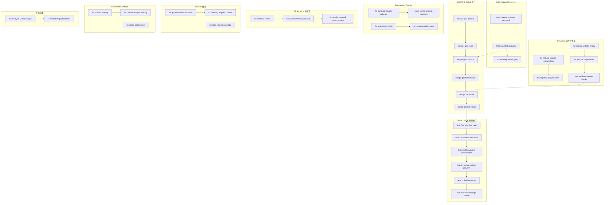

# Architecture Evolution & Design Log · 2026-07-20

> **总 commit 数**: 365（含 merge）· **非 merge commit**: ~65
> **核心叙事**: Goal RFC Rollup 合并 + Desktop UI 五视图融合 + LLM Request Recovery 实现 + Invariants 运行时关系断言 + Compaction Pruning + FS Sandbox 跨家族支持 + 文档部署到 GitHub Pages

---

## 1. 每日架构演进图



## 2. 设计模式与重构

### 应用的设计模式
- **Rollup 合并模式（Rollup Merge）**: Goal RFC Rollup 将多个并行分支（goal-domain → goal-tools → goal-session → goal-commands → ralph-tool）逐层合并，体现了"渐进式集成"策略。
- **五视图融合模式（Multi-View Fusion）**: Desktop UI 将 List、Graph、Timeline、Trace、Log 五个视图融合到统一的 chat view 中，实现了"单一数据源，多角度观察"。
- **边界断言模式（Boundary Assertion）**: Invariants 从"API shape"检查升级为"runtime relationship"断言，确保了运行时行为的正确性。
- **Pruning 策略模式（Pruning Strategy）**: Compaction 的 tool result pruning 采用了"cache reuse"策略，优化了重复摘要的性能。

### 模块解耦与接口定义
- **Goal RFC Rollup**: 通过 stack-based PR 合并，确保了 goal domain 的完整集成。
- **Desktop Inspector**: 统一的 Pretty/Raw/JSON inspector 替代了多个分散的检查视图。
- **Mid-turn message queue**: 建立了 per-session 的消息队列，实现了 enqueue-on-inflight 和 drain-once-per-turn 的语义。

### 基础设施与性能
- **Compaction KV cache reuse**: `a0268d25` 通过 replay conversation prefix 实现了 KV cache 的复用，减少了重复摘要的计算开销。
- **Session-scoped sandbox roots**: `ff21f91a` 将 sandbox roots 限定到 session 级别，防止了跨 session 的资源泄漏。

---

## 3. 特性交付与系统影响

### 核心特性
- **Goal RFC Rollup**: 完整合并了 goal domain 的所有子模块（domain、tools、session、commands、ralph-tool），建立了 agent 自主规划的完整能力栈。
- **Desktop 五视图**: 将 List、Graph、Timeline、Trace、Log 五个视图融合到统一的 chat view 中，支持 in-stream artifact preview 和 unified inspector。
- **LLM Request Recovery**: 实现了 bounded 的 LLM 请求恢复机制，在模型调用失败时自动重试。
- **Compaction Pruning**: 在 summarization 前修剪 tool results，减少了摘要的输入大小和计算开销。

### 系统拓扑影响
- Goal RFC Rollup 的合并完成了 goal domain 的全栈集成，影响所有使用 goal 管理的场景。
- Desktop 五视图的融合扩展了调试工具的能力边界，支持更深入的 session 分析。
- LLM Request Recovery 为模型调用的可靠性提供了基础，影响所有 LLM 调用路径。

---

## 4. 架构决策与 Roadmap 对齐

### 关键技术决策（ADR 推断）

**决策 1: Goal RFC Rollup 使用 stack-based PR 合并**
- **背景与痛点**: 多个并行分支（goal-domain、goal-tools、goal-session、goal-commands、ralph-tool）需要逐层合并，避免集成冲突。
- **选择的方案与 Trade-offs**: 使用 stack-based PR 合并，确保了合并顺序和依赖关系的正确性，但增加了 CI 的复杂度。
- **推断依据**: `6e876e49` → `bbc6808a` 的链式合并

**决策 2: Desktop 五视图融合而非独立视图**
- **背景与痛点**: 多个独立的调试视图（List、Graph、Timeline、Trace、Log）缺乏统一的上下文切换。
- **选择的方案与 Trade-offs**: 融合到统一的 chat view 中，增加了前端复杂度但提升了调试效率。
- **推断依据**: `fa640ec9` feat(desktop): five-way chat view strip

**决策 3: Compaction Pruning 在 summarization 前执行**
- **背景与痛点**: Tool results 在 summarization 时仍然包含大量冗余信息，增加了摘要的计算开销。
- **选择的方案与 Trade-offs**: 在 summarization 前修剪 tool results，减少了输入大小但可能丢失有用信息。
- **推断依据**: `cfa180c1` Resolve compaction policy per routed model

### 产品 Roadmap 支撑
- Goal RFC Rollup 完成了 agent 自主规划的全栈集成，支撑了后续的 goal-based loop 和 plan mode。
- Desktop 五视图为开发者提供了统一的调试入口，支撑了后续的 session analysis 和 workflow debugging。
- LLM Request Recovery 为模型调用的可靠性提供了基础，支撑了后续的 error recovery 和 fallback 机制。

---

## 5. 开发者/架构师决策推断

### 开发者意图重建
- **思维模型**: 开发者在多个维度上同时推进——领域集成（Goal Rollup）、UI 融合（Desktop）、可靠性（Recovery）、安全性（Invariants）、性能（Pruning）。这表明团队正在从"功能构建"转向"集成和优化"。
- **优先级排序**: Goal Rollup（集成）> Desktop UI（体验）> LLM Recovery（可靠性）> Invariants（质量）> Pruning（性能）> Session（修复）。
- **有意取舍**: Goal Rollup 的 stack-based 合并增加了 CI 复杂度，但确保了集成顺序的正确性。

### 架构师决策推断
- **模块拆分粒度**: Desktop UI 的五视图融合表明团队倾向于"统一视图"而非"独立视图"，减少了上下文切换成本。
- **抽象层引入时机**: Invariants 在多个功能稳定后引入运行时关系断言，是正确的"质量门"时机。
- **后续影响**: Goal Rollup 的完成可能加速 agent 自主规划能力的演进。
- **作为架构师**: 我赞同 Goal Rollup 的 stack-based 合并策略——在大规模集成中确保顺序正确是关键。但 Desktop 五视图的前端复杂度需要关注 bundle size 和性能。

### Code Review 视角
- **首先关注**: `fa640ec9` feat(desktop): five-way chat view strip — 这是 UI 架构的重大变更。
- **会提出的问题**: LLM Request Recovery 的重试策略是什么？Compaction Pruning 的信息丢失风险如何评估？
- **做得好**: Goal RFC Rollup 的 stack-based 合并策略很好，确保了集成顺序的正确性。
- **可以改进**: Invariants 的 runtime relationship 断言需要更清晰的错误信息和文档。

---

## 6. 技术债务与风险评估

### 已知风险 / 变通方案
- **Goal Rollup 的 CI 复杂度**: stack-based PR 合并增加了 CI 的构建时间和失败概率。
- **Desktop 五视图的前端性能**: 五个视图融合到一个 chat view 中可能导致渲染性能问题。
- **Compaction Pruning 的信息丢失**: 在 summarization 前修剪 tool results 可能丢失有用信息。

### 建议的下一步
- 为 Desktop 五视图添加性能基准测试。
- 为 Compaction Pruning 添加信息丢失评估机制。
- 为 Goal Rollup 的 CI 添加增量构建优化。

---

## 阶段性深度分析

### 阶段 1: Goal RFC Rollup 合并

**涉及的 Commits**: `6e876e49` `ad370864` `725acb76` `7c0c819b` `09a75ef6` `d919e1b8` `2b39ac32` `3deb7bf1` `5d0a248a` `b360d048` `3787349d`

**阶段意图**: 将 goal domain 的所有子模块（domain、tools、session、commands、ralph-tool）逐层合并到 master，完成 goal RFC rollup。

**开发者视角推断**:
- **思维模型**: 开发者正在处理多个并行分支的集成问题，确保每个子模块的依赖关系和接口兼容性。
- **优先级选择**: 按照依赖顺序合并（domain → tools → session → commands → ralph-tool），确保了集成的正确性。
- **有意取舍**: Stack-based 合并增加了 CI 复杂度，但避免了集成冲突。

**架构师视角推断**:
- **粒度考量**: 每个子模块独立合并，允许在合并过程中发现问题并修复。
- **时机判断**: 在 goal domain 的所有子模块稳定后合并，确保了集成的可靠性。
- **后续影响**: Goal Rollup 的完成为 agent 自主规划提供了完整的后端支撑。

**重点关注的文档/代码**:

| 文件/模块 | 路径 | 阅读要点 |
|-----------|------|----------|
| goal domain | `packages/goal/` | 领域模型的合并 |
| goal tools | `packages/goal/` | 工具的合并 |
| goal session | `packages/goal/` | 会话管理的合并 |
| ralph-tool | `packages/workflow/` | Ralph 工具的合并 |

**关键代码模式**:
```typescript
// Goal domain 合并
// 6e876e49 - Merge branch 'origin/rfc/loop' into codex/goal-domain

// Goal tools 合并
// ad370864 - Merge branch 'origin/codex/goal-domain' into codex/goal-tools

// Goal session 合并
// 725acb76 - Merge branch 'origin/codex/goal-tools' into codex/goal-session
```

**领域建模洞察**（DDD 视角）:
- Goal Rollup 是"聚合"的"集成测试"，确保了多个子模块在统一领域模型下的正确协作。

---

### 阶段 2: Desktop UI 五视图融合

**涉及的 Commits**: `fa640ec9` `64397f5b` `60dfa8d5` `d5e2115a` `067691a8` `830579ab`

**阶段意图**: 将 List、Graph、Timeline、Trace、Log 五个视图融合到统一的 chat view 中，支持 in-stream artifact preview 和 unified inspector。

**开发者视角推断**:
- **思维模型**: 开发者认识到分散的调试视图降低了开发效率，需要一个统一的入口来观察 session 的多个维度。
- **优先级选择**: 先建立五视图 strip（`fa640ec9`），再添加 cordis card（`64397f5b`），然后处理 workflow event（`60dfa8d5`），最后添加 artifact preview（`d5e2115a`）。
- **有意取舍**: 五视图融合增加了前端复杂度，但显著提升了调试效率。

**架构师视角推断**:
- **粒度考量**: 每个视图是独立的组件，通过统一的数据源连接，允许独立演进。
- **时机判断**: 在 goal rollup 稳定后引入，确保了调试工具有可靠的数据源。
- **后续影响**: 为后续的 session analysis 和 workflow debugging 提供了统一入口。

**重点关注的文档/代码**:

| 文件/模块 | 路径 | 阅读要点 |
|-----------|------|----------|
| Desktop UI | `packages/client/` | 五视图的组件结构 |
| Inspector | `packages/client/` | 统一的 Pretty/Raw/JSON inspector |
| Message queue | `packages/client/` | mid-turn message queue |

**关键代码模式**:
```typescript
// 五视图 strip
// fa640ec9 - feat(desktop): five-way chat view strip (List|Graph|时序|Trace|Log)

// Cordis card
// 64397f5b - feat(desktop): cordis dedicated card (mount/unmount/inspect)

// In-stream artifact preview
// d5e2115a - feat(desktop): in-stream inline md/html artifact preview
```

**领域建模洞察**（DDD 视角）:
- Desktop UI 是"表现层"的聚合，其五视图设计实现了"单一数据源，多角度观察"的原则。

---

### 阶段 3: LLM Request Recovery

**涉及的 Commits**: `277b5808` `3b0b0cefe` `cc2e14f7`

**阶段意图**: 实现 bounded 的 LLM 请求恢复机制，在模型调用失败时自动重试。

**开发者视角推断**:
- **思维模型**: 开发者认识到 LLM 调用的不可靠性，需要通过自动重试提高成功率。
- **优先级选择**: 先缩小提案范围（`277b5808`），再实现 bounded recovery（`3b0b0cefe`），最后修复 review gaps（`cc2e14f7`）。
- **有意取舍**: Bounded recovery 限制了重试次数，避免了无限重试的资源浪费。

**架构师视角推断**:
- **粒度考量**: Recovery 作为 agent-loop 的横切关注点，通过 waterfall listener 实现。
- **时机判断**: 在 goal rollup 稳定后引入，确保了 agent-loop 的基础可靠性。
- **后续影响**: 为后续的 error recovery 和 fallback 机制提供了基础。

**重点关注的文档/代码**:

| 文件/模块 | 路径 | 阅读要点 |
|-----------|------|----------|
| agent-loop | `packages/core/agent-loop/` | recovery 的实现 |
| LLM | `packages/llm/` | 调用失败的分类 |

**关键代码模式**:
```typescript
// Bounded recovery
// 3b0b0cefe - feat: implement bounded LLM request recovery

// Recovery review gaps
// cc2e14f7 - fix: close recovery review gaps
```

**领域建模洞察**（DDD 视角）:
- LLM Request Recovery 是"基础设施层"的容错能力，确保了 agent 的"可用性"（Availability）。

---

### 阶段 4: Invariants 运行时关系断言

**涉及的 Commits**: `e92b34bd7` `d897adac8` `3b7ce2e68` `e80fc3e61` `941b0411` `caaa1364`

**阶段意图**: 将 invariant 检查从"API shape"升级为"runtime relationship"断言，确保运行时行为的正确性。

**开发者视角推断**:
- **思维模型**: 开发者认识到静态的 API shape 检查不足以发现运行时问题，需要断言实际的行为关系。
- **优先级选择**: 先断言运行时关系（`e92b34bd7`），再保持 registration gate 清洁（`d897adac8`），然后要求 justified empty（`3b7ce2e68`），最后加入 package checks（`e80fc3e61`）。
- **有意取舍**: Runtime relationship 断言增加了启动开销，但提前发现了行为问题。

**架构师视角推断**:
- **粒度考量**: 每个包的 invariant 独立定义和检查，允许独立演进。
- **时机判断**: 在多个功能稳定后引入运行时断言，确保了检查的准确性。
- **后续影响**: 为后续的包依赖管理提供了自动化检查基础。

**重点关注的文档/代码**:

| 文件/模块 | 路径 | 阅读要点 |
|-----------|------|----------|
| invariants | `packages/runtime-diagnostics/` | 运行时断言框架 |
| package invariants | `packages/*/src/invariant` | 每个包的 invariant 定义 |

**关键代码模式**:
```typescript
// Runtime relationship 断言
// e92b34bd7 - fix(invariants): enforce runtime relationships

// Registration gate
// d897adac8 - fix(invariants): keep registration gate final-head clean

// Package runtime checks
// 941b0411 - feat(invariants): implement package runtime checks
```

**领域建模洞察**（DDD 视角）:
- Package Invariants 是"基础设施层"的自检能力，确保了包之间的"契约"（Contract）在运行时正确。

---

### 阶段 5: Compaction Pruning

**涉及的 Commits**: `6e790b95` `7aee299b` `a625ef4f` `a0268d25`

**阶段意图**: 在 summarization 前修剪 tool results，减少摘要的输入大小和计算开销。

**开发者视角推断**:
- **思维模型**: 开发者认识到 tool results 在 summarization 时包含大量冗余信息，需要通过 pruning 优化性能。
- **优先级选择**: 先完成 master retarget（`6e790b95`），再修正 pruning contracts（`7aee299b`），然后限定 pruning cache reuse（`a625ef4f`），最后实现 KV cache reuse（`a0268d25`）。
- **有意取舍**: Pruning 可能丢失有用信息，但显著减少了计算开销。

**架构师视角推断**:
- **粒度考量**: Pruning 作为 compaction 的横切关注点，通过 policy 实现了可配置的策略。
- **时机判断**: 在 goal rollup 稳定后引入，确保了 compaction 的基础可靠性。
- **后续影响**: 为后续的 compaction 优化提供了性能基础。

**重点关注的文档/代码**:

| 文件/模块 | 路径 | 阅读要点 |
|-----------|------|----------|
| compaction | `packages/compaction/` | pruning 的实现 |
| KV cache | `packages/compaction/` | cache reuse 的实现 |

**关键代码模式**:
```typescript
// Pruning contracts
// 7aee299b - docs(compact): correct pruning surface contracts

// KV cache reuse
// a0268d25 - fix(compact-basic): replay conversation prefix so summarization reuses KV cache
```

**领域建模洞察**（DDD 视角）:
- Compaction Pruning 是"基础设施层"的性能优化，确保了 summarization 的"效率"（Efficiency）。
