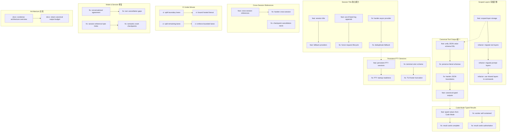

# Architecture Evolution & Design Log · 2026-07-21

> **总 commit 数**: 278（含 merge）· **非 merge commit**: ~75
> **核心叙事**: Scoped Layers 存储迁移 + Canonical Tool Output 统一 + Code Mode Typed Results + Session Title 独立能力 + Persistent PTY Sessions + Cross-Session References + CI Under Minute + Mode 修复

---

## 1. 每日架构演进图



## 2. 设计模式与重构

### 应用的设计模式
- **分层存储模式（Layered Storage）**: Scoped Layers 从分散的存储迁移到统一的 `packages/scope/` 模块，实现了 tool 和 prompt layers 的共享存储。
- **类型安全模式（Type Safety）**: Canonical Tool Output 和 Code Mode Typed Results 将工具输出从 untyped JSON 升级为 typed values，通过 schema DSL 确保类型安全。
- **独立能力模式（Standalone Capability）**: Session Title 从 session 包中独立为独立能力，支持 fallback providers 和 out-of-band log appends。
- **持久会话模式（Persistent Session）**: PTY sessions 从临时会话升级为持久会话，支持跨 session 的状态保持。

### 模块解耦与接口定义
- **Scoped Layers seam**: `packages/scope/` 建立了 tool 和 prompt layers 的统一存储，替代了分散在多个模块中的存储逻辑。
- **Canonical Tool Output seam**: 通过 `ctx.tools` 的 schema DSL 实现了工具输出的类型安全，替代了 untyped JSON。
- **Session Title seam**: `packages/session/` 建立了 session title 的独立能力，支持 fallback providers 和 model providers。

### 基础设施与性能
- **CI Under Minute**: 通过拆分 boundary lanes 和 bound hosted fanout，将 CI 构建时间控制在一分钟内。
- **KV cache reuse**: `a0268d25` 通过 replay conversation prefix 实现了 KV cache 的复用。
- **Session reference byte limits**: `8c6e28cef` 简化了 session reference 的字节限制，优化了内存使用。

---

## 3. 特性交付与系统影响

### 核心特性
- **Scoped Layers**: 将 tool 和 prompt layers 迁移到统一的存储模块，为后续的 scope management 提供了基础设施。
- **Canonical Tool Output**: 将工具输出从 untyped JSON 升级为 typed values，通过 schema DSL 确保类型安全，为后续的 tool result processing 提供了可靠基础。
- **Code Mode Typed Results**: 将 Code Mode 的输出从 untyped 升级为 typed，确保了 result cards 的完整性和权威性。
- **Session Title**: 建立了 session title 的独立能力，支持 fallback providers、model providers 和 out-of-band log appends。
- **Persistent PTY Sessions**: 将 PTY sessions 从临时升级为持久，支持跨 session 的状态保持和颜色方案检测。
- **Cross-Session References**: 建立了跨 session 的引用机制，支持 session 之间的数据共享和追踪。

### 系统拓扑影响
- Scoped Layers 的迁移影响所有使用 tool 和 prompt layers 的模块（commands、interaction、preset）。
- Canonical Tool Output 的统一影响所有工具的输出格式，需要工具实现者适配。
- Session Title 的独立化影响所有使用 session title 的模块（ACP、TUI、SDK）。

---

## 4. 架构决策与 Roadmap 对齐

### 关键技术决策（ADR 推断）

**决策 1: Scoped Layers 迁移到统一存储**
- **背景与痛点**: Tool 和 prompt layers 分散在多个模块中存储，导致存储逻辑重复和不一致。
- **选择的方案与 Trade-offs**: 迁移到统一的 `packages/scope/` 模块，增加了模块数量但消除了存储重复。
- **推断依据**: `8351cdbe` feat(scope): add scoped-layer storage, `1d209932` refactor(scope): migrate tool and prompt layers

**决策 2: Canonical Tool Output 使用 schema DSL**
- **背景与痛点**: 工具输出是 untyped JSON，导致下游处理需要手动验证和转换。
- **选择的方案与 Trade-offs**: 使用 schema DSL 定义 typed outputs，增加了工具实现的复杂度但提升了类型安全。
- **推断依据**: `8500974f` feat: unify JSON value schema DSL, `66c36e73` feat: add canonical typed tool outputs

**决策 3: Session Title 独立为能力而非嵌入 session**
- **背景与痛点**: Session title 的生成逻辑散落在多个模块中，缺乏统一的 fallback 和 model providers。
- **选择的方案与 Trade-offs**: 建立独立的 session title 能力，增加了模块数量但降低了耦合度。
- **推断依据**: `f71f96d2` feat(session-title): integrate queries ACP and TUI

**决策 4: PTY Sessions 从临时升级为持久**
- **背景与痛点**: PTY sessions 是临时的，跨 session 的状态无法保持。
- **选择的方案与 Trade-offs**: 升级为持久 session，增加了存储复杂度但提升了用户体验。
- **推断依据**: `58cde510` feat: add persistent PTY sessions

### 产品 Roadmap 支撑
- Scoped Layers 为后续的 scope management 和 agent composition 提供了基础设施。
- Canonical Tool Output 为后续的 tool result processing 和 code mode 增强提供了类型安全基础。
- Session Title 为后续的 session 管理和搜索提供了统一的标题生成能力。
- Persistent PTY Sessions 为后续的 terminal 交互和 workflow automation 提供了持久化基础。

---

## 5. 开发者/架构师决策推断

### 开发者意图重建
- **思维模型**: 开发者在多个维度上同时推进——存储统一（Scoped Layers）、类型安全（Canonical Output）、能力独立（Session Title）、持久化（PTY Sessions）、跨 session（References）。这表明团队正在从"功能构建"转向"架构统一和类型安全"。
- **优先级排序**: Scoped Layers（存储统一）> Canonical Output（类型安全）> Session Title（能力独立）> PTY Sessions（持久化）> Cross-Session（跨 session）> CI（性能）。
- **有意取舍**: Schema DSL 增加了工具实现的复杂度，但提升了类型安全和下游处理的可靠性。

### 架构师决策推断
- **模块拆分粒度**: Session Title 独立为能力而非嵌入 session，表明团队预期 title 生成将有独立的演进需求。
- **抽象层引入时机**: Scoped Layers 在多个功能稳定后迁移，是正确的"基础设施统一"时机。
- **后续影响**: Canonical Tool Output 的统一可能加速 tool result processing 和 code mode 的演进。
- **作为架构师**: 我赞同 Canonical Tool Output 使用 schema DSL——类型安全是长期维护的关键。但 PTY sessions 的持久化需要关注存储成本和清理策略。

### Code Review 视角
- **首先关注**: `8500974f` feat: unify JSON value schema DSL — 这是工具输出格式的根本变更。
- **会提出的问题**: Scoped Layers 的迁移是否有 backward compatibility 的考虑？Session Title 的 fallback 策略是什么？
- **做得好**: CI Under Minute 的优化很好，将构建时间控制在一分钟内提升了开发效率。
- **可以改进**: Cross-Session References 的安全性需要更多分析——跨 session 的数据共享可能引入信息泄露风险。

---

## 6. 技术债务与风险评估

### 已知风险 / 变通方案
- **Schema DSL 的 adoption**: 所有工具需要适配新的 schema DSL，可能需要 migration guide。
- **PTY sessions 的存储成本**: 持久化 PTY sessions 增加了存储成本，需要清理策略。
- **Cross-Session References 的安全性**: 跨 session 的数据共享可能引入信息泄露风险。
- **Scoped Layers 的迁移兼容性**: 迁移过程中需要确保现有功能不受影响。

### 建议的下一步
- 为 Schema DSL 添加 migration guide 和工具适配示例。
- 为 PTY sessions 添加存储成本分析和清理策略。
- 为 Cross-Session References 添加安全性审计。
- 为 Scoped Layers 迁移添加集成测试。

---

## 阶段性深度分析

### 阶段 1: Scoped Layers 存储迁移

**涉及的 Commits**: `8351cdbe` `1d209932` `e56bcb4d`

**阶段意图**: 将 tool 和 prompt layers 迁移到统一的 `packages/scope/` 存储模块，消除了分散存储的重复逻辑。

**开发者视角推断**:
- **思维模型**: 开发者认识到 tool 和 prompt layers 的存储逻辑分散在多个模块中，导致了重复和不一致。统一存储可以消除这些问题。
- **优先级选择**: 先建立存储模块（`8351cdbe`），再迁移 tool layers（`1d209932`），最后迁移 prompt layers（`e56bcb4d`），体现了"从底层到上层"的迁移策略。
- **有意取舍**: 迁移增加了模块数量但消除了存储重复，是"短期复杂度换长期简洁"的典型取舍。

**架构师视角推断**:
- **粒度考量**: Scoped Layers 作为独立模块引入，表明团队预期 scope management 将有独立的演进需求。
- **时机判断**: 在多个功能稳定后迁移，确保了迁移的稳定性和可验证性。
- **后续影响**: 为后续的 scope management 和 agent composition 提供了统一的存储基础。

**重点关注的文档/代码**:

| 文件/模块 | 路径 | 阅读要点 |
|-----------|------|----------|
| scope | `packages/scope/` | 存储模块的结构 |
| commands | `packages/interaction/` | 迁移后的命令实现 |
| tool layers | `packages/core/tools/` | tool layer 的存储 |
| prompt layers | `packages/core/system-prompt/` | prompt layer 的存储 |

**关键代码模式**:
```typescript
// Scoped-layer storage
// 8351cdbe - feat(scope): add scoped-layer storage

// Tool layer 迁移
// 1d209932 - refactor(scope): migrate tool and prompt layers

// Commands 使用共享 layers
// e56bcb4d - refactor(commands): use shared scoped layers
```

**领域建模洞察**（DDD 视角）:
- Scoped Layers 是"基础设施层"的存储统一，确保了 tool 和 prompt layers 的"一致性"（Consistency）。

---

### 阶段 2: Canonical Tool Output 统一

**涉及的 Commits**: `8500974f` `acc628f3` `4574340d` `66c36e73` `e1633fbc`

**阶段意图**: 将工具输出从 untyped JSON 升级为 typed values，通过 schema DSL 确保类型安全。

**开发者视角推断**:
- **思维模型**: 开发者认识到 untyped JSON 导致下游处理需要手动验证和转换，通过 schema DSL 可以实现类型安全。
- **优先级选择**: 先统一 schema DSL（`8500974f`），再保护 literal schemas（`acc628f3`），然后 harden boundaries（`4574340d`），最后添加 typed outputs（`66c36e73`）。
- **有意取舍**: Schema DSL 增加了工具实现的复杂度，但提升了类型安全和下游处理的可靠性。

**架构师视角推断**:
- **粒度考量**: Schema DSL 作为 tool output 的统一定义，允许所有工具使用相同的类型系统。
- **时机判断**: 在 scoped layers 迁移后引入，确保了 tool output 的类型安全有可靠的存储基础。
- **后续影响**: 为后续的 tool result processing 和 code mode 增强提供了类型安全基础。

**重点关注的文档/代码**:

| 文件/模块 | 路径 | 阅读要点 |
|-----------|------|----------|
| tools | `packages/core/tools/` | schema DSL 的实现 |
| tool output | `packages/core/tools/` | typed output 的定义 |

**关键代码模式**:
```typescript
// Schema DSL 统一
// 8500974f - feat: unify JSON value schema DSL

// Typed outputs
// 66c36e73 - feat: add canonical typed tool outputs

// Boundary hardening
// 4574340d - fix(tools): harden unified JSON value boundaries
```

**领域建模洞察**（DDD 视角）:
- Canonical Tool Output 是"基础设施层"的类型安全保证，确保了工具输出的"正确性"（Correctness）。

---

### 阶段 3: Code Mode Typed Results

**涉及的 Commits**: `c1d7b0df` `7c2fb0a6` `1709b8cf` `449e3cf2`

**阶段意图**: 将 Code Mode 的输出从 untyped 升级为 typed，确保 result cards 的完整性和权威性。

**开发者视角推断**:
- **思维模型**: 开发者认识到 Code Mode 的 untyped 输出导致 result cards 不完整和不权威，需要通过 typed results 解决。
- **优先级选择**: 先添加 typed values（`c1d7b0df`），再确保 result cards 完整（`7c2fb0a6`），然后保持 worker 自包含（`1709b8cf`），最后使 result cards 权威（`449e3cf2`）。
- **有意取舍**: Typed results 增加了 Code Mode 的实现复杂度，但提升了结果的可靠性和可用性。

**架构师视角推断**:
- **粒度考量**: Code Mode 的 typed results 与 canonical tool output 共享 schema DSL，确保了类型系统的一致性。
- **时机判断**: 在 canonical tool output 稳定后引入，确保了 Code Mode 的 typed results 有可靠的类型基础。
- **后续影响**: 为后续的 code mode 增强和 result processing 提供了可靠基础。

**重点关注的文档/代码**:

| 文件/模块 | 路径 | 阅读要点 |
|-----------|------|----------|
| code-runtime | `packages/code-runtime/` | typed results 的实现 |
| result cards | `packages/client/` | result cards 的渲染 |

**关键代码模式**:
```typescript
// Typed values from Code Mode
// c1d7b0df - feat: return typed values from Code Mode

// Result cards complete
// 7c2fb0a6 - fix: keep Code Mode result cards complete

// Result cards authoritative
// 449e3cf2 - fix(tools): make code result cards authoritative
```

**领域建模洞察**（DDD 视角）:
- Code Mode Typed Results 是"表现层"的类型安全保证，确保了结果展示的"完整性"（Completeness）。

---

### 阶段 4: Session Title 独立能力

**涉及的 Commits**: `f71f96d2` `58dc5f94` `9a6914d8` `63cb16a5` `a9d518a3` `c622a288` `d9557fa5` `b3ba4345`

**阶段意图**: 建立 session title 的独立能力，支持 fallback providers、model providers 和 out-of-band log appends。

**开发者视角推断**:
- **思维模型**: 开发者认识到 session title 的生成逻辑散落在多个模块中，需要统一管理以支持 fallback 和 model providers。
- **优先级选择**: 先建立核心能力（`f71f96d2`），再添加 fallback providers（`58dc5f94`），然后处理 out-of-band appends（`9a6914d8`），最后 harden lifecycle（`63cb16a5`、`a9d518a3`）。
- **有意取舍**: 独立 session title 能力增加了模块数量但降低了耦合度。

**架构师视角推断**:
- **粒度考量**: Session Title 作为独立能力引入，表明团队预期 title 生成将有独立的演进需求。
- **时机判断**: 在 canonical tool output 稳定后引入，确保了 session title 有可靠的 session 数据基础。
- **后续影响**: 为后续的 session 管理和搜索提供了统一的标题生成能力。

**重点关注的文档/代码**:

| 文件/模块 | 路径 | 阅读要点 |
|-----------|------|----------|
| session-title | `packages/session/` | title 生成的实现 |
| fallback providers | `packages/session/` | fallback 策略 |

**关键代码模式**:
```typescript
// Session title 核心能力
// f71f96d2 - feat(session-title): integrate queries ACP and TUI

// Fallback providers
// 58dc5f94 - feat(session-title): add fallback and model providers

// Out-of-band log appends
// 9a6914d8 - feat(session): add out-of-band log appends
```

**领域建模洞察**（DDD 视角）:
- Session Title 是"领域层"的能力，确保了 session 的"可识别性"（Identifiability）。

---

### 阶段 5: Persistent PTY Sessions

**涉及的 Commits**: `58cde510` `85ac7472` `3a1b500c` `f8008b57`

**阶段意图**: 将 PTY sessions 从临时升级为持久，支持跨 session 的状态保持和颜色方案检测。

**开发者视角推断**:
- **思维模型**: 开发者认识到临时 PTY sessions 无法保持跨 session 的状态，需要升级为持久 session。
- **优先级选择**: 先添加持久化（`58cde510`），再确保 startup readiness（`85ac7472`），然后检测颜色方案（`3a1b500c`），最后修复 footer truncation（`f8008b57`）。
- **有意取舍**: 持久化增加了存储复杂度但提升了用户体验。

**架构师视角推断**:
- **粒度考量**: PTY sessions 作为独立能力引入，表明团队预期 terminal 交互将有独立的演进需求。
- **时机判断**: 在 session title 稳定后引入，确保了 PTY sessions 有可靠的 session 管理基础。
- **后续影响**: 为后续的 terminal 交互和 workflow automation 提供了持久化基础。

**重点关注的文档/代码**:

| 文件/模块 | 路径 | 阅读要点 |
|-----------|------|----------|
| terminal | `packages/terminal/` | PTY sessions 的实现 |
| color scheme | `packages/client/tui/` | 颜色方案检测 |

**关键代码模式**:
```typescript
// Persistent PTY sessions
// 58cde510 - feat: add persistent PTY sessions

// PTY startup readiness
// 85ac7472 - fix: wait for PTY startup readiness

// Color scheme detection
// 3a1b500c - fix(tui): detect terminal color scheme and apply light-optimised palette
```

**领域建模洞察**（DDD 视角）:
- Persistent PTY Sessions 是"基础设施层"的持久化能力，确保了 terminal 会话的"连续性"（Continuity）。

---

### 阶段 6: Cross-Session References

**涉及的 Commits**: `32d786c4` `ebb62c48` `380a94fe`

**阶段意图**: 建立跨 session 的引用机制，支持 session 之间的数据共享和追踪。

**开发者视角推断**:
- **思维模型**: 开发者认识到 session 之间的数据隔离导致了信息孤岛，需要通过 cross-session references 实现数据共享。
- **优先级选择**: 先建立引用机制（`32d786c4`），再 harden 实现（`ebb62c48`），最后处理 checkpoint races（`380a94fe`）。
- **有意取舍**: Cross-session references 增加了安全风险但提升了数据共享能力。

**架构师视角推断**:
- **粒度考量**: Cross-session references 作为 session 的扩展能力引入，表明团队预期 session 间交互将有独立的演进需求。
- **时机判断**: 在 persistent PTY sessions 稳定后引入，确保了 cross-session references 有可靠的 session 持久化基础。
- **后续影响**: 为后续的 session 协作和数据共享提供了基础。

**重点关注的文档/代码**:

| 文件/模块 | 路径 | 阅读要点 |
|-----------|------|----------|
| session | `packages/session/` | cross-session references 的实现 |
| checkpoint | `packages/session/` | checkpoint cancellation races |

**关键代码模式**:
```typescript
// Cross-session references
// 32d786c4 - feat(session): add cross-session references

// Hardening
// ebb62c48 - fix(session): harden cross-session references

// Checkpoint races
// 380a94fe - fix(session): close checkpoint cancellation races
```

**领域建模洞察**（DDD 视角）:
- Cross-Session References 是"领域层"的关联能力，确保了 session 之间的"可追溯性"（Traceability）。

---

### 阶段 7: CI Under Minute

**涉及的 Commits**: `89add445` `7813dbcf` `25f9035e` `f1202d0d` `3d965082` `ca0c9a7c` `311cbe1e` `e4c56b35` `710f062`

**阶段意图**: 将 CI 构建时间控制在一分钟内，通过拆分 boundary lanes 和 bound hosted fanout 实现。

**开发者视角推断**:
- **思维模型**: 开发者认识到 CI 构建时间过长影响开发效率，需要通过拆分和 bound 优化。
- **优先级选择**: 先拆分 boundary lanes（`89add445`），再 bound hosted fanout（`7813dbcf`），然后拆分剩余 lanes（`25f9035e`），最后 enforce bounded lanes（`f1202d0d`）。
- **有意取舍**: 拆分增加了 CI 配置的复杂度但提升了构建速度。

**架构师视角推断**:
- **粒度考量**: CI lanes 的拆分是基于构建任务的依赖关系，确保了并行度最大化。
- **时机判断**: 在多个功能稳定后优化 CI，确保了优化的准确性和可验证性。
- **后续影响**: 为后续的 CI 优化提供了基础，提升了整体开发效率。

**重点关注的文档/代码**:

| 文件/模块 | 路径 | 阅读要点 |
|-----------|------|----------|
| CI config | `.github/` | lanes 的拆分策略 |
| CI gates | `scripts/` | run-gates 的调度 |

**关键代码模式**:
```typescript
// Boundary lanes 拆分
// 89add445 - ci: split boundary lanes

// Hosted fanout bound
// 7813dbcf - ci: bound hosted fanout

// Bounded lanes enforced
// f1202d0d - ci: enforce bounded build lanes
```

**领域建模洞察**（DDD 视角）:
- CI Under Minute 是"基础设施层"的性能优化，确保了开发流程的"效率"（Efficiency）。
