# Architecture Evolution & Design Log · 2026-07-26

## 1. 每日架构演进图

> 本图反映当日最重要的架构演进路径和设计拓扑。

```mermaid
graph TD
    subgraph CodeModeUI["Code Mode UI"]
        CMUI[Code Mode UI]
        CMUI --> |+NEW| HostFoundation[Host Foundation]
        CMUI --> |+NEW| WebUIV1[Web UI V1]
        CMUI --> |+NEW| LiveParallel[Live Parallel Dispatch]
        CMUI --> |+NEW| DispatchSpill[Dispatch Spill]
    end

    subgraph Shiki["Shiki Syntax"]
        SK[Shiki]
        SK --> |+NEW| SyntaxHighlight[Syntax Highlight]
        SK --> |+NEW| FencePreRoute[Fence Pre-Route]
        SK --> |~MOD| UIPrimitives[UI Primitives]
    end

    subgraph Subprocess["Subprocess Seam"]
        SP[Subprocess]
        SP --> |+NEW| ProcessServiceSeam[Process Service Seam]
        SP --> |+NEW| SubprocessConsumers[Subprocess Consumers]
        SP --> |~MOD| TaskRegistry[Task Registry]
    end

    subgraph WebE2E["Web E2E Tests"]
        WE[Web E2E]
        WE --> |+NEW| Interactions[Interaction Tests]
        WE --> |+NEW| Navigation[Navigation Tests]
        WE --> |+NEW| Lifecycle[Lifecycle Tests]
    end

    subgraph AgentLoop["Agent Loop"]
        AL[Agent Loop]
        AL --> |~MOD| MessageMachine[Message Machine Final]
        AL --> |~MOD| TurnState[Turn State Publish]
        AL --> |~MOD| Admission[Admission Gate]
    end

    classDef new fill:#2ecc71,stroke:#27ae60,color:white
    classDef mod fill:#f39c12,stroke:#e67e22,color:white

    class HostFoundation,WebUIV1,LiveParallel,DispatchSpill,SyntaxHighlight,FencePreRoute,ProcessServiceSeam,SubprocessConsumers,Interactions,Navigation,Lifecycle new
    class UIPrimitives,TaskRegistry,MessageMachine,TurnState,Admission mod
```



## 2. 设计模式与重构

### 应用的设计模式

- **Host Foundation Pattern**：`feat(web): host foundation` 引入了 Web GUI 的主机基础层，提供插件加载和生命周期管理。Microkernel Pattern 的应用。
- **Live Parallel Dispatch**：`feat(tools): live dispatch lifecycle + native-contract parallel sub-calls in Code Mode` 实现了实时并行调度。Actor Pattern 的体现。
- **Dispatch Spill**：`feat(spill): bound the durable copy of Code Mode sub-dispatch results` 实现了调度溢出的有界持久化。Backpressure Pattern 的应用。

### 模块解耦与接口定义

- **Process Service Seam**：`refactor(process): split the process manager out of the bash executor` 将进程管理器从 bash 执行器中分离。
- **Task Registry Split**：`refactor(tasks): split the task registry into seam and local implementation` 将任务注册表分离为缝和本地实现。
- **Agent Loop 最终形态**：`refactor(agent-loop): state slot invariants directly instead of guarding them` 将状态槽不变量直接声明。

### 基础设施与性能

- **Shiki 语法高亮**：`feat(web): shiki syntax highlighting for code surfaces` 实现了代码表面的语法高亮。
- **UI Primitives 原型安全**：`fix(ui-primitives): prototype-safe alias lookup; pre-warm shiki off the render path` 确保了原型安全的别名查找。
- **CI 备用池**：`ci: pre-wire admin-only failover from hosted pools to the in-house pool` 预连接了从托管池到内部池的故障转移。

## 3. 特性交付与系统影响

### 核心特性

- **Code Mode UI 基础**：实现了 Code Mode 的 Web UI 基础层，包括 Host Foundation、Web UI V1、Live Parallel Dispatch 和 Dispatch Spill。
- **Shiki 语法高亮**：实现了代码表面的语法高亮，提升了代码可读性。
- **进程服务缝**：实现了进程管理器的分离，建立了进程服务缝。
- **Web E2E 测试**：实现了交互、导航和生命周期的端到端测试。

### 系统拓扑影响

- **Code Mode UI 基础**改变了 Code Mode 的呈现方式，影响了 web、gui 等 UI 组件。
- **Shiki 语法高亮**改变了代码表面的渲染方式，影响了 web、gui 等 UI 组件。
- **进程服务缝**改变了进程管理的架构，影响了 subprocess、shell 等组件。

## 4. 架构决策与 Roadmap 对齐

### 关键技术决策（ADR 推断）

- **背景与痛点**：Code Mode 缺乏 Web UI 基础，代码表面缺乏语法高亮，进程管理器与 bash 执行器耦合。
- **选择的方案与 Trade-offs**：
  - Host Foundation：选择引入主机基础层而非继续使用分散的加载，提高了统一性但增加了抽象层。
  - Shiki：选择引入 Shiki 而非其他语法高亮库，是因为 Shiki 对 TypeScript 的支持更好。
  - Process Service Seam：选择将进程管理器分离而非重写，保持了向后兼容性。

### 产品 Roadmap 支撑

- Code Mode UI 基础支撑了代码执行的可视化。
- Shiki 语法高亮支撑了代码的可读性。
- 进程服务缝支撑了进程管理的灵活性。
- Web E2E 测试支撑了 Web 端的质量保证。

## 5. 开发者/架构师决策推断

### 开发者意图重建

- **思维模型**：开发者在 7 月 26 日面临多个基础设施层的重构压力（Code Mode UI、Shiki、Subprocess、Web E2E），需要在保持主干稳定的同时推进各个重构。
- **优先级选择**：优先处理 Code Mode UI 基础（影响代码执行可视化），然后是 Shiki 语法高亮（影响代码可读性），最后是进程服务缝（影响进程管理）。
- **有意取舍**：选择引入 Host Foundation 而非继续使用分散的加载，虽然增加了抽象层但提高了统一性。

### 架构师决策推断

- **模块拆分粒度**：Code Mode UI 的拆分粒度适中，每个组件职责清晰。
- **抽象层引入时机**：Host Foundation 的引入时机恰到好处——在 Code Mode UI 需求明确后，而非过早抽象。
- **对后续可扩展性的影响**：Host Foundation 为后续的插件系统奠定了基础。

### Code Review 视角

- **首先关注**：Host Foundation 的实现——这类变更如果处理不当可能导致插件加载问题。
- **会提出的问题**：
  1. Host Foundation 的插件加载机制是否支持动态添加？
  2. Shiki 语法高亮的性能影响如何？
  3. 进程服务缝的向后兼容性如何保证？
- **做得好**：Live Parallel Dispatch 的实现非常有价值，提高了 Code Mode 的并行能力。
- **可以改进**：Web E2E 测试应该覆盖更多的边界情况。

## 6. 技术债务与风险评估

### 已知风险 / 变通方案

- **Host Foundation 的抽象层**：新的抽象层可能增加维护成本，需要监控。
- **Shiki 的性能影响**：语法高亮可能影响渲染性能，需要优化。
- **进程服务缝的兼容性**：分离后的进程管理器需要确保与现有消费者的兼容性。

### 建议的下一步

1. 为 Host Foundation 添加性能基准测试和插件兼容性测试。
2. 为 Shiki 语法高亮添加性能优化和缓存机制。
3. 为进程服务缝添加集成测试，覆盖所有消费者。

---

## 阶段性深度分析

### 阶段 1: Code Mode UI 基础

**涉及的 Commits**: `733d475799` `a0672e8ab3` `878bf6dc33` `f9cc62266c` `c3c10820ba` `4987261d55` `4284530c7e` `2154034a0b` `08251eb180` `e715d6cc59` `13f7c62318` `104e83109f` `7b58346b3c` `a786911293` `5bf4d573f7` `b25a60c0a6` `52f6de60d6` `86819ecbbb` `e542a89db7`

**阶段意图**：实现 Code Mode 的 Web UI 基础层，包括 Host Foundation、Web UI V1、Live Parallel Dispatch 和 Dispatch Spill。

**开发者视角推断**：
- **思维模型**：开发者在 Code Mode UI 面临多个并行需求（Host Foundation、Web UI、Live Parallel、Dispatch Spill），需要在保持一致性的同时推进各个组件。
- **优先级选择**：先实现 Host Foundation（基础），然后是 Web UI V1（呈现），最后是 Live Parallel 和 Dispatch Spill（优化）。
- **有意取舍**：选择在 Host Foundation 后实现 Web UI，而非并行开发，确保了架构一致性。

**架构师视角推断**：
- **粒度考量**：Code Mode UI 的拆分粒度适中，每个组件职责清晰。
- **时机判断**：在 Code Mode 需求明确后引入 Host Foundation，避免了过早抽象。
- **后续影响**：Host Foundation 为后续的插件系统奠定了基础。

**重点关注的文档/代码**：

| 文件/模块 | 路径 | 阅读要点 |
|-----------|------|----------|
| Host Foundation | `packages/web/src/host/` | 主机基础层实现 |
| Web UI V1 | `packages/web/src/ui/` | Web UI V1 实现 |
| Live Parallel | `packages/web/src/parallel/` | 实时并行调度实现 |

**关键代码模式**：
```typescript
// Host Foundation 模式
// 从分散的加载统一到主机基础层
// 文件: packages/web/src/host/foundation.ts
```

### 阶段 2: Shiki 语法高亮

**涉及的 Commits**: `bb3dc50a4b` `c57af8fa36` `63cd1b5834` `28b617dd73` `79e72eb736` `104e83109f` `7b58346b3c` `a786911293` `5bf4d573f7` `b25a60c0a6` `52f6de60d6` `86819ecbbb` `e542a89db7`

**阶段意图**：实现代码表面的语法高亮，包括 Shiki 集成和 Fence Pre-Route。

**开发者视角推断**：
- **思维模型**：开发者认识到代码表面缺乏语法高亮，需要引入 Shiki 库。
- **优先级选择**：先实现 Shiki 集成（基础），然后是 Fence Pre-Route（优化），最后是 UI Primitives（安全）。
- **有意取舍**：选择引入 Shiki 而非其他语法高亮库，是因为 Shiki 对 TypeScript 的支持更好。

**架构师视角推断**：
- **粒度考量**：Shiki 的拆分粒度适中，每个组件职责清晰。
- **时机判断**：在 Code Mode UI 基础完成后引入 Shiki，避免了过早优化。
- **后续影响**：Shiki 语法高亮为后续的代码可视化奠定了基础。

**重点关注的文档/代码**：

| 文件/模块 | 路径 | 阅读要点 |
|-----------|------|----------|
| Shiki Integration | `packages/web/src/shiki/` | Shiki 集成实现 |
| Fence Pre-Route | `packages/web/src/fence/` | Fence Pre-Route 实现 |
| UI Primitives | `packages/web/src/primitives/` | UI Primitives 实现 |

**关键代码模式**：
```typescript
// Shiki 集成模式
// 从无语法高亮到 Shiki 语法高亮
// 文件: packages/web/src/shiki/integration.ts
```

### 阶段 3: 子进程服务缝

**涉及的 Commits**: `0d6bfd8856` `cbb5fc7a51` `12a7e38417` `fc656119a7` `8a79679489` `698b391bd6` `3b91135923` `e20545c9ee` `f2972e846d` `fb0d4ba564` `1f0b8cc4c1` `13ce23db4b` `3672cd25b4` `5e6edce4ed` `fabc843c22`

**阶段意图**：实现进程管理器的分离，建立进程服务缝和子进程消费者。

**开发者视角推断**：
- **思维模型**：开发者认识到进程管理器与 bash 执行器耦合，需要分离以提高灵活性。
- **优先级选择**：先分离进程管理器（基础），然后是子进程消费者（使用），最后是任务注册表（集成）。
- **有意取舍**：选择将进程管理器分离而非重写，保持了向后兼容性。

**架构师视角推断**：
- **粒度考量**：进程服务缝的拆分粒度适中，每个组件职责清晰。
- **时机判断**：在进程管理需求明确后引入服务缝，避免了过早抽象。
- **后续影响**：进程服务缝为后续的多消费者支持奠定了基础。

**重点关注的文档/代码**：

| 文件/模块 | 路径 | 阅读要点 |
|-----------|------|----------|
| Process Service Seam | `packages/subprocess/src/` | 进程服务缝实现 |
| Subprocess Consumers | `packages/subprocess/src/consumers/` | 子进程消费者 |
| Task Registry | `packages/tasks/src/` | 任务注册表分离 |

**关键代码模式**：
```typescript
// 进程服务缝模式
// 从 bash 执行器分离进程管理器
// 文件: packages/subprocess/src/seam.ts
```

### 阶段 4: Web E2E 测试

**涉及的 Commits**: `c50b899015` `e2882f486b` `757d4b0c47` `b02d3e4c03` `c4647a8609` `344943e097` `225552fb32` `1a11c0dbcf` `1b9d66eaac` `7c038f275d` `f505bd9258` `a238c4b064` `047e48bd8d` `430f6441c8` `3d30c5eae2` `b67ecc45fc` `55db56d2ba` `62c56befab` `426da32217` `e1d4607952` `be3f23a422`

**阶段意图**：实现 Web 端的交互、导航和生命周期端到端测试。

**开发者视角推断**：
- **思维模型**：开发者认识到 Web 端缺乏端到端测试，需要系统性地补充。
- **优先级选择**：先实现交互测试（核心），然后是导航测试（流程），最后是生命周期测试（边界）。
- **有意取舍**：选择在 Code Mode UI 基础完成后引入 E2E 测试，而非并行开发。

**架构师视角推断**：
- **粒度考量**：Web E2E 的拆分粒度适中，每个测试类型职责清晰。
- **时机判断**：在 Web GUI 稳定后引入 E2E 测试，避免了过早测试不稳定功能。
- **后续影响**：Web E2E 测试为后续的 Web 质量保证奠定了基础。

**重点关注的文档/代码**：

| 文件/模块 | 路径 | 阅读要点 |
|-----------|------|----------|
| Interaction Tests | `packages/web/e2e/interactions/` | 交互测试实现 |
| Navigation Tests | `packages/web/e2e/navigation/` | 导航测试实现 |
| Lifecycle Tests | `packages/web/e2e/lifecycle/` | 生命周期测试实现 |

**关键代码模式**：
```typescript
// Web E2E 测试模式
// 从无测试到端到端测试
// 文件: packages/web/e2e/interactions/index.ts
```

### 阶段 5: Agent Loop 最终形态

**涉及的 Commits**: `2bc994900b` `7a0c516f60` `65aaf2eb98` `8b34ccd994` `92700c2375` `15bc33c9e6` `28797ae8c6` `15d6f4c085` `ded5d01c6c` `030973e4ab` `970f893d6b` `73c7e3c276` `06556237f4` `0fe9ff888d` `0d86cbcd0c` `cba0944804` `eeab643ad9` `4b06e9df99` `73e7e27799`

**阶段意图**：完成 Agent Loop 的最终形态，包括消息机器、Turn State 发布和 Admission Gate。

**开发者视角推断**：
- **思维模型**：开发者在 Agent Loop 面临多个并行需求（消息机器、Turn State、Admission Gate），需要在保持一致性的同时推进各个组件。
- **优先级选择**：先完成消息机器（基础），然后是 Turn State 发布（状态），最后是 Admission Gate（控制）。
- **有意取舍**：选择在消息机器完成后引入 Turn State，而非并行开发，确保了架构一致性。

**架构师视角推断**：
- **粒度考量**：Agent Loop 的拆分粒度适中，每个组件职责清晰。
- **时机判断**：在 Agent Loop 简化后引入最终形态，避免了过早优化。
- **后续影响**：Agent Loop 的最终形态为后续的消息路由和处理奠定了基础。

**重点关注的文档/代码**：

| 文件/模块 | 路径 | 阅读要点 |
|-----------|------|----------|
| Message Machine | `packages/core/src/agent-loop/message-machine.ts` | 消息机器最终形态 |
| Turn State | `packages/core/src/agent-loop/turn-state.ts` | Turn State 发布 |
| Admission Gate | `packages/core/src/agent-loop/admission.ts` | Admission Gate |

**关键代码模式**：
```typescript
// 消息机器最终形态
// 从复杂状态机简化为清晰流程
// 文件: packages/core/src/agent-loop/message-machine.ts
```

### 阶段 6: 工作区增强

**涉及的 Commits**: `013e6f8769` `84be7cc622` `1a9c1596b8` `c06cb2deec` `468c64a078` `08ce02da2b` `9eb9c70a8a` `5209656086` `67e2ef8ef2` `5a06b9e926` `38448a389e` `45034edd1a` `755e2a8c51` `3b4bb4436f` `7b875b9f62` `d616d4ca50` `a70cea9a51` `3feb05fef8` `fcd355bf45` `9f6dbde7f6` `5345e93ceb` `6a8049879e` `fca2dda37d` `7cf5b08d07` `efc725b7e4` `3da324d1e2` `f51f1d6f9e` `adedeb70a8` `d3b5988061` `a5820f264c` `4de92e62af` `8a7bb03aab` `91d86f9b21` `c09397f833` `222bebbbbe` `4f5cda16c5` `f7d85bf9f5` `0e287b582c` `4a27da44cf` `ab63579d44` `9873240390` `0b1cd0a1cb` `2dfd8635e8` `6abb5eebc2` `f7447b181d` `dc5045dc0a` `fd33a039a2` `e1ae116570` `38ce422f71` `4d9cf310f3` `5b98ba50b9` `fb17d5ec49` `7cdf36dfd0` `ddac36e46e` `416bcd8562` `007e8fd92f` `154104e762` `1f9c8d66e6` `76182a450c` `da54a61639` `cd68b00d15` `2e84a1a194` `12fe458e35` `015ba14bae` `8c1280fa7d` `d67be60933` `26351332e9` `89254b7c56` `c429ef0e95` `dc9c3fb1ae` `fac6c35a9a` `0901140b3f` `d6c8c58358` `2cb23a8481` `c95fb1fe78` `870fb1cafa` `6cd139a25b` `e41d786b1e` `827c6f50c1` `f5506cf35f` `71923d7213` `507dd25a3a` `1bddf5269a` `2e986ee1e3` `25a4a2063b` `0559e0207e` `80b3b6d917` `3f16cb4c3c` `013e6f8769` `7c27107be4` `1529be6fd4` `e90b0d51df` `933e889fb8` `a623ed5183` `6fa2377e34` `c1f148ce7f` `2e27b8aeef` `d07e7dd317` `4c6618c26d` `a193ea7092` `db59d32c9b` `5466a81474` `80cd8f54b5` `8d4aa73abe` `c12277b4bb` `f499872cec` `3cad7f6957` `b58e33268a` `1bfca86128` `83cccd7ffc` `8372340f9c` `669771097d` `d398eda432` `e6a8ff2621` `2beaa18f42` `05ee162723` `9c4bc3e516` `16910475ef` `b5523b0b48` `70febffe1a` `cf2e184112` `f7b36bd36d` `2096050824` `f09539581d` `1a5d892ec5` `1f094ae076` `1d066e0f74` `f9a638b8a6` `34eef10f04`

**阶段意图**：增强工作区功能，包括工作区实体、工作区 GUI 和设置面板。

**开发者视角推断**：
- **思维模型**：开发者在工作区面临多个并行需求（工作区实体、GUI、设置），需要在保持一致性的同时推进各个组件。
- **优先级选择**：先实现工作区实体（基础），然后是 GUI（呈现），最后是设置（配置）。
- **有意取舍**：选择在工作区实体后实现 GUI，而非并行开发，确保了架构一致性。

**架构师视角推断**：
- **粒度考量**：工作区的拆分粒度适中，每个组件职责清晰。
- **时机判断**：在工作区需求明确后引入实体，避免了过早抽象。
- **后续影响**：工作区实体为后续的多工作区支持奠定了基础。

**重点关注的文档/代码**：

| 文件/模块 | 路径 | 阅读要点 |
|-----------|------|----------|
| Workspace Entity | `packages/workspace/src/` | 工作区实体实现 |
| Workspace GUI | `packages/web/src/workspace/` | 工作区 GUI 实现 |
| Settings | `packages/web/src/settings/` | 设置面板实现 |

**关键代码模式**：
```typescript
// 工作区实体模式
// 从无实体到工作区级实体
// 文件: packages/workspace/src/entity.ts
```
