# Architecture Evolution & Design Log · 2026-07-27

## 1. 每日架构演进图

> 本图反映当日最重要的架构演进路径和设计拓扑。当日 commit 571 个，核心聚焦于 Session Projection 系统的全栈构建。

```mermaid
graph TD
    subgraph SessionProjection["Session Projection System"]
        SP[session-projection seam] --> |+NEW| SPReg[ctx.sessionProjections registry]
        SP --> |+NEW| SPUnits[State-driven Units]
        SP --> |+NEW| SPCache[dsh-session-projection-cache]
        SP --> |+NEW| SPTypes[client-aggregate /types outlet]
    end

    subgraph CommandLifecycle["Command Lifecycle Domain"]
        CL[Command Lifecycle] --> |+NEW| CmdExec[command.execute pairing id]
        CL --> |+NEW| CmdLog[durable command/run + command/done]
        CL --> |+NEW| CmdPayload[structured command/run payload]
        CL --> |+NEW| CmdChannel[command channel]
    end

    subgraph GUIProjections["GUI Projection Framework"]
        GP[GUI Projections] --> |+NEW| ProjCells[client projection cells]
        GP --> |+NEW| UseProjection[useProjection hook]
        GP --> |+NEW| ProjValueStore[host-pushed projection values]
        GP --> |~MOD| TUIChat[split createTuiChat]
    end

    subgraph TodoSystem["Todo Domain"]
        TD[Todo System] --> |+NEW| TodoProj[todos projection provider]
        TD --> |+NEW| TodoRow[TodoRow styling]
        TD --> |+NEW| TitleProj[title projection unit]
    end

    subgraph DevInfra["Dev Infrastructure"]
        DI[Dev Infrastructure] --> |+NEW| GatePlans[replayable gate plans]
        DI --> |+NEW| ScopeReport[explicit change scope report]
        DI --> |+NEW| Lefthook[local lefthook per worktree]
    end

    subgraph SessionHistory["Session History"]
        SH[Session History] --> |+NEW| ProjBlock[projection push frame]
        SH --> |+NEW| WatermarkSnap[watermark snapshot reads]
        SH --> |~MOD| ClientOutlet[domain client outlets]
        SH --> |~MOD| ProjKeys[projection key types]
    end

    subgraph WorktreeAndCI["Worktree & CI"]
        WC[Worktree] --> |+NEW| WorktreeHook[worktree hook ownership]
        WC --> |~MOD| CI[CI improvements]
        WC --> |+NEW| ScopeProbe[change scope probes]
    end

    classDef new fill:#2ecc71,stroke:#27ae60,color:white
    classDef mod fill:#f39c12,stroke:#e67e22,color:white

    class SPReg,SPUnits,SPCache,SPTypes,CmdExec,CmdLog,CmdPayload,CmdChannel,ProjCells,UseProjection,ProjValueStore,TodoProj,TodoRow,TitleProj,GatePlans,ScopeReport,Lefthook,ProjBlock,WatermarkSnap,WorktreeHook,ScopeProbe new
    class TUIChat,ClientOutlet,ProjKeys,CI mod
```



## 2. 设计模式与重构

### 应用的设计模式

- **State-driven Projection Pattern**：`feat: reshape dsh-session-projection to state-driven units with eager drive` 将 projection 从被动观察重塑为主动驱动的 state-driven 单元。这是对 React state management 与 Cordis event-driven 架构的融合。
- **Watermark Fold Pattern**：`feat(gui): client projection cells — session dispatch seam, one-watermark fold, service roster` 引入了基于 watermark 的折叠机制，多个 projection 单元通过 watermark 语义合并状态。
- **Host-push Value Pattern**：`feat(gui): generic projection value store — host-pushed whole values, higher-seq-wins` 实现了 host 向 client 推送完整值的模式，使用 sequence number 的 last-wins 语义解决并发冲突。
- **Pairing Lifecycle Pattern**：`feat: command.execute returns the lifecycle pairing id ({matched, commandId?})` 引入了 pairing lifecycle，将命令匹配与命令执行通过 pairing id 关联。
- **Structured Command Payload Pattern**：`refactor: structured command/run payload {commandId, name, args, source}` 将命令执行的输入从位置参数重构为结构化 payload。

### 模块解耦与接口定义

- **Session Projection Seam Package**：`feat: dsh-session-projection seam package (ctx.sessionProjections registry)` 创建了独立的 projection seam 包，通过 `ctx.sessionProjections` 注册表暴露接口，遵循 capability seam 的三角色架构。
- **Command Channel Separation**：`feat: command.execute returns the lifecycle pairing id` 和 `rfc: converge the projection contract on state-driven units, host-side push, and the command channel` 将命令通道从 composer notice channel 独立出来。
- **Domain Client Outlet Consolidation**：`refactor: domain client outlet collapses to ./client (src/client.ts pure re-export)` 将多个 domain 的 client outlet 统一为 `./client` 纯 re-export 路径。
- **Projection Key Type System**：`refactor: projection-key home moves to src/types.ts with /types + /client/types dual outlets` 建立了投影键的类型系统，通过双 outlet 提供类型安全的导入路径。

### 基础设施与性能

- **Gate Plan Inspectability**：`feat(dev-infra): make gate plans inspectable and replayable` 使 gate 计划可检查和可重放，提升了 CI 管道的可观测性。
- **Worktree Hook Isolation**：`fix(dev-infra): isolate Lefthook per worktree` 将 Lefthook 隔离到每个 worktree，避免跨 worktree 的 hook 冲突。
- **Skill Catalog Hot Refresh**：`feat(skill): hot-refresh skill catalogs` 实现了 skill catalog 的热刷新，避免重启即可更新 skill。

## 3. 特性交付与系统影响

### 核心特性

- **Session Projection 全栈**：这是当日最大的架构交付。从 RFC 文档（`rfc: session projections and command lifecycle logging`）开始，经历了 seam package 构建、projection 单元定义、GUI hook 实现、到 cache 持久化的完整路径。这建立了 session 状态在 server-client 之间同步的完整基础设施。
- **Command Lifecycle 日志化**：将命令执行从无状态的 fire-and-forget 重塑为有状态的 lifecycle tracking，每个命令通过 pairing id 关联 start/done 事件。
- **Title/Todo Projection 单元**：作为 session projection 的首批消费者，title 和 todo 分别注册为 projection unit，验证了 projection 框架的可行性。
- **TUI Chat 拆分**：`refactor(tui): split createTuiChat into chat/ sub-controllers` 将 TUI chat 拆分为子控制器，降低了单体复杂度。

### 系统拓扑影响

- **Server → Client 同步路径变化**：projection push frame 建立了 server 向 client 推送状态的新通道，改变了之前 client 主动拉取的模式。
- **Command 执行可观测性**：durable command logging 使每个命令的执行状态可追溯，影响了 session log 的结构和大小。
- **Todo/Title 从独立组件到 Projection 单元**：原有的 todo 和 title 逻辑迁移到 projection 框架，改变了它们的数据流和生命周期。

## 4. 架构决策与 Roadmap 对齐

### 关键技术决策（ADR 推断）

**ADR-001: Session Projection 作为统一状态同步机制**
- **背景与痛点**：GUI 需要同步 session 的多种状态（title、todo、plan 等），每种状态各自实现同步逻辑，导致代码分散和不一致。
- **选择的方案与 Trade-offs**：引入统一的 session projection 框架，通过 `ctx.sessionProjections` 注册表管理所有投影单元。牺牲了每个单元的独立性，换取了一致的状态同步模式和更低的新增成本。

**ADR-002: Command Channel 独立于 Composer Notice Channel**
- **背景与痛点**：命令执行的通知与 composer 的 notice 混合在同一通道，导致命令生命周期追踪困难。
- **选择的方案与 Trade-offs**：将命令通道独立为 `command/execute` 和 `command/done` 事件，通过 pairing id 关联。增加了事件复杂度，但获得了命令执行的完整生命周期可见性。

**ADR-003: Domain Client Outlet 统一为 `./client`**
- **背景与痛点**：多个 domain 包各自定义 client outlet，导入路径分散且不一致。
- **选择的方案与 Trade-offs**：统一为 `./client` 纯 re-export 路径，通过 `client/types.ts` 暴露类型。增加了间接层，但简化了 consumer 的导入逻辑。

### 产品 Roadmap 支撑

- **Session Projection** 是 Web GUI 和 TUI 实现实时状态同步的基础设施，支撑了后续的 todo、plan、goal 等 feature 的 GUI 展示。
- **Command Lifecycle** 支撑了命令执行的可观测性和错误恢复，是 agent-loop 可靠性的关键改进。
- **Skill Catalog Hot Refresh** 支撑了用户自定义 skill 的动态更新，降低了 skill 开发的反馈循环。

## 5. 开发者/架构师决策推断

### 开发者意图重建

- **思维模型**：该开发者脑中的系统画面是一个 "projection-driven GUI"——session 状态通过 projection 单元推送到 GUI，GUI 只关心渲染，不关心状态来源。这个模型类似于 Redux 的 unidirectional data flow，但运行在 Cordis 的 event-driven 基础上。
- **优先级选择**：先建立 projection seam（基础设施），再实现第一个 projection 单元（title/todo），最后建立 GUI 框架（useProjection hook）。这是经典的 "基础设施先行" 策略。
- **有意取舍**：projection 单元的注册是编译时确定的（通过 `ctx.sessionProjections.register()`），而不是运行时动态发现。这牺牲了灵活性，但获得了类型安全和可预测性。

### 架构师决策推断

- **模块拆分粒度**：session-projection 被拆分为 seam package（接口）、cache package（持久化）、types outlet（类型），每个职责有独立的包。这个粒度是合理的，因为 projection 是一个跨多个 consumer 的共享基础设施。
- **抽象层引入时机**：在 title 和 todo 两个具体 consumer 出现后才引入 projection 框架，而不是预先设计。这遵循了 "Rule of Three" 的原则——在看到两个具体案例后才进行抽象。
- **对后续可扩展性的影响**：projection 框架的引入使得后续添加 plan、goal 等投影单元变得简单——只需注册一个新的 unit，而不需要修改同步逻辑。这是一个高杠杆的架构决策。

### Code Review 视角

- **首先关注**：`rfc: session projections and command lifecycle logging` 和 `feat: reshape dsh-session-projection to state-driven units with eager drive`。RFC 是设计决策的记录，reshape 是核心架构变更。
- **会提出的问题**：projection 的 watermark 语义是否在所有 consumer 场景下都正确？host-push 模式在断线重连时的行为是什么？projection cache 的失效策略是什么？
- **做得好的**：projection 框架的设计充分考虑了类型安全（`/types` outlet）、性能（eager drive）和持久化（cache layer）。
- **可以改进的**：domain client outlet 的统一（`./client`）虽然简化了导入，但可能在某些场景下丢失了 domain-specific 的类型信息。

## 6. 技术债务与风险评估

### 已知风险 / 变通方案

- **Projection Cache 失效策略**：`feat: dsh-session-projection-cache — durable projection checkpoints and the cold-read ladder` 引入了 cache，但 cold-read ladder 的失效策略尚不明确，可能导致 stale data 问题。
- **Command Pairing ID 的唯一性保证**：`feat: command.execute returns the lifecycle pairing id` 引入了 pairing id，但未见其唯一性保证机制（如 UUID 生成策略）。
- **Worktree Hook 隔离的边界**：`fix(dev-infra): isolate Lefthook per worktree` 处理了隔离，但多个 worktree 并发修改 hook 时的行为未见文档。

### 建议的下一步

1. **Projection Cache 失效策略文档化**：明确 cold-read ladder 在 session disconnect/reconnect 场景下的行为。
2. **Command Pairing ID 唯一性审计**：确认 pairing id 的生成策略（如 monotonic counter 或 UUID），并在 agent-loop 的所有路径上验证。
3. **Session Projection 的错误恢复**：projection push frame 在 server 崩溃时的行为需要明确——client 是否能从 checkpoint 恢复？
4. **Title/Todo Projection 的性能基准**：作为首批 projection 单元，需要建立性能基准，确保 projection 框架不会引入显著的延迟。

---

## 阶段性深度分析

### 阶段 1: Session Projection 基础设施构建

**涉及的 Commits**: `ed72b56f53` `fa331c6399` `70cc77eab0` `65e41f1cb0` `6f47df0913` `708d3132cf` `531eb7cf0e` `75ea589976` `38ffb78e1c` `dcd9789226` `a91f908e11` `e0577fe8c5` `e78edd6ae4`

**阶段意图**：构建一个统一的 session 状态同步框架，通过 projection 单元将 server 端的 session 状态推送到 client 端，替代之前分散的同步逻辑。

**开发者视角推断**：
- **思维模型**：开发者脑中的系统画面是一个 "projection bus"——所有 session 相关状态（title、todo、plan 等）都通过统一的 projection 通道同步到 GUI，GUI 通过 hook 消费这些状态。
- **优先级选择**：先建立 seam package（`dsh-session-projection`），再建立类型系统（`/types` outlet），最后建立 GUI hook（`useProjection`）。这是 "接口先行" 的策略。
- **有意取舍**：选择了 host-push 模式而非 client-pull 模式，牺牲了 client 的自主性，换取了状态一致性和减少轮询开销。

**架构师视角推断**：
- **粒度考量**：projection 框架被拆分为 seam package、cache package、types outlet，每个职责独立。这个粒度确保了每个包可以独立版本化和测试。
- **时机判断**：在 title 和 todo 两个具体 consumer 出现后才引入框架，而不是预先设计。这避免了过度抽象的风险。
- **后续影响**：projection 框架的引入使得后续添加 plan、goal 等投影单元变得简单，但同时也增加了系统的概念复杂度。

**重点关注的文档/代码**：

| 文件/模块 | 路径 | 阅读要点 |
|-----------|------|----------|
| session-projection seam | `packages/session/projection/` | 核心注册表和 projection 单元接口 |
| projection cache | `packages/session/projection-cache/` | checkpoint/restore 和 cold-read ladder |
| GUI projection cells | `packages/client/gui/src/` | client 端 projection 消费和渲染 |
| useProjection hook | `packages/client/gui/src/hooks/` | GUI 消费 projection 的标准 hook |
| types outlet | `packages/session/projection/src/types.ts` | projection 类型定义 |

**关键代码模式**：
```typescript
// packages/session/projection/src/index.ts — projection 单元注册
ctx.sessionProjections.register('title', { init, apply, view })

// packages/client/gui/src/hooks/useProjection.ts — GUI 消费
const projection = useProjection('title', session)
```

**领域建模洞察**（DDD 视角）：
- **聚合根**：`Session` 是聚合根，projection 单元是其值对象的投影。
- **领域事件**：`projection/push` 是领域事件，携带完整的 projection 值。
- **值对象**：projection 值（如 title、todo list）是不可变的值对象，通过 watermark 语义合并。

**AI Agent 能力演进**：
- projection 框架使得 agent 的状态（如 todo list、plan）可以实时同步到 GUI，增强了 agent 的可观测性。
- command lifecycle 使得 agent 的命令执行状态可追溯，增强了 agent 的可靠性。

---

### 阶段 2: Command Lifecycle 域构建

**涉及的 Commits**: `ed72b55f53` `6d2e5a7cd7` `2ebaa30c6d` `f72f06e84a` `4fcfcf32d5` `4ddec0ba2f` `ba928c5517` `4e50369eb6`

**阶段意图**：将命令执行从无状态的 fire-and-forget 重塑为有状态的 lifecycle tracking，通过 pairing id 关联命令的匹配、执行和完成事件。

**开发者视角推断**：
- **思维模型**：开发者将命令执行视为一个有生命周期的实体——从匹配（matched）到执行（run）到完成（done），每个阶段都有明确的状态和事件。
- **优先级选择**：先定义 pairing id 语义，再建立 structured payload，最后实现 durable logging。这是 "数据模型先行" 的策略。
- **有意取舍**：选择了 pairing id 而非 correlation id，因为 pairing id 是命令执行的唯一标识，而 correlation id 可能跨多个命令。

**架构师视角推断**：
- **粒度考量**：command lifecycle 被拆分为 pairing id（标识）、structured payload（输入）、durable logging（持久化），每个职责独立。
- **时机判断**：在 session projection 框架建立后才引入 command lifecycle，因为 command 执行需要通过 projection 同步到 GUI。
- **后续影响**：command lifecycle 的引入使得命令执行的可观测性和错误恢复成为可能，但也增加了 session log 的复杂度。

**重点关注的文档/代码**：

| 文件/模块 | 路径 | 阅读要点 |
|-----------|------|----------|
| command.execute | `packages/core/tools/src/` | pairing id 的生成和返回 |
| command/run event | `packages/core/session/src/` | structured payload 的定义 |
| command/done event | `packages/core/session/src/` | command 完成事件的结构 |
| command channel | `packages/core/agent-loop/src/` | 命令通道的实现 |

**关键代码模式**：
```typescript
// command.execute 返回 pairing id
const { matched, commandId } = await ctx.tools.execute(command)

// command/run 携带 structured payload
session.append({ type: 'command/run', commandId, name, args, source })
```

**领域建模洞察**（DDD 视角）：
- **实体**：`Command` 是实体，通过 `commandId` 标识。
- **值对象**：`structured payload` 是值对象，包含命令的参数和来源。
- **领域事件**：`command/run` 和 `command/done` 是领域事件，记录命令的执行状态。

**AI Agent 能力演进**：
- command lifecycle 使得 agent 的命令执行状态可追溯，增强了 agent 的可观测性。
- structured payload 使得命令的参数和来源可追溯，增强了 agent 的可审计性。

---

### 阶段 3: GUI Projection Framework 与 Todo/Title Domain

**涉及的 Commits**: `fbebe1757a` `90addbf53c` `70cc77eab0` `95a3794e68` `555a6aa7cc` `e900ebd4c6` `7bf9051b94` `d9d7e523f9` `f42943a14c` `913125294b` `f72f06e84a`

**阶段意图**：构建 GUI 端的 projection 消费框架（`useProjection` hook），并实现 title 和 todo 作为首批 projection 单元，验证框架的可行性。

**开发者视角推断**：
- **思维模型**：开发者将 GUI 视为 projection 的纯渲染层——GUI 通过 `useProjection` hook 获取 projection 值，只关心渲染，不关心状态来源。
- **优先级选择**：先实现 `useProjection` hook（消费端），再实现 title/todo projection（生产端），最后退役旧的 ConversationSnapshot（清理）。这是 "消费者先行" 的策略。
- **有意取舍**：选择了 host-push 模式而非 client-pull 模式，牺牲了 client 的自主性，换取了状态一致性。

**架构师视角推断**：
- **粒度考量**：title 和 todo 被拆分为独立的 projection unit，每个 unit 有自己的 init/apply/view 方法。这个粒度确保了每个 unit 可以独立测试和演进。
- **时机判断**：在 session projection 框架建立后才引入 title/todo，因为 title/todo 需要通过 projection 同步到 GUI。
- **后续影响**：title/todo projection 的引入使得后续添加 plan、goal 等投影单元变得简单，但也增加了系统的概念复杂度。

**重点关注的文档/代码**：

| 文件/模块 | 路径 | 阅读要点 |
|-----------|------|----------|
| useProjection hook | `packages/client/gui/src/hooks/` | GUI 消费 projection 的标准 hook |
| title projection | `packages/session/title/src/` | title projection unit 的实现 |
| todo projection | `packages/todo/src/` | todo projection unit 的实现 |
| ConversationSnapshot | `packages/client/gui/src/` | 旧的 snapshot 机制，正在退役 |

**关键代码模式**：
```typescript
// useProjection hook 消费 projection
const title = useProjection('title', session)

// title projection unit
ctx.sessionProjections.register('title', {
  init: () => '',
  apply: (current, event) => event.payload.title,
  view: (state) => state
})
```

**领域建模洞察**（DDD 视角）：
- **聚合根**：`Session` 是聚合根，title 和 todo 是其值对象的投影。
- **领域事件**：`projection/push` 是领域事件，携带完整的 projection 值。
- **值对象**：title 和 todo 是不可变的值对象，通过 watermark 语义合并。

**AI Agent 能力演进**：
- title projection 使得 agent 的 session title 可以实时同步到 GUI，增强了 agent 的可观测性。
- todo projection 使得 agent 的 todo list 可以实时同步到 GUI，增强了 agent 的协作性。

---

### 阶段 4: Dev Infrastructure 与 Worktree 治理

**涉及的 Commits**: `4bb60b1069` `61703d224b` `3a69e7a2d8` `f7729b6f53` `f42943a14c` `b5c8b80839` `2e210c369b` `7acb4332eb`

**阶段意图**：改进开发者工具链，包括 gate plan 的可检查性、change scope 的显式报告、worktree hook 的隔离。

**开发者视角推断**：
- **思维模型**：开发者将 CI/CD 管道视为一个可检查、可重放的系统——每个 gate plan 都是可检查的，每个 change scope 都是显式的，每个 worktree 的 hook 都是隔离的。
- **优先级选择**：先实现 gate plan 的可检查性（核心能力），再实现 change scope 的显式报告（辅助能力），最后实现 worktree hook 的隔离（环境隔离）。这是 "核心能力先行" 的策略。
- **有意取舍**：gate plan 的可检查性牺牲了 CI 管道的简洁性，换取了可观测性和可调试性。

**架构师视角推断**：
- **粒度考量**：gate plan、change scope、worktree hook 被拆分为独立的改进，每个改进有自己的 commit 和测试。这个粒度确保了每个改进可以独立评审和合并。
- **时机判断**：在 session projection 框架建立后才引入这些改进，因为 CI 管道需要验证 projection 框架的正确性。
- **后续影响**：这些改进使得 CI 管道更加可观测和可调试，但也增加了 CI 配置的复杂度。

**重点关注的文档/代码**：

| 文件/模块 | 路径 | 阅读要点 |
|-----------|------|----------|
| gate plans | `scripts/` | gate plan 的检查和重放 |
| change scope report | `scripts/` | change scope 的显式报告 |
| lefthook | `lefthook.yml` | worktree hook 的隔离 |

**关键代码模式**：
```bash
# gate plan 检查
pnpm run check-gate-plan

# change scope 报告
pnpm run report-change-scope
```

---

### 阶段 5: Session History 与 Client Outlet 统一

**涉及的 Commits**: `65e41f1cb0` `6f47df0913` `531eb7cf0e` `75ea589976` `38ffb78e1c` `dcd9789226` `a91f908e11` `e0577fe8c5` `e78edd6ae4` `f42943a14c`

**阶段意图**：统一 domain client outlet 的导入路径，建立 session history 的 projection block，退役旧的 session/title frame。

**开发者视角推断**：
- **思维模型**：开发者将 client outlet 视为一个 "类型出口"——每个 domain 包通过 `./client/types.ts` 暴露其类型，consumer 通过统一路径导入。
- **优先级选择**：先统一 client outlet 路径（类型系统），再建立 projection block（数据层），最后退役旧的 title frame（清理）。这是 "类型系统先行" 的策略。
- **有意取舍**：统一 client outlet 路径牺牲了 domain-specific 的导入路径，换取了一致性和简洁性。

**架构师视角推断**：
- **粒度考量**：client outlet 被统一为 `./client` 纯 re-export 路径，每个 domain 包通过 `client/types.ts` 暴露类型。这个粒度确保了类型安全和导入简洁性。
- **时机判断**：在 session projection 框架建立后才统一 client outlet，因为 projection 框架需要通过 client outlet 暴露类型。
- **后续影响**：client outlet 的统一使得后续添加新的 domain 包变得简单，但也增加了间接层的复杂度。

**重点关注的文档/代码**：

| 文件/模块 | 路径 | 阅读要点 |
|-----------|------|----------|
| client outlet | `packages/*/src/client/types.ts` | domain client outlet 的类型定义 |
| projection block | `packages/session/projection/src/` | session history 的 projection block |
| title frame | `packages/session/title/src/` | 旧的 title frame，正在退役 |

**关键代码模式**：
```typescript
// client outlet 统一路径
import type { TitleProjection } from '@deepseek-ai/dsh-session-title/client'

// projection block
session.history({ tail: true, projection: true })
```
