# Architecture Evolution & Design Log · 2026-07-29

## 1. 每日架构演进图

> 本图反映当日最重要的架构演进路径和设计拓扑。当日 commit 562 个，核心聚焦于 Typert 类型管线、Oxlint 迁移、CLI 配置统一、Credential 抽象层和 Persistent Bash。

```mermaid
graph TD
    subgraph TypertTypePipeline["Typert Type Pipeline"]
        TT[Typert] --> |+NEW| TTCompiler[compiler-independent pipeline]
        TT --> |+NEW| TTTraversal[shared type node traversal]
        TT --> |+NEW| TTCatalog[cordis catalog from Typert models]
    end

    subgraph OxlintMigration["Oxlint Migration"]
        OM[Oxlint] --> |+NEW| OMMigrate[migrate linting to Oxlint]
        OM --> |+NEW| OMBounds[centralized Oxlint worker bounds]
        OM --> |~MOD| OMRules[ESLint to Oxlint rule parity]
    end

    subgraph CLISharedConfig["CLI Shared Config Foundation"]
        CC[CLI Config] --> |+NEW| CCSingleBase[shared base config]
        CC --> |+NEW| CCOverlays[per-surface overlays]
        CC --> |~MOD| CCBoot[shared app boot driver]
    end

    subgraph CredentialLayer["Credential Abstraction"]
        CL[Credential] --> |+NEW| CLSeam[abstract credential seam]
        CL --> |+NEW| CLProvider[file-backed provider layering]
        CL --> |+NEW| CLEnv[env/.env provider]
    end

    subgraph SettingsSeam["Settings Seam"]
        SS[Settings] --> |+NEW| SSSeam[user-settings seam ctx.settings]
        SS --> |+NEW| SSFile[file provider]
        SS --> |+NEW| SSDescriptors[layered descriptors]
    end

    subgraph PersistentBash["Persistent Bash"]
        PB[Persistent Bash] --> |+NEW| PBTool[persistent bash tool]
        PB --> |+NEW| PBEditor[str-replace editor]
        PB --> |~MOD| PBStatus[wait for complete status markers]
    end

    subgraph AgentLoopSimplify["Agent Loop Simplification"]
        AL[Agent Loop] --> |~MOD| ALMessage[machine simplification]
        AL --> |~MOD| ALScheduler[quiesce scheduler failures]
        AL --> |+NEW| ALInbox[expose mutable inbox state]
    end

    classDef new fill:#2ecc71,stroke:#27ae60,color:white
    classDef mod fill:#f39c12,stroke:#e67e22,color:white

    class TTCompiler,TTTraversal,TTCatalog,OMMigrate,OMBounds,CCSingleBase,CCOverlays,CLSeam,CLProvider,CLEnv,SSSeam,SSFile,SSDescriptors,PBTool,PBEditor,ALInbox new
    class OMRules,CCBoot,PBStatus,ALMessage,ALScheduler mod
```



## 2. 设计模式与重构

### 应用的设计模式

- **Compiler-independent Pipeline Pattern**：`feat(typert): add compiler-independent type pipeline` 引入了编译器无关的类型管线，type 的解析和转换不再依赖特定的 TypeScript 编译器版本。
- **Shared Type Node Traversal Pattern**：`refactor(typert): share type node traversal` 将 type node 的遍历逻辑抽象为共享工具，多个 consumer 可以复用。
- **Layered Descriptor Pattern**：`feat(settings): layered descriptors and structural secret redaction` 引入了分层描述符，settings 的配置可以分层合并和覆盖。
- **Credential Seam Pattern**：`feat(credentials): abstract credential seam (ctx.credentials)` 建立了抽象的 credential seam，通过 `ctx.credentials` 注册表暴露接口。
- **File-backed Provider Layering Pattern**：`feat(credentials): file-backed provider layering process env over $DSH_HOME/.env` 实现了文件支持的 provider 分层，env 变量优先于 `.env` 文件。
- **Shared Base Config Pattern**：`refactor(cli)!: one shared base config with per-surface overlays` 将 CLI 配置重构为共享基础配置 + 每个 surface 的 overlay，实现了配置的统一和复用。

### 模块解耦与接口定义

- **Typert Type Pipeline**：将 typert 从编译器依赖中解耦，建立了独立的 type 解析和转换管线。
- **CLI Config Unification**：将 CLI 配置从分散的 surface-specific 配置统一为共享基础 + overlay 模式。
- **Credential Seam**：将 credential 管理从硬编码路径抽象为可配置的 seam。
- **Settings Seam**：将 settings 管理从硬编码路径抽象为可配置的 seam。

### 基础设施与性能

- **Oxlint Migration**：将 linting 从 ESLint 迁移到 Oxlint，提升了 lint 速度。
- **Oxlint Worker Bounds**：`refactor: centralize Oxlint worker bounds` 将 Oxlint worker 的资源限制集中管理。
- **Persistent Bash Tool**：`feat(tools): add persistent bash and str-replace editor` 实现了持久化的 bash 工具，支持跨 step 的状态保持。

## 3. 特性交付与系统影响

### 核心特性

- **Typert Type Pipeline**：建立了编译器无关的 type 管线，使得 cordis catalog 可以从 Typert 模型生成，不再依赖特定的 TypeScript 编译器版本。
- **CLI Shared Config**：将 CLI 配置统一为共享基础 + overlay 模式，使得每个 surface（TUI、headless、web）可以共享配置，同时保持各自的定制。
- **Credential Seam**：建立了抽象的 credential seam，使得 credential 管理可以配置化，支持 env、`.env` 文件、keychain 等多种 provider。
- **Persistent Bash**：实现了持久化的 bash 工具，支持跨 step 的状态保持，增强了 agent 的 shell 操作能力。

### 系统拓扑影响

- **Typert 类型管线**：改变了 cordis catalog 的生成方式，从编译器依赖变为编译器无关。
- **CLI 配置层**：改变了 CLI 的配置加载路径，从分散的 surface-specific 配置变为统一的 shared base + overlay。
- **Credential 层**：改变了 credential 的管理方式，从硬编码路径变为可配置的 seam。
- **Persistent Bash**：改变了 agent 的 shell 操作方式，从每次新建进程变为持久化会话。

## 4. 架构决策与 Roadmap 对齐

### 关键技术决策（ADR 推断）

**ADR-007: Compiler-independent Type Pipeline**
- **背景与痛点**：cordis catalog 的生成依赖特定的 TypeScript 编译器版本，升级编译器版本会导致 catalog 生成失败。
- **选择的方案与 Trade-offs**：引入编译器无关的 type 管线，通过 typert 的独立解析器处理 type。增加了 typert 的复杂度，但解除了对编译器版本的依赖。

**ADR-008: CLI Shared Base Config**
- **背景与痛点**：每个 CLI surface（TUI、headless、web）各自维护配置，导致配置分散和重复。
- **选择的方案与 Trade-offs**：将配置统一为共享基础 + overlay 模式，每个 surface 通过 overlay 定制配置。增加了配置合并的复杂度，但获得了配置的统一和复用。

**ADR-009: Credential Seam**
- **背景与痛点**：credential 管理硬编码了路径和 provider，无法灵活配置。
- **选择的方案与 Trade-offs**：引入抽象的 credential seam，通过 `ctx.credentials` 注册表暴露接口。增加了架构复杂度，但获得了配置灵活性。

**ADR-010: Persistent Bash**
- **背景与痛点**：每次 shell 操作都需要新建进程，无法保持跨 step 的状态（如环境变量、工作目录）。
- **选择的方案与 Trade-offs**：引入持久化的 bash 工具，通过 persistent session 保持状态。增加了资源管理复杂度，但获得了状态保持能力。

### 产品 Roadmap 支撑

- **Typert Type Pipeline** 支撑了 cordis catalog 的自动生成，降低了维护成本。
- **CLI Shared Config** 支持了多 surface 的配置统一，降低了配置管理的复杂度。
- **Credential Seam** 支持了 credential 的灵活配置，降低了用户配置门槛。
- **Persistent Bash** 增强了 agent 的 shell 操作能力，支持更复杂的自动化任务。

## 5. 开发者/架构师决策推断

### 开发者意图重建

- **思维模型**：开发者将 typert 视为一个 "type 解析引擎"——它独立于 TypeScript 编译器，可以解析和转换 type，生成 cordis catalog。
- **优先级选择**：先建立 compiler-independent pipeline（核心能力），再建立 shared type node traversal（复用优化），最后建立 catalog from Typert models（应用层）。
- **有意取舍**：选择了独立的 type 解析器而非编译器 API wrapper，因为编译器 API 随版本变化较大，独立解析器更稳定。

### 架构师决策推断

- **模块拆分粒度**：typert 被拆分为 compiler-independent pipeline、shared type node traversal、catalog generator，每个职责独立。这个粒度确保了每个包可以独立测试和演进。
- **时机判断**：在 session projection 框架建立后才引入 typert，因为 typert 需要与 cordis catalog 集成。
- **后续影响**：typert 的引入使得 cordis catalog 的生成不再依赖编译器版本，但也增加了 typert 的维护成本。

### Code Review 视角

- **首先关注**：`feat(typert): add compiler-independent type pipeline` 和 `refactor(cli)!: one shared base config with per-surface overlays`。这两个是核心架构变更。
- **会提出的问题**：compiler-independent pipeline 的 type 解析覆盖率是多少？CLI shared config 的 overlay 合并语义是什么？credential seam 的 provider 注册机制是什么？
- **做得好的**：typert 的 compiler-independent pipeline 设计考虑了向后兼容性，CLI shared config 的 overlay 模式考虑了配置复用。
- **可以改进的**：typert 的 type 解析覆盖率需要更明确的文档，CLI shared config 的 overlay 合并语义需要更清晰的测试覆盖。

## 6. 技术债务与风险评估

### 已知风险 / 变通方案

- **Typert Type Coverage**：compiler-independent pipeline 的 type 解析覆盖率可能不完整，导致某些 complex type 无法解析。
- **CLI Config Overlay 合并语义**：overlay 的合并语义（replace vs merge）可能导致配置冲突。
- **Persistent Bash 资源管理**：persistent session 的资源管理（如内存、文件句柄）可能导致资源泄漏。
- **Credential Provider 注册顺序**：credential provider 的注册顺序可能影响 credential 的解析优先级。

### 建议的下一步

1. **Typert Type Coverage 审计**：审计 compiler-independent pipeline 的 type 解析覆盖率，确保覆盖所有 cordis 类型。
2. **CLI Config Overlay 测试**：添加 overlay 合并语义的测试，确保配置合并的正确性。
3. **Persistent Bash 资源管理**：实现 persistent session 的资源回收机制，避免资源泄漏。
4. **Credential Provider 优先级文档化**：明确 credential provider 的注册顺序和解析优先级。

---

## 阶段性深度分析

### 阶段 1: Typert 编译器无关类型管线

**涉及的 Commits**: `f773985e71` `b5ec489c9f` `c269febc9a` `49fbfc2249`

**阶段意图**：建立编译器无关的 type 解析管线，使 cordis catalog 可以从 Typert 模型生成，不再依赖特定的 TypeScript 编译器版本。

**开发者视角推断**：
- **思维模型**：开发者将 typert 视为一个 "type 解析引擎"，它独立于 TypeScript 编译器，可以解析和转换 type。
- **优先级选择**：先建立 compiler-independent pipeline（核心能力），再建立 shared type node traversal（复用优化），最后建立 catalog from Typert models（应用层）。
- **有意取舍**：选择了独立的 type 解析器而非编译器 API wrapper，因为编译器 API 随版本变化较大。

**架构师视角推断**：
- **粒度考量**：typert 被拆分为 pipeline、traversal、catalog，每个职责独立。
- **时机判断**：在 session projection 框架建立后才引入 typert，因为 typert 需要与 cordis catalog 集成。
- **后续影响**：typert 的引入使得 cordis catalog 的生成不再依赖编译器版本。

**重点关注的文档/代码**：

| 文件/模块 | 路径 | 阅读要点 |
|-----------|------|----------|
| typert pipeline | `packages/typert/` | type 解析管线 |
| type node traversal | `packages/typert/src/` | 共享的 type node 遍历 |
| catalog generator | `packages/typert/src/` | cordis catalog 生成 |

**关键代码模式**：
```typescript
// compiler-independent pipeline
const pipeline = createTypePipeline()
const types = pipeline.parse(sourceFile)

// shared type node traversal
const visitor = createTypeNodeVisitor()
types.forEach(node => visitor.visit(node))
```

---

### 阶段 2: Oxlint 迁移与 Worker Bounds

**涉及的 Commits**: `95a995968b` `e673524976` `50350088f9` `fe5d0001ab` `d29c5e0c07` `df9608c43d` `f7ee0bf0fd` `8f34131f01` `59940f0863`

**阶段意图**：将 linting 从 ESLint 迁移到 Oxlint，同时集中管理 Oxlint worker 的资源限制。

**开发者视角推断**：
- **思维模型**：开发者将 Oxlint 视为 ESLint 的高性能替代品，通过迁移提升 lint 速度。
- **优先级选择**：先建立 Oxlint 迁移（核心能力），再建立 worker bounds 集中管理（性能优化），最后验证 ESLint 到 Oxlint 的规则等价性（正确性）。
- **有意取舍**：选择了 Oxlint 而非 ESLint flat config，因为 Oxlint 的性能优势更显著。

**架构师视角推断**：
- **粒度考量**：Oxlint 迁移被拆分为 migration、worker bounds、rule parity，每个职责独立。
- **时机判断**：在 CLI shared config 建立后才引入 Oxlint，因为 Oxlint 需要与 CLI 配置集成。
- **后续影响**：Oxlint 的引入使得 lint 速度大幅提升，但也增加了规则等价性的验证成本。

**重点关注的文档/代码**：

| 文件/模块 | 路径 | 阅读要点 |
|-----------|------|----------|
| oxlint config | `.oxlintrc.json` | Oxlint 配置 |
| worker bounds | `scripts/` | Oxlint worker 资源限制 |
| rule parity | `scripts/` | ESLint 到 Oxlint 规则等价性 |

**关键代码模式**：
```json
// .oxlintrc.json
{
  "rules": {
    "no-unused-vars": "error",
    "no-console": "warn"
  }
}
```

---

### 阶段 3: CLI Shared Config Foundation

**涉及的 Commits**: `f290a8b851` `c19facf9db` `bdc2b4667f` `ff126751d8` `d70cfed4e8` `d8e4fd3b75`

**阶段意图**：将 CLI 配置统一为共享基础配置 + 每个 surface 的 overlay，实现配置的统一和复用。

**开发者视角推断**：
- **思维模型**：开发者将 CLI 配置视为一个 "分层配置系统"——共享基础配置定义公共选项，每个 surface 通过 overlay 定制特有选项。
- **优先级选择**：先建立 shared base config（核心能力），再建立 per-surface overlays（定制能力），最后验证配置合并的正确性（正确性）。
- **有意取舍**：选择了 overlay 模式而非继承模式，因为 overlay 的合并语义更简单、更可预测。

**架构师视角推断**：
- **粒度考量**：CLI config 被拆分为 shared base、per-surface overlays、boot driver，每个职责独立。
- **时机判断**：在 credential seam 建立后才引入 CLI shared config，因为 CLI config 需要与 credential 集成。
- **后续影响**：CLI shared config 的引入使得配置管理更加统一，但也增加了 overlay 合并的复杂度。

**重点关注的文档/代码**：

| 文件/模块 | 路径 | 阅读要点 |
|-----------|------|----------|
| shared base config | `packages/boot/app-boot/` | 共享基础配置 |
| per-surface overlays | `packages/boot/app-boot/src/` | 每个 surface 的 overlay |
| boot driver | `packages/boot/app-boot/src/` | 配置加载和合并 |

**关键代码模式**：
```typescript
// shared base config
const baseConfig = {
  session: { store: '~/.dsh/sessions' },
  llm: { provider: 'deepseek' }
}

// per-surface overlay
const tuiOverlay = {
  tui: { theme: 'dark' }
}
```

---

### 阶段 4: Credential 与 Settings Seam

**涉及的 Commits**: `3a794495ad` `aee06097ee` `f05ab3f945` `ec0786e099` `f44b4db1f2` `1010291fe6`

**阶段意图**：建立抽象的 credential 和 settings seam，使 credential 和 settings 管理可以配置化。

**开发者视角推断**：
- **思维模型**：开发者将 credential 和 settings 视为 "可配置的 seam"——通过注册表暴露接口，provider 可以灵活配置。
- **优先级选择**：先建立 credential seam（核心能力），再建立 settings seam（辅助能力），最后验证 provider 注册的正确性（正确性）。
- **有意取舍**：选择了注册表模式而非单例模式，因为注册表支持多 provider 和灵活配置。

**架构师视角推断**：
- **粒度考量**：credential 和 settings 被拆分为 seam 接口、provider 实现、layered descriptors，每个职责独立。
- **时机判断**：在 CLI shared config 建立后才引入 credential/settings seam，因为 seam 需要与 CLI config 集成。
- **后续影响**：credential/settings seam 的引入使得配置管理更加灵活，但也增加了 provider 注册的复杂度。

**重点关注的文档/代码**：

| 文件/模块 | 路径 | 阅读要点 |
|-----------|------|----------|
| credential seam | `packages/credentials/` | credential seam 接口 |
| settings seam | `packages/settings/` | settings seam 接口 |
| file provider | `packages/credentials/src/` | 文件支持的 provider |
| env provider | `packages/credentials/src/` | env 变量 provider |

**关键代码模式**：
```typescript
// credential seam
ctx.credentials.register('file', fileProvider)
ctx.credentials.register('env', envProvider)

// settings seam
ctx.settings.register('file', fileProvider)
```

---

### 阶段 5: Persistent Bash 与 Agent Loop 简化

**涉及的 Commits**: `665c21693b` `7f5aa2d053` `f2e20c1ef0` `1a21fc3a06` `4370004360`

**阶段意图**：实现持久化的 bash 工具，同时简化 agent loop 的消息机器和调度器。

**开发者视角推断**：
- **思维模型**：开发者将 persistent bash 视为一个 "持久化 shell 会话"——跨 step 保持 shell 状态，避免每次新建进程。
- **优先级选择**：先实现 persistent bash tool（核心能力），再简化 agent loop（架构优化），最后验证状态保持的正确性（正确性）。
- **有意取舍**：选择了 persistent session 而非 stateless execution，因为 persistent session 可以保持环境变量和工作目录。

**架构师视角推断**：
- **粒度考量**：persistent bash 被拆分为 tool、status marker、editor，每个职责独立。
- **时机判断**：在 credential seam 建立后才引入 persistent bash，因为 persistent bash 需要与 credential 集成。
- **后续影响**：persistent bash 的引入增强了 agent 的 shell 操作能力，但也增加了资源管理的复杂度。

**重点关注的文档/代码**：

| 文件/模块 | 路径 | 阅读要点 |
|-----------|------|----------|
| persistent bash | `packages/shell/` | persistent bash tool |
| str-replace editor | `packages/shell/src/` | str-replace editor |
| agent loop | `packages/core/agent-loop/` | 消息机器简化 |

**关键代码模式**：
```typescript
// persistent bash tool
const session = await ctx.shell.createPersistentSession()
await session.execute('export FOO=bar')
await session.execute('echo $FOO') // 输出 bar

// str-replace editor
const editor = new StrReplaceEditor()
await editor.replace(file, 'old', 'new')
```
