# Architecture Evolution & Design Log · 2026-07-30

## 1. 每日架构演进图

> 本图反映当日最重要的架构演进路径和设计拓扑。当日 commit 796 个（本周最高），核心聚焦于 LLM Dynamic Config、Manual Compaction、Web Transcript Projection、Token Meter 和 Sandbox Policy。

```mermaid
graph TD
    subgraph LLMConfig["LLM Dynamic Config"]
        LC[LLM Config] --> |+NEW| LCDynamic[dynamic config]
        LC --> |+NEW| LCWebConfig[web config plane]
        LC --> |+NEW| LCPerRoute[per-request route resolution]
        LC --> |~MOD| LCDeepSeek[DeepSeek provider config]
    end

    subgraph ManualCompaction["Manual Compaction"]
        MC[Manual Compaction] --> |+NEW| MCBracket[bracket-first compaction]
        MC --> |+NEW| MCProgress[compaction progress visibility]
        MC --> |+NEW| MCCheckpoint[checkpoint recognition]
    end

    subgraph WebTranscript["Web Transcript Projection"]
        WT[Web Transcript] --> |+NEW| WTHuman[human transcript projection]
        WT --> |+NEW| WTReplay[replay cursor movements]
        WT --> |~MOD| WTSession[session history injection]
    end

    subgraph TokenMeter["Token Meter"]
        TM[Token Meter] --> |+NEW| TMUsage[durable token usage]
        TM --> |+NEW| TMContext[context occupancy]
        TM --> |+NEW| TMProjection[token usage projection]
    end

    subgraph SandboxPolicy["Sandbox Policy"]
        SP[Sandbox] --> |+NEW| SPContext[sandbox-policy context]
        SP --> |+NEW| SPReadDeny[credential document read denial]
        SP --> |+NEW| SPFileFamilies[enforced file families]
    end

    subgraph WebCards["Web Cards System"]
        WC[Web Cards] --> |+NEW| WCRead[read render-intent card]
        WC --> |+NEW| WCSearch[search render-intent card]
        WC --> |+NEW| WCWeb[web render-intent card]
        WC --> |+NEW| WCDiff[diff render-intent card]
    end

    subgraph SettingsLayer["Settings Layered Descriptors"]
        SL[Settings] --> |~MOD| SLDesc[layered descriptors]
        SL --> |+NEW| SLRevision[stale writer detection]
        SL --> |~MOD| SLSecret[structural secret redaction]
    end

    classDef new fill:#2ecc71,stroke:#27ae60,color:white
    classDef mod fill:#f39c12,stroke:#e67e22,color:white

    class LCDynamic,LCWebConfig,LCPerRoute,MCBracket,MCProgress,MCCheckpoint,WTHuman,WTReplay,TMUsage,TMContext,TMProjection,SPContext,SPReadDeny,SPFileFamilies,WCRead,WCSearch,WCWeb,WCDiff,SLRevision new
    class LCDeepSeek,WTSession,SLDesc,SLSecret mod
```



## 2. 设计模式与重构

### 应用的设计模式

- **Bracket-first Compaction Pattern**：`feat(compact): bracket-first compaction` 引入了括号优先的压缩策略，通过识别对话中的括号结构来决定压缩边界。
- **Checkpoint Recognition Pattern**：`test(snapshot): pin checkpoint recognition at compile time` 将 checkpoint 识别固定在编译时，确保压缩边界的一致性。
- **Dynamic Config Pattern**：`feat(llm): topology event and configurable-provider directory` 引入了动态配置，LLM provider 可以在运行时动态注册和切换。
- **Per-request Route Resolution Pattern**：`feat(llm): topology event and configurable-provider directory` 实现了 per-request 的路由解析，每个请求可以选择不同的 provider。
- **Sandbox Policy Context Pattern**：`feat(sandbox-policy): expose current file policy` 将 sandbox 策略暴露为 context，使得策略可以在运行时查询和修改。
- **Render-intent Card Pattern**：`feat(fs): add a read render-intent card for the read tool result` 引入了 render-intent card，工具输出可以根据内容类型选择不同的渲染方式。

### 模块解耦与接口定义

- **LLM Config Plane**：将 LLM 配置从静态配置重构为动态配置平面，支持运行时的 provider 注册和切换。
- **Manual Compaction**：将压缩从自动触发重构为手动触发，通过 bracket-first 策略确定压缩边界。
- **Token Meter**：将 token 使用量从请求级统计重构为持久化投影，支持 context occupancy 的追踪。
- **Sandbox Policy**：将 sandbox 策略从硬编码重构为可配置的 context，支持文件访问策略的动态调整。

### 基础设施与性能

- **Compaction Progress**：`feat(compact): bracket-first compaction` 实现了压缩进度的可见性，用户可以观察压缩过程。
- **Token Usage Projection**：`feat(token-meter): project durable token usage` 将 token 使用量投影为持久化状态，支持长期追踪。
- **Web Transcript Replay**：`feat(web): project the human transcript from append-origin events` 实现了 human transcript 的重放，支持对话历史的回溯。

## 3. 特性交付与系统影响

### 核心特性

- **LLM Dynamic Config**：这是当日最大的架构交付之一。dynamic config plane、per-request route resolution 和 web config plane 共同建立了 LLM provider 的动态配置和路由机制，使得 agent 可以在运行时选择不同的 provider。
- **Manual Compaction**：将压缩从自动触发重构为手动触发，通过 bracket-first 策略确定压缩边界，用户可以控制对话的压缩时机。
- **Web Transcript Projection**：实现了 human transcript 的投影和重放，支持对话历史的回溯和查看。
- **Token Meter**：将 token 使用量投影为持久化状态，支持 context occupancy 的追踪，帮助用户了解 token 使用情况。
- **Sandbox Policy Context**：将 sandbox 策略暴露为 context，使得文件访问策略可以在运行时查询和修改。
- **Web Cards System**：引入了 render-intent card 机制，工具输出可以根据内容类型选择不同的渲染方式。

### 系统拓扑影响

- **LLM Provider 路由**：dynamic config 改变了 LLM provider 的路由方式，从静态配置变为动态注册和 per-request 路由。
- **压缩触发机制**：manual compaction 改变了压缩的触发方式，从自动触发变为手动触发。
- **Token 使用追踪**：token meter 改变了 token 使用量的追踪方式，从请求级统计变为持久化投影。
- **Sandbox 策略查询**：sandbox policy context 改变了策略的查询方式，从硬编码路径变为 context 查询。

## 4. 架构决策与 Roadmap 对齐

### 关键技术决策（ADR 推断）

**ADR-011: LLM Dynamic Config Plane**
- **背景与痛点**：LLM provider 配置是静态的，无法在运行时动态注册和切换。
- **选择的方案与 Trade-offs**：引入 dynamic config plane，通过 topology event 实现 provider 的动态注册。增加了配置复杂度，但获得了运行时灵活性。

**ADR-012: Bracket-first Manual Compaction**
- **背景与痛点**：自动压缩的边界识别不准确，可能导致重要信息被压缩。
- **选择的方案与 Trade-offs**：引入 bracket-first 策略，通过识别对话中的括号结构确定压缩边界。牺牲了自动化的便利性，换取了压缩边界的准确性。

**ADR-013: Token Usage as Durable Projection**
- **背景与痛点**：token 使用量只在请求级统计，无法追踪长期趋势。
- **选择的方案与 Trade-offs**：将 token 使用量投影为持久化状态，支持 context occupancy 的追踪。增加了存储开销，但获得了长期追踪能力。

**ADR-014: Sandbox Policy as Context**
- **背景与痛点**：sandbox 策略是硬编码的，无法在运行时查询和修改。
- **选择的方案与 Trade-offs**：将 sandbox 策略暴露为 context，通过 `ctx.sandboxPolicy` 查询。增加了架构复杂度，但获得了策略的动态调整能力。

### 产品 Roadmap 支撑

- **LLM Dynamic Config** 支持了多 provider 的动态切换，降低了 provider 绑定的风险。
- **Manual Compaction** 支持了用户控制对话压缩，提升了用户体验。
- **Web Transcript Projection** 支持了对话历史的回溯和查看，增强了对话的可追溯性。
- **Token Meter** 支持了 token 使用量的追踪，帮助用户管理 token 预算。
- **Sandbox Policy Context** 支持了文件访问策略的动态调整，增强了安全性。
- **Web Cards System** 支持了工具输出的多样化渲染，提升了用户体验。

## 5. 开发者/架构师决策推断

### 开发者意图重建

- **思维模型**：开发者将 LLM config 视为一个 "动态注册表"——provider 可以在运行时注册和注销，每个请求可以选择不同的 provider。这个模型类似于服务发现（Service Discovery）。
- **优先级选择**：先建立 dynamic config（核心能力），再建立 per-request route resolution（路由能力），最后建立 web config plane（GUI 能力）。这是 "核心能力先行" 的策略。
- **有意取舍**：选择了 dynamic config 而非 static config，因为 static config 无法满足多 provider 动态切换的需求。

### 架构师决策推断

- **模块拆分粒度**：LLM config 被拆分为 dynamic config、per-request route resolution、web config plane，每个职责独立。这个粒度确保了每个包可以独立测试和演进。
- **时机判断**：在 credential seam 建立后才引入 LLM dynamic config，因为 dynamic config 需要与 credential 集成。
- **后续影响**：LLM dynamic config 的引入使得多 provider 动态切换成为可能，但也增加了配置管理的复杂度。

### Code Review 视角

- **首先关注**：`feat(llm): topology event and configurable-provider directory` 和 `feat(compact): bracket-first compaction`。这两个是核心架构变更。
- **会提出的问题**：dynamic config 的 topology event 在 provider 切换时的行为是什么？bracket-first compaction 的括号识别覆盖率是多少？token meter 的 context occupancy 在 session 恢复时的行为是什么？
- **做得好的**：dynamic config 的 topology event 设计考虑了 provider 的动态注册和注销，bracket-first compaction 的括号识别考虑了对话结构的多样性。
- **可以改进的**：dynamic config 的 topology event 需要更明确的错误处理，bracket-first compaction 的括号识别需要更完善的测试覆盖。

## 6. 技术债务与风险评估

### 已知风险 / 变通方案

- **Dynamic Config 的 topology event 一致性**：provider 切换时的 topology event 可能导致不一致的状态。
- **Bracket-first Compaction 的括号识别**：括号识别可能不覆盖所有对话结构，导致压缩边界不准确。
- **Token Meter 的 context occupancy 精度**：context occupancy 的计算可能受 tokenization 策略影响。
- **Sandbox Policy 的策略冲突**：多个 sandbox policy 可能冲突，需要明确的优先级机制。

### 建议的下一步

1. **Dynamic Config 拓扑事件审计**：审计 topology event 在 provider 切换时的行为，确保状态一致性。
2. **Bracket-first Compaction 测试覆盖**：添加更多对话结构的测试，确保括号识别的覆盖率。
3. **Token Meter 精度验证**：验证 context occupancy 的计算精度，确保与实际 token 使用量一致。
4. **Sandbox Policy 优先级文档化**：明确 sandbox policy 的优先级机制，避免策略冲突。

---

## 阶段性深度分析

### 阶段 1: LLM Dynamic Config 与 Web Config Plane

**涉及的 Commits**: `c0426142c5` `4989494e75` `86ae2b70d5` `2a9a5ff412` `9ebf7424f7` `8c0d626cd5` `b05b0a80fd` `0d96676f35`

**阶段意图**：建立 LLM 的动态配置平面，支持 provider 的动态注册和 per-request 路由解析。

**开发者视角推断**：
- **思维模型**：开发者将 LLM config 视为一个 "动态注册表"——provider 可以在运行时注册和注销，每个请求可以选择不同的 provider。
- **优先级选择**：先建立 dynamic config（核心能力），再建立 per-request route resolution（路由能力），最后建立 web config plane（GUI 能力）。
- **有意取舍**：选择了 dynamic config 而非 static config，因为 static config 无法满足多 provider 动态切换的需求。

**架构师视角推断**：
- **粒度考量**：LLM config 被拆分为 dynamic config、per-request route resolution、web config plane，每个职责独立。
- **时机判断**：在 credential seam 建立后才引入 LLM dynamic config，因为 dynamic config 需要与 credential 集成。
- **后续影响**：LLM dynamic config 的引入使得多 provider 动态切换成为可能。

**重点关注的文档/代码**：

| 文件/模块 | 路径 | 阅读要点 |
|-----------|------|----------|
| LLM config | `packages/llm/` | dynamic config plane |
| topology event | `packages/llm/src/` | provider 注册事件 |
| per-request resolution | `packages/llm/src/` | per-request 路由解析 |
| web config plane | `packages/web/` | web 端配置 GUI |

**关键代码模式**：
```typescript
// dynamic config
ctx.llm.registerProvider('deepseek', deepseekProvider)
ctx.llm.registerProvider('openai', openaiProvider)

// per-request route resolution
const adapter = await ctx.llm.resolveAdapter({ provider: 'deepseek' })
```

---

### 阶段 2: Manual Compaction 与 Token Meter

**涉及的 Commits**: `faac9b4fd` `91ee264e16` `a43a0b5cff` `e371311203` `e73cdd6b7d` `4819210142` `e3cb23336`

**阶段意图**：实现手动压缩机制和 token 使用量的持久化投影。

**开发者视角推断**：
- **思维模型**：开发者将压缩视为一个 "用户控制的操作"——用户通过 bracket-first 策略确定压缩边界，而不是依赖自动触发。
- **优先级选择**：先建立 bracket-first compaction（核心能力），再建立 compaction progress（可见性），最后建立 token meter（度量能力）。
- **有意取舍**：选择了 manual compaction 而非 auto compaction，因为 auto compaction 的边界识别不准确。

**架构师视角推断**：
- **粒度考量**：manual compaction 被拆分为 bracket-first strategy、progress visibility、checkpoint recognition，每个职责独立。
- **时机判断**：在 session projection 框架建立后才引入 manual compaction，因为 compaction 需要与 projection 集成。
- **后续影响**：manual compaction 的引入使得用户可以控制对话压缩，但也增加了用户的操作负担。

**重点关注的文档/代码**：

| 文件/模块 | 路径 | 阅读要点 |
|-----------|------|----------|
| manual compaction | `packages/compaction/` | bracket-first 策略 |
| compaction progress | `packages/compaction/src/` | 压缩进度可见性 |
| token meter | `packages/session/` | token 使用量投影 |

**关键代码模式**：
```typescript
// bracket-first compaction
const boundaries = detectBracketBoundaries(session)
const compacted = await ctx.compaction.compact(session, boundaries)

// token usage projection
ctx.sessionProjections.register('tokenUsage', {
  init: () => ({ used: 0, limit: 0 }),
  apply: (state, event) => ({ ...state, used: state.used + event.tokens }),
  view: (state) => state
})
```

---

### 阶段 3: Web Transcript Projection 与 Human Transcript

**涉及的 Commits**: `d9a11dc91e` `5ac766fd08` `8e5c792b50` `f331f248d8` `3a3f68f36d`

**阶段意图**：实现 human transcript 的投影和重放，支持对话历史的回溯和查看。

**开发者视角推断**：
- **思维模型**：开发者将 human transcript 视为一个 "append-origin projection"——从 append-origin events 投影出 human-readable 的对话历史。
- **优先级选择**：先建立 human transcript projection（核心能力），再建立 replay cursor movements（重放能力），最后验证 session history injection（集成能力）。
- **有意取舍**：选择了 append-origin projection 而非 replay-based projection，因为 append-origin projection 更简单、更可预测。

**架构师视角推断**：
- **粒度考量**：human transcript 被拆分为 projection、replay、session history injection，每个职责独立。
- **时机判断**：在 session projection 框架建立后才引入 human transcript，因为 transcript 需要通过 projection 同步到 GUI。
- **后续影响**：human transcript 的引入使得对话历史的回溯和查看成为可能。

**重点关注的文档/代码**：

| 文件/模块 | 路径 | 阅读要点 |
|-----------|------|----------|
| human transcript | `packages/session/` | human transcript projection |
| replay cursor | `packages/web/` | cursor movements 重放 |
| session history | `packages/session/src/` | session history injection |

**关键代码模式**：
```typescript
// human transcript projection
const transcript = await ctx.session.getHumanTranscript(sessionId)

// replay cursor movements
await ctx.web.replayCursorMovements(sessionId)
```

---

### 阶段 4: Sandbox Policy Context 与 File Families

**涉及的 Commits**: `87a4aaa32e` `7407c26bc1` `7606a99813` `a90ccc4453` `96540c3242`

**阶段意图**：将 sandbox 策略暴露为 context，支持文件访问策略的动态调整和查询。

**开发者视角推断**：
- **思维模型**：开发者将 sandbox policy 视为一个 "可查询的 context"——策略通过 `ctx.sandboxPolicy` 暴露，可以在运行时查询和修改。
- **优先级选择**：先建立 sandbox policy context（核心能力），再建立 file families（策略粒度），最后建立 read denial（安全能力）。
- **有意取舍**：选择了 context 模式而非 config 模式，因为 context 支持运行时查询和修改。

**架构师视角推断**：
- **粒度考量**：sandbox policy 被拆分为 context、file families、read denial，每个职责独立。
- **时机判断**：在 credential seam 建立后才引入 sandbox policy context，因为 policy 需要与 credential 集成。
- **后续影响**：sandbox policy context 的引入使得文件访问策略可以动态调整，但也增加了策略管理的复杂度。

**重点关注的文档/代码**：

| 文件/模块 | 路径 | 阅读要点 |
|-----------|------|----------|
| sandbox policy | `packages/sandbox/` | sandbox policy context |
| file families | `packages/sandbox/src/` | enforced file families |
| read denial | `packages/sandbox/src/` | credential document read denial |

**关键代码模式**：
```typescript
// sandbox policy context
const policy = ctx.sandboxPolicy.getCurrent()
if (policy.denies(path, 'read')) {
  throw new AccessDenied(path)
}
```

---

### 阶段 5: Web Cards System 与 Render-intent Pattern

**涉及的 Commits**: `eb4cc8efc5` `3e22adab28` `f6802ee019` `71adea8ba4` `2d5282b8dc` `d2582b8dc1`

**阶段意图**：引入 render-intent card 机制，工具输出可以根据内容类型选择不同的渲染方式。

**开发者视角推断**：
- **思维模型**：开发者将工具输出视为一个 "render-intent"——根据输出内容的类型（read、search、web、diff），选择不同的 card 渲染方式。
- **优先级选择**：先建立 read card（最基础），再建立 search card（搜索结果），最后建立 web card 和 diff card（复杂内容）。
- **有意取舍**：选择了 card 模式而非 inline 模式，因为 card 模式支持更丰富的内容展示和交互。

**架构师视角推断**：
- **粒度考量**：web cards 被拆分为 read、search、web、diff 四种 card，每种 card 有自己的渲染逻辑。
- **时机判断**：在 web transcript projection 建立后才引入 web cards，因为 cards 需要与 transcript 集成。
- **后续影响**：web cards 的引入使得工具输出的展示更加丰富，但也增加了渲染逻辑的复杂度。

**重点关注的文档/代码**：

| 文件/模块 | 路径 | 阅读要点 |
|-----------|------|----------|
| read card | `packages/web/src/cards/` | read render-intent card |
| search card | `packages/web/src/cards/` | search render-intent card |
| web card | `packages/web/src/cards/` | web render-intent card |
| diff card | `packages/web/src/cards/` | diff render-intent card |

**关键代码模式**：
```typescript
// render-intent card
const card = createRenderIntentCard(toolOutput)
switch (card.type) {
  case 'read': return <ReadCard data={card.data} />
  case 'search': return <SearchCard data={card.data} />
  case 'web': return <WebCard data={card.data} />
  case 'diff': return <DiffCard data={card.data} />
}
```
