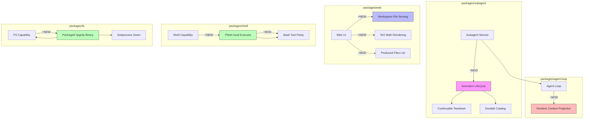

# Architecture Evolution & Design Log · 2026-08-01

> **Commit 数量**: 64 (含 merge) / 25 (非 merge)
> **核心主题**: Subagent activation lifecycle 稳定化 + Web workspace 文件服务 + PowerShell 能力接入 + fs-search ripgrep 打包

---

## 1. 每日架构演进图

> 本图反映当日最重要的架构演进路径和设计拓扑。



**图例**: `+NEW` 新增模块 | `~MOD` 修改模块 | 连线表示依赖/调用关系

---

## 2. 设计模式与重构

### 应用的设计模式
- **Strategy Pattern**: `fs-search` 通过 subprocess seam 选择 ripgrep binary 的执行策略，封装了平台特定的 spawn 行为
- **Adapter Pattern**: `pwsh-local` 作为 PowerShell executor 的本地适配器，镜像 dsh-tool-bash 的调用接口
- **Observer Pattern**: `agent-loop` 的 runtime context projection 在步骤执行前建立上下文快照，形成事件驱动的上下文传播

### 模块解耦与接口定义
- **bash-env 提取**（`87db82e`）: 将 `DSH_*` 环境变量注册表从 tool-bash 独立为 `packages/bash-env`，实现 bash/pwsh 工具间的共享状态管理。这是典型的 **Shared Kernel** DDD 模式——两个 Bounded Context（bash tool, pwsh tool）通过独立包共享领域概念
- **Subagent continuation 接口收窄**: 隐藏 manager-wide continuation drain，将连接级别的 drain 职责限定在 ACP 连接所有者

### 基础设施与性能
- **Produced files 通过 Host 打开**（`8fb6c2b`）: 将文件访问从 HTTP 路由转移到 Host 进程，避免了跨域安全问题和 HTTP 层的额外复杂度
- **TeX 数学渲染延迟**（`8ce4f07`）: 在 streaming 过程中延迟 TeX 渲染，避免每 chunk 重新解析的性能开销

---

## 3. 特性交付与系统影响

### 核心特性

| 特性 | 模块 | 影响范围 |
|------|------|----------|
| PWsh-local executor | `packages/shell` | 新增 PowerShell 能力 seam，需更新所有 shell compositions |
| Packaged ripgrep binary | `packages/fs` | 替代系统 ripgrep 依赖，通过 subprocess seam 隔离执行 |
| Workspace file serving | `packages/web` | 新增 workspace 文件路由，影响安全沙箱策略 |
| TeX math rendering | `packages/web` | Markdown 渲染管线新增数学公式支持 |
| Agent-loop context projection | `packages/agent-loop` | 步骤前上下文快照机制，影响所有 tool 执行路径 |

### 系统拓扑影响
- **pwsh tool 接入**要求更新 shipped compositions，bash-env 需要挂载到所有涉及 shell 的 harness
- **ripgrep 打包**意味着 fs-search 不再依赖系统安装的 rg，降低了用户环境配置门槛但增加了 binary 分发体积
- **workspace file serving** 引入了新的安全边界：文件访问从 HTTP 降级到 Host 进程级别

---

## 4. 架构决策与 Roadmap 对齐

### 关键技术决策（ADR 推断）

#### ADR-1: bash-env 作为独立包提取
- **背景与痛点**: bash tool 和 pwsh tool 需要共享 `DSH_*` 环境变量注册表，但原先内嵌在 tool-bash 中，导致 pwsh tool 无法复用
- **选择的方案**: 提取为 `packages/bash-env`，两个 tool 通过 `ctx.bashEnv` 访问
- **Trade-offs**: 增加了一个包的维护成本，但消除了跨包直接依赖，符合 capability seam 的 Service Definition/Provider/Consumer 模式

#### ADR-2: ripgrep 通过 subprocess seam 执行
- **背景与痛点**: fs-search 依赖系统安装的 ripgrep，用户环境差异导致不可靠
- **选择的方案**: 打包 ripgrep binary，通过 subprocess seam 隔离执行
- **Trade-offs**: 增加了 binary 分发体积，但获得了环境一致性和安全隔离

#### ADR-3: Produced files 通过 Host 打开而非 HTTP
- **背景与痛点**: Web UI 通过 HTTP 路由提供 workspace 文件访问，存在 CORS 和安全沙箱问题
- **选择的方案**: 委托给 Host 进程直接打开文件
- **Trade-offs**: 丧失了 Web 层的文件浏览能力，但获得了原生文件关联和安全保证

### 产品 Roadmap 支撑
- **PowerShell 支持**: 为 Windows 用户提供 shell 能力，是平台覆盖 Roadmap 的关键里程碑
- **Subagent 稳定化**: continuable subagent 的 lifecycle gap 修复是多 agent 协作可靠性的基础
- **Workspace 文件访问**: 支持用户在对话中直接引用和打开 workspace 文件，提升交互体验

---

## 5. 开发者/架构师决策推断

### 开发者意图重建
- **思维模型**: 开发者在处理多个并行 feature branch 的 merge 和 review 修复。核心关注点是 **pwsh tool 的 parity with bash** 和 **subagent 的 durability guarantees**
- **优先级排序**:
  1. pwsh tool 接入（新能力，高优先级）
  2. subagent lifecycle 稳定化（可靠性，高优先级）
  3. web workspace file serving（用户体验，中优先级）
  4. fs-search ripgrep 打包（环境一致性，中优先级）
- **有意取舍**:
  - pwsh tool 先实现 call-for-call mirror，sandbox surface 留到后续迭代
  - subagent 的 activation teardown 去重先于更完整的 lifecycle 重构

### 架构师决策推断
- **模块拆分粒度**: bash-env 的提取粒度恰当——它是一个纯粹的 shared state container，没有业务逻辑，适合作为 Shared Kernel
- **抽象层引入时机**: subprocess seam 在 ripgrep 场景中的引入是正确的——它为未来的其他 binary 打包提供了可复用的执行框架
- **后续影响**: pwsh tool 的 parity 设定为后续 shell 能力扩展（如 nushell、fish）建立了模板
- **作为架构师，你会赞同**: bash-env 的提取、subagent teardown 的去重、produced files 的 Host 委托
- **作为架构师，你会质疑**: workspace file serving 的安全边界是否足够清晰？是否需要独立的 file-serving sandbox？

### Code Review 视角
- **首先关注**: `8fb6c2b` (produced files through Host)——安全边界变更需要仔细审查
- **会提出的问题**:
  - workspace file serving 是否有路径遍历保护？
  - pwsh-local 的 UTF-8 I/O pinning 在 Windows PowerShell 5.1 下的回退策略是什么？
  - subagent activation teardown 去重是否引入了新的 race condition？
- **做得好**: bash-env 的独立包提取干净利落，接口最小化
- **可以改进**: subagent 的 continuation lifecycle 修复分散在多个 commit 中，可以考虑更原子化的提交

---

## 6. 技术债务与风险评估

### 已知风险 / 变通方案
- **bashEnv ownership FIXME**: bash-env 的所有权管理尚未明确，当前标记为 FIXME
- **pwsh-local Windows PowerShell 5.1 限制**: 非 ASCII stdin 可能被 garble，已知但未完全解决
- **ripgrep binary 分发**: 打包的 binary 增加了发布体积，且需要处理跨平台兼容性

### 建议的下一步
1. **明确 bashEnv ownership**: 定义 bash-env 的生命周期管理策略，决定是 tool 所有还是 context 所有
2. **完善 pwsh sandbox surface**: 当前 pwsh tool 镜像 bash 但缺少 sandbox 隔离，需要补齐
3. **workspace file serving 安全审计**: 建立路径验证和访问控制的系统性方案
4. **subagent activation lifecycle 文档化**: 将当前的 fix-driven 开发转化为正式的设计文档

---

## 阶段性深度分析

### 阶段 1: Subagent Activation Lifecycle 稳定化

**涉及的 Commits**: `7b3920801b` `4d0a24d8ed` `9cd3c57b75` `bb6e6d6f3b` `a24f9b06e7` `f91b4b2cdc` `ab4120ac96`

**阶段意图**: 修复 continuable subagent 的 activation teardown 竞态、durability 失败后的行为、以及 cold-resume 的 parent contract 语义。这是 subagent 从"能用"到"可靠"的关键转变。

**开发者视角推断**:
- **思维模型**: 开发者正在处理一个分布式状态机的生命周期问题——subagent 的 activation 可能跨越多个 session，teardown 需要处理并发取消、durability 失败、parent 移除等边界情况
- **优先级选择**: 先修复 teardown 去重（最紧急的竞态），再处理 cold-resume contract（语义正确性），最后清理 speculative effect rollback（代码卫生）
- **有意取舍**: 去重先于更完整的 lifecycle 重构——这是"先止血再治病"的策略

**架构师视角推断**:
- **粒度考量**: teardown 去重是一个精确的修复，没有引入新的抽象层。这在紧急修复中是正确的——过度抽象会增加风险
- **时机判断**: cold-resume contract 的修正应该更早发生——它影响 parent-child 的语义契约
- **后续影响**: 这组修复为 durable subagent catalog（8月2日的 `4240c7dd7b`）奠定了基础

**重点关注的文档/代码**:

| 文件/模块 | 路径 | 阅读要点 |
|-----------|------|----------|
| subagent activation | `packages/subagent/src/activation.ts` | teardown 去重的具体实现 |
| cold-resume contract | `packages/subagent/src/resume.ts` | parent resolution 语义 |
| effect rollback | `packages/subagent/src/lifecycle.ts` | speculative rollback 的移除原因 |

**领域建模洞察**（DDD 视角）:
- **聚合根**: Subagent Activation 是一个独立聚合，管理 activation 的完整生命周期
- **值对象**: Activation ID、Parent Resolution 作为不可变的标识和关系描述
- **领域事件**: ActivationTeardown、ColdResume、DurabilityFailure 作为生命周期事件

**AI Agent 能力演进**:
- subagent 的 continuable 行为是多 agent 协作的核心能力——允许 agent 在后台持续运行并在需要时恢复
- activation lifecycle 的稳定性直接影响 agent 的可靠性和用户体验

---

### 阶段 2: Web Workspace 文件服务与 TeX 渲染

**涉及的 Commits**: `59bfe77fb8` `8fb6c2bd69` `dcf485ac5c` `1e334fa955` `8ce4f07f92` `f5d53f04b7` `35e9122a65` `00390ae851`

**阶段意图**: 让 Web UI 能够列出和打开 workspace 中的文件，并在 Markdown 中渲染 TeX 数学公式。这是从"纯对话"到"对话+文件"交互模式的转变。

**开发者视角推断**:
- **思维模型**: 开发者在构建一个文件感知的对话体验——用户可以在对话中引用 workspace 文件，系统列出每轮产生的文件，并允许直接打开
- **优先级选择**: 先实现文件列出和打开（核心功能），再添加 TeX 渲染（增强功能）
- **有意取舍**: 先通过 HTTP serving（快速实现），再迁移到 Host 委托（安全性）

**架构师视角推断**:
- **粒度考量**: workspace file serving 是一个独立的 feature，没有侵入现有的文件系统抽象层
- **时机判断**: TeX 渲染的引入时机恰当——在 streaming 延迟处理之前，避免了性能问题
- **后续影响**: 文件服务模式可能扩展到其他类型的资源（如图片、音频）

**重点关注的文档/代码**:

| 文件/模块 | 路径 | 阅读要点 |
|-----------|------|----------|
| workspace file route | `packages/web/src/routes/workspace-files.ts` | 文件路由的安全边界 |
| produced files | `packages/web/src/components/produced-files.ts` | 每轮文件列表的 UI |
| TeX renderer | `packages/web/src/markdown/tex.ts` | TeX 解析和渲染逻辑 |

**领域建模洞察**（DDD 视角）:
- **聚合根**: Workspace 是文件服务的聚合根，管理文件的访问和安全策略
- **值对象**: FileReference、FilePath 作为不可变的文件标识
- **领域事件**: FileOpened、FileListed 作为文件交互事件

**AI Agent 能力演进**:
- 文件感知是 agent 能力的重要扩展——agent 可以引用和操作 workspace 文件
- TeX 渲染提升了 agent 在技术文档场景下的表达能力

---

### 阶段 3: PowerShell 能力接入与 bash-env 提取

**涉及的 Commits**: `8c6179d69d` `87db82e821` `d73888478a` `96cf8a2fbc` `af9af8ca05` `33810ae774`

**阶段意图**: 接入 PowerShell 作为 shell 能力的第二个实现，并将共享的环境变量注册表提取为独立包。这是平台覆盖战略的关键一步。

**开发者视角推断**:
- **思维模型**: 开发者在执行一个"先共享后扩展"的策略——先提取共享状态（bash-env），再基于共享状态构建新能力（pwsh tool）
- **优先级选择**: 先提取 bash-env（前置条件），再接入 pwsh tool（新能力），最后更新 compositions（集成）
- **有意取舍**: pwsh tool 先实现 call-for-call mirror，sandbox surface 留到后续——这是"先对齐再增强"的策略

**架构师视角推断**:
- **粒度考量**: bash-env 的粒度是正确的——它只包含环境变量注册逻辑，没有 shell 特定的行为
- **时机判断**: 在 pwsh tool 接入前提取 bash-env 是正确的——避免了 pwsh tool 直接依赖 tool-bash
- **后续影响**: 这个模式为未来的 shell 扩展（如 nushell、fish）建立了清晰的扩展路径

**重点关注的文档/代码**:

| 文件/模块 | 路径 | 阅读要点 |
|-----------|------|----------|
| bash-env | `packages/bash-env/src/` | 环境变量注册表的接口定义 |
| pwsh-local | `packages/shell/src/pwsh-local.ts` | PowerShell 本地执行器的实现 |
| tool-bash refactor | `packages/shell/src/tool-bash.ts` | ctx.bashEnv 的消费方式 |

**关键代码模式**:
```typescript
// packages/bash-env/src/index.ts
// Shared Kernel: bash/pwsh 工具通过 ctx.bashEnv 共享 DSH_* 环境变量
// 接口最小化：只暴露 get/set/register 方法
```

**领域建模洞察**（DDD 视角）:
- **Shared Kernel**: bash-env 作为 bash tool 和 pwsh tool 的共享内核
- **Bounded Context**: 每个 shell 实现（bash, pwsh）是独立的 bounded context，通过 shared kernel 协调
- **值对象**: ShellDialect 作为 shell 类型的不可变标识

**AI Agent 能力演进**:
- PowerShell 接入扩展了 agent 的 shell 能力边界——Windows 用户获得了完整的 shell 支持
- bash-env 的提取为多 shell 环境下的状态管理提供了统一方案

---

### 阶段 4: fs-search ripgrep 打包与 agent-loop 优化

**涉及的 Commits**: `18700f428d` `a9871d4af1` `7206c6019a` `d38c8bfaf3` `7aa9e51084`

**阶段意图**: 将 ripgrep binary 打包到 fs-search 中，消除系统依赖；同时优化 agent-loop 的 runtime context projection。

**开发者视角推断**:
- **思维模型**: 开发者在解决两个独立但相关的问题：环境一致性（ripgrep）和执行效率（context projection）
- **优先级选择**: ripgrep 打包是用户体验问题（高优先级），context projection 是性能优化（中优先级）
- **有意取舍**: ripgrep 打包增加了 binary 体积，但获得了环境一致性——这是"体积换可靠性"

**架构师视角推断**:
- **粒度考量**: subprocess seam 的引入是正确的——它为未来的 binary 打包提供了可复用的执行框架
- **时机判断**: context projection 在步骤前执行是正确的——它确保了 tool 执行时上下文已就绪
- **后续影响**: ripgrep 打包模式可以扩展到其他 CLI 工具（如 jq、fd）

**重点关注的文档/代码**:

| 文件/模块 | 路径 | 阅读要点 |
|-----------|------|----------|
| fs-search | `packages/fs/src/search.ts` | ripgrep spawn 的封装 |
| agent-loop | `packages/core/src/agent-loop.ts` | context projection 的执行时机 |

**领域建模洞察**（DDD 视角）:
- **防腐层**: subprocess seam 作为 fs-search 和系统 ripgrep 之间的防腐层
- **值对象**: RipgrepBinary 作为打包 binary 的不可变标识

**AI Agent 能力演进**:
- ripgrep 打包消除了 agent 的环境依赖——agent 可以在任何系统上执行文件搜索
- context projection 优化了 agent 的执行效率——减少了重复的上下文计算

---

### 阶段 5: CI/文档/治理杂项

**涉及的 Commits**: `5ca7e1ada9` `1d86be1b74` `0385638a35` `36700f6916` `00148eea97` `a27ca7b88f` `d22438e2b1` `1c3887673a` `30c421ed75` `43bbfce7ee`

**阶段意图**: 修复 CI 配置、刷新文档目录、标准化测试 fixture。这是日常的代码卫生工作。

**开发者视角推断**:
- **思维模型**: 开发者在处理 review 反馈和 CI 问题——这些是 PR 合并前的必要清理
- **优先级选择**: CI 问题最紧急（阻塞合并），文档刷新次之，测试 fixture 标准化最后
- **有意取舍**: 先修复 CI 阻塞问题，文档和测试的深度清理推迟到后续

**架构师视角推断**:
- **粒度考量**: 这些都是局部修复，没有架构层面的影响
- **时机判断**: 在 feature 开发间隙处理这些问题是正确的——避免技术债务累积
- **后续影响**: 文档刷新确保了新功能的正确记录

**领域建模洞察**:
- 这个阶段不涉及领域模型变更，主要是基础设施和治理层面的维护
