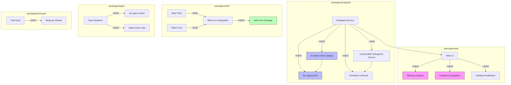

# Architecture Evolution & Design Log · 2026-08-02

> **Commit 数量**: 257 (含 merge) / 220 (非 merge)
> **核心主题**: Subagent durable catalog + Continuable subagents 源码实现 + bash-env/pwsh 集成完成 + Web steering 支持 + py-types oneOf 性能优化

---

## 1. 每日架构演进图

> 本图反映当日最重要的架构演进路径和设计拓扑。



**图例**: `+NEW` 新增模块 | `~MOD` 修改模块 | 连线表示依赖/调用关系

---

## 2. 设计模式与重构

### 应用的设计模式
- **Repository Pattern**: Durable Child Catalog（`4240c7dd7b`）引入了子 agent 的持久化目录，类似于 Repository 模式——提供 CRUD 接口管理子 agent 的元数据
- **Event-Driven Architecture**: Web steering 支持（`955a12cca4` `3a9f78c55e`）实现了消息队列到 active turns 的事件驱动路由
- **State Machine Pattern**: Continuable subagents 的 activation lifecycle 是一个典型的状态机——从创建到 drain 到 disposal 的状态转换

### 模块解耦与接口定义
- **bash-env 集成完成**（`87db82e` `d73888478a` `33810ae774`）: bash tool 和 pwsh tool 通过 `ctx.bashEnv` 共享环境变量注册表。这是 capability seam 的完整实现——Service Definition（bash-env package）、Service Provider（bash/pwsh tool）、Consumer（tool harness）
- **Subagent catalog 接口**（`4240c7dd7b`）: `list_agents` API 暴露了子 agent 的查询能力，遵循了 capability seam 的 Service Definition/Consumer 模式

### 基础设施与性能
- **py-types oneOf 性能优化**（`d7b4b014eb` `1614f19686` `b0e405a679` `345375747e`）: 将 deep oneOf-object 链的 class-name 分配从 O(n²) 优化到 O(n)，通过 amortized allocation 和 depth bound
- **Web catalog invalidation 优化**（`7b40fd5419`）: 只 trail membership-invalidated catalogs，减少不必要的 catalog 刷新

---

## 3. 特性交付与系统影响

### 核心特性

| 特性 | 模块 | 影响范围 |
|------|------|----------|
| Durable child catalog + list_agents | `packages/subagent` | 子 agent 的持久化查询，影响 ACP 和 Web UI |
| Continuable subagents source | `packages/subagent` | 后台子 agent 的完整实现，影响所有 agent 编排 |
| Web steering support | `packages/web` | 消息队列的 steering 能力，影响用户体验 |
| Subagent navigation | `packages/web` | 嵌套子 agent 的导航和 fork 支持 |
| bash-env integration | `packages/shell` | shell 工具的共享环境变量管理 |
| py-types oneOf optimization | `packages/typert` | 复杂 schema 渲染的性能瓶颈 |

### 系统拓扑影响
- **durable child catalog** 是 subagent 从"一次性"到"可查询"的转变——agent 可以在会话间保留子 agent 信息
- **Web steering** 引入了消息队列的交互式控制——用户可以将排队消息重定向到 active turns
- **bash-env 集成**完成了 shell 能力的共享基础设施——所有 shell 工具现在通过统一接口访问环境变量

---

## 4. 架构决策与 Roadmap 对齐

### 关键技术决策（ADR 推断）

#### ADR-1: Durable Child Catalog 设计
- **背景与痛点**: 子 agent 的信息在 session 结束后丢失，无法在 cold-resume 后查询子 agent 状态
- **选择的方案**: 引入持久化 catalog，通过 `list_agents` API 暴露查询能力
- **Trade-offs**: 增加了持久化存储的复杂度，但获得了会话间子 agent 状态的可查询性

#### ADR-2: Web Steering 作为队列到 Turn 的桥梁
- **背景与痛点**: 用户无法在消息排队后重新定向消息到 active turns
- **选择的方案**: 引入 steering 消息通道，允许用户将排队消息重定向
- **Trade-offs**: 增加了消息路由的复杂度，但获得了更灵活的消息控制

#### ADR-3: py-types oneOf 的 Class-name Amortized Allocation
- **背景与痛点**: deep oneOf-object 链导致 class-name 分配的 O(n²) 性能
- **选择的方案**: 通过 amortized allocation 和 depth bound 将复杂度降到 O(n)
- **Trade-offs**: 增加了分配逻辑的复杂度，但消除了性能瓶颈

### 产品 Roadmap 支撑
- **Subagent 可查询性**: durable catalog 是多 agent 协作的管理基础
- **消息控制**: steering 是用户对 agent 行为的精细控制能力
- **性能优化**: py-types oneOf 优化是复杂 schema 场景的必要改进

---

## 5. 开发者/架构师决策推断

### 开发者意图重建
- **思维模型**: 开发者在并行推进多个 feature branch：subagent catalog、web steering、bash-env 集成、py-types 优化。核心关注点是 **subagent 的持久化能力** 和 **web 交互的丰富性**
- **优先级排序**:
  1. Subagent durable catalog（核心架构，高优先级）
  2. Continuable subagents source（功能完整性，高优先级）
  3. Web steering（用户控制，中优先级）
  4. bash-env integration（基础设施，中优先级）
  5. py-types oneOf optimization（性能，中优先级）
- **有意取舍**:
  - durable catalog 先实现基本 CRUD，查询能力（list_agents）作为后续 API
  - web steering 先实现核心路由，UI 完善作为后续迭代

### 架构师决策推断
- **模块拆分粒度**: durable catalog 的粒度恰当——它是一个独立的存储层，没有侵入 subagent 的核心逻辑
- **抽象层引入时机**: bash-env 的集成时机正确——在 pwsh tool 接入后立即完成，避免了临时方案的累积
- **后续影响**: durable catalog 为未来的 agent 管理面板提供了数据基础
- **作为架构师，你会赞同**: durable catalog 的设计、py-types oneOf 的性能优化、bash-env 的统一集成
- **作为架构师，你会质疑**: web steering 的消息路由是否需要更明确的优先级机制？durable catalog 的存储策略是否需要考虑迁移？

### Code Review 视角
- **首先关注**: `4240c7dd7b` (durable child catalog)——持久化存储的设计需要仔细审查
- **会提出的问题**:
  - durable catalog 的存储格式是否支持版本迁移？
  - list_agents API 的查询性能在大量子 agent 场景下如何？
  - web steering 的消息路由是否有优先级反转的风险？
  - py-types oneOf 的 depth bound 是否足够覆盖所有实际场景？
- **做得好**: py-types oneOf 的性能优化思路清晰，从 O(n²) 到 O(n) 的改进显著
- **可以改进**: subagent 的多轮 review fix（round 1/2/3）表明设计评审可以更前置

---

## 6. 技术债务与风险评估

### 已知风险 / 变通方案
- **Subagent catalog 持久化格式**: 当前的持久化格式可能不支持未来的 schema 演进
- **Web steering 消息路由**: 优先级反转和消息丢失的风险需要进一步验证
- **py-types depth bound**: depth bound 的选择基于经验，可能在极端场景下不足

### 建议的下一步
1. **Durable catalog 版本迁移策略**: 设计 catalog 格式的版本演进机制
2. **Steering 消息路由测试**: 增加高并发和边界场景的测试覆盖
3. **py-types depth bound 监控**: 在生产环境中监控 depth bound 的使用情况
4. **Subagent catalog 查询优化**: 考虑索引和缓存策略

---

## 阶段性深度分析

### 阶段 1: Durable Subagent Catalog 与 list_agents API

**涉及的 Commits**: `fc59b63c8c` `ceaef2c3d0` `4240c7dd7b` `7b3920801b` `4d0a24d8ed` `9cd3c57b75` `bb6e6d6f3b`

**阶段意图**: 建立子 agent 的持久化目录，允许在 cold-resume 后查询子 agent 状态。这是 subagent 从"运行时状态"到"持久化状态"的转变。

**开发者视角推断**:
- **思维模型**: 开发者在构建一个 agent 管理基础设施——durable catalog 是 agent 状态的持久化层，list_agents 是查询接口
- **优先级选择**: 先设计 RFC（`fc59b63c8c`），再实现 source（`4240c7dd7b`），最后修复 lifecycle 问题（`7b3920801b` 等）
- **有意取舍**: 先实现基本持久化，查询能力（list_agents）作为 API 暴露——这是"先存储后查询"的策略

**架构师视角推断**:
- **粒度考量**: durable catalog 是一个独立的存储层，没有侵入 subagent 的核心逻辑。这是正确的——存储关注点应该与业务逻辑分离
- **时机判断**: 在 activation lifecycle 稳定化后引入 durable catalog 是正确的——避免了在不稳定的基础上构建持久化
- **后续影响**: durable catalog 为未来的 agent 管理面板、agent 分析、agent 重放提供了数据基础

**重点关注的文档/代码**:

| 文件/模块 | 路径 | 阅读要点 |
|-----------|------|----------|
| durable catalog RFC | `.agents/notes/` | 设计决策和 trade-offs |
| catalog source | `packages/subagent/src/catalog.ts` | 持久化存储的实现 |
| list_agents API | `packages/subagent/src/api.ts` | 查询接口的定义 |

**关键代码模式**:
```typescript
// packages/subagent/src/catalog.ts
// Durable catalog: 子 agent 元数据的持久化存储
// 支持 cold-resume 后的查询和状态恢复
```

**领域建模洞察**（DDD 视角）:
- **聚合根**: Subagent Catalog 是持久化层的聚合根，管理子 agent 的元数据
- **值对象**: AgentDescriptor、AgentStatus 作为子 agent 的不可变描述
- **领域事件**: AgentCreated、AgentRemoved、AgentStatusChanged 作为目录变更事件

**AI Agent 能力演进**:
- durable catalog 是多 agent 协作的管理基础——agent 可以查询和管理其子 agent
- list_agents API 是 agent 自省能力的重要扩展

---

### 阶段 2: Continuable Subagents 源码实现

**涉及的 Commits**: `26a117f842` `1c30548068` `357f317b4c` `4e7a5f19cf` `72f8f47335` `ae6976cbbd` `694b078365` `55f86367ad` `bc504195df` `3911b7117e` `c8fbc111db` `4435616a04` `03973cb074` `542a01c407`

**阶段意图**: 实现 continuable subagents 的完整源码，包括 activation lifecycle、continuation drain、ACP 集成。这是 subagent 从"设计"到"实现"的关键转变。

**开发者视角推断**:
- **思维模型**: 开发者在实现一个复杂的分布式状态机——continuable subagent 需要处理 activation、continuation、drain、disposal 等多个生命周期阶段
- **优先级选择**: 先实现核心 activation lifecycle（`26a117f842`），再处理 continuation drain（`c8fbc111db`），最后完善 ACP 集成（`542a01c407`）
- **有意取舍**: 先实现 in-process spec，ACP snapshot 作为后续——这是"先核心后集成"的策略

**架构师视角推断**:
- **粒度考量**: continuable subagents 的实现粒度恰当——它是一个独立的能力，没有侵入 subagent 的核心逻辑
- **时机判断**: 在 durable catalog 后实现 continuable subagents 是正确的——持久化为 continuable 提供了状态恢复基础
- **后续影响**: continuable subagents 是多 agent 协作的核心能力——agent 可以在后台持续运行

**重点关注的文档/代码**:

| 文件/模块 | 路径 | 阅读要点 |
|-----------|------|----------|
| activation lifecycle | `packages/subagent/src/activation.ts` | activation 的状态机实现 |
| continuation drain | `packages/subagent/src/continuation.ts` | continuation 的 drain 逻辑 |
| ACP integration | `packages/acp/src/subagent.ts` | ACP 层的 subagent 集成 |

**领域建模洞察**（DDD 视角）:
- **聚合根**: Subagent Activation 是 activation lifecycle 的聚合根
- **值对象**: ActivationID、ContinuationToken 作为不可变的标识
- **领域事件**: ActivationStarted、ContinuationDrained、ActivationDisposed 作为生命周期事件

**AI Agent 能力演进**:
- continuable subagents 是多 agent 协作的核心能力——agent 可以在后台持续运行并在需要时恢复
- activation lifecycle 的稳定性直接影响 agent 的可靠性和用户体验

---

### 阶段 3: Web Steering 支持

**涉及的 Commits**: `955a12cca4` `5b17d3bab5` `3a9f78c55e` `dffe955ed2` `7d08e43720` `cf918fa05d`

**阶段意图**: 实现消息队列到 active turns 的 steering 能力，允许用户将排队消息重定向。

**开发者视角推断**:
- **思维模型**: 开发者在构建一个消息路由机制——steering 是用户对 agent 行为的精细控制能力
- **优先级选择**: 先实现核心 routing（`955a12cca4`），再添加 UI 配置（`dffe955ed2`），最后处理 review feedback（`7d08e43720`）
- **有意取舍**: 先实现基本 steering，优先级机制作为后续——这是"先路由后优化"的策略

**架构师视角推断**:
- **粒度考量**: steering 是一个独立的消息通道，没有侵入现有的消息队列逻辑
- **时机判断**: 在 web UI 稳定化后引入 steering 是正确的——避免了在不稳定的 UI 上构建复杂功能
- **后续影响**: steering 为未来的消息优先级、消息过滤等能力提供了基础

**重点关注的文档/代码**:

| 文件/模块 | 路径 | 阅读要点 |
|-----------|------|----------|
| steering route | `packages/web/src/routes/steering.ts` | 消息路由的实现 |
| steering UI | `packages/web/src/components/steering.ts` | 用户控制界面 |

**领域建模洞察**（DDD 视角）:
- **值对象**: SteeringMessage、SteeringTarget 作为消息路由的不可变描述
- **领域事件**: MessageSteered、SteeringConfigured 作为路由变更事件

**AI Agent 能力演进**:
- steering 是用户对 agent 行为的精细控制能力——用户可以重定向排队消息
- 这提升了 agent 的可控性和用户体验

---

### 阶段 4: bash-env 集成与 Shell 工具完善

**涉及的 Commits**: `87db82e821` `d73888478a` `96cf8a2fbc` `af9af8ca05` `33810ae774` `4e62fea095`

**阶段意图**: 完成 bash-env 的集成，确保 bash 和 pwsh 工具通过统一接口访问环境变量。

**开发者视角推断**:
- **思维模型**: 开发者在完成一个"先共享后扩展"的策略——bash-env 已提取，现在完成集成
- **优先级选择**: 先完成 bash tool 集成（`87db82e`），再完成 pwsh tool 集成（`33810ae774`），最后更新 compositions（`96cf8a2fbc`）
- **有意取舍**: 先完成基本集成，文档和 catalog 刷新作为后续

**架构师视角推断**:
- **粒度考量**: bash-env 集成的粒度恰当——它只涉及 ctx.bashEnv 的消费方式变更
- **时机判断**: 在 pwsh tool 接入后立即完成集成是正确的——避免了临时方案的累积
- **后续影响**: bash-env 为未来的 shell 扩展提供了统一的环境变量管理方案

**重点关注的文档/代码**:

| 文件/模块 | 路径 | 阅读要点 |
|-----------|------|----------|
| bash tool refactor | `packages/shell/src/tool-bash.ts` | ctx.bashEnv 的消费方式 |
| pwsh tool integration | `packages/shell/src/tool-pwsh.ts` | pwsh 的环境变量访问 |
| compositions | `packages/bundle/src/compositions/` | shipped compositions 的更新 |

**领域建模洞察**（DDD 视角）:
- **Shared Kernel**: bash-env 作为 bash tool 和 pwsh tool 的共享内核
- **Bounded Context**: 每个 shell 实现是独立的 bounded context，通过 shared kernel 协调

**AI Agent 能力演进**:
- bash-env 集成完成了 shell 能力的共享基础设施——所有 shell 工具现在通过统一接口访问环境变量
- 这为未来的 shell 扩展（如 nushell、fish）提供了清晰的路径

---

### 阶段 5: py-types oneOf 性能优化

**涉及的 Commits**: `d7b4b014eb` `1614f19686` `b0e405a679` `345375747e` `96a2e38fa3` `51189a650c` `7518a5cb65`

**阶段意图**: 优化 py-types oneOf-object 链的 class-name 分配，从 O(n²) 降到 O(n)。

**开发者视角推断**:
- **思维模型**: 开发者在解决一个性能瓶颈——deep oneOf-object 链导致 class-name 分配的二次复杂度
- **优先级选择**: 先实现 amortized allocation（`d7b4b014eb`），再添加 cycle detection（`96a2e38fa3`），最后优化 allocation（`1614f19686`）
- **有意取舍**: 先解决性能问题，代码复杂度作为可接受的代价

**架构师视角推断**:
- **粒度考量**: 性能优化集中在 typert 包，没有影响其他模块
- **时机判断**: 在 py-types 功能稳定后进行性能优化是正确的——避免了在不稳定的基础上优化
- **后续影响**: 这个优化为复杂的 Python SDK 渲染场景提供了性能保证

**重点关注的文档/代码**:

| 文件/模块 | 路径 | 阅读要点 |
|-----------|------|----------|
| py-types renderer | `packages/typert/src/py-types.ts` | oneOf 渲染的实现 |
| class-name allocation | `packages/typert/src/class-name.ts` | amortized allocation 的实现 |

**关键代码模式**:
```typescript
// packages/typert/src/class-name.ts
// Amortized allocation: 将 class-name 分配从 O(n²) 优化到 O(n)
// 通过 depth bound 和 batch allocation 实现
```

**领域建模洞察**（DDD 视角）:
- 这个优化不涉及领域模型变更，是纯粹的性能优化

**AI Agent 能力演进**:
- py-types oneOf 优化提升了 agent 在复杂 schema 场景下的渲染性能
- 这为 Python SDK 的广泛使用提供了性能保证

---

### 阶段 6: Subagent Navigation 与 Web 交互完善

**涉及的 Commits**: `16ffd63115` `a27492507d` `8a518e353b` `f0ab04273d` `76547dfe0c` `23680e838b` `b94d2f9c1d` `53ae9abea2` `ca1d838afc` `42d34473af` `130410bb98`

**阶段意图**: 实现嵌套子 agent 的导航和 fork 支持，完善 Web UI 的 subagent 交互体验。

**开发者视角推断**:
- **思维模型**: 开发者在构建一个 agent 层级的导航系统——用户可以在嵌套的子 agent 之间导航
- **优先级选择**: 先实现核心 navigation transport（`a27492507d`），再添加 nested conversations（`16ffd63115`），最后完善 fork support（`130410bb98`）
- **有意取舍**: 先实现基本导航，fork 分组作为后续完善

**架构师视角推断**:
- **粒度考量**: subagent navigation 是一个独立的 UI 功能，没有侵入 subagent 的核心逻辑
- **时机判断**: 在 durable catalog 和 continuable subagents 后实现 navigation 是正确的——持久化和激活为导航提供了数据基础
- **后续影响**: subagent navigation 为未来的 agent 管理面板提供了 UI 基础

**重点关注的文档/代码**:

| 文件/模块 | 路径 | 阅读要点 |
|-----------|------|----------|
| subagent navigation | `packages/web/src/components/subagent-nav.ts` | 导航的 UI 实现 |
| nested conversations | `packages/web/src/components/nested-conversations.ts` | 嵌套对话的实现 |

**领域建模洞察**（DDD 视角）:
- **值对象**: NavigationPath、ForkGroup 作为导航的不可变描述
- **领域事件**: AgentNavigated、ForkCreated 作为导航变更事件

**AI Agent 能力演进**:
- subagent navigation 是多 agent 协作的 UI 基础——用户可以在嵌套的子 agent 之间导航
- 这提升了 agent 的可观测性和用户体验

---

### 阶段 7: tool-goal wrap-up 与 LLM replay 优化

**涉及的 Commits**: `e72978ba98` `666ef95f81` `04d43e3b19` `820a5a97f1`

**阶段意图**: 修复 tool-goal 的 wrap-up clause 作用域问题，并增强 LLM replay 的占位符解析能力。

**开发者视角推断**:
- **思维模型**: 开发者在处理两个独立但相关的问题：tool-goal 的语义正确性和 LLM replay 的灵活性
- **优先级选择**: tool-goal 修复最紧急（语义正确性），LLM replay 增强次之（功能扩展）
- **有意取舍**: tool-goal 先修复作用域问题，更完整的重构作为后续

**架构师视角推断**:
- **粒度考量**: 这两个修复都是局部的，没有架构层面的影响
- **时机判断**: 在 feature 开发间隙处理这些问题是正确的——避免了技术债务累积
- **后续影响**: LLM replay 的占位符解析为测试和调试提供了更大的灵活性

**重点关注的文档/代码**:

| 文件/模块 | 路径 | 阅读要点 |
|-----------|------|----------|
| tool-goal | `packages/goal/src/tool-goal.ts` | wrap-up clause 的作用域修复 |
| llm-replay | `packages/llm/src/replay.ts` | 占位符解析的增强 |

**领域建模洞察**（DDD 视角）:
- 这个阶段不涉及领域模型变更，主要是语义修复和功能增强
