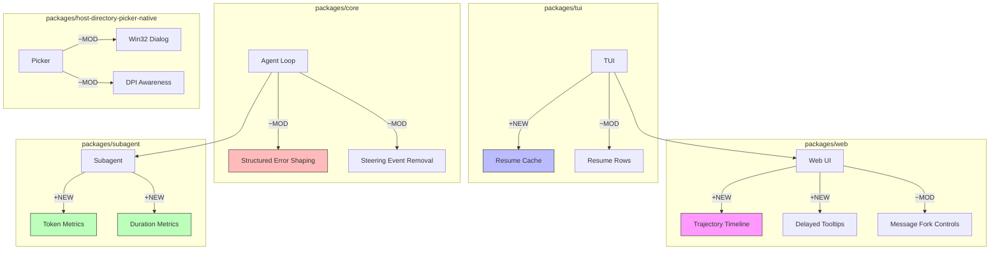

# Architecture Evolution & Design Log · 2026-08-03

> **Commit 数量**: 193 (含 merge) / 106 (非 merge)
> **核心主题**: TUI resume 优化 + UI trajectory 增强 + Agent-loop 结构化错误 + Subagent token/duration 指标 + Directory picker Win32 重构

---

## 1. 每日架构演进图

> 本图反映当日最重要的架构演进路径和设计拓扑。



**图例**: `+NEW` 新增模块 | `~MOD` 修改模块 | 连线表示依赖/调用关系

---

## 2. 设计模式与重构

### 应用的设计模式
- **Cache Pattern**: TUI resume cache（`7a26214a81`）通过 projection cache 缓存 session 标题，避免每次 resume 时重新计算
- **Composite Pattern**: UI trajectory timeline（`062a1507f1` `74cd2e4bd9`）将多个 timing 交互组合为统一的 timeline 视图
- **Strategy Pattern**: Directory picker 的 Win32 dialog 重构（`089f4dfad8` `4201eaed3f`）通过 child process 隔离 dialog 执行

### 模块解耦与接口定义
- **Steering message session event 移除**（`cb2f01f48c`）: 从 agent-loop 中移除了 steering/message session event，简化了事件模型
- **Agent-loop turn error shaping 内联**（`f0622f3280`）: 将 turn error shaping 从独立函数内联到调用点，减少了抽象层级
- **Agent-loop maintenance between turns**（`b4258a2c4a`）: 在 turn 之间运行 maintenance，分离了业务逻辑和维护逻辑

### 基础设施与性能
- **TUI resume cache**（`7a26214a81`）: 通过 projection cache 缓存 session 标题，将 resume 的 I/O 操作降到最低
- **Subagent token/duration metrics**（`57e2433f45` `3a920be9c5` `b30686d634`）: 增加了子 agent 的 token 使用量和活跃时长指标
- **Inbox lifecycle migration**（`49e90695cc` `f4a2e0d10a`）: 完成了 inbox 的生命周期迁移

---

## 3. 特性交付与系统影响

### 核心特性

| 特性 | 模块 | 影响范围 |
|------|------|----------|
| TUI resume cache | `packages/tui` | 加速 session resume，减少 I/O |
| UI trajectory timeline | `packages/web` | 增强的 timing 可视化 |
| Delayed multiline tooltips | `packages/ui-primitives` | 延迟显示的多行 tooltip |
| Agent-loop structured errors | `packages/core` | turn/error 的结构化表示 |
| Subagent token/duration metrics | `packages/subagent` | 子 agent 的性能指标 |
| Directory picker Win32 refactor | `packages/host-directory-picker-native` | Win32 dialog 的进程隔离 |

### 系统拓扑影响
- **TUI resume cache** 减少了 session resume 的延迟，提升了用户体验
- **Subagent metrics** 为 agent 性能分析提供了数据基础
- **Directory picker 重构** 改善了 Windows 平台的稳定性

---

## 4. 架构决策与 Roadmap 对齐

### 关键技术决策（ADR 推断）

#### ADR-1: TUI Resume 通过 Projection Cache
- **背景与痛点**: TUI session resume 需要重新计算 session 标题，导致启动延迟
- **选择的方案**: 通过 projection cache 缓存 session 标题，避免重复计算
- **Trade-offs**: 增加了缓存一致性维护的复杂度，但显著减少了 resume 延迟

#### ADR-2: Directory Picker 通过 Child Process 隔离
- **背景与痛点**: Win32 folder dialog 的 COM apartment 问题导致进程崩溃
- **选择的方案**: 通过 child process 隔离 dialog 执行
- **Trade-offs**: 增加了进程间通信的复杂度，但获得了崩溃隔离

#### ADR-3: Steering Message Event 移除
- **背景与痛点**: steering message 产生了不必要的 session event
- **选择的方案**: 移除 steering/message session event，简化事件模型
- **Trade-offs**: 丧失了 steering 的 session 级别审计能力，但简化了事件处理

### 产品 Roadmap 支撑
- **TUI 性能**: resume cache 是 TUI 用户体验的关键改进
- **Windows 稳定性**: directory picker 重构是 Windows 平台稳定性的基础
- **Agent 可观测性**: subagent metrics 是 agent 性能分析的基础

---

## 5. 开发者/架构师决策推断

### 开发者意图重建
- **思维模型**: 开发者在并行推进多个优化和增强：TUI 性能、Web UI 交互、agent-loop 结构化、subagent 指标、Windows 稳定性
- **优先级排序**:
  1. TUI resume cache（性能，高优先级）
  2. Directory picker Win32 重构（稳定性，高优先级）
  3. Subagent metrics（可观测性，中优先级）
  4. UI trajectory timeline（交互体验，中优先级）
  5. Agent-loop structured errors（代码质量，中优先级）
- **有意取舍**:
  - TUI resume cache 先实现基本缓存，缓存失效策略作为后续
  - directory picker 先实现 child process 隔离，更完整的错误处理作为后续

### 架构师决策推断
- **模块拆分粒度**: 每个优化都是独立的模块级变更，没有跨模块的影响
- **抽象层引入时机**: trajectory timeline 的引入时机恰当——在 Web UI 稳定化后增强交互
- **后续影响**: subagent metrics 为未来的 agent 性能监控和调优提供了数据基础
- **作为架构师，你会赞同**: TUI resume cache、directory picker 重构、subagent metrics
- **作为架构师，你会质疑**: steering message event 的移除是否过于激进？

### Code Review 视角
- **首先关注**: `089f4dfad8` (directory picker Win32 refactor)——进程隔离的实现需要仔细审查
- **会提出的问题**:
  - directory picker 的 child process 通信协议是什么？超时和错误处理如何？
  - TUI resume cache 的缓存失效策略是什么？
  - subagent metrics 的采集是否有性能开销？
- **做得好**: subagent metrics 的设计清晰，token 和 duration 是关键指标
- **可以改进**: steering message event 的移除应该有更明确的迁移指南

---

## 6. 技术债务与风险评估

### 已知风险 / 变通方案
- **TUI resume cache 一致性**: 缓存可能与实际 session 状态不一致
- **Directory picker child process**: 进程间通信的超时和错误处理需要进一步完善
- **Subagent metrics 开销**: metrics 采集可能在高并发场景下产生性能开销

### 建议的下一步
1. **TUI resume cache 失效策略**: 设计基于 session 变更的缓存失效机制
2. **Directory picker 错误处理**: 完善 child process 的超时、重试和错误传播
3. **Subagent metrics 采样**: 在高并发场景下考虑 metrics 采样策略

---

## 阶段性深度分析

### 阶段 1: TUI Resume 优化与 Agent-loop 结构化

**涉及的 Commits**: `7a26214a81` `7077d6befc` `f0622f3280` `cb2f01f48c` `b4258a2c4a` `49e90695cc` `f4a2e0d10a`

**阶段意图**: 优化 TUI session resume 的性能，并将 agent-loop 的错误处理和 maintenance 逻辑结构化。

**开发者视角推断**:
- **思维模型**: 开发者在优化 TUI 的启动体验——通过 projection cache 减少 I/O，通过结构化错误提升可维护性
- **优先级选择**: resume cache 最紧急（用户体验），error shaping 次之（代码质量），maintenance 最后（架构改进）
- **有意取舍**: resume cache 先实现基本缓存，缓存失效策略作为后续

**架构师视角推断**:
- **粒度考量**: resume cache 是一个独立的优化，没有侵入 TUI 的核心逻辑
- **时机判断**: 在 TUI 功能稳定化后进行性能优化是正确的
- **后续影响**: resume cache 为 TUI 的进一步性能优化提供了基础

**重点关注的文档/代码**:

| 文件/模块 | 路径 | 阅读要点 |
|-----------|------|----------|
| resume cache | `packages/tui/src/resume-cache.ts` | projection cache 的实现 |
| agent-loop error | `packages/core/src/agent-loop.ts` | structured error shaping |

**领域建模洞察**（DDD 视角）:
- **值对象**: ResumeCacheKey 作为缓存的不可变标识
- **领域事件**: SessionResumed、CacheInvalidated 作为缓存变更事件

---

### 阶段 2: UI Trajectory Timeline 与交互增强

**涉及的 Commits**: `062a1507f1` `74cd2e4bd9` `c8ece8325c` `a8478fc031` `94dabcb7ed` `68e79ed983` `44304a458c` `5534431d42`

**阶段意图**: 增强 Web UI 的 trajectory timeline，提供更丰富的 timing 交互和可视化。

**开发者视角推断**:
- **思维模型**: 开发者在构建一个时间线交互系统——用户可以看到和操作 agent 的 timing 信息
- **优先级选择**: 先实现 timeline 基础结构，再添加 timing 交互，最后完善动画和响应式布局
- **有意取舍**: 先实现核心 timeline，高级交互作为后续

**架构师视角推断**:
- **粒度考量**: trajectory timeline 是一个独立的 UI 组件
- **时机判断**: 在 Web UI 稳定化后引入 timeline 是正确的
- **后续影响**: trajectory timeline 为未来的 agent 性能分析提供了可视化基础

**重点关注的文档/代码**:

| 文件/模块 | 路径 | 阅读要点 |
|-----------|------|----------|
| trajectory timeline | `packages/web/src/components/trajectory-timeline.ts` | timeline 的 UI 实现 |
| timing interactions | `packages/web/src/components/timing-interactions.ts` | timing 交互的实现 |

---

### 阶段 3: Subagent Token/Duration 指标

**涉及的 Commits**: `3a920be9c5` `57e2433f45` `c831c99981` `b30686d634` `255cd90c6e`

**阶段意图**: 增加子 agent 的 token 使用量和活跃时长指标，支持性能分析。

**开发者视角推断**:
- **思维模型**: 开发者在构建 agent 的性能观测能力——token 和 duration 是关键的性能指标
- **优先级选择**: 先实现 token metrics，再添加 duration metrics，最后完善显示
- **有意取舍**: 先实现基本 metrics，采样和聚合策略作为后续

**架构师视角推断**:
- **粒度考量**: metrics 是一个独立的观测层
- **时机判断**: 在 subagent 功能稳定化后引入 metrics 是正确的
- **后续影响**: metrics 为未来的 agent 性能监控和调优提供了数据基础

**重点关注的文档/代码**:

| 文件/模块 | 路径 | 阅读要点 |
|-----------|------|----------|
| token metrics | `packages/subagent/src/metrics/token.ts` | token 使用量的采集 |
| duration metrics | `packages/subagent/src/metrics/duration.ts` | 活跃时长的计算 |

---

### 阶段 4: Directory Picker Win32 重构

**涉及的 Commits**: `089f4dfad8` `4201eaed3f` `bc9171337a` `8500a21658` `e182f03230` `020ce50414` `f4095ee3eb` `16b7708100`

**阶段意图**: 重构 Win32 folder dialog，通过 child process 隔离 COM apartment 问题。

**开发者视角推断**:
- **思维模型**: 开发者在解决 Windows 平台的稳定性问题——Win32 dialog 的 COM apartment 问题导致进程崩溃
- **优先级选择**: 先实现 child process 隔离，再处理 DPI 感知，最后完善错误处理
- **有意取舍**: 先实现基本隔离，更完整的错误处理作为后续

**架构师视角推断**:
- **粒度考量**: directory picker 重构是一个独立的平台特定优化
- **时机判断**: 在 Windows 平台问题暴露后立即修复是正确的
- **后续影响**: 这个重构为 Windows 平台的其他 COM 组件集成提供了模式

**重点关注的文档/代码**:

| 文件/模块 | 路径 | 阅读要点 |
|-----------|------|----------|
| win32 dialog | `packages/host-directory-picker-native/src/win32-dialog.ts` | child process 隔离的实现 |
| DPI awareness | `packages/host-directory-picker-native/src/dpi.ts` | DPI 感知的处理 |

**关键代码模式**:
```typescript
// packages/host-directory-picker-native/src/win32-dialog.ts
// Child process isolation: 通过 spawned child process 隔离 COM apartment
// 避免 Win32 dialog 的 COM 问题影响主进程
```

**领域建模洞察**（DDD 视角）:
- **值对象**: DialogConfig、DpiContext 作为 dialog 配置的不可变描述
- **领域事件**: DialogOpened、DialogClosed 作为 dialog 生命周期事件
