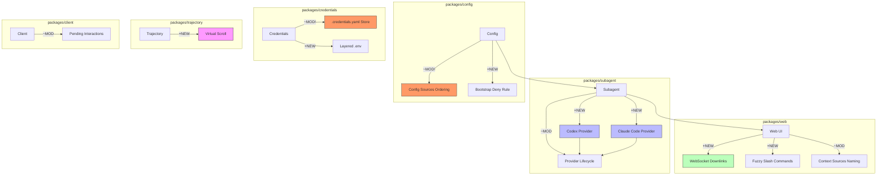

# Architecture Evolution & Design Log · 2026-08-04

> **Commit 数量**: 192 (含 merge) / 127 (非 merge)
> **核心主题**: Product providers (Codex/Claude Code) + Config breaking change + Credentials store migration + WebSocket downlinks + Trajectory virtualization

---

## 1. 每日架构演进图

> 本图反映当日最重要的架构演进路径和设计拓扑。

**图例**: `+NEW` 新增模块 | `~MOD` 修改模块 | `~MOD!` Breaking change | 连线表示依赖/调用关系

---

## 2. 设计模式与重构

### 应用的设计模式
- **Provider Pattern**: Codex product provider（`1daa35b6e3`）和 Claude Code provider（`be56f64b7a`）实现了 subagent 的多 provider 架构。这是 **Strategy Pattern** 的高级应用——不同 provider 提供不同的 agent 能力
- **Adapter Pattern**: WebSocket downlinks（`8b4ddfe60c`）将 connection downlinks 从 HTTP 长轮询迁移到 WebSocket，是典型的协议适配器
- **Facade Pattern**: Config sources ordering（`0512b12714`）统一了配置源的优先级，为外部提供简化的配置访问接口

### 模块解耦与接口定义
- **Credentials store 迁移**（`03b534de16`）: 将 credentials 从隐式存储迁移到 `.credentials.yaml` 并分层 `$DSH_HOME/.env`。这是 **Value Object** 的持久化重构——credentials 从运行时状态变为声明式配置
- **Agent-loop inbox mutations by message id**（`0ac95437b4`）: 将 inbox 变更从位置索引改为 message id 索引，消除了位置依赖的竞态条件
- **Agent-loop direct wakeup**（`e50c4aca03`）: 将 work 启动从间接通知改为直接唤醒，减少了通知链路的延迟

### 基础设施与性能
- **Trajectory virtual scroll**（`ae1008b4fb`）: 为长 session 历史实现虚拟滚动，将渲染复杂度从 O(n) 降到 O(1)
- **Chat scroll optimization**（`6514a59d5d` `8de33e42f7` `9b91e5312c`）: 修复了 long-chat 场景下的滚动位置保持问题
- **TUI long session render**（`5329bef04d`）: 增量式 step timing 和 card render 缓存，优化长 session 的渲染性能

---

## 3. 特性交付与系统影响

### 核心特性

| 特性 | 模块 | 影响范围 |
|------|------|----------|
| Codex product provider | `packages/subagent` | 新增 Codex agent 能力 |
| Claude Code provider | `packages/subagent` | 新增 Claude Code agent 能力 |
| Config sources ordering (breaking) | `packages/config` | 配置源优先级重排，需迁移 |
| Credentials .credentials.yaml | `packages/credentials` | 凭证存储格式变更 |
| WebSocket downlinks | `packages/web` | 连接协议从 HTTP 到 WebSocket |
| Fuzzy slash commands | `packages/web` | 命令发现的模糊匹配 |
| Trajectory virtual scroll | `packages/trajectory` | 长 session 的虚拟滚动 |

### 系统拓扑影响
- **Product providers** 是 subagent 从"单一实现"到"多 provider"的转变——agent 可以使用不同的底层 AI 服务
- **Config breaking change** 要求所有用户更新配置文件——这是高影响力的架构决策
- **Credentials 迁移** 改变了凭证管理的安全模型——从隐式到声明式
- **WebSocket downlinks** 改变了客户端-服务器通信模式——从轮询到推送

---

## 4. 架构决策与 Roadmap 对齐

### 关键技术决策（ADR 推断）

#### ADR-1: Product Provider 架构
- **背景与痛点**: subagent 需要支持不同的 AI 服务（Codex、Claude Code），但原先只支持单一实现
- **选择的方案**: 引入 product provider 抽象，每个 provider 封装特定 AI 服务的交互
- **Trade-offs**: 增加了 provider 管理的复杂度，但获得了多 AI 服务的支持

#### ADR-2: Config Sources Ordering (breaking)
- **背景与痛点**: 配置源的优先级不明确，导致配置覆盖行为不可预测
- **选择的方案**: 定义明确的配置源优先级顺序
- **Trade-offs**: Breaking change 要求用户迁移，但获得了可预测的配置行为

#### ADR-3: Credentials 迁移到 .credentials.yaml
- **背景与痛点**: credentials 的存储格式不统一，安全模型不清晰
- **选择的方案**: 迁移到 `.credentials.yaml` 并分层 `$DSH_HOME/.env`
- **Trade-offs**: 存储格式变更要求迁移，但获得了清晰的安全边界

### 产品 Roadmap 支撑
- **Multi-provider support**: product providers 是平台生态的关键扩展
- **Config stability**: config breaking change 是配置管理规范化的必要步骤
- **Security hardening**: credentials 迁移是安全模型完善的基础设施

---

## 5. 开发者/架构师决策推断

### 开发者意图重建
- **思维模型**: 开发者在并行推进多个架构级变更：product providers、config breaking change、credentials migration、WebSocket 通信。核心关注点是 **架构的规范化和扩展性**
- **优先级排序**:
  1. Product providers（核心架构，高优先级）
  2. Config breaking change（架构规范化，高优先级）
  3. Credentials migration（安全模型，高优先级）
  4. WebSocket downlinks（通信优化，中优先级）
  5. Trajectory virtualization（性能，中优先级）
- **有意取舍**:
  - config breaking change 先实现，迁移工具作为后续
  - product providers 先实现 Codex，Claude Code 作为后续

### 架构师决策推断
- **模块拆分粒度**: product providers 的粒度恰当——每个 provider 是独立的模块
- **抽象层引入时机**: config breaking change 的引入时机恰当——在配置使用稳定后规范化
- **后续影响**: product providers 为未来的 agent 生态提供了扩展基础
- **作为架构师，你会赞同**: product providers 的设计、config breaking change 的规范化
- **作为架构师，你会质疑**: config breaking change 的迁移路径是否足够清晰？是否有回滚机制？

### Code Review 视角
- **首先关注**: `0512b12714` (config breaking change)——breaking change 需要仔细审查
- **会提出的问题**:
  - config breaking change 的迁移指南是什么？是否有自动迁移工具？
  - credentials .credentials.yaml 的安全模型是什么？是否有加密？
  - product providers 的错误处理和重试策略是什么？
  - WebSocket downlinks 的断线重连机制是什么？
- **做得好**: product providers 的抽象设计清晰，provider 接口最小化
- **可以改进**: config breaking change 应该有更完善的迁移文档

---

## 6. 技术债务与风险评估

### 已知风险 / 变通方案
- **Config migration**: breaking change 可能导致用户配置丢失，需要完善的迁移工具
- **Credentials security**: .credentials.yaml 的明文存储可能不满足安全要求
- **Provider reliability**: product providers 的可靠性依赖于外部 AI 服务的可用性

### 建议的下一步
1. **Config migration tool**: 提供自动迁移工具，减少用户手动迁移的负担
2. **Credentials encryption**: 考虑对 .credentials.yaml 进行加密存储
3. **Provider circuit breaker**: 为 product providers 实现断路器模式
4. **WebSocket reconnection**: 完善 WebSocket 的断线重连和状态恢复

---

## 阶段性深度分析

### 阶段 1: Product Providers (Codex + Claude Code)

**涉及的 Commits**: `1daa35b6e3` `be56f64b7a` `c09b20f96b` `36b562e4e9` `8e4a1b3396` `d7ee0e798a` `f96acad438` `451c2929ed`

**阶段意图**: 实现 Codex 和 Claude Code 作为 subagent 的 product providers，支持多 AI 服务架构。

**开发者视角推断**:
- **思维模型**: 开发者在构建一个 provider 抽象层——每个 product provider 封装特定 AI 服务的交互细节
- **优先级选择**: 先实现 Codex provider（`1daa35b6e3`），再实现 Claude Code provider（`be56f64b7a`），最后处理 review findings
- **有意取舍**: 先实现基本功能，error handling 和 retry 作为后续

**架构师视角推断**:
- **粒度考量**: product providers 的粒度恰当——每个 provider 是独立的模块，通过统一接口交互
- **时机判断**: 在 subagent 功能稳定化后引入 product providers 是正确的
- **后续影响**: product providers 为未来的 agent 生态提供了扩展基础

**重点关注的文档/代码**:

| 文件/模块 | 路径 | 阅读要点 |
|-----------|------|----------|
| codex provider | `packages/subagent/src/providers/codex.ts` | Codex 交互的实现 |
| claude code provider | `packages/subagent/src/providers/claude-code.ts` | Claude Code 交互的实现 |
| provider lifecycle | `packages/subagent/src/providers/lifecycle.ts` | provider 的生命周期管理 |

**领域建模洞察**（DDD 觠角）:
- **聚合根**: Product Provider 是 subagent 能力的聚合根
- **值对象**: ProviderConfig、ProviderCapabilities 作为 provider 的不可变描述
- **领域事件**: ProviderRegistered、ProviderActivated 作为 provider 生命周期事件

**AI Agent 能力演进**:
- product providers 是 multi-agent 架构的核心——agent 可以使用不同的 AI 服务
- 这为 agent 的能力扩展和生态建设提供了基础

---

### 阶段 2: Config Breaking Change 与 Credentials Migration

**涉及的 Commits**: `0512b12714` `03b534de16` `8c2970e70e` `88c035c98e` `e1d226c4af`

**阶段意图**: 规范化配置源优先级（breaking change），并将凭证存储迁移到 `.credentials.yaml`。

**开发者视角推断**:
- **思维模型**: 开发者在执行架构规范化——配置和凭证管理需要明确的优先级和存储格式
- **优先级选择**: config breaking change 最紧急（架构规范化），credentials migration 次之（安全模型）
- **有意取舍**: 先实现 breaking change，迁移工具作为后续

**架构师视角推断**:
- **粒度考量**: config 和 credentials 是独立的配置关注点，应该分别处理
- **时机判断**: 在配置使用模式稳定后进行规范化是正确的
- **后续影响**: 这些变更奠定了配置管理的规范化基础

**重点关注的文档/代码**:

| 文件/模块 | 路径 | 阅读要点 |
|-----------|------|----------|
| config sources | `packages/config/src/sources.ts` | 配置源优先级的定义 |
| credentials store | `packages/credentials/src/store.ts` | .credentials.yaml 的实现 |

**领域建模洞察**（DDD 视角）:
- **值对象**: ConfigSource、CredentialStore 作为配置的不可变描述
- **领域事件**: ConfigChanged、CredentialsMigrated 作为配置变更事件

---

### 阶段 3: WebSocket Downlinks 与客户端通信优化

**涉及的 Commits**: `8b4ddfe6c0` `e2049910d5` `00d4349eb4` `5372f56280` `3a54694d28`

**阶段意图**: 将客户端-服务器通信从 HTTP 轮询迁移到 WebSocket 推送，优化实时性。

**开发者视角推断**:
- **思维模型**: 开发者在优化客户端-服务器通信——WebSocket 提供了更好的实时性和效率
- **优先级选择**: 先实现 WebSocket downlinks（`8b4ddfe6c0`），再处理 pending interactions（`00d4349eb4`），最后优化 reconnect（`3a54694d28`）
- **有意取舍**: 先实现基本 WebSocket，更完整的错误处理和重连作为后续

**架构师视角推断**:
- **粒度考量**: WebSocket downlinks 是一个独立的通信层，没有侵入现有的消息逻辑
- **时机判断**: 在 Web UI 稳定化后引入 WebSocket 是正确的
- **后续影响**: WebSocket 为未来的实时交互提供了通信基础

**重点关注的文档/代码**:

| 文件/模块 | 路径 | 阅读要点 |
|-----------|------|----------|
| websocket downlinks | `packages/web/src/websocket/downlinks.ts` | WebSocket 的实现 |
| pending interactions | `packages/client/src/pending.ts` | pending 状态的管理 |

**领域建模洞察**（DDD 视角）:
- **值对象**: DownlinkConfig、InteractionState 作为通信配置的不可变描述
- **领域事件**: DownlinkConnected、InteractionPending 作为通信状态事件

---

### 阶段 4: Trajectory Virtualization 与性能优化

**涉及的 Commits**: `ae1008b4fb` `26742effdd` `13fed3721f` `92de5bb6d4`

**阶段意图**: 为长 session 历史实现虚拟滚动，优化渲染性能。

**开发者视角推断**:
- **思维模型**: 开发者在解决长 session 的渲染性能问题——虚拟滚动将渲染复杂度从 O(n) 降到 O(1)
- **优先级选择**: 先实现虚拟滚动（`ae1008b4fb`），再处理 history windows 折叠（`26742effdd`），最后优化 streaming 限制（`92de5bb6d4`）
- **有意取舍**: 先实现基本虚拟滚动，更完整的交互作为后续

**架构师视角推断**:
- **粒度考量**: trajectory virtualization 是一个独立的 UI 优化
- **时机判断**: 在 trajectory 功能稳定化后引入虚拟滚动是正确的
- **后续影响**: 虚拟滚动为长 session 场景提供了性能保证

**重点关注的文档/代码**:

| 文件/模块 | 路径 | 阅读要点 |
|-----------|------|----------|
| virtual scroll | `packages/trajectory/src/virtual-scroll.ts` | 虚拟滚动的实现 |
| history windows | `packages/trajectory/src/history-windows.ts` | history 折叠的逻辑 |

**领域建模洞察**（DDD 视角）:
- **值对象**: ScrollWindow、HistorySegment 作为滚动窗口的不可变描述
- **领域事件**: ScrollPositionChanged、HistoryFolded 作为滚动状态事件

---

### 阶段 5: TUI 改进与 CLI 清理

**涉及的 Commits**: `10bb9cbf4a` `8ddc53f7a0` `88c035c98e` `eaf5b879c6` `5329bef04d`

**阶段意图**: 移除旧的 TUI 包和 legacy dsh entrypoints，优化 TUI 长 session 渲染。

**开发者视角推断**:
- **思维模型**: 开发者在清理技术债务——移除不再使用的 TUI 代码，简化 CLI 入口
- **优先级选择**: TUI 清理最紧急（技术债务），TUI 性能优化次之
- **有意取舍**: 先移除旧代码，性能优化作为后续

**架构师视角推断**:
- **粒度考量**: TUI 清理是独立的清理工作
- **时机判断**: 在新 TUI 实现稳定后移除旧代码是正确的
- **后续影响**: 清理减少了代码库的复杂度和维护成本

**重点关注的文档/代码**:

| 文件/模块 | 路径 | 阅读要点 |
|-----------|------|----------|
| CLI entrypoints | `packages/cli/src/` | CLI 入口的简化 |
| TUI removal | `packages/tui/` | 旧 TUI 代码的移除 |

**领域建模洞察**（DDD 视角）:
- 这个阶段主要是代码清理，不涉及领域模型变更
