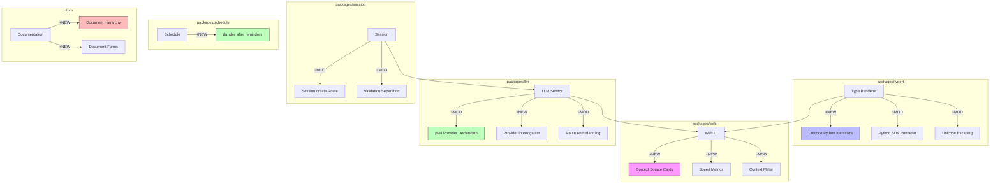

# Architecture Evolution & Design Log · 2026-08-05

> **Commit 数量**: 249 (含 merge) / 164 (非 merge)
> **核心主题**: Python SDK renderer 完善 + Context source cards + LLM pi-ai provider 重构 + Session create 路由 + Schedule durable reminders + Documentation hierarchy

---

## 1. 每日架构演进图

> 本图反映当日最重要的架构演进路径和设计拓扑。



**图例**: `+NEW` 新增模块 | `~MOD` 修改模块 | 连线表示依赖/调用关系

---

## 2. 设计模式与重构

### 应用的设计模式
- **Facade Pattern**: Session.create 路由（`8cbdd5b9d0`）为 session 创建提供了统一的入口，封装了验证和快照的复杂性
- **Strategy Pattern**: LLM pi-ai provider declaration（`d6126c25f2`）将 provider 发现从运行时查找改为声明式配置，是策略模式的应用
- **Template Method Pattern**: Python SDK renderer（`7a178951d6` `5d65686c33`）通过模板方法定义了 Python 代码生成的骨架

### 模块解耦与接口定义
- **Context source cards**（`b7034e4a26` `340c9ba576`）: 将 context 注入拆分为 producer-declared forms，每个 producer 声明其支持的 context 形式。这是 **Open-Closed Principle** 的应用——新 producer 可以声明新的 context 形式而不需要修改 consumer
- **Session validation 与 snapshots 分离**（`c02871b910`）: 将 session 验证从快照中分离，实现了读写关注点的分离
- **Agent-loop setup 与 publication 分离**（`69b1ea8d8c`）: 将 agent 的 setup 和 publication 分离为独立步骤，简化了生命周期管理

### 基础设施与性能
- **Token-meter surface 折叠**（`e62cbe12e4`）: 将 token meter 和 projection 合并为一个 surface，减少了重复计算
- **Context meter 支持 compaction**（`038699bcb4`）: 让 context meter 能够看到 compaction 操作，提供了更完整的 context 使用视图
- **TeX math rendering**（`51494c9cbe` `7c90422f34`）: 完善了 TeX 数学公式的解析和渲染

---

## 3. 特性交付与系统影响

### 核心特性

| 特性 | 模块 | 影响范围 |
|------|------|----------|
| Unicode Python identifiers | `packages/typert` | Python SDK 支持非 ASCII 标识符 |
| Context source cards | `packages/web` | producer 声明的 context 形式 |
| Speed metrics | `packages/web` | agent 执行速度可视化 |
| pi-ai provider declaration | `packages/llm` | provider 发现从查找改为声明 |
| Provider interrogation | `packages/llm` | 运行时查询 provider 能力 |
| Session.create routing | `packages/session` | session 创建的统一入口 |
| Durable after reminders | `packages/schedule` | 持久化的延时提醒 |
| Document hierarchy | `docs` | 文档结构的规范化 |

### 系统拓扑影响
- **Context source cards** 是 context 管理的架构改进——producer 声明 context 形式，consumer 按需消费
- **pi-ai provider declaration** 改变了 LLM provider 的发现机制——从运行时查找变为声明式配置
- **Session.create routing** 简化了 session 创建的复杂度——统一入口封装了验证和快照
- **Document hierarchy** 建立了文档结构的规范化——为文档维护提供了清晰的框架

---

## 4. 架构决策与 Roadmap 对齐

### 关键技术决策（ADR 推断）

#### ADR-1: Context Source Cards 作为 Producer-Declared Forms
- **背景与痛点**: context 注入缺乏统一的声明机制，每个 producer 的 context 形式不透明
- **选择的方案**: 引入 producer-declared context forms，每个 producer 声明其支持的 context 形式
- **Trade-offs**: 增加了 producer 的声明负担，但获得了 context 形式的透明性

#### ADR-2: LLM pi-ai Provider Declaration
- **背景与痛点**: provider 发现依赖运行时查找，不可预测且难以测试
- **选择的方案**: 改为声明式配置，provider 在配置时声明其能力
- **Trade-offs**: 增加了配置复杂度，但获得了可预测性和可测试性

#### ADR-3: Session.create 统一路由
- **背景与痛点**: session 创建逻辑分散在多个入口，难以维护
- **选择的方案**: 引入 Session.create 统一路由，封装验证和快照
- **Trade-offs**: 增加了路由层的复杂度，但简化了 session 创建的使用

### 产品 Roadmap 支撑
- **Multi-language SDK**: Unicode Python identifiers 是 Python SDK 国际化的基础
- **Context transparency**: context source cards 提升了 context 管理的透明度
- **LLM provider reliability**: pi-ai provider declaration 提升了 provider 发现的可靠性

---

## 5. 开发者/架构师决策推断

### 开发者意图重建
- **思维模型**: 开发者在并行推进多个架构改进：Python SDK 完善、context 管理、LLM provider、session 管理、文档规范化。核心关注点是 **架构的规范化和完善**
- **优先级排序**:
  1. Context source cards（架构改进，高优先级）
  2. LLM pi-ai provider declaration（可靠性，高优先级）
  3. Session.create routing（代码质量，中优先级）
  4. Python SDK Unicode support（功能扩展，中优先级）
  5. Document hierarchy（文档规范化，中优先级）
- **有意取舍**:
  - context source cards 先实现基本声明，高级验证作为后续
  - pi-ai provider 先实现声明，interrogation 作为后续

### 架构师决策推断
- **模块拆分粒度**: 每个改进都是独立的模块级变更，没有跨模块的影响
- **抽象层引入时机**: context source cards 的引入时机恰当——在 context 管理稳定后规范化
- **后续影响**: context source cards 为未来的 context 扩展提供了声明框架
- **作为架构师，你会赞同**: context source cards、pi-ai provider declaration、Session.create routing
- **作为架构师，你会质疑**: context source cards 的声明格式是否足够灵活？是否需要支持嵌套声明？

### Code Review 视角
- **首先关注**: `b7034e4a26` (context source cards)——架构改进需要仔细审查
- **会提出的问题**:
  - context source cards 的声明格式是什么？是否支持嵌套和组合？
  - pi-ai provider declaration 的配置格式是什么？是否有版本兼容性？
  - Session.create 的错误处理和回滚策略是什么？
  - durable after reminders 的持久化策略是什么？
- **做得好**: context source cards 的设计清晰，producer-declared 模式灵活
- **可以改进**: document hierarchy 应该有更明确的迁移指南

---

## 6. 技术债务与风险评估

### 已知风险 / 变通方案
- **Context form validation**: producer-declared forms 的验证可能不够严格
- **Provider declaration compatibility**: 声明格式的版本兼容性需要验证
- **Session.create migration**: 统一路由可能需要现有代码的迁移

### 建议的下一步
1. **Context form validation**: 加强 producer-declared forms 的运行时验证
2. **Provider declaration versioning**: 为 provider 声明格式引入版本机制
3. **Session.create migration guide**: 提供现有 session 创建代码的迁移指南
4. **Document hierarchy enforcement**: 在 CI 中强制执行文档层次结构

---

## 阶段性深度分析

### 阶段 1: Python SDK Renderer 完善与 Unicode 支持

**涉及的 Commits**: `5d65686c33` `7a178951d6` `72991bbcdb` `308f5ae0f3` `cf85c9a3e4` `1b4cb031f0` `dbefb2fa90` `8c001d9928`

**阶段意图**: 完善 Python SDK renderer，支持 Unicode Python 标识符和正确的转义。

**开发者视角推断**:
- **思维模型**: 开发者在完善 Python SDK 的代码生成——Unicode 支持是国际化和代码正确性的基础
- **优先级选择**: 先实现 Unicode 标识符支持（`5d65686c33`），再处理转义逻辑（`308f5ae0f3`），最后修复 class-name 问题（`8c001d9928`）
- **有意取舍**: 先实现基本 Unicode 支持，更完整的边界处理作为后续

**架构师视角推断**:
- **粒度考量**: Python SDK renderer 的改进是独立的，没有影响其他模块
- **时机判断**: 在 typert 功能稳定化后完善 renderer 是正确的
- **后续影响**: Unicode 支持为 Python SDK 的国际化奠定了基础

**重点关注的文档/代码**:

| 文件/模块 | 路径 | 阅读要点 |
|-----------|------|----------|
| python sdk renderer | `packages/typert/src/py-sdk.ts` | Python 代码生成的实现 |
| unicode escaping | `packages/typert/src/unicode.ts` | Unicode 转义逻辑 |

**关键代码模式**:
```typescript
// packages/typert/src/py-sdk.ts
// Unicode Python identifiers: 支持非 ASCII 标识符的代码生成
// 通过 isBareIdentifier 检查和 camelCase 转换实现
```

**领域建模洞察**（DDD 视角）:
- **值对象**: PythonIdentifier、EscapeSequence 作为 Python 代码的不可变描述
- **领域事件**: IdentifierGenerated、CodeEmitted 作为代码生成事件

**AI Agent 能力演进**:
- Unicode 支持提升了 Python SDK 的国际化能力——agent 可以生成包含非 ASCII 标识符的代码
- 这为多语言代码生成提供了基础

---

### 阶段 2: Context Source Cards 与 Context 管理

**涉及的 Commits**: `340c9ba576` `b7034e4a26` `ebe6ca20ad` `5f34f782fc` `ccd27f3775` `aeb718688e` `757adac62d` `038699bcb4`

**阶段意图**: 实现 producer-declared context forms，让每个 producer 声明其支持的 context 形式。

**开发者视角推断**:
- **思维模型**: 开发者在构建一个声明式的 context 管理框架——producer 声明 context 形式，consumer 按需消费
- **优先级选择**: 先实现基本声明（`340c9ba576`），再处理 review findings（`ebe6ca20ad`），最后完善 context meter（`038699bcb4`）
- **有意取舍**: 先实现核心声明机制，高级验证和嵌套支持作为后续

**架构师视角推断**:
- **粒度考量**: context source cards 是一个独立的声明框架，没有侵入现有的 context 逻辑
- **时机判断**: 在 context 管理稳定后引入声明框架是正确的
- **后续影响**: context source cards 为未来的 context 扩展提供了声明基础

**重点关注的文档/代码**:

| 文件/模块 | 路径 | 阅读要点 |
|-----------|------|----------|
| context forms | `packages/context/src/forms.ts` | context 形式的声明 |
| producer declarations | `packages/context/src/producer.ts` | producer 的声明实现 |
| context meter | `packages/web/src/components/context-meter.ts` | context 使用的可视化 |

**领域建模洞察**（DDD 视角）:
- **聚合根**: Context Form 是 context 管理的聚合根
- **值对象**: ContextForm、ProducerDeclaration 作为 context 形式的不可变描述
- **领域事件**: FormDeclared、ContextInjected 作为 context 生命周期事件

**AI Agent 能力演进**:
- context source cards 是 context 管理的架构改进——agent 可以更清晰地了解和管理 context
- 这提升了 agent 的 context 感知能力

---

### 阶段 3: LLM pi-ai Provider 重构

**涉及的 Commits**: `d6126c25f2` `ecee93ec26` `4c80cab108` `f376ee23d1` `73fce861e5` `66c2cb81d3`

**阶段意图**: 将 LLM provider 发现从运行时查找改为声明式配置，并添加 provider interrogation 能力。

**开发者视角推断**:
- **思维模型**: 开发者在规范化 LLM provider 的管理——声明式配置比运行时查找更可预测和可测试
- **优先级选择**: 先实现声明式配置（`d6126c25f2`），再添加 interrogation（`ecee93ec26`），最后处理 review findings
- **有意取舍**: 先实现基本声明，interrogation 作为后续功能

**架构师视角推断**:
- **粒度考量**: provider 声明是独立的配置改进，没有侵入 LLM 核心逻辑
- **时机判断**: 在 LLM 功能稳定后进行 provider 重构是正确的
- **后续影响**: 声明式配置为未来的 provider 管理提供了规范化基础

**重点关注的文档/代码**:

| 文件/模块 | 路径 | 阅读要点 |
|-----------|------|----------|
| provider declaration | `packages/llm/src/provider.ts` | provider 声明的格式 |
| provider interrogation | `packages/llm/src/interrogate.ts` | 运行时查询的实现 |
| route auth | `packages/llm/src/auth.ts` | 路由认证的处理 |

**领域建模洞察**（DDD 视角）:
- **聚合根**: LLM Provider 是 LLM 能力的聚合根
- **值对象**: ProviderDeclaration、ProviderCapabilities 作为 provider 的不可变描述
- **领域事件**: ProviderDeclared、ProviderInterrogated 作为 provider 生命周期事件

**AI Agent 能力演进**:
- pi-ai provider declaration 提升了 LLM provider 的可靠性——agent 可以更准确地选择和使用 AI 服务
- 这为 agent 的能力扩展提供了更稳定的基础

---

### 阶段 4: Session.create 路由与 Session 管理

**涉及的 Commits**: `8cbdd5b9d0` `c02871b910` `e61839a6ab` `5ae0a23f42` `1832df038d`

**阶段意图**: 引入 Session.create 统一路由，简化 session 创建的复杂度。

**开发者视角推断**:
- **思维模型**: 开发者在规范化 session 创建——统一入口封装了验证和快照，简化了使用
- **优先级选择**: 先实现统一入口（`8cbdd5b9d0`），再分离验证（`c02871b910`），最后完善文档（`1832df038d`）
- **有意取舍**: 先实现基本路由，更完整的错误处理作为后续

**架构师视角推断**:
- **粒度考量**: Session.create 是独立的路由改进，没有侵入 session 核心逻辑
- **时机判断**: 在 session 功能稳定后引入统一路由是正确的
- **后续影响**: Session.create 为未来的 session 管理提供了统一入口

**重点关注的文档/代码**:

| 文件/模块 | 路径 | 阅读要点 |
|-----------|------|----------|
| session.create | `packages/session/src/create.ts` | 统一路由的实现 |
| validation | `packages/session/src/validation.ts` | 验证逻辑的分离 |
| session documentation | `packages/session/README.md` | 创建所有权的文档 |

**领域建模洞察**（DDD 视角）:
- **聚合根**: Session 是 session 管理的聚合根
- **值对象**: SessionConfig、SessionSnapshot 作为 session 的不可变描述
- **领域事件**: SessionCreated、SessionValidated 作为 session 生命周期事件

**AI Agent 能力演进**:
- Session.create 路由简化了 session 管理——agent 可以更简洁地创建和管理会话
- 这为 agent 的多会话管理提供了更清晰的接口

---

### 阶段 5: Schedule Durable Reminders 与 Documentation Hierarchy

**涉及的 Commits**: `f7e7851e3f` `a229b42e24` `f07f8f15ed` `dd8d446286` `5634c08088` `012bb0a549`

**阶段意图**: 添加持久化的延时提醒功能，并建立文档结构的规范化层次。

**开发者视角推断**:
- **思维模型**: 开发者在并行推进两个独立改进：schedule 的持久化能力和文档的结构化
- **优先级选择**: durable reminders 最紧急（功能需求），document hierarchy 次之（文档规范化）
- **有意取舍**: 先实现基本 durable reminders，高级调度策略作为后续

**架构师视角推断**:
- **粒度考量**: durable reminders 是独立的功能模块，document hierarchy 是独立的文档改进
- **时机判断**: 在 schedule 功能稳定后引入 durable reminders 是正确的
- **后续影响**: durable reminders 为未来的任务调度提供了持久化基础

**重点关注的文档/代码**:

| 文件/模块 | 路径 | 阅读要点 |
|-----------|------|----------|
| durable reminders | `packages/schedule/src/durable.ts` | 持久化提醒的实现 |
| document hierarchy | `docs/AGENTS.md` | 文档层次结构的定义 |

**领域建模洞察**（DDD 视角）:
- **聚合根**: Schedule 是任务调度的聚合根
- **值对象**: ReminderConfig、DocumentHierarchy 作为配置的不可变描述
- **领域事件**: ReminderScheduled、DocumentStructured 作为配置变更事件

**AI Agent 能力演进**:
- durable reminders 是 agent 任务调度的核心能力——agent 可以创建持久化的延时任务
- 这为 agent 的自动化能力提供了时间维度的支持
