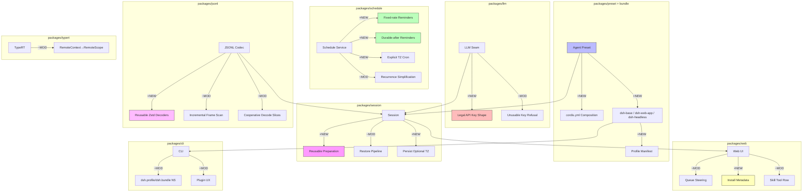

# Architecture Evolution & Design Log · 2026-08-06

> **Commit 数量**: 301 (含 merge) / ~180 (非 merge)
> **核心主题**: Profile/Preset 系统奠基 + Schedule 多模式提醒 + API Key 验证链路 + Session 持久化恢复管线 + TypeRT Remote Gateway 基础设施 + JSONL 性能优化

---

## 1. 每日架构演进图

> 本图反映当日最重要的架构演进路径和设计拓扑。



**图例**: `+NEW` 新增模块 | `~MOD` 修改模块 | 连线表示依赖/调用关系

---

## 2. 设计模式与重构

### 应用的设计模式
- **Composition Root Pattern**: `18fe174897` (feat(agent-presets)) 引入了基于 `cordis.yml` 的 session agent 组合模式——每个 session 从 preset cordis.yml 组合其 agent，这是 Composition Root 的变体，将依赖注入的决策从代码中心移到了声明式配置
- **Strategy Pattern**: Schedule 系统新增三种提醒模式（`ceb0bbd66d` fixed-rate, `8b69252664` durable-after, `31c0c6a9f6` explicit-TZ cron），每种模式作为独立的调度策略实现
- **Decorator Pattern**: LLM API Key 验证链路（`5b842895a8` → `45d78c9272` → `5514dd2bd6` → `cf9eade39d`）在 header 构建前、字段层、UI 层形成多层装饰器验证
- **Adapter Pattern**: TypeRT RemoteContext 重命名为 RemoteScope（`d362cdb54f`），标志着从具体上下文到抽象作用域的适配层调整

### 模块解耦与接口定义
- **Profile/Bundle 命名空间分离** (`62d0f26fd6`): CLI 将 profile 和 bundle manifest 命名空间化到 `dsh.profile` 和 `dsh.bundle`，这是对配置 schema 的结构性重构，为后续的 bundle 治理奠定基础
- **Schedule recurrence evidence 简化** (`93d239b5d7`, `cd59acd6f6`): 将 recurrence 证据和 request zone authority 从复杂实现简化为更清晰的领域模型
- **Produced-files row 独立为插件** (`f00a44fd44`): 将 Web UI 的 produced-files 行拆分为独立的插件包，遵循了单一职责原则

### 基础设施与性能
- **JSONL 可复用 Zstd 帧解码器** (`353226246e`): 引入可复用的 zstd frame decoders，避免每次 decode 重新初始化解压上下文
- **JSONL 增量帧扫描** (`03983ff986`): 将 decode 后的帧扫描改为增量式，减少大 session 恢复时的内存压力
- **Cooperative decode slices** (`2551b757fb`): 将长 decode 操作切分为协作式 slice，允许事件循环介入
- **Session preparation 恢复管线** (`0afc42309d` → `e089ef92d8` → `aacac1fec8`): 从零构建了可复用的 session preparation 架构，解决了 session 恢复的 race condition 问题

---

## 3. 特性交付与系统影响

### 核心特性
1. **Agent Preset 组合系统** (`18fe174897`): 这是当日最重要的架构变更。每个 session 从预定义的 cordis.yml preset 组合其 agent，将 agent 的能力定义从硬编码配置提升为可组合的声明式模型。这为多 agent 场景（minimal、code、custom）奠定了基础
2. **Schedule 多模式提醒**: 三种提醒模式覆盖了不同时间语义——fixed-rate（固定间隔）、durable-after（持久化延迟）、explicit-TZ（显式时区 cron），形成了完整的调度能力矩阵
3. **Session Preparation 架构**: 引入了可复用的 session preparation 机制，解决了 session 恢复过程中的 race condition 和 stale preparation 问题，这是 session 持久化可靠性的关键里程碑
4. **Profile/Bundle 发布体系**: `2365b2c54f` 发布了 dsh-base、dsh-web-app、dsh-headless 三个 profile bundle，`cd6b4ee3c9` 让 `dsh` CLI 从 profile 启动，形成了完整的插件分发链路

### 系统拓扑影响
- **Profile 层级**: 新增了 `cordis.patch.yml` 作为 home-level user patch layer（`65770325e7`），形成了 bundle → profile → home → patch 的四层组合拓扑
- **Session 恢复管线**: preparation → persist → restore 的三阶段管线为大型 session 的可靠恢复提供了保障
- **LLM Key 验证**: 从 provider-level 到 field-level 到 UI-level 的三层验证形成了纵深防御

---

## 4. 架构决策与 Roadmap 对齐

### 关键技术决策（ADR 推断）
- **决策 1: Preset 以 cordis.yml 为载体**
  - **背景与痛点**: 之前 agent 的能力组合在代码中硬编码，无法在运行时或配置时灵活调整
  - **选择的方案**: 使用 Cordis 原生的 `cordis.yml` 格式作为 preset 的载体，让每个 preset 本质上是一个 Cordis 配置片段
  - **Trade-offs**: 牺牲了 preset 的类型安全（cordis.yml 是运行时解释的），换取了与 Cordis 生态的无缝集成和配置的可组合性

- **决策 2: Schedule 提醒不依赖外部调度器**
  - **背景与痛点**: 提醒功能需要在 session 存活期间可靠触发，但不想引入 Redis/Scheduler 等外部依赖
  - **选择的方案**: 在 session 内部实现调度逻辑，利用 JSONL 持久化保障 durability
  - **Trade-offs**: 牺牲了跨 session 的全局调度能力（提醒绑定在 session 生命周期内），换取了零外部依赖和与 session 上下文的紧密集成

- **决策 3: JSONL 增量解码**
  - **背景与痛点**: 大型 session 恢复时全量解码导致延迟和内存峰值
  - **选择的方案**: 引入可复用 zstd 解码器和增量帧扫描，将 decode 操作分解为协作式 slice
  - **Trade-offs**: 增加了实现复杂度（需要管理解码器状态和协作边界），换取了更好的大型 session 恢复性能

### 产品 Roadmap 支撑
- Agent Preset 系统直接支撑了"多 agent 工作流"的 roadmap 目标，让用户可以在 minimal/code/custom 等预设之间切换
- Profile/Bundle 发布体系支撑了"插件生态"的 roadmap，让第三方可以发布自己的 bundle
- Schedule 多模式提醒支撑了"自动化工作流"的 roadmap，覆盖了定时、延迟、周期等调度场景

---

## 5. 开发者/架构师决策推断

### 开发者意图重建
- **思维模型**: 开发者当时在构建一个"可组合的 agent 运行时"——从 preset 的声明式定义，到 bundle 的分发机制，到 session 的 preparation/restore，形成了一条完整的 agent 生命周期管理链路
- **优先级排序**: 先解决"agent 如何组合"（preset），再解决"组合结果如何分发"（bundle），最后解决"组合结果如何恢复"（session preparation）
- **有意取舍**: Schedule 的三种提醒模式是"先做三种典型场景"而非"设计一个通用调度框架"；JSONL 优化是"增量改进"而非"重写编解码器"

### 架构师决策推断
- **模块拆分粒度**: Preset 系统被拆分为 `preset/`（核心逻辑）、`bundle/`（分发格式）、`boot/`（启动逻辑）三个包，粒度适中——每个包都有明确的职责边界和对外契约
- **抽象层引入时机**: Session Preparation 在经历了多轮 fix/test 后才引入（`0afc42309d`），说明开发者在确定需求稳定后才引入抽象，避免了过早抽象的风险
- **对后续可扩展性的影响**: cordis.yml 作为 preset 载体的选择意味着后续新增 preset 只需创建新的 cordis.yml 文件，无需修改代码，扩展性良好

### Code Review 视角
- **首先关注**: `18fe174897` (feat(agent-presets))——这是架构变更最大的 commit，需要重点关注 cordis.yml 组合的安全性和隔离性
- **会提出的问题**:
  - Preset 之间的隔离边界在哪里？一个 preset 能否访问另一个 preset 的服务？
  - `cordis.patch.yml` 的组合顺序是否确定？bundle → profile → home → patch 的覆盖语义是否有测试覆盖？
  - JSONL 协作式 decode 的边界条件——如果 session 在 decode slice 之间被中断，恢复是否安全？
- **做得好**: Schedule 的三种提醒模式各有清晰的语义边界，没有试图抽象为一个"万能调度器"
- **可以改进**: API Key 验证链路跨越了 LLM、Web、CLI 三个包，可以考虑抽取一个 `credential-validation` 共享模块

---

## 6. 技术债务与风险评估

### 已知风险 / 变通方案
- **Session Preparation race condition**: 虽然引入了 preparation 架构，但仍有多个 fix（`e37aa41f87`, `ede74b1926`, `2b9428f35d`）在修复 race condition，说明该机制的并发安全性仍需加固
- **Schedule recurrence 边缘案例**: `b96a9f2268` 和 `49a6e4ddb9` 连续修复 recurring gate 的边缘案例，说明调度逻辑的时间语义比预期复杂
- **JSONL 可复用解码器的状态管理**: 增量解码引入了有状态的解码器，需要确保解码器在 session 中断后能正确清理

### 建议的下一步
- 为 Agent Preset 系统添加隔离性测试——验证不同 preset 的服务不互相泄漏
- 为 Session Preparation 架构编写正式的状态机文档，明确各状态的转换条件
- 考虑将 API Key 验证逻辑从 LLM 包抽取到 `credentials/` 包，统一验证入口
- 为 Schedule 的三种提醒模式编写对比文档，帮助用户选择合适的模式

---

## 阶段性深度分析

### 阶段 1: Agent Preset 组合系统

**涉及的 Commits**: `18fe174897`, `9235d0f90f`, `2365b2c54f`, `65770325e7`, `cd6b4ee3c9`, `62d0f26fd6`, `2ee2ee2f96`

**阶段意图**: 建立声明式的 agent 组合系统，让每个 session 从预定义的 cordis.yml preset 组合其 agent，并通过 bundle/profile 机制实现分发和覆盖。

**开发者视角推断**:
- **思维模型**: 开发者脑中是一个"配置即代码"的画面——agent 的能力不是写死的，而是从 cordis.yml 声明式地组合出来的。bundle 是可分发的配置包，profile 是用户的个性化覆盖
- **优先级选择**: 先实现组合机制（preset），再实现分发机制（bundle），最后实现用户覆盖机制（patch），因为组合是分发和覆盖的前提
- **有意取舍**: 选择了 `cordis.patch.yml` 作为覆盖格式而非引入新的配置语言，牺牲了表达力换取了与 Cordis 生态的兼容性

**架构师视角推断**:
- **粒度考量**: Profile/Bundle 被拆分为独立的包而非放在 boot 中，因为它们的变更频率和发布节奏与 boot 不同
- **时机判断**: 在 cordis.yml loader 已经成熟后才引入 preset 系统，确保了底层机制的稳定性
- **后续影响**: 这个决策让后续新增 agent preset 只需创建 cordis.yml 文件，极大地降低了扩展成本

**重点关注的文档/代码**:

| 文件/模块 | 路径 | 阅读要点 |
|-----------|------|----------|
| Agent Preset | `packages/preset/src/` | preset 的组合逻辑、cordis.yml 加载机制 |
| Bundle 基础 | `packages/bundle/base/` | dsh-base bundle 的声明和 patch 文件 |
| Profile 启动 | `packages/boot/app-boot/` | profile 的两锚点解析和组合逻辑 |
| CLI Profile | `packages/cli/src/` | `dsh.profile` / `dsh.bundle` 命名空间 |

**关键代码模式**:
```typescript
// feat(agent-presets): compose each session's agent from a preset cordis.yml
// 18fe174897 — 声明式 agent 组合的核心模式
// 通过 cordis.yml 加载 preset，将 agent 能力定义为配置
```

**领域建模洞察**:
- **聚合根**: `Preset` 成为新的聚合根，包含 name、description、cordis.yml 内容
- **值对象**: `Bundle` 作为分发单元，是不可变的值对象
- **领域事件**: Profile 组合完成后触发 composition 事件，下游消费者据此初始化 session

**AI Agent 能力演进**:
- Agent 的能力边界从硬编码变为声明式配置，支持运行时组合
- Preset 系统为多 agent 场景（minimal、code、custom）提供了基础

---

### 阶段 2: Schedule 多模式提醒

**涉及的 Commits**: `ceb0bbd66d`, `8b69252664`, `31c0c6a9f6`, `b96a9f2268`, `49a6e4ddb9`, `93d239b5d7`, `cd59acd6f6`, `6f2317e578`, `d61059364e`, `a667ec55d6`, `b669ae46bc`

**阶段意图**: 为 Schedule 系统构建完整的提醒能力矩阵，覆盖固定间隔、持久化延迟、显式时区三种时间语义。

**开发者视角推断**:
- **思维模型**: 开发者在设计一个"时间感知的提醒系统"——不同的提醒场景需要不同的时间语义，固定间隔适合轮询，持久化延迟适合异步任务，显式时区适合跨时区协作
- **优先级选择**: 先实现 fixed-rate（最常见的轮询场景），再实现 durable-after（需要持久化保障），最后实现 explicit-TZ（需要时区处理）
- **有意取舍**: 三种模式是独立实现而非一个通用调度框架，因为每种模式的边缘案例差异很大，过早抽象会导致大量条件分支

**架构师视角推断**:
- **粒度考量**: 每种提醒模式作为独立的实现路径，而非在单一调度器中分支，因为它们的持久化语义、时间计算、边缘案例都不同
- **时机判断**: 在 schedule 核心稳定后才引入新模式，确保了基础机制的可靠性
- **后续影响**: 三种模式的独立实现意味着后续新增模式只需添加新路径，不影响现有模式

**重点关注的文档/代码**:

| 文件/模块 | 路径 | 阅读要点 |
|-----------|------|----------|
| Schedule Fixed-rate | `packages/schedule/src/` | fixed-rate 的实现逻辑和边界条件 |
| Schedule Durable-after | `packages/schedule/src/` | durable-after 的持久化和恢复逻辑 |
| Schedule Cron TZ | `packages/schedule/src/` | explicit-TZ cron 的时区处理 |
| Time Context | `packages/context/src/` | time-context 的时区权威和验证 |

**关键代码模式**:
```typescript
// feat(schedule): add fixed-rate reminders
// ceb0bbd66d — 固定间隔提醒的核心调度逻辑
// 基于 session 内部时间推进，不依赖外部调度器
```

**领域建模洞察**:
- **值对象**: `TimeContext` 作为时区权威，是调度系统的核心值对象
- **领域事件**: Reminder 事件携带时间戳和模式标识，消费者据此判断是否触发
- **聚合根**: Schedule 作为聚合根，管理所有 reminder 的生命周期

---

### 阶段 3: API Key 验证链路

**涉及的 Commits**: `5b842895a8`, `45d78c9272`, `5514dd2bd6`, `cf9eade39d`, `6b75bb0425`, `a89c26b611`, `266629f1c3`, `b6b57ceda3`, `665b5697bb`, `b1660ab8a4`, `9ff7eb84f0`

**阶段意图**: 在 LLM、Web、CLI 三个层面建立 API Key 的纵深验证链路，确保不可用的 key 在最早时机被拒绝。

**开发者视角推断**:
- **思维模型**: 开发者在构建"防御纵深"——API Key 验证不是在单一入口完成的，而是在 header 构建前（LLM 层）、字段层（Web 层）、用户提示层（CLI 层）分别拦截
- **优先级选择**: 先在 LLM 层定义 legal key shape（`5b842895a8`），再在各 consumer 层实现拒绝逻辑，确保验证标准的统一
- **有意取舍**: 选择在每个 consumer 层独立实现拒绝而非抽取公共验证模块，因为各层的错误提示和 UI 行为不同

**架构师视角推断**:
- **粒度考量**: API Key shape 定义在 LLM seam 层（`5b842895a8`），而非在各 provider 中，确保了验证标准的统一性
- **时机判断**: 在 provider 实现稳定后才引入验证，避免了验证逻辑与 provider 实现的耦合
- **后续影响**: 这个决策意味着后续新增 provider 只需实现 key 的合法性判断，验证框架已经就位

**重点关注的文档/代码**:

| 文件/模块 | 路径 | 阅读要点 |
|-----------|------|----------|
| LLM Key Shape | `packages/llm/src/` | legal API key shape 的定义 |
| LLM DeepSeek | `packages/llm/src/` | DeepSeek provider 的 key 拒绝逻辑 |
| LLM Pi-AI | `packages/llm/src/` | Pi-AI provider 的 key 拒绝逻辑 |
| Web API Key | `packages/web/src/` | Web UI 的 key 字段拒绝逻辑 |

**关键代码模式**:
```typescript
// feat(llm): define the legal API key shape in the seam
// 5b842895a8 — 在 LLM seam 层定义合法 key 形状
// 为所有 provider 提供统一的验证标准
```

---

### 阶段 4: Session 持久化恢复管线

**涉及的 Commits**: `0afc42309d`, `aacac1fec8`, `e089ef92d8`, `e37aa41f87`, `ede74b1926`, `2b9428f35d`, `c026ad61a9`, `feb2c35cef`, `466390c1af`, `beb9b2a7fa`, `bb5e9ea1c7`, `f0868d6a70`, `a667ec55d6`

**阶段意图**: 构建可复用的 session preparation 机制，解决 session 恢复过程中的 race condition 和 stale preparation 问题。

**开发者视角推断**:
- **思维模型**: 开发者在设计一个"三阶段恢复管线"——prepare（准备恢复数据）、persist（持久化恢复状态）、restore（应用恢复数据），每个阶段都有明确的输入输出和错误处理
- **优先级选择**: 先构建 preparation 的核心机制，再逐步修复 race condition 和边缘案例，因为 race condition 只有在核心机制就位后才能复现
- **有意取舍**: 选择了"先实现后加固"的策略——先快速实现 preparation 机制，再通过多个 fix commit 修复发现的 race condition，而非一开始就设计完美的并发控制

**架构师视角推断**:
- **粒度考量**: Preparation 被设计为独立于 session 核心的机制，因为它只在恢复路径上需要，不影响正常的 session 操作
- **时机判断**: 在 session 恢复的性能瓶颈暴露后才引入 preparation，确保了需求的真实性
- **后续影响**: Preparation 机制为后续的大型 session 恢复和跨设备同步奠定了基础

**重点关注的文档/代码**:

| 文件/模块 | 路径 | 阅读要点 |
|-----------|------|----------|
| Session Preparation | `packages/session/src/` | preparation 的核心状态机 |
| Session Restore | `packages/session/src/` | restore 管线的三阶段逻辑 |
| JSONL Codec | `packages/jsonl/src/` | 可复用 zstd 解码器和增量扫描 |
| Session Persistence | `packages/session/src/` | preparation 的持久化和恢复 |

**关键代码模式**:
```typescript
// feat: add reusable session preparation
// 0afc42309d — 可复用 session preparation 的核心实现
// preparation 是 session 恢复的第一阶段，负责准备恢复数据
```

**领域建模洞察**:
- **聚合根**: `Session` 作为聚合根，包含 preparation 状态
- **值对象**: `PreparedRestore` 作为恢复数据的不可变快照
- **领域事件**: Preparation 事件标记恢复管线的阶段转换

---

### 阶段 5: Web UI 交互增强

**涉及的 Commits**: `e4256a1684`, `f00a44fd44`, `dd473870dd`, `f9f72e2f09`, `84a6bae1c7`, `e43e4f187e`, `a667d2cd64`, `8f2168303b`, `cf9eade39d`, `bb920b32e0`

**阶段意图**: 增强 Web UI 的交互能力，包括队列操控、produced-files 独立、主题持久化、skill tool row 等。

**开发者视角推断**:
- **思维模型**: 开发者在"打磨产品体验"——队列操控（Cmd/Ctrl+Enter）提升了高级用户的效率，produced-files 独立提升了代码组织，主题持久化提升了用户体验
- **优先级选择**: 先实现交互增强（queue steering），再实现代码组织（produced-files 独立），最后实现体验优化（theme persistence）
- **有意取舍**: 选择了"渐进式增强"而非"一次性重构"——每个 commit 只解决一个具体问题，保持了变更的可回滚性

**架构师视角推断**:
- **粒度考量**: produced-files 被拆分为独立插件包而非留在 web 包中，因为它的变更频率和职责与 web 包不同
- **时机判断**: 在 Web UI 核心功能稳定后才引入交互增强，确保了基础体验的可靠性
- **后续影响**: 这个决策让后续新增 Web UI 功能可以作为独立插件包发布，而非修改 web 包核心

**重点关注的文档/代码**:

| 文件/模块 | 路径 | 阅读要点 |
|-----------|------|----------|
| Queue Steering | `packages/web/src/` | Cmd/Ctrl+Enter 队列操控逻辑 |
| Produced Files | `packages/web/src/` | produced-files 独立插件包 |
| Theme Persistence | `packages/web/src/` | 主题偏好的 settings 持久化 |
| Skill Tool Row | `packages/web/src/` | skill tool row 的渲染逻辑 |

**关键代码模式**:
```typescript
// feat(web): steer the whole queue with an empty-draft Cmd/Ctrl+Enter
// e4256a1684 — 队列操控的核心交互逻辑
// 通过键盘快捷键批量操控消息队列
```
