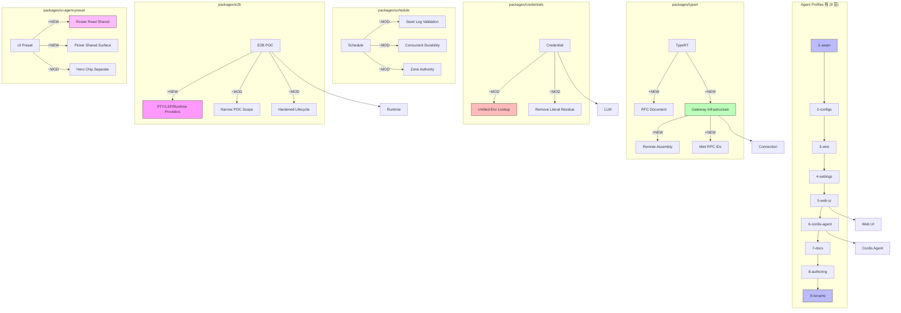

# Architecture Evolution & Design Log · 2026-08-07

> **Commit 数量**: 375 (含 merge) / ~220 (非 merge)
> **核心主题**: Agent Profiles 栈式推进（9 层）+ TypeRT Remote Gateway 基础设施 + Credential 统一 + Schedule 持久化加固 + E2B 运行时 POC

---

## 1. 每日架构演进图

> 本图反映当日最重要的架构演进路径和设计拓扑。



**图例**: `+NEW` 新增模块 | `~MOD` 修改模块 | 连线表示依赖/调用关系

---

## 2. 设计模式与重构

### 应用的设计模式
- **Layered Architecture**: Agent Profiles 栈（`1-seam` → `9-rename`）采用了经典的分层架构，每一层只依赖下一层，形成了清晰的依赖链
- **Facade Pattern**: TypeRT Remote Gateway（`64a963da0b`）为远程 RPC 调用提供了统一的网关入口，封装了连接建立、服务发现、错误处理的复杂性
- **Adapter Pattern**: Credential 统一环境查找（`d0e052dd83`, `2c532f3b2c`）将分散的环境变量查找逻辑适配为统一的 lookup order
- **Repository Pattern**: E2B POC（`e7b682f1f6`）将远程沙箱操作抽象为 Repository 风格的 CRUD 接口

### 模块解耦与接口定义
- **Agent Profiles 栈**: 9 层栈的每一层都有明确的接口契约——seam 定义接口，configs 定义配置，wire 定义通信，settings 定义用户设置，web-ui 定义渲染，cordis-agent 定义 agent 行为，docs 定义文档，authoring 定义编辑，rename 定义最终命名
- **UI Preset 表面共享** (`82ae1a8a37`, `0f27a505c4`, `e9648bdeee`): 将 roster read 和 picker 逻辑抽取为共享模块，多个 UI 表面（hero chip、settings page、session header）共用同一份实现
- **TypeRT Remote Scope** (`d362cdb54f`): 将 RemoteContext 重命名为 RemoteScope，标志着从具体上下文到抽象作用域的接口调整

### 基础设施与性能
- **Settings Namespace Scope** (`638c9e4bd7`): 将 per-field settings preference controller 替换为 namespace settings scope，减少了 controller 数量和状态同步复杂度
- **TypeRT SRC Endpoint Claims 缓存** (`e28ac506ed`): 缓存远程端点声明，减少重复的服务发现开销
- **Session Query SQLite Header Bind** (`5f57f51f34`): 将 header columns 的绑定从循环中提取为一次性绑定，减少了 SQLite 查询开销

---

## 3. 牸性交付与系统影响

### 核心特性
1. **Agent Profiles 栈**: 这是当日最重要的架构变更。9 层栈从 seam 到 rename，完整定义了 agent preset 的接口、配置、通信、设置、UI、agent 行为、文档、编辑和命名。这是一个"自底向上"的架构推进，每一层都为上一层提供基础
2. **TypeRT Remote Gateway 基础设施**: 从 RFC（`effd8e1ebd`）到实现（`64a963da0b`），建立了完整的远程 RPC 基础设施，包括 gateway、remote assembly、RPC ID mint、endpoint claims 缓存
3. **E2B 沙箱 POC**: 引入了 E2B 远程沙箱的 proof-of-concept，包括 PTY/LSP/Runtime providers，为后续的远程代码执行奠定了基础
4. **Credential 统一**: 将分散的环境变量查找逻辑统一为一致的 lookup order，减少了 credential 配置的混乱

### 系统拓扑影响
- **Agent Profiles**: 新增了 9 层依赖链，从 seam 到 rename，形成了 agent preset 的完整生命周期管理
- **TypeRT Gateway**: 新增了远程 RPC 通道，允许客户端通过 gateway 调用远程服务
- **E2B POC**: 新增了远程沙箱通道，允许 agent 在隔离环境中执行代码
- **Credential**: 统一了环境变量查找顺序，影响所有依赖 credential 的包

---

## 4. 架构决策与 Roadmap 对齐

### 关键技术决策（ADR 推断）
- **决策 1: Agent Profiles 采用栈式推进**
  - **背景与痛点**: Agent preset 涉及多个关注点（接口、配置、通信、设置、UI、agent 行为），需要一种方式组织这些关注点
  - **选择的方案**: 采用 9 层栈，每一层只关注一个方面，通过依赖链串联
  - **Trade-offs**: 牺牲了灵活性（每一层的职责固定），换取了清晰度和可维护性（每一层的变更范围明确）

- **决策 2: TypeRT Gateway 采用 RFC 先行**
  - **背景与痛点**: 远程 RPC 是一个复杂的基础设施变更，需要在实现前明确设计决策
  - **选择的方案**: 先编写 RFC（`effd8e1ebd`），再逐步实现，确保设计决策有据可查
  - **Trade-offs**: 牺牲了实现速度（RFC 编写和评审需要时间），换取了设计质量和团队共识

- **决策 3: E2B POC 采用窄化策略**
  - **背景与痛点**: E2B 沙箱的能力很广，但 initial POC 需要控制范围
  - **选择的方案**: 先实现核心的 PTY/LSP/Runtime providers，再逐步扩展（`de77310c6f` narrow the sandbox POC）
  - **Trade-offs**: 牺牲了功能完整性（POC 只覆盖核心场景），换取了交付速度和质量可控

### 产品 Roadmap 支撑
- Agent Profiles 栈直接支撑了"多 agent 工作流"的 roadmap，让用户可以在不同 agent preset 之间切换
- TypeRT Gateway 支撑了"远程服务调用"的 roadmap，允许 agent 调用远程 API
- E2B POC 支撑了"安全代码执行"的 roadmap，为后续的沙箱化代码执行奠定了基础

---

## 5. 开发者/架构师决策推断

### 开发者意图重建
- **思维模型**: 开发者当时在构建"agent 的可组合性"——agent 的能力不是固定的，而是从 preset 声明式地组合出来的。preset 涉及多个关注点，需要分层组织
- **优先级排序**: 先建立接口（seam），再建立配置（configs），再建立通信（wire），再建立设置（settings），再建立 UI（web-ui），再建立 agent 行为（cordis-agent），再建立文档（docs），再建立编辑（authoring），最后建立命名（rename）
- **有意取舍**: 选择了"栈式推进"而非"并行推进"，因为栈式推进可以确保每一层的接口在上一层实现前就已经确定，减少了返工风险

### 架构师决策推断
- **模块拆分粒度**: 9 层栈的每一层都对应一个独立的 PR/分支，粒度适中——每一层都有明确的变更范围和验证标准
- **时机判断**: 在 agent preset 的需求明确后才开始栈式推进，确保了每一层的设计决策都有真实需求支撑
- **后续影响**: 9 层栈的结构意味着后续新增 agent preset 功能只需要在对应的层添加代码，不影响其他层

### Code Review 视角
- **首先关注**: Agent Profiles 栈的 9 层合并顺序——确保每一层都基于正确的父层
- **会提出的问题**:
  - 9 层栈的每一层是否有独立的测试覆盖？
  - 如果某一层的接口需要变更，影响范围如何控制？
  - TypeRT Gateway 的 RFC 是否考虑了安全性（认证、授权、加密）？
  - E2B POC 的 scope 窄化是否影响了后续扩展的可行性？
- **做得好**: Agent Profiles 栈的分层清晰，每一层的职责边界明确
- **可以改进**: UI Preset 的多个共享模块（roster read、picker、hero chip）可以进一步抽取为独立的 UI 组件库

---

## 6. 技术债务与风险评估

### 已知风险 / 变通方案
- **Agent Profiles 栈的合并复杂度**: 9 层栈的合并顺序需要严格控制，任何一层的合并失败都会阻塞后续层
- **TypeRT Gateway 的安全性**: RFC 中可能未充分考虑认证和授权机制，需要在实现中补充
- **E2B POC 的生命周期管理**: 多个 fix（`091af03a81`, `c122d984c4`, `ec0310ca1b`）在修复生命周期问题，说明远程沙箱的资源管理比预期复杂
- **Credential 统一的兼容性**: 统一 lookup order 可能影响现有的 credential 配置方式

### 建议的下一步
- 为 Agent Profiles 栈编写集成测试，验证 9 层的端到端组合
- 为 TypeRT Gateway 补充安全认证机制的实现
- 为 E2B POC 编写资源管理的状态机文档
- 为 Credential 统一编写迁移指南，帮助现有用户适配新的 lookup order

---

## 阶段性深度分析

### 阶段 1: Agent Profiles 栈式推进

**涉及的 Commits**: `380eaec39b` (1-seam), `b77fb9036c` (2-configs), `6093c266c6` (3-wire), `61895808a6` (4-settings), `d3ebc32ac5c` (5-web-ui), `4c70e2e17c` (6-cordis-agent), `d6f540134a` (7-docs), `b4213fac6f` (8-authoring), `4f1c419fdc` (9-rename), 以及大量的 merge commit

**阶段意图**: 建立 agent preset 的完整生命周期管理——从接口定义到配置到通信到设置到 UI 到 agent 行为到文档到编辑到命名。

**开发者视角推断**:
- **思维模型**: 开发者在构建一个"分层的 agent 组合系统"——每一层只关注一个方面，通过依赖链串联，形成清晰的职责边界
- **优先级选择**: 先建立底层接口（seam），再建立上层应用（web-ui），因为底层接口是上层应用的基础
- **有意取舍**: 选择了"栈式推进"而非"并行推进"，因为栈式推进可以确保每一层的接口在上一层实现前就已经确定

**架构师视角推断**:
- **粒度考量**: 9 层栈的每一层都对应一个独立的 PR/分支，粒度适中——每一层都有明确的变更范围和验证标准
- **时机判断**: 在 agent preset 的需求明确后才开始栈式推进，确保了每一层的设计决策都有真实需求支撑
- **后续影响**: 9 层栈的结构意味着后续新增 agent preset 功能只需要在对应的层添加代码，不影响其他层

**重点关注的文档/代码**:

| 文件/模块 | 路径 | 阅读要点 |
|-----------|------|----------|
| Agent Preset Seam | `packages/preset/src/` | preset 的接口定义和契约 |
| Agent Preset Configs | `packages/preset/src/` | preset 的配置 schema |
| Agent Preset Wire | `packages/preset/src/` | preset 的通信协议 |
| Agent Preset Settings | `packages/preset/src/` | preset 的用户设置 |
| Agent Preset Web UI | `packages/web/src/` | preset 的 UI 渲染 |
| Agent Preset Cordis Agent | `packages/preset/src/` | preset 的 agent 行为 |

**关键代码模式**:
```typescript
// stack/agent-profiles-1-seam → stack/agent-profiles-9-rename
// 9 层栈的每一层都有明确的接口契约和验证标准
// 通过依赖链串联，形成清晰的职责边界
```

**领域建模洞察**:
- **聚合根**: `Preset` 作为聚合根，包含 name、description、cordis.yml 内容
- **值对象**: `Bundle` 作为分发单元，是不可变的值对象
- **领域事件**: Preset 选择事件触发 session 的 agent 组合

---

### 阶段 2: TypeRT Remote Gateway 基础设施

**涉及的 Commits**: `effd8e1ebd` (RFC), `64a963da0b` (Infrastructure), `9400926bdf` (Goal Example), `36516e97b9` (Shared API Dispatch), `cd566f26f5` (Client Remotes), `e8f2ab89bb` (Remote Services), `ea3090dfa` (SRC Claims Cache), `d362cdb54f` (RemoteScope Rename)

**阶段意图**: 建立完整的远程 RPC 基础设施，包括 gateway、remote assembly、RPC ID mint、endpoint claims 缓存。

**开发者视角推断**:
- **思维模型**: 开发者在构建一个"远程服务调用通道"——gateway 负责路由，remote assembly 负责服务发现，RPC ID mint 负责请求标识，SRC claims cache 负责性能优化
- **优先级选择**: 先编写 RFC 明确设计决策，再逐步实现，因为远程 RPC 是一个复杂的基础设施变更
- **有意取舍**: 选择了"RFC 先行"而非"直接实现"，因为 RFC 可以确保设计决策有据可查，减少实现过程中的返工

**架构师视角推断**:
- **粒度考量**: Gateway、remote assembly、RPC ID mint 被拆分为独立的模块，因为它们的变更频率和职责不同
- **时机判断**: 在 Connection 包稳定后才引入 gateway，确保了底层通信机制的可靠性
- **后续影响**: 这个决策让后续新增远程服务只需要注册到 gateway，无需修改 gateway 本身

**重点关注的文档/代码**:

| 文件/模块 | 路径 | 阅读要点 |
|-----------|------|----------|
| TypeRT RFC | `docs/` | 远程 gateway 的设计决策 |
| Gateway Infrastructure | `packages/typert/src/` | gateway 的核心实现 |
| Remote Assembly | `packages/api/src/` | 远程服务的发现和组装 |
| Shared API | `packages/connection/src/` | 客户端和网关的共享 API |

**关键代码模式**:
```typescript
// feat: add TypeRT remote gateway infrastructure
// 64a963da0b — 远程 gateway 的核心实现
// 为远程服务调用提供统一的路由和错误处理
```

**领域建模洞察**:
- **聚合根**: `Gateway` 作为聚合根，管理所有远程服务的注册和路由
- **值对象**: `RemoteScope` 作为远程服务的作用域，是不可变的值对象
- **领域事件**: Remote registration 事件触发 gateway 的路由表更新

---

### 阶段 3: E2B 沙箱 POC

**涉及的 Commits**: `e7b682f1f6` (Runtime Providers), `6667102890` (PTY/LSP/Runtime), `de77310c6f` (Narrow POC), `951a56208d` (Lifecycle Fixes), `091af03a81` (Remote Startup/Teardown), `c122d984c4` (Cancellation/Teardown), `ec0310ca1b` (Remote Teardown), `917a7493f7` (Provider Layer)

**阶段意图**: 引入 E2B 远程沙箱的 proof-of-concept，包括 PTY/LSP/Runtime providers，为后续的远程代码执行奠定基础。

**开发者视角推断**:
- **思维模型**: 开发者在构建"远程代码执行通道"——PTY 提供终端交互，LSP 提供语言服务，Runtime 提供代码执行，三者共同构成完整的远程开发环境
- **优先级选择**: 先实现核心的 PTY/LSP/Runtime providers，再逐步扩展，因为 POC 需要控制范围
- **有意取舍**: 选择了"窄化策略"而非"完整实现"，因为 E2B 的能力很广，POC 需要聚焦核心场景

**架构师视角推断**:
- **粒度考量**: PTY、LSP、Runtime 被拆分为独立的 provider，因为它们的生命周期和资源管理需求不同
- **时机判断**: 在本地 subprocess 包稳定后才引入远程 provider，确保了本地执行路径的可靠性
- **后续影响**: 这个决策让后续扩展 E2B 能力只需要添加新的 provider，不影响现有的本地 provider

**重点关注的文档/代码**:

| 文件/模块 | 路径 | 阅读要点 |
|-----------|------|----------|
| E2B Runtime Providers | `packages/e2b/src/` | 远程运行时的核心实现 |
| E2B PTY Provider | `packages/e2b/src/` | 远程终端的生命周期管理 |
| E2B LSP Provider | `packages/e2b/src/` | 远程语言服务的适配 |
| E2B Lifecycle | `packages/e2b/src/` | 远程沙箱的资源管理 |

**关键代码模式**:
```typescript
// feat(e2b): add remote runtime providers
// e7b682f1f6 — 远程运行时的核心实现
// 为远程代码执行提供 PTY/LSP/Runtime providers
```

**领域建模洞察**:
- **聚合根**: `Sandbox` 作为聚合根，管理远程沙箱的生命周期
- **值对象**: `SandboxPolicy` 作为沙箱策略，是不可变的值对象
- **领域事件**: Sandbox lifecycle 事件标记远程沙箱的状态转换
