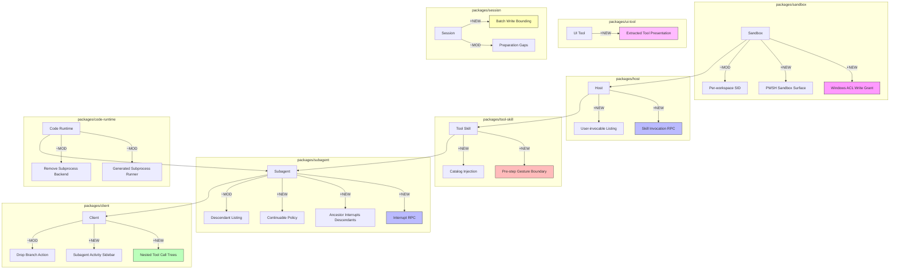

# Architecture Evolution & Design Log · 2026-08-08

> **Commit 数量**: 397 (含 merge) / ~240 (非 merge)
> **核心主题**: Subagent Interrupt/Continuable + Sandbox ACL 硬化 + Tool Presentation 拆分 + Session Batch Persistence + Conversation Node Engine + Skill Invocation 重构 + Code Runtime Subprocess Refactor

---

## 1. 每日架构演进图

> 本图反映当日最重要的架构演进路径和设计拓扑。



**图例**: `+NEW` 新增模块 | `~MOD` 修改模块 | 连线表示依赖/调用关系

---

## 2. 设计模式与重构

### 应用的设计模式
- **Observer Pattern**: Subagent interrupt RPC（`66a21a38b1`）和 ancestor interrupt（`d769d3cbb7`）建立了 agent 间的中断观察机制，父 agent 可以中断子 agent 的执行
- **Chain of Responsibility**: Skill invocation 重构（`0d53752c49`, `c08fa27e5c`）将 skill 调用从 RPC 边界移到 pre-step gesture boundary，形成了从 catalog 到 pre-step 到 injection 的责任链
- **State Machine**: Session batch persistence（`924c954469`）引入了写入批处理的状态机，管理 batching 的生命周期和错误恢复
- **Composite Pattern**: Conversation node engine（`81d6886006`）将对话节点组合为树状结构，每个节点有独立的上下文和渲染逻辑

### 模块解耦与接口定义
- **Tool Presentation 独立** (`7cc554ef16`, `1674af147e`): 将 Tool presentation 从 conversation 包抽取到 `ui-tool` 包，实现了 tool 渲染逻辑与对话逻辑的解耦
- **Subagent Activity Sidebar** (`04e9a2453e`): 将子 agent 活动信息从主对话区域分离到侧边栏，提升了信息密度和可读性
- **Skill Invocation 边界** (`0d53752c49`): 将 skill invoke RPC 从 host 边界移到 gesture boundary，确保 skill 调用在正确的执行上下文中

### 基础设施与性能
- **Session Batch Write** (`924c954469`): 引入了 session 写入批处理，将多个小写入合并为批量写入，减少了 I/O 开销
- **Subagent Projection Cache** (`a25d4331d7`): 为子 agent listing 引入了投影缓存，减少了重复查询的开销
- **Tool Call Depth Bound** (`de2de298e4`): 为嵌套 tool call 引入了深度限制，防止无限递归

---

## 3. 特性交付与系统影响

### 核心特性
1. **Subagent Interrupt/Continuable**: 这是当日最重要的架构变更。子 agent 现在可以被父 agent 中断（`66a21a38b1`），并且支持 continuable 模式（`dc64c5f1c2`），中断后可以从断点恢复。这为多 agent 协作提供了关键的控制能力
2. **Windows ACL Sandbox**: 引入了基于 Windows ACL 的写入沙箱（`abfb933620`），为 Windows 平台提供了细粒度的文件系统访问控制
3. **Tool Presentation 拆分**: 将 tool 渲染逻辑从 conversation 包独立到 `ui-tool` 包，提升了代码的可维护性和可复用性
4. **Skill Invocation 重构**: 将 skill 调用从 RPC 边界移到 pre-step gesture boundary，确保 skill 调用在正确的执行上下文中
5. **Code Runtime Subprocess 重构**: 移除了 subprocess backend，生成了共享的 subprocess runner，简化了代码运行时的架构

### 系统拓扑影响
- **Subagent**: 新增了 interrupt/continuable 能力，改变了 agent 间的控制拓扑
- **Sandbox**: 新增了 Windows ACL 通道，扩展了沙箱的平台覆盖
- **Client**: 新增了 sidebar 和 tool tree，改变了 UI 的信息展示拓扑
- **Host**: 新增了 skill invocation RPC，改变了 skill 的调用拓扑

---

## 4. 架构决策与 Roadmap 对齐

### 关键技术决策（ADR 推断）
- **决策 1: Subagent Interrupt 采用 RPC 模式**
  - **背景与痛点**: 父 agent 需要中断子 agent 的执行，但不想引入复杂的进程间通信
  - **选择的方案**: 通过 RPC 调用子 agent 的 interrupt 方法，利用已有的通信通道
  - **Trade-offs**: 牺牲了中断的即时性（RPC 有延迟），换取了实现的简单性和与现有通信机制的兼容性

- **决策 2: Sandbox ACL 采用 restricted-token runner**
  - **背景与痛点**: Windows 平台需要细粒度的文件系统访问控制，但 AppContainer 和 mxc 有兼容性问题
  - **选择的方案**: 使用 restricted-token runner 和 Windows ACL，为每个 session 创建独立的写入权限
  - **Trade-offs**: 牺牲了隔离强度（restricted-token 不如 AppContainer），换取了兼容性和实现简单性

- **决策 3: Skill Invocation 移到 gesture boundary**
  - **背景与痛点**: skill 调用在 RPC 边界执行，无法访问正确的执行上下文（如 agent 的 scope）
  - **选择的方案**: 将 skill 调用移到 pre-step gesture boundary，确保在正确的执行上下文中
  - **Trade-offs**: 特牲了调用的独立性（skill 调用现在依赖 pre-step 的执行上下文），换取了上下文的正确性

- **决策 4: Tool Presentation 独立为 ui-tool 包**
  - **背景与痛点**: tool 渲染逻辑与 conversation 逻辑耦合，难以独立修改和测试
  - **选择的方案**: 将 tool 渲染逻辑抽取到 `ui-tool` 包，实现解耦
  - **Trade-offs**: 特牲了包的数量（新增一个包），换取了代码的可维护性和可复用性

### 产品 Roadmap 支撑
- Subagent Interrupt/Continuable 支撑了"多 agent 协作"的 roadmap，让用户可以控制子 agent 的执行
- Windows ACL Sandbox 支撑了"跨平台安全"的 roadmap，为 Windows 平台提供了安全保障
- Tool Presentation 拆分支撑了"UI 可扩展性"的 roadmap，让 tool 渲染逻辑可以独立演进
- Skill Invocation 重构支撑了"skill 生态"的 roadmap，确保 skill 调用在正确的上下文中执行

---

## 5. 开发者/架构师决策推断

### 开发者意图重建
- **思维模型**: 开发者当时在构建"agent 的控制平面"——subagent interrupt 提供了中断能力，continuable 提供了恢复能力，skill invocation 提供了扩展能力，sandbox ACL 提供了安全能力
- **优先级排序**: 先实现中断能力（interrupt），再实现恢复能力（continuable），再实现扩展能力（skill invocation），再实现安全能力（sandbox ACL），因为中断和恢复是多 agent 协作的前提
- **有意取舍**: 选择了"RPC 模式"而非"共享内存模式"来实现 interrupt，因为 RPC 模式可以复用现有的通信通道，而共享内存模式需要引入新的通信机制

### 架构师决策推断
- **模块拆分粒度**: Tool Presentation 被独立为 `ui-tool` 包，而非留在 conversation 包中，因为它的变更频率和职责与 conversation 不同
- **时机判断**: 在 conversation 包稳定后才引入 tool presentation 拆分，确保了基础对话逻辑的可靠性
- **后续影响**: 这个决策让后续新增 tool 渲染逻辑可以作为独立包发布，而非修改 conversation 包核心

### Code Review 视角
- **首先关注**: Subagent Interrupt/Continuable——这是架构变更最大的特性，需要重点关注中断的安全性和恢复的正确性
- **会提出的问题**:
  - Interrupt RPC 的超时和错误处理机制是什么？如果子 agent 无法响应 interrupt 怎么办？
  - Continuable 的断点恢复是否保证了 session log 的一致性？
  - Windows ACL 的 restricted-token 是否有足够的隔离强度？
  - Skill invocation 移到 gesture boundary 后，是否影响了 skill 的独立测试？
- **做得好**: Tool Presentation 的独立抽取非常干净，conversation 包和 ui-tool 包的职责边界清晰
- **可以改进**: Subagent activity sidebar 和 tool tree 可以考虑共享一个通用的"活动信息"组件

---

## 6. 技术债务与风险评估

### 已知风险 / 变通方案
- **Subagent Interrupt 的安全性**: 如果子 agent 在执行敏感操作时被中断，可能导致资源泄漏或状态不一致
- **Continuable 的 session log 一致性**: 断点恢复需要确保 session log 的完整性，任何中断都可能导致 log 碎片
- **Windows ACL 的兼容性**: restricted-token 在某些 Windows 版本上可能有兼容性问题
- **Skill Invocation 的上下文依赖**: 移到 gesture boundary 后，skill 调用依赖 pre-step 的执行上下文，如果 pre-step 失败，skill 调用也会失败

### 建议的下一步
- 为 Subagent Interrupt 编写安全性测试，验证中断敏感操作时的资源清理
- 为 Continuable 编写 session log 一致性测试，验证断点恢复的正确性
- 为 Windows ACL 编写兼容性矩阵，覆盖不同 Windows 版本
- 为 Skill Invocation 编写故障注入测试，验证 pre-step 失败时的降级行为

---

## 阶段性深度分析

### 阶段 1: Subagent Interrupt/Continuable

**涉及的 Commits**: `66a21a38b1` (Interrupt RPC), `d769d3cbb7` (Ancestor Interrupt), `5793614b86` (Continuable Expose), `dc64c5f1c2` (Continuable Policy), `82019134b1` (Web Interrupt Verify), `336c84baf0` (Interrupt Edge Cases), `57e9e6977c` (Continuation Contract)

**阶段意图**: 建立子 agent 的中断和恢复机制，为多 agent 协作提供关键的控制能力。

**开发者视角推断**:
- **思维模型**: 开发者在设计一个"agent 间的控制通道"——interrupt 是控制信号，continuable 是恢复机制，两者共同构成了 agent 间的协作协议
- **优先级选择**: 先实现 interrupt（最基本的控制能力），再实现 continuable（中断后的恢复能力），因为 continuable 依赖 interrupt 的实现
- **有意取舍**: 选择了"RPC 模式"而非"共享内存模式"，因为 RPC 模式可以复用现有的通信通道

**架构师视角推断**:
- **粒度考量**: Interrupt 和 Continuable 被设计为独立的能力，而非合并为一个"控制"模块，因为它们的语义和使用场景不同
- **时机判断**: 在 subagent listing 稳定后才引入 interrupt，确保了子 agent 的发现机制可靠
- **后续影响**: 这个决策让后续新增 agent 间控制能力（如暂停、恢复、优先级调整）可以复用 interrupt 通道

**重点关注的文档/代码**:

| 文件/模块 | 路径 | 阅读要点 |
|-----------|------|----------|
| Subagent Interrupt | `packages/subagent/src/` | interrupt RPC 的核心实现 |
| Continuable Policy | `packages/subagent/src/` | continuable 的策略定义 |
| Web Interrupt | `packages/web/src/` | interrupt 的 UI 展示 |
| Continuation Contract | `packages/subagent/src/` | 中断和恢复的契约文档 |

**关键代码模式**:
```typescript
// feat(subagent): add current-turn interrupt RPC
// 66a21a38b1 — 子 agent 中断的核心 RPC 实现
// 允许父 agent 中断子 agent 的当前 turn 执行
```

**领域建模洞察**:
- **聚合根**: `Subagent` 作为聚合根，管理子 agent 的生命周期和控制状态
- **值对象**: `InterruptSignal` 作为中断信号，是不可变的值对象
- **领域事件**: Interrupt 事件触发子 agent 的状态转换（running → interrupting → interrupted）

---

### 阶段 2: Windows ACL Sandbox

**涉及的 Commits**: `abfb933620` (Write Grant), `83f835e4cb` (PWSH Surface), `07c7e2f0bd` (Revoke Failures), `91d3ed6c5a` (Review Findings), `fa591b5ebd` (DACL Limitation), `5fea4b7c4b` (Per-workspace SID), `0a17575040` (Review Address)

**阶段意图**: 为 Windows 平台引入基于 ACL 的写入沙箱，提供细粒度的文件系统访问控制。

**开发者视角推断**:
- **思维模型**: 开发者在构建"平台特定的安全边界"——Windows 的 ACL 机制提供了细粒度的访问控制，但需要处理 DACL 合并、SID 分配、权限撤销等复杂性
- **优先级选择**: 先实现核心的 write grant（`abfb933620`），再处理边缘案例（`07c7e2f0bd`, `91d3ed6c5a`），因为核心实现是边缘案例处理的前提
- **有意取舍**: 选择了"restricted-token runner"而非"AppContainer"，因为 restricted-token 在更多 Windows 版本上可用

**架构师视角推断**:
- **粒度考量**: Write grant、DACL merge、SID allocation 被设计为独立的子模块，因为它们的失败模式和恢复策略不同
- **时机判断**: 在 Landlock（Linux）sandbox 稳定后才引入 Windows ACL，确保了跨平台沙箱的一致性
- **后续影响**: 这个决策让 Windows 平台获得了与 Linux 平台相当的安全保障

**重点关注的文档/代码**:

| 文件/模块 | 路径 | 阅读要点 |
|-----------|------|----------|
| Windows ACL Write Grant | `packages/sandbox/src/` | write grant 的核心实现 |
| PWSH Sandbox Surface | `packages/sandbox/src/` | PowerShell 沙箱的渲染逻辑 |
| DACL Merge | `packages/sandbox/src/` | DACL 合并和锁机制 |
| Per-workspace SID | `packages/sandbox/src/` | 每个 workspace 的独立 SID |

**关键代码模式**:
```typescript
// feat(sandbox): per-session windows-acl write grant with dual-mode restricting lists
// abfb933620 — Windows ACL 写入沙箱的核心实现
// 为每个 session 创建独立的写入权限，使用 restricted-token runner
```

**领域建模洞察**:
- **聚合根**: `SandboxPolicy` 作为聚合根，管理沙箱的安全策略
- **值对象**: `WriteGrant` 作为写入权限，是不可变的值对象
- **领域事件**: Grant 事件触发文件系统权限的变更

---

### 阶段 3: Tool Presentation 拆分

**涉及的 Commits**: `7cc554ef16` (Extract to ui-tool), `1674af147e` (Detach from Conversation), `871c59c3bc` (Address Review), `67c753dcb7` (Restore Snapshots), `fafd54fc03` (Record Ownership), `cd64cc7ecd` (Update References)

**阶段意图**: 将 Tool presentation 逻辑从 conversation 包独立到 `ui-tool` 包，实现解耦。

**开发者视角推断**:
- **思维模型**: 开发者在"解耦关注点"——tool 渲染逻辑和 conversation 逻辑是两个独立的关注点，应该分离以便独立修改和测试
- **优先级选择**: 先提取核心逻辑（`7cc554ef16`），再修复依赖关系（`1674af147e`），最后验证快照（`67c753dcb7`），因为提取是修复和验证的前提
- **有意取舍**: 选择了"独立包"而非"conversation 内部模块"，因为独立包可以有自己的发布周期和依赖管理

**架构师视角推断**:
- **粒度考量**: Tool presentation 被独立为 `ui-tool` 包，而非拆分为多个更小的包，因为 tool 渲染逻辑是一个内聚的职责
- **时机判断**: 在 conversation 包的功能稳定后才引入拆分，确保了基础对话逻辑的可靠性
- **后续影响**: 这个决策让后续新增 tool 渲染逻辑可以作为独立包发布，而非修改 conversation 包核心

**重点关注的文档/代码**:

| 文件/模块 | 路径 | 阅读要点 |
|-----------|------|----------|
| UI Tool | `packages/ui-tool/src/` | tool presentation 的核心实现 |
| Conversation | `packages/client/src/` | conversation 包对 ui-tool 的引用 |
| Tool Snapshots | `packages/ui-tool/tests/` | tool 渲染的快照测试 |

**关键代码模式**:
```typescript
// cleanup(client): extract Tool presentation into ui-tool
// 7cc554ef16 — 将 tool presentation 从 conversation 包提取到 ui-tool 包
// 实现了 tool 渲染逻辑与对话逻辑的解耦
```

---

### 阶段 4: Skill Invocation 重构

**涉及的 Commits**: `0d53752c49` (Retire RPC), `c08fa27e5c` (Pre-step Gesture), `cc0f6e11b9` (Catalog Injection), `85422f44dc` (User-invocable Listing), `56e9e61749` (Slash Skill Claim), `3584d8e088` (Document Path), `db146f0eba` (Share Refusal)

**阶段意图**: 将 skill 调用从 RPC 边界移到 pre-step gesture boundary，确保 skill 调用在正确的执行上下文中。

**开发者视角推断**:
- **思维模型**: 开发者在"修正执行边界"——skill 调用需要访问 agent 的 scope 和 context，但 RPC 边界无法提供这些，因此需要移到 gesture boundary
- **优先级选择**: 先废弃旧的 RPC 调用（`0d53752c49`），再建立新的 gesture boundary（`c08fa27e5c`），最后更新 catalog 和 listing（`cc0f6e11b9`, `85422f44dc`），因为废弃是建立的前提
- **有意取舍**: 选择了"gesture boundary"而非"pre-step 直接调用"，因为 gesture boundary 提供了更清晰的调用语义

**架构师视角推断**:
- **粒度考量**: Skill invocation 被设计为独立的 gesture，而非 pre-step 的一部分，因为 skill 调用有独立的生命周期和错误处理需求
- **时机判断**: 在 tool pipeline 稳定后才引入 skill invocation 重构，确保了 tool 执行机制的可靠性
- **后续影响**: 这个决策让后续新增 skill 调用模式（如用户显式调用、agent 自动调用）可以复用 gesture boundary

**重点关注的文档/代码**:

| 文件/模块 | 路径 | 阅读要点 |
|-----------|------|----------|
| Tool Skill | `packages/skill/src/` | skill invocation 的核心实现 |
| Host Skill | `packages/host/src/` | user-invocable listing |
| Tool Catalog | `packages/core/src/` | catalog injection 机制 |

**关键代码模式**:
```typescript
// refactor(host)!: retire the skill.invoke RPC for the gesture boundary
// 0d53752c49 — 废弃 skill.invoke RPC，改为 gesture boundary 调用
// 确保 skill 调用在正确的执行上下文中执行
```

**领域建模洞察**:
- **聚合根**: `SkillCatalog` 作为聚合根，管理所有可用 skill 的注册和发现
- **值对象**: `SkillInvocation` 作为 skill 调用请求，是不可变的值对象
- **领域事件**: Skill invocation 事件触发 gesture boundary 的执行

---

### 阶段 5: Code Runtime Subprocess 重构

**涉及的 Commits**: `4d5345794d` (Remove Backend), `68ccf50a77` (Generated Runner), `dde55d5afe` (Consolidate Decisions), `b71dbbe766` (Close Lifecycle Gaps), `674d23118b` (Close Portability Gaps), `c1d550de58` (Collapse Layers)

**阶段意图**: 简化代码运行时的 subprocess 架构，移除冗余的 backend 层，生成共享的 subprocess runner。

**开发者视角推断**:
- **思维模型**: 开发者在"精简架构"——代码运行时有多个 subprocess backend 层，但只有一个是实际使用的，其余是冗余的
- **优先级选择**: 先移除冗余 backend（`4d5345794d`），再生成共享 runner（`68ccf50a77`），最后关闭生命周期间隙（`b71dbbe766`），因为移除冗余是生成共享 runner 的前提
- **有意取舍**: 选择了"移除"而非"标记为废弃"，因为废弃的代码仍然需要维护，而移除可以彻底简化架构

**架构师视角推断**:
- **粒度考量**: Subprocess backend 被整体移除，而非逐步废弃，因为只有一个实际使用的 backend，其余都是冗余的
- **时机判断**: 在 subprocess 包的接口稳定后才引入重构，确保了接口的兼容性
- **后续影响**: 这个决策让代码运行时的 subprocess 架构从多层简化为单层，降低了维护成本

**重点关注的文档/代码**:

| 文件/模块 | 路径 | 阅读要点 |
|-----------|------|----------|
| Code Runtime | `packages/code-runtime/src/` | subprocess runner 的生成逻辑 |
| Subprocess | `packages/subprocess/src/` | subprocess 的核心实现 |
| Runtime Lifecycle | `packages/code-runtime/src/` | 生命周期管理的简化逻辑 |

**关键代码模式**:
```typescript
// refactor(code-runtime): remove subprocess backend
// 4d5345794d — 移除冗余的 subprocess backend
// 将多层 subprocess 架构简化为单层
```
