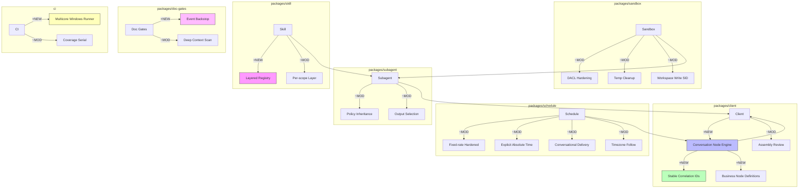

# Architecture Evolution & Design Log · 2026-08-09

> **Commit 数量**: 377 (含 merge) / ~210 (非 merge)
> **核心主题**: Conversation Node Engine + Schedule 提醒语义完善 + Windows CI 多核 + Subagent Policy Inheritance + Sandbox ACL 硬化 + Doc Prose Purge + Repository Plugin E2E

---

## 1. 每日架构演进图

> 本图反映当日最重要的架构演进路径和设计拓扑。



**图例**: `+NEW` 新增模块 | `~MOD` 修改模块 | 连线表示依赖/调用关系

---

## 2. 设计模式与重构

### 应用的设计模式
- **Composite Pattern**: Conversation Node Engine（`81d6886006`）将对话节点组合为树状结构，每个节点有独立的上下文和渲染逻辑，形成了 Composite 模式
- **Mediator Pattern**: Stable Correlation IDs（`aa623b6e7a`）为对话事件引入了稳定的关联 ID，作为事件之间的中介者，解耦了事件的生产者和消费者
- **Strategy Pattern**: Schedule 三种提醒模式（fixed-rate、absolute、conversational）各自实现了不同的时间计算策略
- **Chain of Responsibility**: Skill layered registry（`4788569889`）将 skill 注册按 scope 分层，形成了从 global 到 session 到 preset 的责任链

### 模块解耦与接口定义
- **Conversation Node Engine**: 将对话渲染拆分为独立的节点引擎，每个节点类型（message、tool、compact、skill 等）有独立的渲染逻辑和上下文
- **Business Node Definitions**（`6d09b3168d`）: 将业务节点的定义从 conversation 包分离，实现了节点定义和渲染逻辑的解耦
- **Skill Layered Registry**（`4788569889`）: 将 skill 注册按 scope 分层，global、session、preset 各自维护独立的 skill 集合，避免了全局状态污染

### 基础设施与性能
- **Schedule Fixed-rate Hardened**（`acb32f2999`）: 加固了 fixed-rate 提醒的边界条件，确保了时间计算的正确性
- **Schedule Conversational Delivery**（`36ef892559`）: 将提醒交付改为对话式，允许提醒在对话上下文中触发
- **Windows CI Multicore**（`461f2aaaf2`）: 引入了多核 Windows runner，提升了 CI 的并行执行能力

---

## 3. 特性交付与系统影响

### 核心特性
1. **Conversation Node Engine**: 这是当日最重要的架构变更。将对话渲染拆分为独立的节点引擎，每个节点类型有独立的渲染逻辑和上下文。这为后续的对话 UI 扩展提供了清晰的架构基础
2. **Schedule 提醒语义完善**: 三种提醒模式的语义得到了完善——fixed-rate 加固了边界条件，absolute 显式化了时间计算，conversational 改进了交付方式
3. **Subagent Policy Inheritance**: 子 agent 现在可以继承父 agent 的策略，确保了策略的一致性
4. **Skill Layered Registry**: skill 注册按 scope 分层，避免了全局状态污染，提升了 skill 的隔离性
5. **Doc Gates Event Backstop**: 为文档验证引入了事件回退机制，确保了文档与代码的一致性

### 系统拓扑影响
- **Conversation**: 新增了节点引擎，改变了对话渲染的拓扑——从单一渲染器变为节点化的组合渲染器
- **Schedule**: 提醒交付从事件驱动变为对话式，改变了提醒的触发拓扑
- **Subagent**: 策略从独立配置变为继承式，改变了策略的传播拓扑
- **Skill**: 注册从全局变为分层，改变了 skill 的可见性拓扑

---

## 4. 架构决策与 Roadmap 对齐

### 关键技术决策（ADR 推断）
- **决策 1: Conversation 采用节点引擎**
  - **背景与痛点**: 对话渲染逻辑与业务逻辑耦合，难以独立修改和扩展
  - **选择的方案**: 将对话渲染拆分为独立的节点引擎，每个节点类型有独立的渲染逻辑
  - **Trade-offs**: 牺牲了渲染的统一性（每个节点类型有自己的渲染逻辑），换取了扩展性和可维护性

- **决策 2: Skill Registry 按 Scope 分层**
  - **背景与痛点**: skill 注册在全局状态下，不同 session 和 preset 的 skill 互相干扰
  - **选择的方案**: 将 skill 注册按 scope 分层，global、session、preset 各自维护独立的 skill 集合
  - **Trade-offs**: 特牲了查询效率（需要跨层查询），换取了隔离性和可维护性

- **决策 3: Schedule 提醒采用对话式交付**
  - **背景与痛点**: 提醒在事件驱动模式下触发，无法访问对话上下文
  - **选择的方案**: 将提醒交付改为对话式，允许提醒在对话上下文中触发
  - **Trade-offs**: 特牲了触发的即时性（需要等待对话上下文），换取了上下文的正确性

- **决策 4: Subagent 策略采用继承模式**
  - **背景与痛点**: 子 agent 的策略需要手动配置，容易遗漏或不一致
  - **选择的方案**: 子 agent 自动继承父 agent 的策略，确保策略的一致性
  - **Trade-offs**: 特牲了灵活性（子 agent 无法独立配置策略），换取了一致性和易用性

### 产品 Roadmap 支撑
- Conversation Node Engine 支撑了"对话 UI 可扩展性"的 roadmap，让用户可以看到更多类型的对话内容
- Schedule 提醒语义完善支撑了"自动化工作流"的 roadmap，提供了更可靠的提醒交付
- Subagent Policy Inheritance 支撑了"多 agent 协作"的 roadmap，简化了策略配置
- Skill Layered Registry 支撑了"skill 生态"的 roadmap，提供了更好的 skill 隔离

---

## 5. 开发者/架构师决策推断

### 开发者意图重建
- **思维模型**: 开发者当时在"重构对话系统"——从单一渲染器变为节点引擎，从全局 skill 注册变为分层注册，从事件驱动提醒变为对话式交付
- **优先级排序**: 先建立节点引擎（conversation node engine），再建立分层注册（skill layered registry），再完善提醒语义（schedule hardened），因为节点引擎是对话系统的基础
- **有意取舍**: 选择了"节点引擎"而非"模板引擎"，因为节点引擎提供了更灵活的组合能力，而模板引擎更适合静态内容

### 架构师决策推断
- **模块拆分粒度**: Conversation node engine 被拆分为多个独立的节点类型（message、tool、compact、skill），每个类型有自己的渲染逻辑，粒度适中
- **时机判断**: 在 conversation 包的功能稳定后才引入节点引擎，确保了基础对话逻辑的可靠性
- **后续影响**: 这个决策让后续新增对话内容类型只需要实现新的节点类型，不影响现有节点

### Code Review 视角
- **首先关注**: Conversation Node Engine——这是架构变更最大的特性，需要重点关注节点的组合逻辑和上下文传递
- **会提出的问题**:
  - 节点引擎的上下文传递机制是什么？父节点的上下文如何传递给子节点？
  - 如果某个节点的渲染失败，是否会影响其他节点的渲染？
  - Skill layered registry 的跨层查询是否有性能影响？
  - Schedule conversational delivery 是否保证了提醒的及时性？
- **做得好**: Skill layered registry 的设计非常清晰，global/session/preset 三层的职责边界明确
- **可以改进**: Conversation node engine 可以考虑引入节点缓存机制，避免重复渲染

---

## 6. 技术债务与风险评估

### 已知风险 / 变通方案
- **Conversation Node Engine 的复杂性**: 节点引擎引入了更多的抽象层，增加了理解成本
- **Skill Layered Registry 的查询效率**: 跨层查询可能在 skill 数量较多时成为性能瓶颈
- **Schedule Conversational Delivery 的及时性**: 对话式交付可能在对话空闲时延迟提醒
- **Subagent Policy Inheritance 的灵活性**: 继承模式可能无法满足子 agent 的个性化需求

### 建议的下一步
- 为 Conversation Node Engine 编写节点类型的扩展指南，降低新节点类型的开发成本
- 为 Skill Layered Registry 添加性能基准测试，验证跨层查询的效率
- 为 Schedule Conversational Delivery 编写超时机制，确保提醒的及时性
- 为 Subagent Policy Inheritance 添加覆盖机制，允许子 agent 覆盖继承的策略

---

## 阶段性深度分析

### 阶段 1: Conversation Node Engine

**涉及的 Commits**: `81d6886006` (Node Engine), `aa623b6e7a` (Correlation IDs), `6d09b3168d` (Business Node Defs), `8723a0e15f` (Assembly Review), `990f700d3c` (Assembly Review Feedback), `e11f630fcd` (Remaining Review), `10464d155d` (Typed Business Events)

**阶段意图**: 将对话渲染拆分为独立的节点引擎，为对话 UI 扩展提供清晰的架构基础。

**开发者视角推断**:
- **思维模型**: 开发者在构建一个"节点化的对话渲染器"——每个对话元素（message、tool、compact、skill）都是一个独立的节点，有自己的渲染逻辑和上下文
- **优先级选择**: 先建立节点引擎核心（`81d6886006`），再建立关联 ID（`aa623b6e7a`），再建立业务节点定义（`6d09b3168d`），因为节点引擎是关联 ID 和业务节点的基础
- **有意取舍**: 选择了"节点引擎"而非"模板引擎"，因为节点引擎提供了更灵活的组合能力

**架构师视角推断**:
- **粒度考量**: 每个节点类型被独立为一个渲染器，而非合并为一个统一的渲染器，因为不同节点类型的渲染逻辑差异很大
- **时机判断**: 在 conversation 包的功能稳定后才引入节点引擎，确保了基础对话逻辑的可靠性
- **后续影响**: 这个决策让后续新增对话内容类型只需要实现新的节点类型，不影响现有节点

**重点关注的文档/代码**:

| 文件/模块 | 路径 | 阅读要点 |
|-----------|------|----------|
| Conversation Node Engine | `packages/client/src/` | 节点引擎的核心实现 |
| Correlation IDs | `packages/events/src/` | 稳定关联 ID 的生成和管理 |
| Business Node Defs | `packages/client/src/` | 业务节点的定义和注册 |

**关键代码模式**:
```typescript
// feat(client): add conversation node engine and contextual slots
// 81d6886006 — 对话节点引擎的核心实现
// 将对话渲染拆分为独立的节点，每个节点有自己的渲染逻辑和上下文
```

**领域建模洞察**:
- **聚合根**: `Conversation` 作为聚合根，管理所有对话节点的生命周期
- **值对象**: `NodeContext` 作为节点上下文，是不可变的值对象
- **领域事件**: Node render 事件触发节点的渲染逻辑

---

### 阶段 2: Schedule 提醒语义完善

**涉及的 Commits**: `acb32f2999` (Fixed-rate Hardened), `b7ec8429a9` (Explicit Absolute Time), `36ef892559` (Conversational Delivery), `3952fb4b72` (Follow Latest Contracts), `76537fde15` (Partial Recurring Failure), `204c526551` (Conversational Hardened), `139b4f421e` (Absolute-time Review Gaps)

**阶段意图**: 完善三种提醒模式的时间语义，确保边界条件的正确处理。

**开发者视角推断**:
- **思维模型**: 开发者在"加固时间语义"——fixed-rate 的边界条件、absolute 的时间计算、conversational 的交付方式都需要精确处理
- **优先级选择**: 先加固 fixed-rate（最常见的场景），再完善 absolute（需要时间计算），最后改进 conversational（需要对话上下文）
- **有意取舍**: 选择了"逐个加固"而非"统一重构"，因为三种模式的边缘案例差异很大，统一重构可能导致回归

**架构师视角推断**:
- **粒度考量**: 每种提醒模式作为独立的实现路径，而非在单一调度器中分支，因为它们的持久化语义、时间计算、边缘案例都不同
- **时机判断**: 在 schedule 核心稳定后才引入语义完善，确保了基础机制的可靠性
- **后续影响**: 这个决策让后续新增提醒模式只需添加新路径，不影响现有模式

**重点关注的文档/代码**:

| 文件/模块 | 路径 | 阅读要点 |
|-----------|------|----------|
| Schedule Fixed-rate | `packages/schedule/src/` | fixed-rate 的边界条件加固 |
| Schedule Absolute | `packages/schedule/src/` | absolute time 的时间计算 |
| Schedule Conversational | `packages/schedule/src/` | conversational 的交付逻辑 |

**关键代码模式**:
```typescript
// fix(schedule): harden fixed-rate boundaries
// acb32f2999 — 加固 fixed-rate 提醒的边界条件
// 确保时间计算在各种边缘案例下的正确性
```

---

### 阶段 3: Skill Layered Registry

**涉及的 Commits**: `4788569889` (Layered Registry), `4b9bde551b` (Prove Global Layer), `0b2f32740d` (Revert), `3d21db0b83` (Drop Skill Contribution)

**阶段意图**: 将 skill 注册按 scope 分层，避免全局状态污染，提升 skill 的隔离性。

**开发者视角推断**:
- **思维模型**: 开发者在"隔离 skill 作用域"——不同 scope（global、session、preset）的 skill 应该互相独立，避免全局状态污染
- **优先级选择**: 先实现分层注册（`4788569889`），再验证 global layer（`4b9bde551b`），最后处理边缘案例（`0b2f32740d`），因为分层注册是验证和边缘案例处理的前提
- **有意取舍**: 选择了"分层注册"而非"命名空间隔离"，因为分层注册更符合 Cordis 的 scope 语义

**架构师视角推断**:
- **粒度考量**: Skill registry 被分为三层（global、session、preset），而非更多层，因为三层覆盖了主要的使用场景
- **时机判断**: 在 skill 包稳定后才引入分层注册，确保了基础 skill 机制的可靠性
- **后续影响**: 这个决策让后续新增 skill scope 只需要添加新层，不影响现有层

**重点关注的文档/代码**:

| 文件/模块 | 路径 | 阅读要点 |
|-----------|------|----------|
| Skill Layered Registry | `packages/skill/src/` | 分层注册的核心实现 |
| Skill Scope | `packages/skill/src/` | scope 的定义和管理 |

**关键代码模式**:
```typescript
// feat(skill): layer the host skill registry per scope like the tools registry
// 4788569889 — 将 skill 注册按 scope 分层
// global、session、preset 各自维护独立的 skill 集合
```
