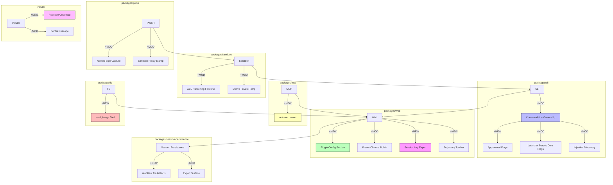

# Architecture Evolution & Design Log · 2026-08-10

> **Commit 数量**: 359 (含 merge) / ~200 (非 merge)
> **核心主题**: CLI Command-line Ownership + Web Plugin Config + Windows ACL/PWSH Merged + Session Log Export + MCP Auto-reconnect + Vendor Rescope + Repository Plugin Removal + read_image Tool

---

## 1. 每日架构演进图

> 本图反映当日最重要的架构演进路径和设计拓扑。



**图例**: `+NEW` 新增模块 | `~MOD` 修改模块 | 连线表示依赖/调用关系

---

## 2. 设计模式与重构

### 应用的设计模式
- **Facade Pattern**: CLI command-line ownership（`1f0a0440f3`, `d4ccfbd80f`）将命令行解析的责任从 launcher 转移到 app，每个 app 声明自己拥有的 flags，launcher 只解析自己认识的 flags
- **Adapter Pattern**: Vendor rescope（`ec601ca13d`）将 vendored Cordis 包从原始 scope 适配为 `@deepseek-ai` scope，通过 codemod 实现批量重命名
- **Observer Pattern**: MCP auto-reconnect（`00f68d7e93`）在 transport close 后自动重连，通过 observer 监听连接状态变化
- **Strategy Pattern**: Web plugin config（`f8555b5561`）将 host-plane 插件配置暴露为 settings section，用户可以通过策略选择不同的配置

### 模块解耦与接口定义
- **CLI Command-line Ownership**: 将命令行解析的责任从 launcher 转移到 app，每个 app 声明自己拥有的 flags，launcher 只解析自己认识的 flags。这实现了 launcher 和 app 的职责分离
- **Web Plugin Config**（`f8555b5561`）: 将 host-plane 插件配置暴露为 settings section，用户可以通过 Web UI 配置插件参数，实现了配置的 UI 化
- **Session Log Export**（`9574a99f45`, `ded90bffba`, `80b7f929ea`): 将 session log 导出为可下载的 artifact，实现了 session 数据的可移植性

### 基础设施与性能
- **MCP Auto-reconnect**（`00f68d7e93`）: 在 MCP transport close 后自动重连，使用 bounded backoff 策略，避免了手动重连的繁琐
- **Vendor Rescope**（`ec601ca13d`）: 将 vendored Cordis 包从原始 scope 适配为 `@deepseek-ai` scope，统一了依赖的命名空间
- **Session Log Export**（`80b7f929ea`）: 将 session log 导出为可下载的 artifact，支持 surrogate-safe chunks 和 backpressure drain

---

## 3. 特性交付与系统影响

### 核心特性
1. **CLI Command-line Ownership**: 这是当日最重要的架构变更。将命令行解析的责任从 launcher 转移到 app，每个 app 声明自己拥有的 flags。这为后续的多 app 架构（web app、one-shot app、ACP server）奠定了基础
2. **Web Plugin Config**: 将 host-plane 插件配置暴露为 settings section，用户可以通过 Web UI 配置插件参数。这为插件的可配置性提供了 UI 支持
3. **Session Log Export**: 将 session log 导出为可下载的 artifact，支持 trajectory toolbar 下载。这为 session 数据的可移植性和分析提供了支持
4. **Vendor Rescope**: 将 vendored Cordis 包从原始 scope 适配为 `@deepseek-ai` scope，统一了依赖的命名空间。这为依赖管理和发布提供了基础
5. **read_image Tool**: 引入了最小化的 read_image 工具，支持从 attachment 和 fs seam 读取图片。这为多模态输入提供了基础

### 系统拓扑影响
- **CLI**: 新增了 command-line ownership 机制，改变了命令行解析的拓扑——从 launcher 统一解析变为 app 各自声明
- **Web**: 新增了 plugin config section，改变了配置管理的拓扑——从文件配置变为 UI 配置
- **Session**: 新增了 log export 能力，改变了 session 数据的消费拓扑——从内部消费变为可导出
- **Vendor**: 新增了 rescope 机制，改变了依赖的命名拓扑——从原始 scope 变为统一 scope

---

## 4. 架构决策与 Roadmap 对齐

### 关键技术决策（ADR 推断）
- **决策 1: CLI 采用 App-owned Flags**
  - **背景与痛点**: Launcher 需要解析所有 app 的 flags，导致 launcher 与 app 紧耦合
  - **选择的方案**: 每个 app 声明自己拥有的 flags，launcher 只解析自己认识的 flags
  - **Trade-offs**: 牺牲了 flags 的全局可见性（每个 app 只看到自己的 flags），换取了 launcher 和 app 的解耦

- **决策 2: Vendor 采用 Rescope Codemod**
  - **背景与痛点**: Vendored Cordis 包使用原始 scope，与项目其他依赖的命名空间不一致
  - **选择的方案**: 通过 codemod 批量重命名 vendored 包的 scope 为 `@deepseek-ai`
  - **Trade-offs**: 牺牲了与上游的兼容性（scope 变更可能导致上游更新困难），换取了命名空间的一致性

- **决策 3: Session Log 采用 Artifact Export**
  - **背景与痛点**: Session log 只能在内部消费，无法导出给外部工具分析
  - **选择的方案**: 将 session log 导出为可下载的 artifact，支持 surrogate-safe chunks 和 backpressure drain
  - **Trade-offs**: 特牲了导出的即时性（需要序列化和传输），换取了数据的可移植性和安全性

- **决策 4: Web Plugin Config 采用 Settings Section**
  - **背景与痛点**: 插件配置需要通过文件手动编辑，用户体验差
  - **选择的方案**: 将 host-plane 插件配置暴露为 Web UI 的 settings section
  - **Trade-offs**: 特牲了配置的灵活性（UI 限制了配置的表达力），换取了用户体验和可发现性

### 产品 Roadmap 支撑
- CLI Command-line Ownership 支撑了"多 app 架构"的 roadmap，让用户可以在 web app、one-shot app、ACP server 之间切换
- Web Plugin Config 支撑了"插件可配置性"的 roadmap，让用户可以通过 UI 配置插件参数
- Session Log Export 支撑了"数据可移植性"的 roadmap，让用户可以导出 session 数据进行分析
- Vendor Rescope 支撑了"依赖管理"的 roadmap，统一了依赖的命名空间
- read_image Tool 支撑了"多模态输入"的 roadmap，让用户可以上传图片作为输入

---

## 5. 开发者/架构师决策推断

### 开发者意图重建
- **思维模型**: 开发者当时在"重构启动架构"——从 launcher 统一解析变为 app 各自声明，从文件配置变为 UI 配置，从内部消费变为可导出
- **优先级排序**: 先建立 command-line ownership（CLI），再建立 plugin config（Web），再建立 session export（Session），因为 command-line ownership 是多 app 架构的前提
- **有意取舍**: 选择了"app-owned flags"而非"全局 flags registry"，因为 app-owned flags 更简单，且满足当前的多 app 需求

### 架构师决策推断
- **模块拆分粒度**: CLI command-line ownership 被设计为独立的机制，而非合并到 launcher 中，因为它的职责和变更频率与 launcher 不同
- **时机判断**: 在 CLI 核心功能稳定后才引入 command-line ownership，确保了基础启动逻辑的可靠性
- **后续影响**: 这个决策让后续新增 app 只需要声明自己的 flags，不需要修改 launcher

### Code Review 视角
- **首先关注**: CLI Command-line Ownership——这是架构变更最大的特性，需要重点关注 flags 的声明和解析逻辑
- **会提出的问题**:
  - App-owned flags 的冲突检测机制是什么？如果两个 app 声明了相同的 flag 怎么办？
  - Launcher 如何处理不认识的 flags？是忽略还是报错？
  - Vendor rescope 是否影响了 Cordis 的内部引用？
  - Session log export 的 backpressure 机制如何工作？如果导出速度跟不上写入速度怎么办？
- **做得好**: CLI command-line ownership 的设计非常清晰，launcher 和 app 的职责边界明确
- **可以改进**: Web plugin config 可以考虑引入配置验证机制，确保用户输入的配置值是合法的

---

## 6. 技术债务与风险评估

### 已知风险 / 变通方案
- **CLI Command-line Ownership 的冲突检测**: 如果两个 app 声明了相同的 flag，当前没有冲突检测机制，可能导致运行时错误
- **Vendor Rescope 的上游兼容性**: scope 变更可能导致上游更新时需要额外的适配工作
- **Session Log Export 的性能**: 大型 session 的导出可能需要较长时间，用户体验需要优化
- **Web Plugin Config 的安全性**: 插件配置暴露在 Web UI 中，需要确保只有授权用户可以修改

### 建议的下一步
- 为 CLI command-line ownership 添加 flags 冲突检测机制
- 为 Vendor rescope 编写上游更新指南，记录 scope 变更的影响
- 为 Session log export 添加进度指示和异步导出支持
- 为 Web plugin config 添加配置验证和权限控制

---

## 阶段性深度分析

### 阶段 1: CLI Command-line Ownership

**涉及的 Commits**: `1f0a0440f3` (App Entry Values), `d4ccfbd80f` (App-owned Profile Startup), `37cbd155f5` (Launcher Parses Own Flags), `82728808d4` (Web and One-shot Apps Own Flags), `788368e314` (Remaining Arguments to App), `b692f38506` (Injection Discovery), `09e2d2ddc1` (Command Providers), `668bdb3d8e` (Readiness in Web App), `18328ce615` (Unused Profile Hook)

**阶段意图**: 将命令行解析的责任从 launcher 转移到 app，实现 launcher 和 app 的职责分离。

**开发者视角推断**:
- **思维模型**: 开发者在"解耦启动架构"——launcher 只负责发现和启动 app，app 自己负责解析 flags 和初始化
- **优先级选择**: 先定义 app entry values（`1f0a0440f3`），再实现 app-owned startup（`d4ccfbd80f`），最后清理 launcher（`37cbd155f5`），因为 app entry values 是 app-owned startup 的前提
- **有意取舍**: 选择了"app-owned flags"而非"全局 flags registry"，因为 app-owned flags 更简单，且满足当前的多 app 需求

**架构师视角推断**:
- **粒度考量**: Command-line ownership 被设计为独立的机制，而非合并到 launcher 中，因为它的职责和变更频率与 launcher 不同
- **时机判断**: 在 CLI 核心功能稳定后才引入 command-line ownership，确保了基础启动逻辑的可靠性
- **后续影响**: 这个决策让后续新增 app 只需要声明自己的 flags，不需要修改 launcher

**重点关注的文档/代码**:

| 文件/模块 | 路径 | 阅读要点 |
|-----------|------|----------|
| CLI Launcher | `packages/cli/src/` | launcher 的 flags 解析逻辑 |
| CLI App Entry | `packages/cli/src/` | app entry values 的定义 |
| CLI Injection | `packages/cli/src/` | injection discovery 的实现 |

**关键代码模式**:
```typescript
// refactor(cli)!: the launcher parses only its own flags
// 37cbd155f5 — launcher 只解析自己认识的 flags
// 将 flags 解析的责任从 launcher 转移到 app
```

**领域建模洞察**:
- **聚合根**: `App` 作为聚合根，管理自己的 flags 和启动逻辑
- **值对象**: `AppFlags` 作为 app 的 flags 声明，是不可变的值对象
- **领域事件**: App start 事件触发 app 的初始化逻辑

---

### 阶段 2: Web Plugin Config

**涉及的 Commits**: `f8555b5561` (Configure Host-plane Plugins), `da6cad065` (Show Plugin Settings), `d9d2b11b9f` (WIP: Agent Preset UI Flow), `a95e3265f6` (Preset Chrome Polish), `d53f392cd3` (Stage Card Edits), `5d8d79ce92` (Edit Declared Provider)

**阶段意图**: 将 host-plane 插件配置暴露为 Web UI 的 settings section，让用户可以通过 UI 配置插件参数。

**开发者视角推断**:
- **思维模型**: 开发者在"UI 化配置管理"——插件配置不再需要手动编辑文件，而是通过 Web UI 进行可视化配置
- **优先级选择**: 先实现 plugin config section（`f8555b5561`），再实现 preset chrome polish（`a95e3265f6`），最后实现 card edits（`d53f392cd3`），因为 plugin config section 是其他 UI 改进的基础
- **有意取舍**: 选择了"settings section"而非"独立配置页面"，因为 settings section 更符合现有的 UI 架构

**架构师视角推断**:
- **粒度考量**: Plugin config 被设计为 settings section，而非独立的配置管理模块，因为它的变更频率和职责与 settings 一致
- **时机判断**: 在 Web UI 核心功能稳定后才引入 plugin config，确保了基础 UI 框架的可靠性
- **后续影响**: 这个决策让后续新增插件配置只需要添加新的 settings section，不影响现有配置

**重点关注的文档/代码**:

| 文件/模块 | 路径 | 阅读要点 |
|-----------|------|----------|
| Web Plugin Config | `packages/web/src/` | plugin config section 的实现 |
| Web Preset Chrome | `packages/web/src/` | preset chrome 的 UI 改进 |
| Web Card Edits | `packages/web/src/` | card edits 的 staged 机制 |

**关键代码模式**:
```typescript
// feat(client): configure host-plane plugins from a settings section
// f8555b5561 — 将 host-plane 插件配置暴露为 settings section
// 用户可以通过 Web UI 配置插件参数
```

---

### 阶段 3: Session Log Export

**涉及的 Commits**: `9574a99f45` (Session Log Export), `ded90bffba` (Host Session-log Download), `80b7f929ea` (Expose readRaw), `2a34ca51a3` (Assembled E2E), `fbd09a70f3` (Document SessionRawArtifact), `bf70da473b` (Address Review)

**阶段意图**: 将 session log 导出为可下载的 artifact，支持 trajectory toolbar 下载。

**开发者视角推断**:
- **思维模型**: 开发者在"数据导出通道"——session log 不仅可以在内部消费，还可以导出给外部工具分析
- **优先级选择**: 先暴露 readRaw（`80b7f929ea`），再实现 host download surface（`ded90bffba`），最后实现 trajectory toolbar（`9574a99f45`），因为 readRaw 是 download surface 的前提
- **有意取舍**: 选择了"artifact export"而非"streaming export"，因为 artifact export 更简单，且满足当前的使用场景

**架构师视角推断**:
- **粒度考量**: Session log export 被设计为独立的能力，而非合并到 session persistence 中，因为它的职责和变更频率与 persistence 不同
- **时机判断**: 在 session persistence 稳定后才引入 export，确保了基础持久化机制的可靠性
- **后续影响**: 这个决策让后续新增 export 格式只需要添加新的 export 实现，不影响现有导出

**重点关注的文档/代码**:

| 文件/模块 | 路径 | 阅读要点 |
|-----------|------|----------|
| Session Persistence | `packages/session/src/` | readRaw 的实现 |
| API Proxy | `packages/api/src/` | host download surface |
| Web Trajectory | `packages/web/src/` | trajectory toolbar 的实现 |

**关键代码模式**:
```typescript
// feat(session-persistence): expose readRaw for per-session artifacts
// 80b7f929ea — 暴露 readRaw 接口，支持 session log 的原始读取
// 为 session log export 提供基础数据访问能力
```

**领域建模洞察**:
- **聚合根**: `SessionArtifact` 作为聚合根，管理 session 数据的导出生命周期
- **值对象**: `SessionRawArtifact` 作为原始 session 数据，是不可变的值对象
- **领域事件**: Export 事件触发 session 数据的序列化和传输

---

### 阶段 4: Vendor Rescope

**涉及的 Commits**: `ec601ca13d` (Rescope Codemod), `194828e8b8` (Mapping Doc), `78e9b8bec5` (Resolve Framework Peer), `a7e8805340` (Materialize Runtime Dependencies), `75f4434787` (Close Rescoped Deploy), `b668e6f120` (Dereference Restored Deps)

**阶段意图**: 将 vendored Cordis 包从原始 scope 适配为 `@deepseek-ai` scope，统一依赖的命名空间。

**开发者视角推断**:
- **思维模型**: 开发者在"统一命名空间"——vendored 包和项目其他依赖应该使用相同的 scope，便于管理和发布
- **优先级选择**: 先实现 codemod（`ec601ca13d`），再处理 runtime dependencies（`a7e8805340`），最后关闭部署间隙（`75f4434787`），因为 codemod 是其他步骤的前提
- **有意取舍**: 选择了"codemod 批量重命名"而非"手动逐个修改"，因为 codemod 更高效，且可以确保一致性

**架构师视角推断**:
- **粒度考量**: Rescope 被设计为独立的变更，而非与其他变更合并，因为它的影响范围很广，需要独立验证
- **时机判断**: 在 vendor 包稳定后才引入 rescope，确保了基础 vendoring 机制的可靠性
- **后续影响**: 这个决策让后续更新 vendored 包时只需要运行 codemod，不需要手动修改

**重点关注的文档/代码**:

| 文件/模块 | 路径 | 阅读要点 |
|-----------|------|----------|
| Vendor Rescope | `vendor/src/` | rescope codemod 的实现 |
| Vendor Mapping | `docs/` | scope 映射的文档 |
| Package.json | `packages/*/package.json` | runtime dependencies 的更新 |

**关键代码模式**:
```typescript
// build(vendor): rescope the vendored Cordis packages into @deepseek-ai
// ec601ca13d — 将 vendored Cordis 包的 scope 从原始 scope 重命名为 @deepseek-ai
// 通过 codemod 实现批量重命名
```

---

### 阶段 5: read_image Tool

**涉及的 Commits**: `1861a3fc7c` (Minimal read_image), `767e5a5723` (Close Review Gaps), `97a9ec5a0e` (Align Contracts), `fcf5f402b8` (Fix Tasks-local), `21ec0fd10b` (Expect read_image)

**阶段意图**: 引入最小化的 read_image 工具，支持从 attachment 和 fs seam 读取图片。

**开发者视角推断**:
- **思维模型**: 开发者在"多模态输入通道"——agent 需要能够读取图片作为输入，read_image 提供了这个能力
- **优先级选择**: 先实现最小化的 read_image（`1861a3fc7c`），再修复 review findings（`767e5a5723`），最后对齐 contracts（`97a9ec5a0e`），因为最小化实现是 review 和对齐的前提
- **有意取舍**: 选择了"最小化实现"而非"完整图片处理"，因为最小化实现可以快速验证架构，后续再扩展功能

**架构师视角推断**:
- **粒度考量**: read_image 被设计为独立的 tool，而非合并到 fs tool 中，因为它的职责和使用场景与 fs tool 不同
- **时机判断**: 在 attachment 和 fs seam 稳定后才引入 read_image，确保了基础数据访问机制的可靠性
- **后续影响**: 这个决策让后续扩展图片处理能力（如图片分析、图片生成）可以复用 read_image 的基础

**重点关注的文档/代码**:

| 文件/模块 | 路径 | 阅读要点 |
|-----------|------|----------|
| read_image Tool | `packages/fs/src/` | read_image 的核心实现 |
| Attachment | `packages/attachment/src/` | attachment seam 的适配 |
| FS Seam | `packages/fs/src/` | fs seam 的适配 |

**关键代码模式**:
```typescript
// feat(fs): add a minimal read_image tool over the attachment and fs seams
// 1861a3fc7c — 最小化的 read_image 工具实现
// 从 attachment 和 fs seam 读取图片，为多模态输入提供基础
```

**领域建模洞察**:
- **聚合根**: `ImageTool` 作为聚合根，管理图片读取的生命周期
- **值对象**: `ImageContent` 作为图片内容，是不可变的值对象
- **领域事件**: Image read 事件触发图片的读取和转换
