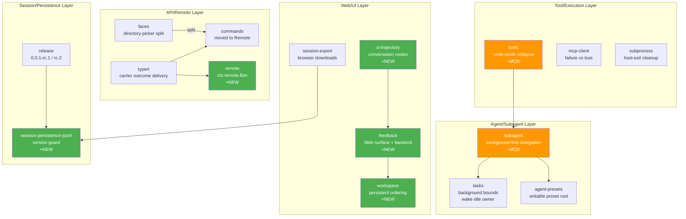

# Architecture Evolution & Design Log · 2026-08-11

> 525 commits (含 merges)，~250 non-merge commits。当日是 DSH 发版前的集中冲刺日，涵盖 Remote 迁移、Subagent 后台委托、Web Feedback UI、Session 导出、Workspace 排序、Release 流程等多个并行架构线。

## 1. 每日架构演进图

> 本图反映当日最重要的架构演进路径和设计拓扑。



## 2. 设计模式与重构

- **应用的设计模式**：
  - **Adapter Pattern**：`commands` 服务迁移到 Remote，通过 carrier 适配器在 ctx.remote 上交付命令结果（`070a2a7f1e`, `a2981207b0`）
  - **Strategy Pattern**：tool collapse 逻辑在 scope 级别解决而非 deployment default（`e258cf7a2d`），code-mode executor 按调用来源选择 collapse 目标（`24dd48b133`, `1e78513806`）
  - **Observer Pattern**：`ctx.remote.$on` 引入 allowlisted Host event 转发机制（`d88f771e19`），remote event delivery 形成新的事件消费路径
  - **Chain of Responsibility**：waterfall listener 在 tool pipeline 中传递 `next()`，collapse 逻辑检查 scope 而非全局默认

- **模块解耦与接口定义**：
  - `faces` 包拆分：directory-picker faces 独立为新包，generated contributions 从 Host aggregate 中分离（`027cbdfe5d`, `40af20cafe`）
  - carrier 类型集中到 assembly package（`159d102f99`），为 Remote unary 迁移奠定类型基础
  - typert 新增 carrier outcome delivery（`a2981207b0`）和 Remote absence 处理（`027e5fe9a4`），消除冗余的 second result envelope

- **基础设施与性能**：
  - subprocess host-exit cleanup 优先级调整（`0c232cf5b8`），确保 managed processes 在 host exit 时可靠清理（`ebe932e24c`）
  - session-persistence-jsonl 引入版本守卫，拒绝不可读的 format versions（`0a95a9eed8`, `9186824e87`）

## 3. 特性交付与系统影响

- **核心特性**：
  - **Remote Event Delivery**：`ctx.remote.$on` 允许 allowlisted Host events 通过 Remote 边界传递（`d88f771e19`），为 Web 端消费 owner events 提供通道。这是 Remote 从 RPC-only 向事件转发的架构扩展。
  - **Subagent Background-First Delegation**：continuable delegation 默认走 background（`8344d64363`），final reports 成为 continuable return contract（`76cf6cbd0b`），sibling delegations 实现并发安全（`a26d03960a`）
  - **Web Message Feedback**：完整的 feedback 后端 + Web surface（`3cffc77719`, `526febc44d`），含 session sharing disclosure（`3f9d0436eb`）
  - **Workspace Persistent Ordering**：sidebar drag ordering 持久化（`b3e843056e`, `2ad471123d`），host-confirmed order 恢复（`6898b06160`）
  - **Trajectory Conversation Assembly**：registered conversation nodes 组装（`f479c60b6d`），target-owned snapshots（`3e79f7106e`），性能优化包括 deferred text processing 和 indexed snapshot assembly

- **系统拓扑影响**：
  - Remote 层从单纯的 RPC carrier 扩展为包含事件转发的复合通道，影响所有消费 `ctx.remote` 的插件
  - Subagent 的 background-first 默认改变了 delegation 的执行拓扑，影响 tasks 和 agent-presets 的配置假设
  - Session export 从 raw artifact 转向 browser download，需要 apiproxy 协调 compression 和 cancellation

## 4. 架构决策与 Roadmap 对齐

- **关键技术决策（ADR 推断）**：
  - **背景与痛点**：Remote carrier 需要同时支持命令结果和事件转发，旧的 second result envelope 增加了复杂度
  - **选择的方案与 Trade-offs**：采用 unary Remote 迁移（`8c31290abb` proposal），carrier outcome 直接从 ctx.remote 交付，消除冗余 envelope。代价是需要一次性迁移所有 command consumers
  - **Tool collapse scope 决策**：从 deployment default 改为 scope-level resolution（`e258cf7a2d`），增加了 scope 概念的职责但获得了更精确的控制粒度
  - **Subagent background-first**：将 continuable delegation 的默认从 foreground 切到 background，牺牲了即时可见性换取更好的资源利用率和用户通知体验

- **产品 Roadmap 支撑**：
  - Release 0.0.1-rc.1/rc.2 标志着首次公开发布准备
  - Web feedback UI 为产品闭环提供了用户反馈通道
  - Workspace ordering 支持多 session 管理的用户体验提升

## 5. 开发者/架构师决策推断

- **开发者意图重建**：
  - **思维模型**：开发者在并行推进多个架构线——Remote 迁移、Subagent 后台化、Web UI 完善。每个分支都有清晰的 review feedback 循环（多次 fix: review findings）
  - **优先级排序**：先完成类型基础（faces split, carrier types），再实现新能力（remote events, feedback），最后打磨体验（workspace ordering, trajectory）
  - **有意取舍**：tool collapse 的 prompt filtering 被移除（`2aef2d83fa` review feedback），选择保持简洁而非增加过滤层

- **架构师决策推断**：
  - **模块拆分粒度**：faces split 粒度精确——directory-picker 独立但 generated contributions 仍属 Host aggregate，避免过度拆分
  - **抽象层引入时机**：`ctx.remote.$on` 在 Remote 已有 carrier 基础上引入事件层，时机恰当——太早会增加不必要的抽象，太晚会错过 Web 端消费 owner events 的窗口
  - **对后续可扩展性的影响**：session format version guard 为未来的持久化格式演进建立了安全网

- **Code Review 视角**：
  - 首先关注 Remote event delivery（`d88f771e19`），因为它是跨边界的新 API surface，需要验证 allowlist 完整性和边界安全性
  - 会向提交者提问：`ctx.remote.$on` 的事件清理语义是什么？plugin unload 时是否自动 dispose？
  - 做得好：tool collapse 的 scope-level resolution 比 deployment default 更精确；session version guard 用最小侵入建立了格式兼容性保护
  - 可改进：subagent background-first 改变了默认行为，需要更显式的文档说明对现有 foreground 依赖者的影响

## 6. 技术债务与风险评估

- **已知风险 / 变通方案**：
  - tool collapse 的 `collapses()` 方法引入了新的公共 API surface，需要确保 backward compatibility
  - session format version guard 在 `0a95a9eed8` 中拒绝 foreign versions，但 error recovery 路径需要验证
  - carrier types 到 assembly package 的迁移是一次性变更，遗漏的 consumer 会在运行时暴露

- **建议的下一步**：
  - 为 `ctx.remote.$on` 添加 disposal 集成测试，验证 plugin unload 时的事件清理
  - 为 subagent background-first 添加 migration guide，说明 foreground delegation 的替代方案
  - 为 session format version guard 添加 graceful degradation 路径

---

## 阶段性深度分析

### 阶段 1: API Remote 迁移与类型基础

**涉及的 Commits**: `8c31290abb` `027e5fe9a4` `a2981207b0` `070a2a7f1e` `027cbdfe5d` `40af20cafe` `159d102f99`

**阶段意图**：将 Remote 从 RPC-only carrier 扩展为支持 event forwarding 的复合通道，同时拆分 faces 包以支持按需加载。这是 Remote 层的架构升级，为后续的 `ctx.remote.$on` 和 Web 端 owner event 消费奠定基础。

**开发者视角推断**：
- **思维模型**：开发者认识到 Remote 需要同时处理命令结果和事件流，旧的 second result envelope 增加了不必要的复杂度。拆分 faces 是为了减少 Host aggregate 的构建体积。
- **优先级选择**：先完成类型基础（carrier types, faces split），再实现新能力（remote events），符合依赖拓扑
- **有意取舍**：选择 unary Remote 迁移而非增量适配，虽然一次性变更更大但避免了长期的 dual-mode 维护

**架构师视角推断**：
- **粒度考量**：faces split 粒度精确——directory-picker 作为独立包有独立的 Consumer，而 generated contributions 仍属 Host aggregate
- **时机判断**：在发版前引入 Remote 迁移，确保首次公开发布就包含正确的架构基础
- **后续影响**：carrier outcome delivery 消除了冗余 envelope，简化了所有 Remote consumer 的 error handling

**重点关注的文档/代码**：

| 文件/模块 | 路径 | 阅读要点 |
|-----------|------|----------|
| typert carrier | `packages/typert/` | carrier outcome delivery 的类型定义和 ctx.remote 集成 |
| commands faces | `packages/commands/` | 从 Host aggregate 分离后的包结构和依赖关系 |
| directory-picker | `packages/picker/` | split 后的 package boundary 和 Host aggregate 的剩余职责 |
| carrier assembly | `packages/client/` | carrier types 的 assembly package 定义 |

**关键代码模式**：
```typescript
// carrier outcome delivery from ctx.remote
// packages/typert/src/ — Remote absence without second result envelope
// 027e5fe9a4: carry Remote absence without a second result envelope
```

**领域建模洞察**（DDD 视角）：
- Remote 作为 **Bounded Context** 的边界更清晰——carrier 是值对象，outcome 是领域事件
- faces split 重新划定了 Host aggregate 的边界，directory-picker 成为独立的 Aggregate Root

**AI Agent 能力演进**（如适用）：
- Remote 从 RPC carrier 扩展为事件转发通道，agent 的 `ctx.remote` 能力边界扩展到事件消费

---

### 阶段 2: Subagent 后台委托与任务管理

**涉及的 Commits**: `8344d64363` `76cf6cbd0b` `a26d03960a` `567fcadba0` `c778b5b0db` `d78b796a51` `f32a51b284` `c98a4d0949` `75b26988dc` `fa349202c7`

**阶段意图**：将 subagent 的 continuable delegation 默认从 foreground 改为 background，建立 final report 作为 return contract，同时加强 background task 的资源管理（bounds, wake-on-idle）。

**开发者视角推断**：
- **思维模型**：开发者认识到 foreground delegation 在长时间运行任务中会阻塞用户交互，background-first 更符合异步 agent 协作模型
- **优先级选择**：先建立 background-first 默认，再添加 resource bounds 和 wake-on-idle，确保新默认不会导致资源失控
- **有意取舍**：牺牲了 foreground delegation 的即时可见性，换取更好的用户体验和资源利用率

**架构师视角推断**：
- **粒度考量**：continuable delegation 的 background 化是一个行为变更而非结构变更，保持了 delegation 接口的稳定性
- **时机判断**：在 subagent 能力成熟后引入 background-first，确保有足够的 foundation（final report contract, concurrency safety）
- **后续影响**：改变了 agent 协作的默认执行模型，影响所有依赖 delegation 的插件

**重点关注的文档/代码**：

| 文件/模块 | 路径 | 阅读要点 |
|-----------|------|----------|
| subagent | `packages/subagent/` | background-first delegation 的默认值和 final report contract |
| tasks | `packages/core/tasks` | background bounds 和 wake-on-idle 机制 |
| agent-presets | `packages/preset/` | writable preset root 的 ownership 变更 |

**关键代码模式**：
```typescript
// background-first delegation default
// packages/subagent/src/ — 8344d64363
// continuable delegation now defaults to background execution
```

**领域建模洞察**（DDD 视角）：
- Subagent delegation 作为 **Domain Event**，background-first 改变了事件的处理语义
- Final report 作为 **Value Object**，成为 continuable return 的契约

**AI Agent 能力演进**（如适用）：
- Agent 的 delegation 能力从 foreground-only 扩展为 background-first，支持更复杂的异步协作模式

---

### 阶段 3: Web UI 完善与交互体验

**涉及的 Commits**: `526febc44d` `3cffc77719` `3f9d0436eb` `b3e843056e` `f479c60b6d` `3e79f7106e` `d06a7e07e5` `e611e825b1` `ee1a88c9f1` `dc42e6b822` `341051603f`

**阶段意图**：完善 Web 端的核心交互体验——message feedback 提供用户反馈通道，workspace ordering 支持多 session 管理，trajectory conversation nodes 提供更丰富的对话可视化。

**开发者视角推断**：
- **思维模型**：开发者在构建 Web 端的 MVP 体验，feedback + ordering + trajectory 形成完整的用户交互闭环
- **优先级选择**：先实现 feedback 后端（数据层），再实现 Web surface（展示层），最后打磨 workspace ordering（交互层）
- **有意取舍**：trajectory 的 deferred text processing 选择延迟加载而非预计算，牺牲首屏速度换取更低的内存占用

**架构师视角推断**：
- **粒度考量**：feedback 的后端和 Web surface 分离为独立能力，允许 headless 模式只使用后端
- **时机判断**：在 session log export 完成后引入 feedback，确保有完整的数据基础
- **后续影响**：workspace ordering 的持久化机制可能需要扩展到其他 session 元数据

**重点关注的文档/代码**：

| 文件/模块 | 路径 | 阅读要点 |
|-----------|------|----------|
| feedback | `packages/feedback/` | 后端 + Web surface 的架构分离 |
| workspace | `packages/client/` | persistent ordering 的存储和恢复机制 |
| ui-trajectory | `packages/web/` | conversation nodes 的注册和组装机制 |
| ui-attachment | `packages/web/` | DeepSeek Chat 对齐的 attachment 展示 |

**关键代码模式**：
```typescript
// message feedback backend + web surface
// packages/feedback/src/ — 3cffc77719 + 526febc44d
// durable feedback storage with web UI controls
```

**领域建模洞察**（DDD 视角）：
- Feedback 作为 **Domain Event**，包含 session id 和 sharing disclosure 作为 Value Objects
- Workspace ordering 作为 **Aggregate Root**，管理 session 的排序关系

**AI Agent 能力演进**（如适用）：
- Web 端的 feedback 机制为 agent 的输出质量提供了用户反馈通道，支持后续的 RLHF 改进

---

### 阶段 4: 持久化安全与发布准备

**涉及的 Commits**: `0a95a9eed8` `9186824e87` `b64c3ac1ba` `5ca7be5dcb` `4cd77a5ad9` `9840d39ba0` `8cd38945f1` `a943e67798`

**阶段意图**：为首次公开发布建立持久化格式的兼容性保护（version guard），同时完善 release 流程（family metadata, pack, verify, publish）。

**开发者视角推断**：
- **思维模型**：开发者认识到持久化格式是长期契约，必须在首次发布前建立版本兼容性保护
- **优先级选择**：先建立 version guard，再完善 release 流程，确保发布的包是安全的
- **有意取舍**：version guard 选择硬拒绝而非 graceful degradation，确保数据安全而非兼容性

**架构师视角推断**：
- **粒度考量**：version guard 在 parse 层面拦截，避免了下游代码处理不兼容格式
- **时机判断**：在发版前引入，确保首次公开发布的包就包含格式保护
- **后续影响**：为未来的 format evolution 建立了安全网，任何格式变更都必须通过 version bump

**重点关注的文档/代码**：

| 文件/模块 | 路径 | 阅读要点 |
|-----------|------|----------|
| session-persistence-jsonl | `packages/session/` | version guard 的实现和 non-object/non-string-id 路径 |
| release | `packages/bundle/` | family metadata 和 pack/verify/publish 流程 |
| vendor release | `vendor/` | vendored Cordis 的 release 流程 |

**关键代码模式**：
```typescript
// session format version guard
// packages/session/src/ — 0a95a9eed8 + 9186824e87
// refuse foreign format versions before parsing current structure
```

**领域建模洞察**（DDD 视角）：
- Session format 作为 **Value Object**，version 是其 identity 属性
- Release family 作为 **Aggregate Root**，管理一组相关包的发布关系

**AI Agent 能力演进**（如适用）：
- Version guard 确保 agent 的 session 数据在版本升级后仍然可读，支持 agent 的长期记忆能力
