# Architecture Evolution & Design Log · 2026-08-12

> 204 commits (含 merges)，~116 non-merge commits。当日聚焦于富内容桥接、插件设置 UI、Workflow 披露自动跟踪、文档国际化校对、以及 Settings namespace 服务化。

## 1. 每日架构演进图

> 本图反映当日最重要的架构演进路径和设计拓扑。

```mermaid
graph TD
    subgraph "Content/Media Layer"
        ATTACH["attachment<br/>image batch admission<br/>+NEW"]
        ACP_BRIDGE["acp<br/>durable image prompts<br/>+NEW"]
        MCP_IMG["mcp<br/>image result projection<br/>~MOD"]
    end

    subgraph "Plugin/Settings Layer"
        SETTINGS["settings<br/>namespace serving<br/>+NEW"]
        PLUGIN_INV["web<br/>Loader plugin inventory<br/>+NEW"]
        PLUGIN_TABS["web<br/>plugin settings tabs<br/>+NEW"]
    end

    subgraph "Workflow Layer"
        WORKFLOW["workflow<br/>auto-follow disclosures<br/>+NEW"]
        DISCLOSURE["workflow<br/>coalesced disclosure cycles<br/>~MOD"]
    end

    subgraph "Session Layer"
        EXPORT_CMD["session-export<br/>command + Header action<br/>+NEW"]
        EXPORT_STREAM["session-export<br/>streamed downloads<br/>~MOD"]
    end

    subgraph "Documentation Layer"
        I18N["docs<br/>i18n proofreading<br/>~MOD"]
        ARCH["docs<br/>architecture refresh<br/>~MOD"]
    end

    ATTACH --> ACP_BRIDGE
    ATTACH --> MCP_IMG
    SETTINGS --> PLUGIN_INV
    SETTINGS --> PLUGIN_TABS
    WORKFLOW --> DISCLOSURE
    EXPORT_CMD --> EXPORT_STREAM

    style ATTACH fill:#4CAF50,color:#fff
    style ACP_BRIDGE fill:#4CAF50,color:#fff
    style SETTINGS fill:#4CAF50,color:#fff
    style PLUGIN_INV fill:#4CAF50,color:#fff
    style PLUGIN_TABS fill:#4CAF50,color:#fff
    style WORKFLOW fill:#4CAF50,color:#fff
    style EXPORT_CMD fill:#4CAF50,color:#fff
```



## 2. 设计模式与重构

- **应用的设计模式**：
  - **Adapter Pattern**：MCP image results 通过 durable attachments 投影（`49426cae02`），code mode 嵌套 image results 的转发（`e00146be73`）
  - **Observer Pattern**：workflow auto-follow disclosures（`3dff212c5d`），coalesced disclosure cycles 的 refold（`1b91e5b4fe`）
  - **Repository Pattern**：settings namespace serving（`4366528a38`），为每个 registered namespace 和 key plugin card 提供统一访问
  - **Composite Pattern**：plugin settings tabs 组合（`4f5c730032`），将多个 plugin 的设置合并到 tab 视图

- **模块解耦与接口定义**：
  - attachment 模块引入 ordered image batch admission（`219d2a1fb9`），区分 admission 和 storage failures（`57fc6bc539`）
  - ACP bridge 模块隔离 prompt admission 从 agent work（`adf4878b4a`），为 durable image prompts 提供独立的处理通道
  - settings section directory 实现 disposal、stale-read、invalidation 路径（`d8035680b9`）

- **基础设施与性能**：
  - session-export preserve streamed browser downloads（`785f41daed`）
  - plugin inventory 避免假设 loader sibling order（`be693f3bc7`）和 randomized id order（`6e64f77030`）

## 3. 特性交付与系统影响

- **核心特性**：
  - **Rich Content Bridges**：image batch admission 支持 ordered admission（`219d2a1fb9`），ACP bridge 为 durable image prompts/replies 提供通道（`4f87c1fe6d`），MCP 通过 durable attachments 投影 image results（`49426cae02`）。这是多模态内容处理的关键基础设施。
  - **Plugin Settings Tabs**：将多个 plugin 的设置合并到 tab 视图（`4f5c730032`），支持完整的 accessibility（`de0d16d3d1`），为用户提供了统一的配置入口
  - **Workflow Auto-Follow**：auto-follow run and phase disclosures（`3dff212c5d`），coalesced disclosure cycles 的 refold（`1b91e5b4fe`），clean-cycle reset scoped to phases（`33112b4957`）
  - **Loader Plugin Inventory**：read-only Loader plugin inventory（`6ed5df964e`），show module names for dynamic plugins（`eea356e785`），refined card details（`2614a2df93`）
  - **Settings Namespace Serving**：serve every registered namespace and key plugin cards（`4366528a38`），为 plugin 设置提供统一的数据层

- **系统拓扑影响**：
  - attachment 模块从简单的文件引用扩展为支持 ordered batch admission 和 admission/storage failure 区分的完整管线
  - ACP bridge 在 ACP 层和 attachment 层之间建立了 durable 连接，影响所有 image 处理路径
  - settings namespace serving 为所有 plugin 设置提供了统一的访问接口，简化了 Web 端的设置 UI

## 4. 架构决策与 Roadmap 对齐

- **关键技术决策（ADR 推断）**：
  - **背景与痛点**：image content 需要在 ACP、MCP、Web 三端一致处理，旧的 ad-hoc 转发导致了不一致的行为
  - **选择的方案与 Trade-offs**：采用 durable attachments 作为 image content 的统一载体，通过 ordered batch admission 确保处理顺序。代价是增加了 attachment 模块的复杂度
  - **Plugin settings 统一**：从分散的 plugin 配置入口合并到 tab 视图，牺牲了每个 plugin 的独立 UI 空间换取统一的用户体验

- **产品 Roadmap 支撑**：
  - Rich content bridges 为多模态 agent 能力提供了内容处理基础
  - Plugin settings tabs 为 plugin 生态提供了统一的用户配置体验
  - Workflow auto-follow 为 agent 工作流的可观测性提供了自动化支持

## 5. 开发者/架构师决策推断

- **开发者意图重建**：
  - **思维模型**：开发者在构建多模态内容处理管线和 plugin 设置 UI 两条并行线。image 处理需要跨层一致，settings 需要统一入口
  - **优先级选择**：先建立 attachment 的 admission 机制，再建立 ACP/MCP 的投影通道，最后统一 settings UI
  - **有意取舍**：plugin inventory 保持 read-only，选择先展示后编辑

- **架构师决策推断**：
  - **模块拆分粒度**：attachment 的 admission/storage failure 区分是正确的边界——admission 是策略决策，storage 是实现细节
  - **抽象层引入时机**：settings namespace serving 在 plugin 数量增长后引入，时机恰当
  - **后续影响**：durable attachments 成为多模态内容的统一载体，影响所有未来的 content type

- **Code Review 视角**：
  - 首先关注 attachment 的 admission/storage failure 区分（`57fc6bc539`），验证错误处理的完整性
  - 会向提交者提问：ACP bridge 的 durable image prompt 的 cleanup 语义是什么？
  - 做得好：plugin inventory 的 non-assumption 设计（avoid randomized id order）体现了健壮性思维
  - 可改进：workflow disclosure cycles 的 refold 逻辑可能需要更清晰的状态机文档

## 6. 技术债务与风险评估

- **已知风险 / 变通方案**：
  - attachment 的 ordered batch admission 依赖 ordering 语义，需要验证并发场景下的正确性
  - plugin settings tabs 的 accessibility 需要持续的 screen reader 测试
  - workflow disclosure cycles 的 coalescing 可能导致状态丢失

- **建议的下一步**：
  - 为 attachment 的 ordered batch admission 添加并发测试
  - 为 plugin settings tabs 添加 keyboard navigation 测试
  - 为 workflow disclosure cycles 添加状态机文档

---

## 阶段性深度分析

### 阶段 1: 多模态内容桥接

**涉及的 Commits**: `219d2a1fb9` `4f87c1fe6d` `49426cae02` `e00146be73` `57fc6bc539` `de17206051` `8d4c3f8a0a` `c9a536e0c8` `2c9036b102`

**阶段意图**：建立多模态内容（特别是 image）的统一处理管线，从 admission 到 projection 到 Web 展示，确保跨层一致性。

**开发者视角推断**：
- **思维模型**：开发者认识到 image content 需要在 ACP、MCP、Web 三端一致处理，旧的 ad-hoc 转发导致了不一致的行为。需要一个统一的载体（durable attachments）来承载 image content。
- **优先级选择**：先建立 attachment 的 admission 机制（策略层），再建立 ACP/MCP 的投影通道（传输层），最后完善 Web 展示（展示层）
- **有意取舍**：选择 ordered batch admission 而非 parallel admission，牺牲吞吐量换取处理顺序的确定性

**架构师视角推断**：
- **粒度考量**：admission/storage failure 区分是正确的策略——admission 反映的是内容策略决策（大小、格式、权限），storage 反映的是实现约束
- **时机判断**：在 image 处理需求出现时引入 durable attachments，而非更早（避免过度设计）或更晚（避免临时方案）
- **后续影响**：durable attachments 成为多模态内容的统一载体，影响所有未来的 content type（video、audio 等）

**重点关注的文档/代码**：

| 文件/模块 | 路径 | 阅读要点 |
|-----------|------|----------|
| attachment | `packages/attachment/` | ordered batch admission 和 failure 区分 |
| acp | `packages/acp/` | durable image prompts 的 bridge |
| mcp | `packages/mcp/` | image result projection through attachments |
| web | `packages/web/` | image drop, limits, thumbnail tiling |

**关键代码模式**：
```typescript
// ordered image batch admission
// packages/attachment/src/ — 219d2a1fb9
// distinguish admission from storage failures — 57fc6bc539
```

**领域建模洞察**（DDD 视角）：
- Attachment 作为 **Aggregate Root**，管理 image content 的 admission 和 storage 生命周期
- Admission policy 作为 **Domain Service**，执行格式检查和大小限制

**AI Agent 能力演进**（如适用）：
- Agent 的 image 处理能力从 ad-hoc 转发升级为 durable attachment 管线，支持更可靠的多模态交互

---

### 阶段 2: Plugin Settings 统一

**涉及的 Commits**: `4366528a38` `4f5c730032` `de0d16d3d1` `6ed5df964e` `eea356e785` `2614a2df93` `4cf76f2362` `5d9f026e55` `d8035680b9` `14e70b1bf4`

**阶段意图**：将分散的 plugin 配置入口统一到 tab 视图，建立 settings namespace serving 作为数据层，同时提供 plugin inventory 展示。

**开发者视角推断**：
- **思维模型**：开发者认识到 plugin 数量增长后，分散的配置入口导致用户体验碎片化。需要统一的 tab 视图和 namespace serving
- **优先级选择**：先建立 settings namespace serving（数据层），再实现 plugin settings tabs（展示层），最后完善 plugin inventory（浏览层）
- **有意取舍**：plugin inventory 保持 read-only，选择先展示后编辑

**架构师视角推断**：
- **粒度考量**：namespace serving 的粒度是 namespace + key，而非 plugin，支持跨 plugin 的命名空间共享
- **时机判断**：在 plugin 数量达到一定规模后引入，避免了过早优化
- **后续影响**：namespace serving 可能成为其他配置场景的模板

**重点关注的文档/代码**：

| 文件/模块 | 路径 | 阅读要点 |
|-----------|------|----------|
| settings | `packages/settings/` | namespace serving 和 section directory |
| web | `packages/web/` | plugin settings tabs 和 inventory |
| ui-workspace | `packages/web/` | drag-accept and status-dot renderers |

**关键代码模式**：
```typescript
// settings namespace serving
// packages/settings/src/ — 4366528a38
// serve every registered namespace and key plugin cards on it
```

**领域建模洞察**（DDD 视角）：
- Settings namespace 作为 **Value Object**，由 namespace + key 组成
- Plugin settings tab 作为 **Aggregate Root**，管理一组 plugin 的配置关系

**AI Agent 能力演进**（如适用）：
- Plugin settings 的统一为 agent 的配置管理提供了标准化入口，支持更复杂的 agent 定制

---

### 阶段 3: Workflow 披露自动化

**涉及的 Commits**: `3dff212c5d` `1b91e5b4fe` `33112b4957` `e4a5c6fb9d` `8f308023a2`

**阶段意图**：建立 workflow disclosure 的自动跟踪机制，coalesced disclosure cycles 的 refold，clean-cycle reset scoped to phases。

**开发者视角推断**：
- **思维模型**：开发者认识到 workflow 的 disclosure 信息需要自动跟踪，手动维护不可持续
- **优先级选择**：先建立 auto-follow 机制，再完善 coalescing 和 reset 语义
- **有意取舍**：coalesced disclosure cycles 选择 refold 而非 rebuild，保持状态连续性

**架构师视角推断**：
- **粒度考量**：clean-cycle reset scoped to phases 是正确的边界——phase 是 workflow 的最小可观测单元
- **时机判断**：在 workflow 能力成熟后引入自动跟踪，确保有足够的 foundation
- **后续影响**：auto-follow 机制可能扩展到其他 workflow 事件

**重点关注的文档/代码**：

| 文件/模块 | 路径 | 阅读要点 |
|-----------|------|----------|
| workflow | `packages/workflow/` | auto-follow, coalesced cycles, phase-scoped reset |

**关键代码模式**：
```typescript
// workflow auto-follow run and phase disclosures
// packages/workflow/src/ — 3dff212c5d
// scope clean-cycle reset to phases — 33112b4957
```

**领域建模洞察**（DDD 视角）：
- Disclosure 作为 **Domain Event**，auto-follow 是事件的消费策略
- Phase 作为 **Aggregate Root**，管理 cycle 的生命周期

**AI Agent 能力演进**（如适用）：
- Workflow disclosure 的自动跟踪为 agent 的可观测性提供了自动化支持

---

### 阶段 4: 文档国际化与校对

**涉及的 Commits**: `4806d94715` `7b450d121e` `7af0b8f6df` `0a8c9fb1f9` `30b2a04b69` `ca5e67490e` `d6af042cf7` `0a2ac90617` `555771496b` `0f13ffa458`

**阶段意图**：完成文档的国际化校对，刷新 generated references，添加 agent-assisted architecture exploration 推荐。

**开发者视角推断**：
- **思维模型**：开发者在发版前确保文档的完整性和多语言一致性
- **优先级选择**：先完成 proofreading，再刷新 generated references，最后添加新推荐
- **有意取舍**：选择 comprehensive proofreading 而非 selective，确保质量

**架构师视角推断**：
- **粒度考量**：proofreading 覆盖所有语言对，而非仅中文
- **时机判断**：在发版前完成，确保文档与代码同步
- **后续影响**：建立了文档国际化的标准流程

**重点关注的文档/代码**：

| 文件/模块 | 路径 | 阅读要点 |
|-----------|------|----------|
| docs | `docs/` | proofreading, generated references, i18n |

**关键代码模式**：
```markdown
// documentation proofreading and i18n
// docs/ — 4806d94715, 7b450d121e
// human-polish key Chinese READMEs
```

**领域建模洞察**（DDD 视角）：
- 文档作为 **Value Object**，语言对是其 identity 属性

**AI Agent 能力演进**（如适用）：
- agent-assisted architecture exploration 推荐为开发者提供了新的代码理解方式
