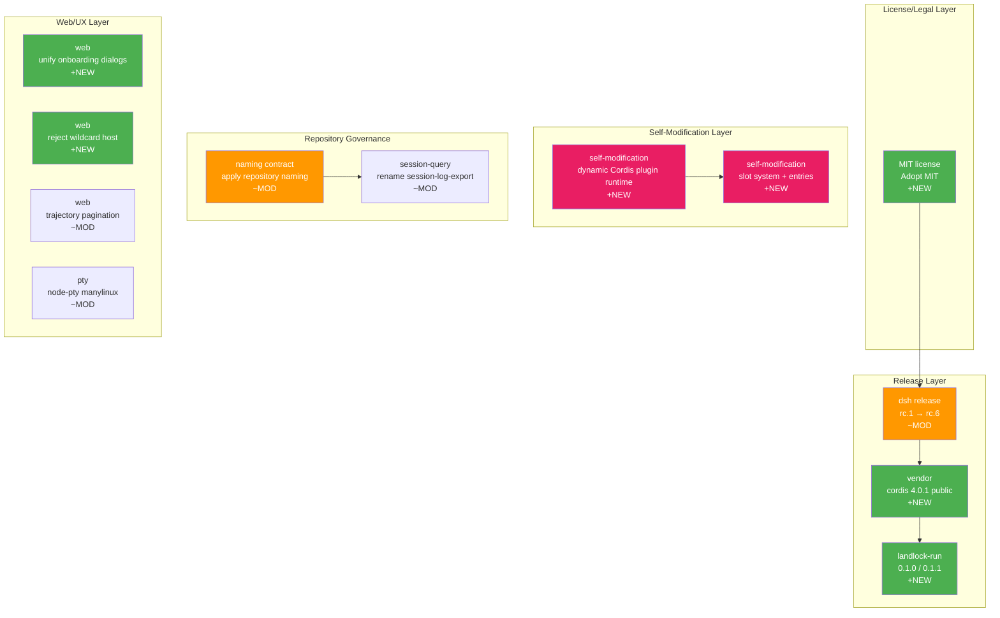

# Architecture Evolution & Design Log · 2026-08-13

> 200 commits (含 merges)，~121 non-merge commits。当日是发布密集日——多个 release candidate 迭代、vendor 包公开发布、MIT 许可证采用、self-modification 功能引入、repository naming contract 应用。

## 1. 每日架构演进图

> 本图反映当日最重要的架构演进路径和设计拓扑。



## 2. 设计模式与重构

- **应用的设计模式**：
  - **Factory Pattern**：self-modification 的 slot system（`0367506471`），动态 Cordis plugin runtime 的注册和管理（`4064198560`）
  - **Strategy Pattern**：session-search opt-in 通过 openAt never 控制（`b6b6a72df7`），OAuth-only providers 从 configurable directory 中 withheld（`a5a83bd1d9`）
  - **Adapter Pattern**：node-pty manylinux 重建的 fallback 到 prebuild（`a785eb80f7`）
  - **Mediator Pattern**：self-modification 的 slot system 作为 plugin 间的中介

- **模块解耦与接口定义**：
  - repository naming contract 的应用（`a2d0f7f411`），统一了所有包的命名空间
  - session-log-export 重命名为 session-query（`34dd480ae5`），更准确地反映其查询能力
  - MIT 许可证采用（`c905c4694e`），简化了贡献流程

- **基础设施与性能**：
  - vendor 包公开发布（`7bedce822f`, `a213befd0f`），vendored Cordis 和 native packages 现在可公开安装
  - node-pty manylinux 重建（`1106b0b03d`），解决 Linux 平台的兼容性问题

## 3. 特性交付与系统影响

- **核心特性**：
  - **Public npm Publication**：dsh family 公开发布（`8c1e8d9890`），vendor 包（cordis 4.0.1, cosmokit 1.8.2 等）公开发布（`7bedce822f`），landlock-run 0.1.0/0.1.1 发布（`9febc89930`, `6e05cb7ff5`）。这是 DSH 从内部工具到公开 npm 包的关键里程碑。
  - **Self-Modification**：dynamic Cordis plugin runtime 和 UI（`4064198560`），slot system + entries/priority/errorreport + typert generator（`0367506471`）。agent 可以动态检查和挂载自己的 plugin，实现了 self-modification 能力。
  - **Onboarding Unification**：unify onboarding dialogs（`9ee5aef98c`），English onboarding copy（`fc90114ad9`），session list default ascending（`f75d785e79`）
  - **Wildcard Host Rejection**：reject unsupported wildcard host（`6cbf927e0a`），clarify wildcard host safety warning（`0633add19d`）
  - **Repository Naming Contract**：apply repository naming contract（`a2d0f7f411`），mark as implemented（`0233b8b26b`）

- **系统拓扑影响**：
  - Public npm publication 将 DSH 从 monorepo 内部消费推向外部生态，需要考虑 backward compatibility 和 deprecation policy
  - Self-modification 赋予 agent 动态改变自身结构的能力，这是 agent 自主性的重大提升
  - Repository naming contract 统一了所有包的命名空间，简化了依赖管理和文档

## 4. 架构决策与 Roadmap 对齐

- **关键技术决策（ADR 推断）**：
  - **背景与痛点**：DSH 需要从内部工具转变为公开可用的 npm 包，同时保持内部开发的灵活性
  - **选择的方案与 Trade-offs**：采用 release candidate 迭代（rc.1 → rc.6）逐步稳定 API，而非一次性发布稳定版。代价是增加了发布管理的复杂度
  - **Self-modification 设计**：选择 slot system 而非 reflection API，牺牲了通用性换取了类型安全性
  - **MIT 许可证**：从 proprietary 转向 MIT，降低了贡献门槛但放弃了专利保护

- **产品 Roadmap 支撑**：
  - Public npm publication 是产品化的关键步骤，支持外部开发者使用
  - Self-modification 为 agent 的自主进化能力奠定了基础
  - Onboarding unification 降低了新用户的上手门槛

## 5. 开发者/架构师决策推断

- **开发者意图重建**：
  - **思维模型**：开发者在并行推进产品化（release, MIT）和能力扩展（self-modification）。每个 release candidate 都是 API 稳定性的里程碑
  - **优先级选择**：先完成 release 流程（pack, verify, publish），再引入 self-modification（新能力），最后统一 naming（治理）
  - **有意取舍**：self-modification 选择 slot system 而非 reflection API，类型安全优先于通用性

- **架构师决策推断**：
  - **模块拆分粒度**：self-modification 的 slot system 粒度精确——每个 slot 有明确的 priority 和 error handling
  - **时机判断**：public npm publication 在 release candidate 稳定后引入，确保外部用户获得可用的 API
  - **后续影响**：self-modification 可能成为 agent 自主性的核心机制，影响所有 plugin 的设计

- **Code Review 视角**：
  - 首先关注 self-modification 的 slot system（`0367506471`），验证 priority 和 error handling 的正确性
  - 会向提交者提问：slot 的 priority 冲突如何解决？errorreport 的 cleanup 语义是什么？
  - 做得好：release candidate 迭代确保了 API 稳定性；MIT 许可证降低了贡献门槛
  - 可改进：self-modification 的 slot system 需要更详细的文档说明其安全边界

## 6. 技术债务与风险评估

- **已知风险 / 变通方案**：
  - release candidate 迭代可能导致 API 不稳定，需要明确的 deprecation policy
  - self-modification 的 slot system 需要安全审计，防止恶意 plugin 注入
  - repository naming contract 的应用可能影响现有的 import 路径

- **建议的下一步**：
  - 为 self-modification 添加安全审计，验证 slot 的隔离性
  - 为 public npm publication 添加 API stability 文档
  - 为 repository naming contract 添加 migration guide

---

## 阶段性深度分析

### 阶段 1: Public npm Publication 与 Release 流程

**涉及的 Commits**: `8c1e8d9890` `7bedce822f` `a213befd0f` `9febc89930` `6e05cb7ff5` `22ab3beac1` `15148dbd9a` `abe560f81e` `8a954b2eca` `60b04b6ef7` `3e8a1cfa33` `a90d9af1b2` `1e99f20963`

**阶段意图**：将 DSH 从 monorepo 内部消费推向公开 npm 包生态，通过多个 release candidate 迭代稳定 API。

**开发者视角推断**：
- **思维模型**：开发者认识到 DSH 需要从内部工具转变为公开可用的 npm 包，需要稳定的 API 和可靠的发布流程
- **优先级选择**：先完善 release 流程（pack, verify, publish），再进行多次 rc 迭代，确保 API 稳定性
- **有意取舍**：选择 rc 迭代而非一次性发布，牺牲了速度换取了稳定性

**架构师视角推断**：
- **粒度考量**：release family 的粒度是 dsh core + vendor + native，确保所有相关包一起发布
- **时机判断**：在 self-modification 引入前发布，确保外部用户获得可用的 API
- **后续影响**：public npm publication 建立了外部生态的基础，影响所有未来的 API 设计

**重点关注的文档/代码**：

| 文件/模块 | 路径 | 阅读要点 |
|-----------|------|----------|
| release | `packages/bundle/` | family metadata, pack, verify, publish |
| vendor | `vendor/` | cordis 4.0.1 公开发布 |
| landlock-run | `native/` | 0.1.0/0.1.1 发布 |

**关键代码模式**：
```typescript
// release family metadata and publish
// packages/bundle/ — 8cd38945f1, a943e67798
// drive the installed entry from the packed tarballs
```

**领域建模洞察**（DDD 视角）：
- Release family 作为 **Aggregate Root**，管理一组相关包的发布关系
- Version 作为 **Value Object**，是发布的 identity 属性

**AI Agent 能力演进**（如适用）：
- Public npm publication 使 agent 框架可被外部开发者使用，扩展了 agent 生态

---

### 阶段 2: Self-Modification 能力引入

**涉及的 Commits**: `4064198560` `0367506471`

**阶段意图**：引入 self-modification 能力，允许 agent 动态检查和挂载自己的 plugin，实现自主进化。

**开发者视角推断**：
- **思维模型**：开发者认识到 agent 需要动态改变自身结构的能力，slot system 是实现这一目标的机制
- **优先级选择**：先建立 slot system（基础机制），再实现 dynamic plugin runtime（高级能力）
- **有意取舍**：选择 slot system 而非 reflection API，类型安全优先于通用性

**架构师视角推断**：
- **粒度考量**：slot system 的粒度是每个 plugin slot，有明确的 priority 和 error handling
- **时机判断**：在发版后引入，确保外部用户先获得稳定的 API
- **后续影响**：self-modification 可能成为 agent 自主性的核心机制

**重点关注的文档/代码**：

| 文件/模块 | 路径 | 阅读要点 |
|-----------|------|----------|
| self-modification | `packages/self-modification/` | dynamic Cordis plugin runtime |
| slot system | `packages/self-modification/` | entries, priority, errorreport |

**关键代码模式**：
```typescript
// dynamic Cordis plugin runtime and UI
// packages/self-modification/src/ — 4064198560
// slot system + entries/priority/errorreport + typert generator
// — 0367506471
```

**领域建模洞察**（DDD 视角）：
- Slot 作为 **Aggregate Root**，管理 plugin 的注册和执行
- Priority 作为 **Value Object**，决定 slot 的执行顺序

**AI Agent 能力演进**（如适用）：
- Self-modification 赋予 agent 动态改变自身结构的能力，这是 agent 自主性的重大提升

---

### 阶段 3: Repository Governance 与命名统一

**涉及的 Commits**: `a2d0f7f411` `0233b8b26b` `34dd480ae5` `ee35505f81` `1540e76598`

**阶段意图**：应用 repository naming contract，统一所有包的命名空间，重命名 session-log-export 为 session-query。

**开发者视角推断**：
- **思维模型**：开发者认识到命名一致性是代码质量的基础，需要在发版前统一
- **优先级选择**：先应用 naming contract，再重命名 session-log-export，最后更新文档
- **有意取舍**：选择 comprehensive naming 而非 selective，确保一致性

**架构师视角推断**：
- **粒度考量**：naming contract 的粒度是每个 package，确保所有包遵循统一的命名规则
- **时机判断**：在发版前应用，确保首次公开发布就有正确的命名
- **后续影响**：统一的命名空间简化了依赖管理和文档

**重点关注的文档/代码**：

| 文件/模块 | 路径 | 阅读要点 |
|-----------|------|----------|
| naming contract | `docs/` | repository naming contract |
| session-query | `packages/session-query/` | 从 session-log-export 重命名 |

**关键代码模式**：
```typescript
// apply repository naming contract
// packages/ — a2d0f7f411
// rename session log export package — 34dd480ae5
```

**领域建模洞察**（DDD 视角）：
- Package name 作为 **Value Object**，是包的 identity 属性

**AI Agent 能力演进**（如适用）：
- 统一的命名空间为 agent 的依赖管理提供了标准化基础

---

### 阶段 4: Web UX 完善与平台兼容性

**涉及的 Commits**: `9ee5aef98c` `fc90114ad9` `f75d785e79` `6cbf927e0a` `0633add19d` `2c837c267f` `a785eb80f7` `29d420f1ee` `c29246ae31` `9e9073da24`

**阶段意图**：完善 Web 端的 onboarding 体验，reject wildcard host 以确保安全，修复 node-pty manylinux 兼容性。

**开发者视角推断**：
- **思维模型**：开发者在发版前确保 Web 端的用户体验和平台兼容性
- **优先级选择**：先统一 onboarding，再确保安全（wildcard host），最后修复平台兼容性（node-pty）
- **有意取舍**：wildcard host rejection 选择硬拒绝而非警告，确保安全

**架构师视角推断**：
- **粒度考量**：onboarding 的粒度是每个 provider，确保每个 provider 都有正确的 onboarding 路径
- **时机判断**：在发版前完善，确保首次用户获得正确的体验
- **后续影响**：wildcard host rejection 为安全策略建立了基础

**重点关注的文档/代码**：

| 文件/模块 | 路径 | 阅读要点 |
|-----------|------|----------|
| web | `packages/web/` | onboarding dialogs, wildcard host |
| subprocess-local | `packages/subprocess/` | node-pty manylinux |
| boot | `packages/boot/` | junction-safe unlink |

**关键代码模式**：
```typescript
// unify onboarding dialogs
// packages/web/src/ — 9ee5aef98c
// reject unsupported wildcard host — 6cbf927e0a
```

**领域建模洞察**（DDD 视角）：
- Onboarding 作为 **Domain Service**，引导用户完成初始配置
- Wildcard host 作为 **Value Object**，是安全策略的一部分

**AI Agent 能力演进**（如适用）：
- Onboarding 的统一为 agent 的首次使用提供了更好的体验
